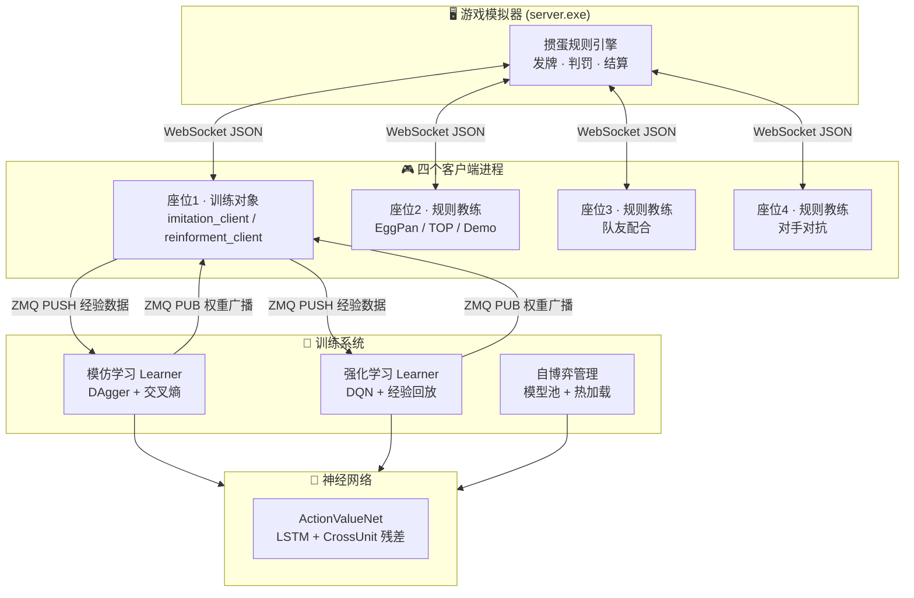
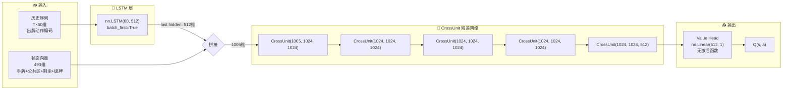
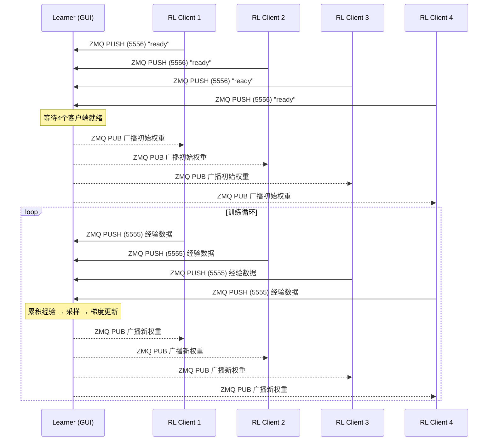

欢迎来到 **NUAA 掼蛋AI系统** 的文档。本项目是南京航空航天大学 2021 年的一项毕业设计成果，目标是构建一个能够通过深度学习自我进化的掼蛋（Guandan）扑克牌游戏 AI。无论你是想快速启动一局人机对战，还是希望深入理解 DQN 强化学习在复杂牌类游戏中的应用，这份文档都将为你提供完整的指引。

在开始深入代码之前，让我们先从三个核心问题入手：**这个系统做什么？它是如何组织的？你应该从哪里开始阅读？**

## 什么是掼蛋？

掼蛋是一种流行于中国华东地区的四人结对扑克牌游戏，使用两副共 108 张牌，对家（座位 1 和 3、座位 2 和 4）为队友。游戏的核心挑战在于：**牌型组合极其丰富**——从单张、对子、三带二、顺子、钢板到炸弹和同花顺，每种牌型都有严格的比较规则；同时玩家需要在 **不完全信息** 下与队友配合，既要自己尽快出完手牌，又要帮助队友压制对手。这使其成为比斗地主更复杂的博弈环境，也是检验 AI 决策能力的理想测试平台。

Sources: [README.md](README.md#L1-L5)

## 系统全景：三大引擎协同工作

本项目可以抽象为 **三大核心引擎** 的协同运作。下面的架构图展示了数据从游戏模拟器产生，到 AI 决策，再到模型训练的完整闭环：

**引擎一：游戏模拟器**（`simulator/windows/server.exe`）是一个编译好的 Go 语言可执行文件，它实现了完整的掼蛋规则——包括发牌、出牌校验、进贡/还贡、升级逻辑和终局判定。它通过 **WebSocket 协议** 与四个客户端通信，每一步向当前行动玩家发送 JSON 格式的游戏状态（手牌、公共信息、可选动作列表），并接收玩家的动作索引（一个整数）作为响应。

Sources: [simulator/README.md](simulator/README.md#L1-L15)

**引擎二：客户端进程**（`clients/`）是 AI 智能体的运行载体。四个客户端对应四个座位，其中 1 号座位通常是 **被训练对象**——它可以是模仿学习客户端（`imitation_client.py`）、强化学习客户端（`reinforment_client.py`）或测试客户端（`test_client.py`）。其余三个座位由 **规则教练**（如 EggPan、TOP）填充，它们为训练提供稳定的对手和队友环境。所有客户端的统一精简入口是 `tcli.py`，支持 `rule`、`reinforcement`、`imitation`、`test` 四种运行模式。

Sources: [clients/tcli.py](clients/tcli.py#L1-L18), [train.py](train.py#L99-L112)

**引擎三：训练系统**（`actor_all/`）是模型进化的驱动力。它包含两条训练路线：**模仿学习**（Imitation Learning）使用 DAgger 算法，让神经网络模仿专家（EggPan）的出牌决策；**强化学习**（Reinforcement Learning）使用 DQN 框架，通过 TD 时序差分学习最大化累积奖励。在分布式模式下，Learner 通过 ZMQ PUB-SUB 向客户端广播最新网络权重，客户端则通过 ZMQ PUSH 回传经验数据或专家样本。

Sources: [actor_all/learner.py](actor_all/learner.py#L1-L15), [actor_all/imitation_learner.py](actor_all/imitation_learner.py#L1-L15)

## 项目目录结构导览

理解目录结构是驾驭项目的第一步。下表按功能模块对关键目录和文件进行分类：

| 模块 | 路径 | 核心作用 |
|------|------|----------|
| **游戏模拟器** | `simulator/windows/server.exe` | 掼蛋规则引擎，WebSocket 服务端 |
| **启动编排** | `launch/launch.py` | 多进程管理：启动服务端 + 4 个客户端 |
| **训练入口** | `train.py` | 封装 launch.py，提供友好的命令行参数 |
| **GUI 启动器** | `main.py` | Tkinter 图形界面，可视化配置客户端参数 |
| **精简客户端** | `clients/tcli.py` | 统一的客户端入口，支持 4 种运行模式 |
| **状态解析器** | `clients/state.py` | JSON 消息解析 + 游戏阶段自动路由 |
| **神经网络** | `model.py` | ActionValueNet：LSTM + CrossUnit 残差 |
| **特征工程** | `util.py` | 状态编码、动作编码、经验回放缓冲区 |
| **教练注册** | `coach/__init__.py` | 动态导入所有教练模块，LoadCoach 工厂 |
| **专家策略** | `coach/EggPan/`, `coach/TOP/` | 基于规则的启发式 AI |
| **模仿学习** | `actor_all/imitation_learner.py` | 分布式 DAgger Learner (GUI) |
| **强化学习** | `actor_all/learner.py` | 分布式 DQN Learner (GUI) |
| **自博弈** | `clients/selfplay_opponent.py` | 加载固定 checkpoint 的推理对手 |
| **自动评估** | `test/analysis/race.py` | 多模型对战评估 |
| **单元测试** | `test/unit_test/` | 教练模块与特征嵌入验证 |

Sources: [README.md](README.md#L13-L25)

## 神经网络架构速览

本系统的核心模型是 `ActionValueNet`，它是一个 **动作价值网络**（Q 网络），输入游戏状态和可选动作，输出该动作的预期累积奖励（Q 值）。其架构设计体现了两条关键思路：

**LSTM 历史建模**：掼蛋是时序决策游戏——上一轮谁出了什么牌、是否选择了"过"（PASS），都会影响当前最优决策。`ActionValueNet` 使用单层 LSTM（隐藏维度 512）处理出牌历史序列，将最后一个时间步的隐状态与当前状态拼接，使模型具备"记住牌局脉络"的能力。

**CrossUnit 残差网络**：`CrossUnit` 是一个借鉴 ResNet 思想的残差模块——`z = ReLU(FC1(x)) → FC2(z) → ReLU(x + z)`。当输入输出维度不一致时，通过额外的线性层 `fc_3` 对齐。5 层 CrossUnit 堆叠提供了足够的非线性表达能力，同时残差连接缓解了梯度消失问题，使深层网络的训练更加稳定。

**Q 值输出**：最终的价值头（Value Head）是一个不带激活函数的全连接层，输出标量 Q 值。Q 值可正可负，直接反映"在当前状态下选择该动作，预期能获得多少未来奖励"。

Sources: [model.py](model.py#L1-L45)

## 三种运行模式对比

本项目支持三种主要的运行模式，下表帮助你快速理解它们的差异和适用场景：

| 维度 | 普通模式 (common) | 模仿学习 (IL) | 强化学习 (RL) |
|------|-------------------|---------------|---------------|
| **1号客户端** | `client1.py`（规则教练） | `imitation_client.py` | `reinforment_client.py` |
| **学习方式** | 无学习，纯推理 | 监督学习：模仿专家出牌 | TD 学习：最大化累积奖励 |
| **数据来源** | 不收集数据 | 专家（EggPan）动作标签 | 环境交互 + 奖励信号 |
| **损失函数** | N/A | 交叉熵（分类） | MSE（Q 值回归） |
| **探索策略** | 确定性（教练规则） | 专家概率衰减 | ε-greedy |
| **产出物** | 游戏日志 | value=xxx.pth（模仿精度） | reward=xxx.pth（平均奖励） |
| **适用场景** | 体验对局、测试教练 | 冷启动：给 RL 一个好起点 | 策略精进：超越专家 |

Sources: [train.py](train.py#L99-L112), [clients/imitation_client.py](clients/imitation_client.py#L1-L60)

## 教练团队：已注册的专家 AI

`coach/` 目录下注册了 9 套专家策略，它们通过 `coach/__init__.py` 的**动态导入机制**自动发现和注册。`LoadCoach(name)` 工厂函数根据名称返回对应的客户端类：

| 教练名称 | 策略类型 | 特点 |
|----------|----------|------|
| **EggPan** | 启发式权重 | 作者参赛队伍代码，基于权重的出牌评估 |
| **TOP** | 完整规则引擎 | 1456 行代码，覆盖所有牌型的组合搜索与比较 |
| **Demo** | 随机策略 | 在可选动作中随机选择，用于基线对比 |
| **PJH / QAI / SEU / SHL / ZZQ** | 各队参赛代码 | 历届比赛强队的策略实现 |
| **HUMAN** | 人类接口 | 提供图形界面供真人玩家操作 |

Sources: [coach/__init__.py](coach/__init__.py#L1-L27), [coach/TOP/action.py](coach/TOP/action.py#L1-L40)

## 分布式训练架构

当训练规模扩大时，单进程的"打牌→学习"循环成为瓶颈。本项目的分布式架构将 **数据收集** 和 **模型训练** 解耦到不同进程中：

核心设计思想：Learner 绑定三个 ZMQ 端口——**PUB 端口**（如 10002）广播最新模型权重给所有订阅的客户端；**PULL 端口 5555** 接收客户端发送的经验元组 `(obs, history, action, reward, next_obs, next_history, done)`；**PULL 端口 5556** 接收客户端的就绪信号，当所有客户端就绪后才开始广播初始权重，保证同步启动。

客户端侧（`tcli.py` 的 reinforcement 模式）在后台线程中持续监听 PUB 端口，收到新权重后热更新本地模型，实现 **无需重启进程的在线权重同步**。

Sources: [actor_all/learner.py](actor_all/learner.py#L1-L80), [clients/tcli.py](clients/tcli.py#L49-L95)

## 阅读路线指引

作为初学者，建议按以下顺序阅读文档：

### 🚀 第一站：跑起来
从 [快速启动：一行命令运行AI对局](2-kuai-su-qi-dong-xing-ming-ling-yun-xing-aidui-ju) 开始，用一行命令体验 AI 对局。然后阅读 [环境准备](4-huan-jing-zhun-bei-pythonyi-lai-mo-ni-qi-fu-wu-duan-yu-gpupei-zhi) 确保开发环境就绪。

### 🏗️ 第二站：理解架构
[项目架构总览](3-xiang-mu-jia-gou-zong-lan-cong-fu-wu-duan-dao-ke-hu-duan-de-wan-zheng-dui-ju-liu-cheng) 将带你走完从服务端启动到客户端响应的完整对局流程。配合 [GUI启动器](5-guiqi-dong-qi-shi-yong-tu-xing-jie-mian-guan-li-duo-ke-hu-duan-dui-ju) 可以通过图形界面更直观地管理多客户端。

### 🧠 第三站：深入训练
- **模仿学习路线**：[DAgger 原理](6-mo-fang-xue-xi-yuan-li-daggersuan-fa-yu-zhuan-jia-ce-lue-hun-he-cai-yang) → [train.py 入口](7-train-py-xun-lian-ru-kou-ming-ling-xing-can-shu-yu-yamlpei-zhi-lian-dong) → [分布式 DAgger](8-fen-bu-shi-dagger-learneryan-bo-quan-zhong-ke-hu-duan-shou-ji-zhuan-jia-yang-ben)
- **强化学习路线**：[DQN 训练流程](9-dqnxun-lian-liu-cheng-jing-yan-hui-fang-tan-suo-ce-lue-yu-tdmu-biao-geng-xin) → [分布式 RL](10-fen-bu-shi-qiang-hua-xue-xi-zmq-pub-subjia-gou-xia-de-duo-ke-hu-duan-bing-xing-xun-lian) → [自博弈](11-zi-bo-yi-xun-lian-xi-tong-mo-xing-chi-guan-li-re-jia-zai-dui-shou-yu-die-dai-dui-kang)

### 🔬 第四站：理解模型
[神经网络架构](12-shen-jing-wang-luo-jia-gou-actionvaluenetde-lstmli-shi-jian-mo-yu-crossunitcan-chai-wang-luo) 详细解释 ActionValueNet 的设计哲学，[状态编码](13-zhuang-tai-bian-ma-she-ji-shou-pai-chu-pai-qu-sheng-yu-pai-shu-yu-ji-pai-de-duo-wei-qian-ru) 和 [动作编码](14-dong-zuo-bian-ma-yu-li-shi-xu-lie-chu-pai-li-shi-de-lstmshi-xu-jian-mo) 则揭示特征工程的精妙之处。

---

> **提示**：本文档体系采用 **Diátaxis 框架** 组织——"快速入门"帮你动手实践，"核心训练系统"和"模型与特征工程"深入解释原理，"教练系统与对手引擎"和"架构深入"提供技术参考，"测试与监控"指导工程实践。你可以根据自己的需求灵活跳转阅读。