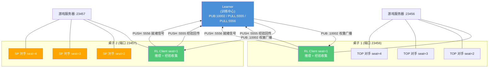
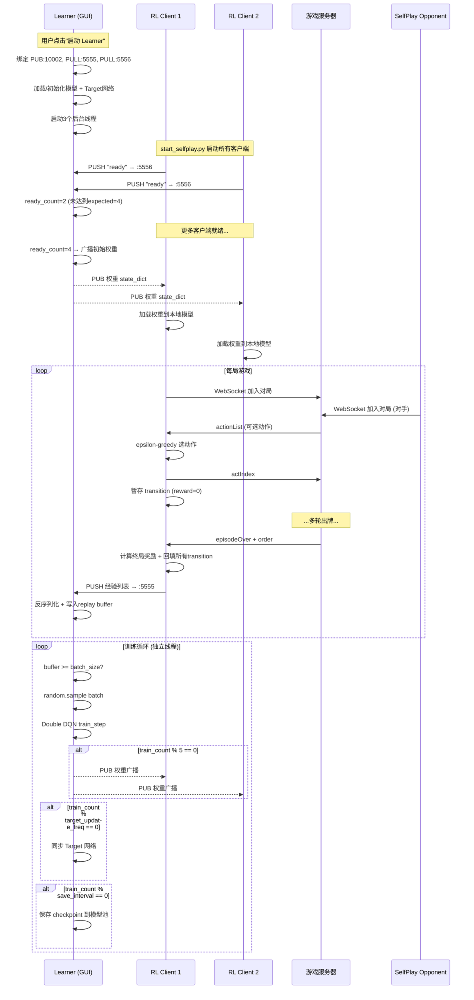

本文档深入剖析分布式强化学习系统的核心架构——基于ZeroMQ PUB-SUB模式的多客户端并行训练机制。系统将**模型训练（Learner）**与**数据收集（Client）**解耦，通过四个ZMQ端口实现权重广播、经验回传、就绪同步与模型池查询的完整闭环。读者应已熟悉[DQN训练流程](9-dqnxun-lian-liu-cheng-jing-yan-hui-fang-tan-suo-ce-lue-yu-tdmu-biao-geng-xin)中的基本TD目标更新原理，本文聚焦于分布式架构如何将DQN从单机扩展为多客户端并行系统。

Sources: [train.py](train.py#L1-L141)

## 架构总览：四个ZMQ端口与三类进程

分布式强化学习系统由三类实体构成：**Learner（中心训练节点）**、**Reinforcement Client（RL推理客户端）**和**Self-Play Opponent（自博弈对手）**。它们通过四个ZMQ端口建立通信拓扑：

| 端口 | 通信模式 | 绑定方 | 连接方 | 数据流向 | 功能 |
|------|----------|--------|--------|----------|------|
| 10002 | PUB-SUB | Learner | RL Client | Learner → 所有Client | 广播最新模型权重 |
| 5555 | PUSH-PULL | Learner | RL Client | 所有Client → Learner | 回传一局游戏的经验序列 |
| 5556 | PUSH-PULL | Learner | RL Client | 每个Client → Learner | 发送客户端就绪信号 |
| 10004 | REQ-REP | Learner V2 | 外部查询方 | 双向 | 查询模型池可用checkpoint列表 |

这个拓扑的设计哲学是**星型集中式训练**：Learner作为中心节点，不参与游戏对局，专注于从所有客户端收集经验并在GPU上执行梯度更新；客户端只负责推理出牌和收集transition数据，不执行反向传播。这种分离使得Learner可以使用GPU全速训练，而客户端可以分布在多台机器上并发对局，实现经验收集的线性扩展。



上图中RL Client同时承担两种角色：通过WebSocket与游戏服务器通信完成对局（推理出牌），通过ZMQ与Learner通信收发权重和经验。非RL的对手客户端（TOP规则引擎或自博弈模型）不连接Learner，仅通过WebSocket参与游戏，为RL客户端提供对抗环境。

Sources: [actor_all/learner.py](actor_all/learner.py#L1-L30), [clients/tcli.py](clients/tcli.py#L1-L28), [actor_all/start_selfplay.py](actor_all/start_selfplay.py#L1-L55)

## Learner：中心训练节点的内部设计

Learner是一个带GUI的Tkinter应用程序，其核心由三个后台线程和三个ZMQ Socket构成。GUI提供了模型加载、超参数调整、端口状态监控和运行日志的完整界面。

### ZMQ Socket初始化序列

Learner在启动时依次绑定三个端口，绑定顺序保证经验通道和就绪通道先就绪，最后才是权重广播通道：

```python
# 第一步：绑定经验接收通道
self.pull_socket = self.context.socket(zmq.PULL)
self.pull_socket.bind("tcp://*:5555")      # 接收来自所有客户端的经验

# 第二步：绑定就绪信号通道
self.ready_pull_socket = self.context.socket(zmq.PULL)
self.ready_pull_socket.bind("tcp://*:5556")  # 接收客户端就绪通知

# 第三步：绑定权重广播通道
self.pub_socket = self.context.socket(zmq.PUB)
self.pub_socket.bind(f"tcp://*:{pub_port}")  # 默认10002，广播权重给所有SUB客户端
```

ZMQ PUB-SUB模式的关键特性是**扇出（fan-out）**：一条`send()`调用可以同时将数据推送到所有已连接的SUB订阅者，无需Learner维护客户端列表。客户端只需在启动时`connect()`到PUB端口并设置`SUBSCRIBE b""`（订阅所有消息），即可自动接收每次广播。

Sources: [actor_all/learner.py](actor_all/learner.py#L230-L270)

### 三线程协同模型

Learner启动后创建三个守护线程，每个线程运行独立的循环：

| 线程 | 函数 | 职责 | 阻塞方式 |
|------|------|------|----------|
| 就绪监听 | `_ready_receiver()` | 接收客户端`b"ready"`信号，计数并触发初始权重广播 | `recv()`阻塞 |
| 经验接收 | `_receive_loop()` | 通过zmq.Poller非阻塞轮询PULL端口，反序列化经验并写入replay buffer | `poll(timeout=100ms)` |
| 训练执行 | `_train_loop()` | 从replay buffer采样batch，执行Double DQN训练，定期广播权重和保存checkpoint | 主动轮询buffer大小 |

就绪监听线程采用**模计数触发**策略：每当`ready_count % expected == 0`时广播一次权重。这意味着客户端断开重连后重新发送就绪信号时，Learner会再次广播最新权重，实现断线恢复后的自动同步。

Sources: [actor_all/learner.py](actor_all/learner.py#L280-L310)

### Double DQN训练步骤

`train_step()`方法是Learner的核心训练逻辑，实现了完整的Double DQN更新。与`util.py`中`MemoryBuffer.learn_batch`的区别在于，Learner版本增加了**PASS动作掩码**和**梯度裁剪**：

```python
# Double-Q核心逻辑（简化）
for each transition in batch:
    q_curr = model(state, action, history)
    
    if done:
        td_target = reward
    else:
        # 排除PASS动作：防止Q(PASS)膨胀导致训练崩塌
        online_qs_masked = online_qs.masked_fill(pass_mask, float('-inf'))
        best_idx = online_qs_masked.argmax()       # online网络选动作
        td_target = reward + gamma * target_qs[best_idx]  # target网络打分

    loss = MSE(q_curr, td_target)
```

PASS掩码的设计意图是防止Agent学会"一直不出牌"的退化策略——在greedy动作选择时排除PASS，强制Agent在有合法出牌时必须选择出牌动作。但在TD bootstrap计算时，如果所有候选动作都是PASS（即`pass_mask_t.all()`为True），则`td_target = reward`，不进行未来值引导，避免将无意义的状态引入价值估计。

训练完成后执行梯度裁剪（`clip_grad_norm_(max_norm=1.0)`），防止单批次异常transition导致的梯度爆炸。

Sources: [actor_all/learner.py](actor_all/learner.py#L325-L375)

### 权重广播节奏

权重广播不是每次训练后都执行，而是采用**固定步数间隔广播**策略：

```python
if train_count % 5 == 0:
    self.broadcast_weights()
```

每5个训练步广播一次权重。这个间隔在**训练效率**和**策略新鲜度**之间取得平衡：过于频繁的广播（如每步）会增加网络传输开销和客户端权重更新开销；过于稀疏的广播（如每100步）会导致客户端长时间使用过时策略，收集的经验与当前策略偏差过大（off-policy程度加剧）。

`broadcast_weights()`将模型`state_dict`的每个tensor移到CPU（避免发送CUDA tensor），使用`pickle.dumps()`序列化后通过PUB socket发送。

Sources: [actor_all/learner.py](actor_all/learner.py#L440-L460), [actor_all/learner.py](actor_all/learner.py#L375-L385)

## Reinforcement Client：推理与经验收集

强化学习客户端（`tcli.py`的`reinforcement`模式）是分布式系统中数据收集的载体。与早期版本`reinforment_client.py`不同，新版客户端**不执行本地训练**，所有梯度计算都交给Learner，客户端只负责三件事：**推理出牌**、**收集经验**、**收发权重**。

### InferenceClient的ZMQ连接拓扑

客户端在构造时建立三个ZMQ连接，均为`connect()`模式（客户端主动连接Learner的绑定端口）：

```python
# SUB: 被动接收Learner广播的权重
self.sub_socket = self.zmq_ctx.socket(zmq.SUB)
self.sub_socket.connect(f"tcp://{args.learner_host}:{args.learner_port}")
self.sub_socket.setsockopt(zmq.SUBSCRIBE, b"")  # 订阅所有消息

# PUSH: 向Learner发送经验 (端口5555)
self.push_socket = self.zmq_ctx.socket(zmq.PUSH)
self.push_socket.connect(f"tcp://{args.learner_host}:5555")

# PUSH: 向Learner发送就绪信号 (端口5556)
self.ready_socket = self.zmq_ctx.socket(zmq.PUSH)
self.ready_socket.connect(f"tcp://{args.learner_host}:5556")
self.ready_socket.send(b"ready")  # 启动时立即发送一次
```

注意就绪信号在构造函数中**立即发送**，不等WebSocket连接建立。这意味着Learner可能在客户端实际加入游戏前就收到就绪信号——这是一种宽松的就绪语义：客户端"已准备好接收权重"，而非"已加入游戏"。

Sources: [clients/tcli.py](clients/tcli.py#L90-L110)

### 权重热更新：后台监听线程

`_weights_listener()`在一个独立守护线程中运行，通过`sub_socket.poll(timeout=500)`以500ms超时轮询PUB消息。收到权重后加锁更新模型：

```python
def _weights_listener(self):
    while not self.stop_listener:
        if self.sub_socket.poll(timeout=500):
            msg = self.sub_socket.recv()
            state_dict = pickle.loads(msg)
            with self.weights_lock:
                for k, v in state_dict.items():
                    state_dict[k] = v.to(self.device)  # 移到GPU（如适用）
                self.model.load_state_dict(state_dict)
```

使用`threading.Lock`保护权重更新操作，因为推理线程（WebSocket回调）可能同时在读取模型参数进行Q值计算。这种读写分离的锁策略避免了推理过程中模型参数的半更新状态导致的非确定性行为。

Sources: [clients/tcli.py](clients/tcli.py#L110-L125)

### 动作选择：改进的Epsilon-Greedy

`select_action()`实现了带PASS抑制的epsilon-greedy策略，与Learner训练中的PASS掩码形成呼应：

```python
if random.random() > self.args.epsilon:
    # Greedy: 选最优非PASS动作
    if pass_idx is not None and act_range > 0:
        q_vals_masked = q_vals.copy()
        q_vals_masked[pass_idx] = -float('inf')
        action_idx = int(np.argmax(q_vals_masked))
else:
    # Exploration: 允许PASS，让模型学习何时该让牌
    action_idx = random.randint(0, act_range)
```

关键设计在于**探索时允许PASS、利用时禁止PASS**。如果greedy模式也允许PASS，Agent可能因为PASS动作的Q值膨胀而频繁选择不出牌，导致对局无法推进。但探索时必须偶尔采样PASS，收集"出牌导致输牌"和"让牌导致获胜"两类经验，才能让模型学会在正确的时机让牌。

Sources: [clients/tcli.py](clients/tcli.py#L150-L180)

### 经验收集与终局奖励回填

客户端采用**全局缓存 + 终局回填**的模式收集经验。在一个episode（一小局）中，每一步的transition以`reward=0`暂存，因为完整的终局奖励要到`episodeOver`阶段才知道：

```python
# 每步暂存（奖励为0）
transition = (last_obs, last_history, last_act, 0.0, state, action_list, history, False)
self.episode_transitions.append(transition)

# 终局时回填奖励
def apply_final_reward(self, final_reward):
    for i, trans in enumerate(self.episode_transitions):
        t = list(trans)
        t[3] = final_reward - (self.PASS_PENALTY if t[2][0] == 'PASS' else 0.0)
        if i == len(self.episode_transitions) - 1:
            t[7] = True  # 最后一步标记为done
        self.episode_transitions[i] = tuple(t)
```

**PASS_PENALTY（0.05）**是一个微小的正则化项：每次PASS动作额外扣减0.05的奖励。这个惩罚相对于终局奖励（-5到+5）来说非常小，不会主导梯度方向，但长期积累下会引导模型偏好出牌而非让牌，与greedy时的PASS抑制策略形成双重约束。

奖励函数本身是一个基于完牌次序的离散映射：`{(0,1):5, (0,2):3, (0,3):1, (1,2):-1, (1,3):-3, (2,3):-5}`。这里`(0,1)`表示自己第0名（头游）、队友第1名（二游），是最优结果；`(2,3)`表示己方双负，是最差结果。奖励范围[-5, 5]比旧版`reinforment_client.py`的[-500, 500]缩小了100倍，这有助于稳定TD目标的数值范围。

经验发送使用**异步线程**避免阻塞WebSocket回调：

```python
def send_experience(self):
    threading.Thread(
        target=self._send_experience_async, args=(data,), daemon=True
    ).start()
```

这是因为WebSocket的`received_message`回调在主线程中执行，如果在回调中执行网络I/O（`push_socket.send()`），会阻塞后续消息的处理，导致对局卡顿。

Sources: [clients/tcli.py](clients/tcli.py#L210-L250), [clients/tcli.py](clients/tcli.py#L125-L140)

## 新旧客户端对比：训练职责的迁移

项目中存在两个强化学习客户端实现：原始的`reinforment_client.py`和新版`tcli.py`的`reinforcement`模式。两者代表了架构演进的两个阶段：

| 维度 | reinforment_client.py（旧版） | tcli.py reinforcement（新版） |
|------|-------------------------------|-------------------------------|
| 训练位置 | 客户端本地训练（`MemoryBuffer.learn_batch`） | 不在客户端训练，全部在Learner执行 |
| 经验存储 | 每个客户端独立`MemoryBuffer` | 经验发送到Learner的全局replay buffer |
| 模型更新 | 独立更新，客户端间无同步 | 被动接收Learner广播的权重 |
| 奖励量级 | ±500/350/100 | ±5/3/1（缩小100倍） |
| Target网络 | 无（单网络TD） | 无（依赖Learner的Double DQN） |
| 经验发送 | 无（本地消费） | 每局结束后PUSH到Learner |
| Learner依赖 | 无（完全独立） | 必须连接Learner才能获得最新权重 |

旧版客户端的问题在于：四个客户端各自独立训练，模型参数互不同步，每个客户端只看到自己所在桌的经验，数据多样性和训练效率都受限。新版架构通过中心化Learner解决了这些问题——**一个Learner聚合四桌经验，训练一个共享模型，然后广播给所有客户端**。

Sources: [clients/reinforment_client.py](clients/reinforment_client.py#L80-L150), [clients/tcli.py](clients/tcli.py#L60-L125)

## Learner V2：面向自博弈的模型池扩展

`learner_v2.py`在V1基础上增加了三个关键能力，支撑自博弈训练闭环：

### 1. 固定保存目录与序列编号

```python
self.save_dir = "model/selfplay_checkpoints"
# 扫描已有checkpoint，续接编号
self._next_seq = max(nums) + 1 if nums else 1
# 保存时使用序列编号
save_path = os.path.join(self.save_dir, f"{self._next_seq}.pth")
```

V1使用`checkpoints_{timestamp}_learner`作为目录名，每次启动创建新目录；V2使用固定目录`model/selfplay_checkpoints/`，checkpoint文件名为`1.pth`、`2.pth`、`3.pth`等序列编号。固定路径使得自博弈对手客户端（`selfplay_opponent.py`）可以稳定地从该目录读取模型。

保存间隔从V1的默认50步缩短为**25步**，生成更细粒度的模型快照，为模型池提供更多候选对手。

Sources: [actor_all/learner_v2.py](actor_all/learner_v2.py#L250-L270)

### 2. REP Socket：模型池查询服务

```python
self.rep_socket = self.context.socket(zmq.REP)
self.rep_socket.bind(f"tcp://*:{rep_port}")  # 默认10004
```

REP socket响应两种请求：`b"pool"`返回所有checkpoint路径列表，`b"latest"`返回最新checkpoint路径。这个查询接口为外部监控工具或动态对手管理提供了编程接口。

Sources: [actor_all/learner_v2.py](actor_all/learner_v2.py#L320-L345)

### 3. 模型池实时维护

每次保存checkpoint时同步更新内存中的模型池列表：

```python
with self.model_pool_lock:
    self.model_pool.append(save_path)
self.update_pool_display()
```

训练日志中也增加了`模型池: {len(self.model_pool)}`字段，方便监控对手多样性的增长。

Sources: [actor_all/learner_v2.py](actor_all/learner_v2.py#L490-L500)

## 多桌编排：从启动脚本到进程拓扑

### start.py：四桌并行 + 规则对手

`actor_all/start.py`为每个桌子（端口23456-23459）启动一个RL客户端（seat=1）和三个TOP规则对手（seat=2,3,4），共16个客户端进程。RL客户端通过`--learner_host`和`--learner_port`参数连接Learner。进程管理使用`subprocess.Popen`，通过`CREATE_NO_WINDOW`标志在Windows下隐藏控制台窗口。

TOP规则对手不连接Learner，仅通过WebSocket与游戏服务器通信，使用`[TOP专家策略](18-topzhuan-jia-ce-lue-wan-zheng-de-guan-dan-gui-ze-yin-qing-yu-pai-xing-zu-he-sou-suo)`进行出牌决策。这种**强规则对手 + RL自训练**的组合为RL客户端提供了高质量的对抗环境。

Sources: [actor_all/start.py](actor_all/start.py#L20-L112)

### start_selfplay.py：混合对手池 + 模型热加载

`actor_all/start_selfplay.py`实现了更复杂的对手编排：

- **桌子1**（端口23456）：RL + 3个TOP强对手——提供高强度的规则对抗基准
- **桌子2-4**（端口23457-23459）：RL + 3个自博弈对手——提供多样化的模型对抗

自博弈对手通过`selfplay_opponent.py`启动，该客户端在每局开始（`stage == "beginning"`）时自动扫描`model/selfplay_checkpoints/`目录，按`model_index`选择模型并热加载：

```python
def _reload_model(self):
    files = glob.glob(os.path.join(self.MODEL_DIR, "*.pth"))
    files.sort(key=extract_num, reverse=True)  # 从新到旧排序
    idx = min(self.model_index, len(files) - 1)
    chosen = files[idx]
    if chosen == self.current_model_path:
        return  # 模型没变，跳过加载
    # 加载新模型...
```

`model_index=0`加载最新模型，`model_index=1`加载第二新模型，以此类推。三张自博弈桌分别使用不同"年龄"的模型作为对手，形成**渐进式对抗**：最新模型对抗稍旧的模型，避免所有对手都使用相同策略导致训练信号单一。

自博弈对手使用**纯确定性策略**（`epsilon=0.0`），不发送经验、不更新权重，仅通过WebSocket参与对局。这使得对手行为可复现，便于评估当前模型的真实能力。

Sources: [actor_all/start_selfplay.py](actor_all/start_selfplay.py#L60-L166), [clients/selfplay_opponent.py](clients/selfplay_opponent.py#L50-L80)

## 完整训练流程：从启动到模型收敛

以下时序图展示了分布式强化学习训练的一个完整周期：



训练循环的关键特征在于**完全异步**：客户端不断对局、发送经验，Learner不断采样、训练、广播。两者之间没有显式的同步屏障——客户端可能使用"过时"的权重进行推理（off-policy），这正是DQN类算法的设计前提。经验回放缓冲区天然支持off-policy学习，权重广播的5步间隔确保了客户端策略与Learner策略的偏差在可控范围内。

Sources: [actor_all/learner.py](actor_all/learner.py#L400-L468), [clients/tcli.py](clients/tcli.py#L140-L250)

## 关键设计决策与权衡

### 异步经验发送 vs 同步屏障

系统采用**完全异步**的经验传输模式，不设同步屏障。代价是客户端可能使用过时权重收集经验（off-policy程度随广播间隔增大），收益是系统吞吐量不受最慢客户端限制。5步广播间隔是一个经验性选择：在[检查点文件结构](27-jian-cha-dian-wen-jian-jie-gou-mo-xing-can-shu-jiao-lian-ming-cheng-yu-wang-luo-lei-de-xu-lie-hua-yue-ding)中可以看到模型通常需要数千步训练才收敛，5步的延迟不会显著影响收敛。

### 全局Replay Buffer vs 分布式Buffer

旧版每个客户端维护独立的`MemoryBuffer`，新版使用Learner中的全局`deque(maxlen=30000)`。全局buffer保证了训练数据的**独立同分布采样**——`random.sample()`从聚合了四桌经验的大池中均匀采样，避免了单桌数据的分布偏差。

### 梯度累积 vs 逐样本更新

`train_step()`对一个batch内的所有样本累加loss后执行一次`backward()`，而非逐样本更新。这等价于使用了更大的有效batch size（512），在GPU上可以充分利用并行计算。梯度裁剪在`backward()`之后、`optimizer.step()`之前执行，对累积梯度进行全局约束。

### PASS抑制的双重机制

系统在两个层面抑制PASS动作的滥用：**推理时**（greedy模式排除PASS，保证对局推进）和**训练时**（TD bootstrap排除PASS的Q值，防止Q(PASS)膨胀）。这种双重机制确保了Agent学会在正确的时机让牌，而非将让牌作为默认策略。

## 阅读后续

本文档涵盖了分布式强化学习系统的核心架构。要理解训练系统如何在自博弈中迭代进化，请阅读[自博弈训练系统：模型池管理、热加载对手与迭代对抗](11-zi-bo-yi-xun-lian-xi-tong-mo-xing-chi-guan-li-re-jia-zai-dui-shou-yu-die-dai-dui-kang)。要了解Learner设计的更多细节，请参考[分布式Learner设计：ZMQ PUB-SUB权重广播与经验收集](21-fen-bu-shi-learnershe-ji-zmq-pub-subquan-zhong-yan-bo-yu-jing-yan-shou-ji)。关于多进程编排机制，见[launch.py 多进程编排](20-launch-py-duo-jin-cheng-bian-pai-fu-wu-duan-yu-si-ke-hu-duan-bing-xing-qi-dong-yu-sheng-ming-zhou-qi-guan-li)。