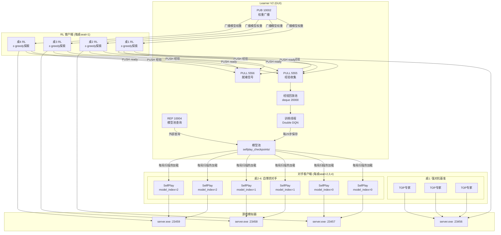
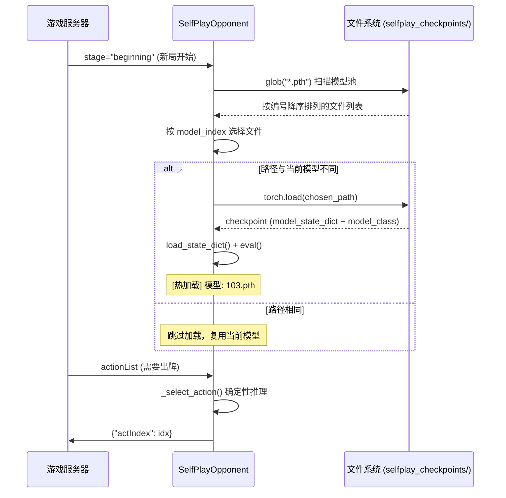

自博弈（Self-Play）是本项目强化学习训练的进阶阶段。在模仿学习和基础 DQN 训练奠定模型能力之后，系统让当前模型与**自身历史版本**对弈，形成持续的对抗升级循环。本页面详细解析 Learner V2 如何管理模型池、SelfPlay 对手客户端如何实现热加载，以及多桌并行对抗的编排逻辑。

## 架构总览：三角色协同的自博弈拓扑

自博弈系统由三种不同职责的进程构成，它们通过 ZMQ 和 WebSocket 互联，形成"训练—推理—对抗"的闭环。在提出细节前，先用一张架构图建立整体认知：



图中三个核心角色分工明确：**Learner V2** 是中央训练节点，收集经验、更新网络、管理模型池；**RL 客户端** 位于每桌 seat=1 位置，使用 ε-greedy 策略进行探索性推理并向 Learner 回传经验；**对手客户端** 分为两档——桌1使用 TOP 专家策略作为强对抗基准，桌2-4使用 SelfPlay 对手加载模型池中的历史检查点进行确定性打牌。

Sources: [start_selfplay.py](actor_all/start_selfplay.py#L17-L29), [learner_v2.py](actor_all/learner_v2.py#L1-L15)

## Learner V2：专为自博弈设计的训练中枢

Learner V2 是在基础 Learner（V1）之上的扩展版本，其核心差异在于引入了**模型池管理**和**对外查询服务**。V1 将检查点保存到按时间戳命名的目录（如 `model/checkpoints_2026_5_16_13_9_28_learner/`），文件名包含训练步数（如 `learner_train100.pth`），每次启动创建新目录。这种设计适合单次训练会话，但不利于跨会话的模型复用。

V2 采用固定目录 `model/selfplay_checkpoints/` 和纯数字序列命名（`1.pth, 2.pth, 3.pth, ...`），使模型池成为一个**持续增长的、按时间顺序排列的版本链**。

Sources: [learner_v2.py](actor_all/learner_v2.py#L248-L265), [learner.py](actor_all/learner.py#L233-L234)

### 模型池的三个核心机制

**启动续接。** Learner V2 启动时自动扫描 `model/selfplay_checkpoints/` 目录下的所有 `.pth` 文件，提取数字编号并取最大值 + 1 作为下一个保存编号。这意味着即使 Learner 重启，编号也不会冲突——新的检查点无缝追加到已有模型池尾部。

```python
# learner_v2.py 中的启动续接逻辑
existing = _glob.glob(os.path.join(self.save_dir, "*.pth"))
self.model_pool = sorted(existing, key=lambda f: int(os.path.basename(f).replace(".pth", "")))
if self.model_pool:
    nums = [int(os.path.basename(f).replace(".pth", "")) for f in self.model_pool]
    self._next_seq = max(nums) + 1 if nums else 1
```

**训练时自动追加。** 每经过 `save_interval` 次训练（V2 默认 25 步，而 V1 为 50 步），Learner 将当前模型参数序列化保存为 `{next_seq}.pth`，并原子地将路径追加到内存中的 `model_pool` 列表。更短的保存间隔意味着对手池更新更频繁，RL 客户端面对的对手多样性更高。

**REP 查询服务。** V2 新增了一个 ZMQ REP socket（默认端口 10004），响应外部对模型池的查询。支持两种请求：`b"pool"` 返回全部模型路径列表，`b"latest"` 返回最新模型路径。这为未来扩展（如动态对手调度、外部监控面板）预留了接口。

Sources: [learner_v2.py](actor_all/learner_v2.py#L316-L332), [learner_v2.py](actor_all/learner_v2.py#L469-L481)

### V1 与 V2 参数对比

| 维度 | Learner V1 | Learner V2（自博弈版） |
|---|---|---|
| 保存目录 | `model/checkpoints_{timestamp}_learner/` | `model/selfplay_checkpoints/`（固定） |
| 文件命名 | `learner_train{step}.pth` | `{seq}.pth`（纯数字序列） |
| 默认保存间隔 | 50 步 | 25 步 |
| 经验池容量 | 30000 | 20000 |
| 模型池管理 | 无 | 内存列表 + 文件锁 |
| 对外查询 | 无 | REP socket (10004) |
| GUI 窗口标题 | "Learner 广播客户端" | "Learner V2 — 自博弈版" |

两种 Learner 的训练核心——Double DQN 算法、PASS 掩码策略、梯度裁剪、Target 网络同步——完全一致，差异集中在模型生命周期管理上。详细训练流程见 [分布式Learner设计：ZMQ PUB-SUB权重广播与经验收集](21-fen-bu-shi-learnershe-ji-zmq-pub-subquan-zhong-yan-bo-yu-jing-yan-shou-ji)。

Sources: [learner_v2.py](actor_all/learner_v2.py#L36-L67), [learner.py](actor_all/learner.py#L48-L65)

## SelfPlay 对手客户端：每局热加载的确定性推理器

自博弈对手（`clients/selfplay_opponent.py`）是一个**精简的纯推理客户端**——没有 ZMQ 通信（仅 WebSocket 连接游戏服务器）、没有经验回放、没有梯度计算。它的唯一职责是：加载模型池中的一个检查点，在每一局中做确定性（或微探索）推理，并在每局开始时重新扫描模型池。

Sources: [selfplay_opponent.py](clients/selfplay_opponent.py#L1-L16)

### 热加载的工作流程



热加载的触发时机是 `stage == "beginning"`——即每一小局的开始。这意味着如果 RL 客户端在上一局中表现优异并将经验发送给 Learner，Learner 可能在两局之间完成几次训练并保存新检查点，那么 SelfPlay 对手在下一局开始时就会自动加载这个**更新后**的模型，形成"RL 越打越强，对手也越打越强"的迭代升级。

Sources: [selfplay_opponent.py](clients/selfplay_opponent.py#L69-L75), [selfplay_opponent.py](clients/selfplay_opponent.py#L47-L67)

### 模型选择策略：model_index 参数

`model_index` 是 SelfPlay 对手的核心参数，控制从模型池中选择第几个最新的模型：

| model_index | 选择逻辑 | 含义 |
|---|---|---|
| 0 | `files.sort(reverse=True)[0]` | 最新（最强）的检查点 |
| 1 | `files.sort(reverse=True)[1]` | 第二新的检查点 |
| 2 | `files.sort(reverse=True)[2]` | 第三新的检查点 |
| ≥N | `min(index, len(files)-1)` | 不超过池大小的最旧可用模型 |

在 `start_selfplay.py` 中，桌2 使用 `model_index=0`（最新模型），桌3 使用 `model_index=1`，桌4 使用 `model_index=2`。这创造了一个**难度梯度**：RL 客户端在桌2 面对最强版本的自己，在桌4 面对较旧（较弱）版本。不同难度的对手迫使 RL 策略不能依赖于对手的某个特定弱点，从而提升泛化能力。

Sources: [selfplay_opponent.py](clients/selfplay_opponent.py#L127-L129), [start_selfplay.py](actors_all/start_selfplay.py#L125-L131)

### 推理策略：确定性 + PASS 防崩塌

SelfPlay 对手的 `_select_action` 方法与 RL 客户端高度一致——遍历所有合法动作，计算 Q 值，选最大者。关键差异在于：

1. **默认 ε=0.0**：纯贪心策略，不做探索。这是因为 SelfPlay 对手的目的是提供一个**稳定的、可复现的对抗基准**，而非探索新策略。
2. **PASS 防崩塌**：在贪心选择时显式排除 PASS 动作（当存在非 PASS 选项时）。这与 RL 客户端的处理一致，防止 Q(PASS) 膨胀导致模型永远选择不出牌。

```python
# PASS 防崩塌逻辑（selfplay_opponent.py 与 tcli.py 一致）
if random.random() > self.epsilon:
    action_idx = int(np.argmax(q_vals))
    # 如果选了 PASS 且存在非 PASS 动作，强制选非 PASS 中最好的
    if action_idx == pass_idx and act_range > 0:
        non_pass = [i for i in range(act_range + 1) if i != pass_idx]
        non_pass_qs = [q_vals[i] for i in non_pass]
        action_idx = non_pass[int(np.argmax(non_pass_qs))]
```

Sources: [selfplay_opponent.py](clients/selfplay_opponent.py#L95-L111), [tcli.py](clients/tcli.py#L167-L186)

## 启动编排：四桌并行与难度分层

`actor_all/start_selfplay.py` 是整个自博弈系统的启动脚本，它将 4 桌游戏、RL 客户端和对手客户端一次性编排启动。

### 桌子分配策略

| 桌子 | 端口 | Seat 1（训练方） | Seat 2-4（对手） | 训练目的 |
|---|---|---|---|---|
| 桌1 | 23456 | RL 客户端 (ε-greedy) | 3 × TOP 专家 | **强对抗基准**：检验模型是否超越规则引擎 |
| 桌2 | 23457 | RL 客户端 (ε-greedy) | 3 × SelfPlay (model_index=0) | 对抗最新自身版本 |
| 桌3 | 23458 | RL 客户端 (ε-greedy) | 3 × SelfPlay (model_index=1) | 对抗次新自身版本 |
| 桌4 | 23459 | RL 客户端 (ε-greedy) | 3 × SelfPlay (model_index=2) | 对抗较旧自身版本 |

桌1 使用 3 个 TOP 专家对手，其作用是提供 **"外部标尺"**——自博弈可能陷入策略循环（A 打败 B，B 打败 C，C 又打败 A），而 TOP 的固定策略不受模型池影响，可以客观衡量 RL 模型是否在真正进步。如果 RL 客户端在桌2-4 的自博弈中胜率上升但在桌1 对 TOP 的胜率没有提高，说明模型可能在**过拟合自博弈对手的弱点**，而非学习普适的掼蛋策略。

Sources: [start_selfplay.py](actors_all/start_selfplay.py#L106-L135)

### 进程生命周期管理

`start_selfplay.py` 使用 `subprocess.Popen` 管理所有子进程，`CREATE_NO_WINDOW` 标志使进程在后台静默运行。主循环每秒轮询所有子进程的存活状态，任一进程退出即打印信息并移除。Ctrl+C 触发 `KeyboardInterrupt` 时，脚本依次 `terminate()` 所有子进程。

值得注意的设计决策：脚本**不负责启动游戏服务端**。注释明确说明"服务器由 Docker 管理"，意味着服务端的 4 个 `server.exe` 实例需要预先在 Docker 容器中运行。这种分离使服务端生命周期独立于客户端——当模型池为空需要重启对手时，游戏服务不会中断。

Sources: [start_selfplay.py](actors_all/start_selfplay.py#L138-L166)

## 数据流闭环：从对局到升级的完整周期

```mermaid
flowchart LR
    A[RL 客户端<br/>ε-greedy 出牌] --> B[收集经验<br/>(s,a,r,s')]
    B --> C[ZMQ PUSH<br/>端口 5555]
    C --> D[Learner 经验池<br/>deque 20000]
    D --> E[随机采样 Batch 512<br/>Double DQN 训练]
    E --> F{训练步数 % 5 == 0?}
    F -->|是| G[ZMQ PUB 广播权重<br/>端口 10002]
    F -->|否| E
    G --> H[RL 客户端<br/>SUB 接收更新权重]
    E --> I{训练步数 % 25 == 0?}
    I -->|是| J[保存 checkpoint<br/>model/selfplay_checkpoints/]
    J --> K[模型池更新]
    K --> L[SelfPlay 对手<br/>下一局开始时扫描并热加载]
    L --> M[SelfPlay 对手<br/>确定性推理打牌]
    H --> A
    M --> A
```

整个闭环的关键时间参数：

| 事件 | 频率 | 影响 |
|---|---|---|
| 权重广播 | 每 5 次训练 | RL 客户端策略快速更新 |
| 检查点保存 | 每 25 次训练 | 对手池细粒度增长 |
| 对手热加载 | 每局开始 | 对手与 RL 客户端几乎同步进化 |
| Target 网络同步 | 每 100 次训练 | TD 目标稳定性 |

广播频率（5步）远高于保存频率（25步），这意味着 RL 客户端的权重更新比对手模型池更新快 5 倍。这种不对称设计是有意为之：RL 客户端需要快速适应以对抗当前对手，而对手的"版本延迟"为 RL 提供了一个**略微落后但仍具挑战性**的目标，避免训练震荡。

Sources: [learner_v2.py](actor_all/learner_v2.py#L460-L481), [tcli.py](clients/tcli.py#L79-L112)

## 双轨奖励与 PASS 惩罚

自博弈系统中的奖励机制在两个层面运作：

**终局奖励。** 每局结束时，根据己方和对家的完牌名次计算标量奖励。RL 客户端（`tcli.py` reinforcement 模式）使用缩放版奖励表 `{(0,1):5, (0,2):3, (0,3):1, (1,2):-1, (1,3):-3, (2,3):-5}`，而独立 RL 客户端（`reinforment_client.py`）使用原始版 `{(0,1):500, ...}`。缩放不影响梯度方向，仅影响数值稳定性。

**PASS 惩罚。** `InferenceClient.apply_final_reward` 对 PASS 动作额外施加 0.05 的固定惩罚（`PASS_PENALTY = 0.05`）。这一机制与 Q 值选择时的 PASS 掩码形成**双重防线**：推理时强制不选 PASS（除非别无选择），训练时惩罚选了 PASS 的经验样本。双重约束确保模型不会退化为"永远不出牌"的坍塌策略。

```python
# tcli.py 中的 PASS 惩罚逻辑
def apply_final_reward(self, final_reward):
    for i, trans in enumerate(self.episode_transitions):
        t = list(trans)
        t[3] = final_reward - (self.PASS_PENALTY if t[2][0] == 'PASS' else 0.0)
        ...
```

关于奖励函数设计的完整论述见 [奖励函数设计：完牌次序到标量奖励的映射策略](15-jiang-li-han-shu-she-ji-wan-pai-ci-xu-dao-biao-liang-jiang-li-de-ying-she-ce-lue)。

Sources: [tcli.py](clients/tcli.py#L130-L140), [tcli.py](clients/tcli.py#L208-L217)

## 迭代对抗的演进动力学

自博弈训练的**核心假设**是：如果 RL 客户端持续战胜历史版本的自己，那么策略就在单调改进。然而实践中可能出现几种非单调动态：

**策略循环。** 模型 A 学会了某种激进打法能打败模型 B；模型 C 学会针对激进打法的保守策略打败模型 A；模型 D 又用新打法打败模型 C——如此往复，胜率呈周期性波动而非单调上升。多桌不同 `model_index` 的设计部分缓解了此问题：RL 客户端同时面对多个历史版本的混合评估。

**遗忘与震荡。** 当 Learner 的训练数据全部来自"当前 RL vs 近期对手"的分布时，模型可能遗忘早期学到的通用策略。桌1 的 TOP 对手作为**分布外检验**，可以在模型过拟合自博弈对手时发出预警。

**探索率衰减。** 当前的 `epsilon` 参数是固定值（默认 0.1），不随训练进度衰减。这是未来可能的改进方向——训练初期高探索率以发现多样化策略，后期降低探索率以精细化最优策略。

关于 TOP 专家策略的实现细节，参见 [TOP专家策略：完整的掼蛋规则引擎与牌型组合搜索](18-topzhuan-jia-ce-lue-wan-zheng-de-guan-dan-gui-ze-yin-qing-yu-pai-xing-zu-he-sou-suo)。

Sources: [start_selfplay.py](actors_all/start_selfplay.py#L1-L16), [reinforment_client.py](clients/reinforment_client.py#L41-L42)

## 阅读导航

自博弈系统是项目训练管线的最后一环。建议按以下顺序深入理解：

- **前置知识**：[DQN训练流程：经验回放、探索策略与TD目标更新](9-dqnxun-lian-liu-cheng-jing-yan-hui-fang-tan-suo-ce-lue-yu-tdmu-biao-geng-xin) —— 理解 Double DQN 训练步骤
- **前置知识**：[分布式强化学习：ZMQ PUB-SUB架构下的多客户端并行训练](10-fen-bu-shi-qiang-hua-xue-xi-zmq-pub-subjia-gou-xia-de-duo-ke-hu-duan-bing-xing-xun-lian) —— 理解 Learner-Client 通信架构
- **横向对比**：[分布式Learner设计：ZMQ PUB-SUB权重广播与经验收集](21-fen-bu-shi-learnershe-ji-zmq-pub-subquan-zhong-yan-bo-yu-jing-yan-shou-ji) —— Learner V1 的详细设计
- **对手详解**：[自博弈对手客户端：固定检查点的确定性推理打牌](19-zi-bo-yi-dui-shou-ke-hu-duan-gu-ding-jian-cha-dian-de-que-ding-xing-tui-li-da-pai) —— SelfPlay 对手的技术细节
- **启动机制**：[launch.py 多进程编排：服务端与四客户端并行启动与生命周期管理](20-launch-py-duo-jin-cheng-bian-pai-fu-wu-duan-yu-si-ke-hu-duan-bing-xing-qi-dong-yu-sheng-ming-zhou-qi-guan-li)