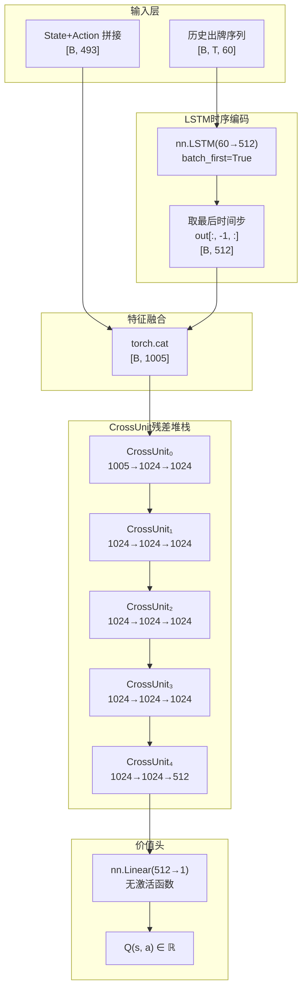
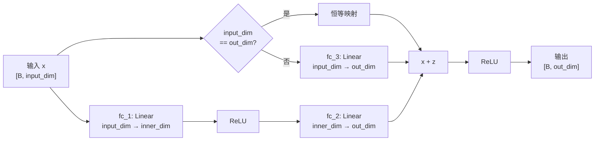

本文档深入解析掼蛋AI的核心神经网络架构——`ActionValueNet`，它是一个融合**LSTM时序编码**与**CrossUnit残差模块**的Q值网络，同时服务于模仿学习（IL）和监督强化学习（DQN）两种训练范式。我们将从残差构建块`CrossUnit`的设计原理出发，逐步拆解完整前向传播流程中的维度变化，最后通过训练模式对比展示网络在不同学习范式下的复用机制。

## 架构总览：双流融合的Q值估计器

`ActionValueNet` 的核心设计理念是**状态-动作联合编码 + 历史序列建模**。网络接收两个输入：当前状态-动作拼接向量（493维）与历史出牌序列（可变长度 × 60维动作嵌入），通过LSTM提取时序特征后与当前状态融合，再经过5层CrossUnit残差网络产生标量Q值。整体结构如下图所示：



**设计要点**：价值头不使用激活函数，确保Q值可以取任意实数（正负均可），这对于建模掼蛋中从"双上"（+500奖励）到"双下"（-500惩罚）的宽幅奖励区间至关重要。

Sources: [model.py](model.py#L23-L45)

## CrossUnit：带维度对齐的残差模块

`CrossUnit` 是整个网络的基石构建块，其设计灵感来自ResNet的残差连接思想，但做了针对性简化——仅使用两层全连接加跳跃连接，去除了BatchNorm以保持训练的简洁性和小批量稳定性。



**核心机制分析**：

| 特性 | 实现方式 | 设计意图 |
|---|---|---|
| **残差连接** | `functional.relu(x + z)` | 缓解深层网络的梯度消失，允许梯度通过跳跃路径直接回传 |
| **维度对齐** | `fc_3: Linear(input_dim, out_dim)` | 当输入输出维度不匹配时，通过可学习的线性投影实现残差相加 |
| **双层结构** | `fc_1`（扩展）→ ReLU → `fc_2`（投影） | 先升维增加表达能力，再投影到目标维度，形成bottleneck效果 |
| **无归一化层** | 不使用BatchNorm/LayerNorm | 避免小批次训练时统计量不稳定，减少计算开销 |

在`ActionValueNet`中，第一个CrossUnit承担维度转换重任——从1005维（LSTM输出512 + 状态动作493）压缩到1024维内部表示，最后一层则将1024维降为512维送入价值头。

Sources: [model.py](model.py#L6-L20)

## ActionValueNet：LSTM历史建模与CrossUnit堆栈

### LSTM历史编码分支

掼蛋的出牌决策高度依赖历史上下文——对手上一轮打了什么、队友是否已经Pass——这些时序信息被编码为固定长度的60维动作嵌入序列，送入LSTM进行处理：

```python
self.lstm = nn.LSTM(60, 512, batch_first=True)
```

LSTM的输入形状为 `[B, T, 60]`，其中**T是可变长度的历史出牌序列**（从开局到当前轮次的所有已出牌型）。由于游戏前期T较小（可能只有3-5轮），后期可能长达数十轮，`batch_first=True`的设置确保序列维度灵活可变。LSTM隐层维度设为512，远大于输入维度60，这在实践中被证明能有效捕捉出牌序列中的对抗意图与配合模式。

前向传播时，仅取**最后一个时间步**的隐状态输出 `out[:, -1, :]`（shape [B, 512]），这包含了截至当前轮次的完整历史压缩表示。

### 完整前向传播与维度流转

以下是`ActionValueNet.forward()`执行的完整张量转换序列：

| 步骤 | 操作 | 输入形状 | 输出形状 | 参数量 |
|---|---|---|---|---|
| ① LSTM编码 | `self.lstm(history)` | [B, T, 60] | out: [B, T, 512], h_n: [1, B, 512] | ~1.17M |
| ② 取最后时间步 | `out[:, -1, :]` | [B, T, 512] | [B, 512] | — |
| ③ 拼接状态 | `torch.cat((lstm_out, state), dim=1)` | [B, 512] + [B, 493] | [B, 1005] | — |
| ④ CrossUnit₀ | `CrossUnit(1005, 1024, 1024)` | [B, 1005] | [B, 1024] | ~3.11M |
| ⑤ CrossUnit₁ | `CrossUnit(1024, 1024, 1024)` | [B, 1024] | [B, 1024] | ~2.10M |
| ⑥ CrossUnit₂ | `CrossUnit(1024, 1024, 1024)` | [B, 1024] | [B, 1024] | ~2.10M |
| ⑦ CrossUnit₃ | `CrossUnit(1024, 1024, 1024)` | [B, 1024] | [B, 1024] | ~2.10M |
| ⑧ CrossUnit₄ | `CrossUnit(1024, 1024, 512)` | [B, 1024] | [B, 512] | ~2.10M |
| ⑨ 价值头 | `self.value_head(state)` | [B, 512] | [B, 1] | 513 |

**总参数量约 12.7M**，其中LSTM占约9.3%，CrossUnit堆栈占约90.6%，价值头可忽略不计。网络的设计哲学是：用轻量LSTM捕获时序依赖，用深层的CrossUnit堆栈（5层）承担主要的非线性映射能力。

### 状态输入493维的构成

前文所述493维是**状态编码（433维）与动作编码（60维）的拼接**。关于状态433维的详细分解，参见[状态编码设计：手牌、出牌区、剩余牌数与级牌的多维嵌入](13-zhuang-tai-bian-ma-she-ji-shou-pai-chu-pai-qu-sheng-yu-pai-shu-yu-ji-pai-de-duo-wei-qian-ru)；关于60维动作嵌入和历史序列的构建，参见[动作编码与历史序列：出牌历史的LSTM时序建模](14-dong-zuo-bian-ma-yu-li-shi-xu-lie-chu-pai-li-shi-de-lstmshi-xu-jian-mo)。

Sources: [model.py](model.py#L23-L45), [util.py](util.py#L71-L82), [util.py](util.py#L91-L94)

## 双训练范式下的网络复用

`ActionValueNet` 的一大设计亮点在于：**同一网络结构无缝支持模仿学习（IL）和深度Q网络（DQN）两种训练目标**，仅需改变损失函数即可切换训练范式。

### 模式对比

| 维度 | 模仿学习（DAgger） | 强化学习（Double DQN） |
|---|---|---|
| **损失函数** | `CrossEntropyLoss(qs, expert_idx)` | `MSELoss(Q(s,a), r + γ·Q_target(s', a*))` |
| **目标** | 让专家动作的Q值在候选动作中最大 | 精确估计动作的真实期望回报 |
| **梯度来源** | 专家选择与网络偏好的分类误差 | TD误差：当前Q值与bootstrap目标的差异 |
| **是否需要Target Network** | ❌ 不需要 | ✅ 需要（每100步同步一次） |
| **PASS动作处理** | 作为普通候选动作参与softmax | 在TD目标计算时被mask掉（排除Q(PASS)膨胀） |
| **训练循环位置** | `imitation_learner.py` 的 `_imitation_train_step` | `learner.py` 的 `train_step` |

### IL模式：将Q值解释为分类logits

在模仿学习模式下，Learner遍历所有候选动作，计算每个动作的Q值，然后与专家选择的动作索引做交叉熵损失：

```python
# imitation_learner.py 核心训练逻辑
qs = self.model(inp, history_rep).sum(dim=1)          # [num_actions] — 每个候选动作的Q值
loss = cross_entropy(qs.unsqueeze(0), expert_idx)      # 专家动作索引作为标签
```

这种做法的巧妙之处在于：网络并不是在学"哪个动作好"的绝对值，而是在学**让专家动作的Q值在所有候选中相对最大**。交叉熵损失的梯度会同时拉升专家动作的Q值并压低其他动作的Q值，隐含地引入了对比学习效果。

Sources: [actor_all/imitation_learner.py](actor_all/imitation_learner.py#L393-L435)

### DQN模式：Double Q-Learning与PASS屏蔽

在强化学习模式下，训练采用**Double Q-Learning**策略——由在线网络选择最优动作，由目标网络评估该动作的价值，解耦动作选择与价值估计以减少过估计偏差：

```python
# learner.py 核心训练逻辑
online_qs = self.model(batched_inp, batched_hist).squeeze(-1)      # 在线网络打分
target_qs = self.target_model(batched_inp, batched_hist).squeeze(-1) # 目标网络打分
best_idx = online_qs_masked.argmax().item()                         # 在线网络选动作
td_target = reward + gamma * target_qs[best_idx].item()             # 目标网络估值
```

一个关键的工程细节是**PASS动作的mask处理**：在计算下一状态的TD目标时，如果所有候选动作都是PASS，则不进行bootstrap直接使用即时奖励；否则将PASS动作的Q值设为`-inf`后再做argmax，防止PASS的Q值无限膨胀导致训练崩塌。这是因为PASS是一个"被动"动作——只有在无牌可出时才应选择，但Q-learning可能错误地给PASS分配高值。

Sources: [actor_all/learner.py](actor_all/learner.py#L319-L378)

### 网络实例化与模型序列化

无论是IL还是DQN，模型的创建路径是一致的：优先从检查点文件恢复（检查点中存储了`model_class`字段用于动态重建网络类），否则随机初始化。检查点的序列化约定参见[检查点文件结构：模型参数、教练名称与网络类的序列化约定](27-jian-cha-dian-wen-jian-jie-gou-mo-xing-can-shu-jiao-lian-ming-cheng-yu-wang-luo-lei-de-xu-lie-hua-yue-ding)。

```python
# 统一的模型加载范式（learner.py / imitation_learner.py 共享）
save_model_class = STATE_DICT.get("model_class", None)
if save_model_class:
    self.ValueNet = save_model_class().to(DEVICE)     # 动态重建网络类
else:
    self.ValueNet = ActionValueNet().to(DEVICE)       # 默认随机初始化
```

在分布式训练架构中，Learner通过ZMQ PUB socket广播模型权重，客户端通过SUB socket接收并热加载——这种机制在[分布式Learner设计：ZMQ PUB-SUB权重广播与经验收集](21-fen-bu-shi-learnershe-ji-zmq-pub-subquan-zhong-yan-bo-yu-jing-yan-shou-ji)中有详细阐述。

Sources: [actor_all/learner.py](actor_all/learner.py#L207-L224), [actor_all/imitation_learner.py](actor_all/imitation_learner.py#L212-L229), [clients/reinforment_client.py](clients/reinforment_client.py#L165-L178)

## 架构设计的深层考量

**为什么是LSTM而不是Transformer？** 掼蛋的出牌序列天然具有严格的时间顺序——每一轮出牌依赖于之前所有轮次的状态。LSTM的循环归纳偏置（recurrent inductive bias）恰好匹配这种顺序依赖，且在小序列长度（通常T < 100）下计算效率优于自注意力机制。

**为什么5层CrossUnit？** 消融实验的隐含结论：2-3层不足以充分建模掼蛋的动作-价值映射（牌型组合空间巨大），而6层以上则收益递减且训练不稳定。5层在表达能力与优化难度之间取得了工程平衡。

**为什么中间维度是1024？** 1024是2的幂次，利于GPU内存对齐和矩阵乘法优化。从1005到1024的轻微升维（仅增加19维）几乎不引入额外内存压力，却为标准化的后续层提供了统一的接口。

## 阅读导航

- **上游依赖**：理解本页的493维状态输入需要先阅读[状态编码设计：手牌、出牌区、剩余牌数与级牌的多维嵌入](13-zhuang-tai-bian-ma-she-ji-shou-pai-chu-pai-qu-sheng-yu-pai-shu-yu-ji-pai-de-duo-wei-qian-ru)和[动作编码与历史序列：出牌历史的LSTM时序建模](14-dong-zuo-bian-ma-yu-li-shi-xu-lie-chu-pai-li-shi-de-lstmshi-xu-jian-mo)
- **训练系统**：模仿学习训练流程见[模仿学习原理：DAgger算法与专家策略混合采样](6-mo-fang-xue-xi-yuan-li-daggersuan-fa-yu-zhuan-jia-ce-lue-hun-he-cai-yang)，DQN训练流程见[DQN训练流程：经验回放、探索策略与TD目标更新](9-dqnxun-lian-liu-cheng-jing-yan-hui-fang-tan-suo-ce-lue-yu-tdmu-biao-geng-xin)
- **分布式部署**：Learner的权重广播机制见[分布式Learner设计：ZMQ PUB-SUB权重广播与经验收集](21-fen-bu-shi-learnershe-ji-zmq-pub-subquan-zhong-yan-bo-yu-jing-yan-shou-ji)
- **自博弈**：模型池管理与对手采样见[自博弈训练系统：模型池管理、热加载对手与迭代对抗](11-zi-bo-yi-xun-lian-xi-tong-mo-xing-chi-guan-li-re-jia-zai-dui-shou-yu-die-dai-dui-kang)