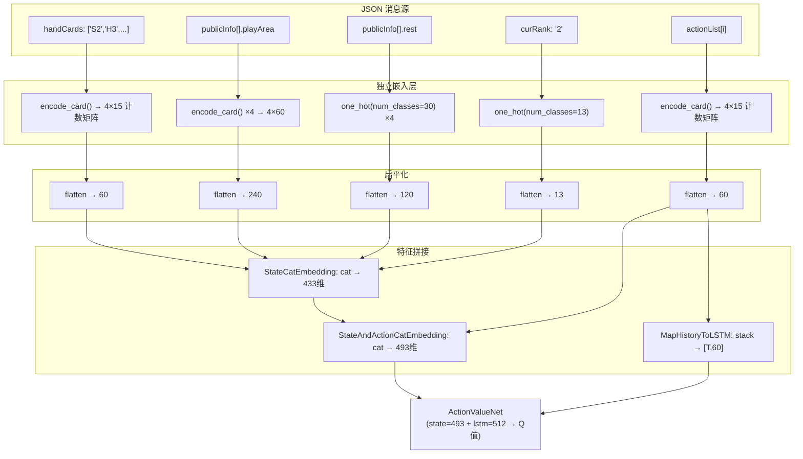
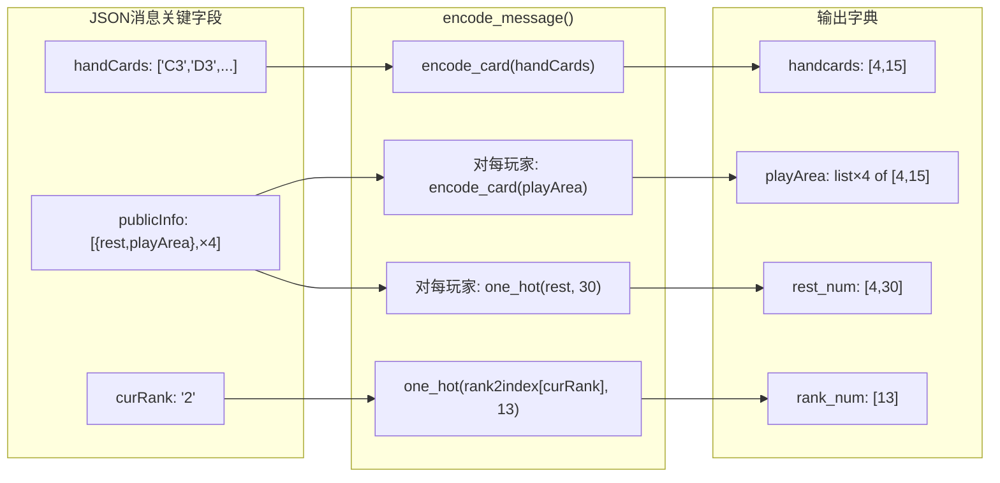
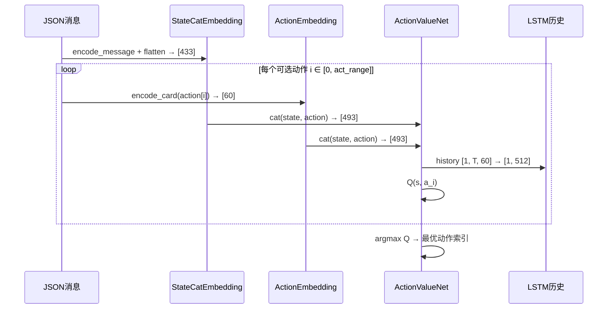

本文深入剖析掼蛋AI系统中将游戏状态从JSON消息转换为神经网络输入张量的完整编码管线。文章聚焦四个核心信息源——手牌、出牌区、剩余牌数与级牌——的离散嵌入策略，解释从54张扑克牌的稀疏表示到493维稠密向量的映射逻辑，以及该向量如何与LSTM历史建模协同构成DQN的Q值评估输入。

## 编码体系全景

掼蛋AI的状态编码遵循**分源嵌入 + 扁平拼接**的架构模式。游戏服务器通过WebSocket发送的JSON消息包含多源异构信息，`util.py`中的编码函数将这些信息分别映射为固定维度的张量，最终拼合成一个统一的特征向量。下图展示了从原始消息到网络输入的四阶段数据流：



核心设计原则是：**所有信息源独立编码，互不干扰**。每种信息源使用最适合其语义的嵌入方式——牌张用多热计数矩阵，剩余牌数用one-hot编码，级牌用one-hot编码。这种模块化设计使得添加或修改某个信息源时无需触碰其他编码逻辑。

Sources: [util.py](util.py#L10-L67)

## 牌张编码：4×15计数矩阵

牌张编码是整个系统最底层的原子操作。`encode_card()` 函数将一组扑克牌字符串映射为一个 `4×15` 的计数矩阵，其中4行对应四种花色，15列覆盖13个点数加2个特殊位（大小丑）。

### 编码表

| 维度 | 索引范围 | 映射内容 | 编码方式 |
|------|----------|----------|----------|
| 花色 (行) | 0-3 | S(黑桃)=0, H(红心)=1, C(梅花)=2, D(方片)=3 | 字典映射 `color2index` |
| 点数 (列) | 0-12 | A=0, 2=1, 3=2, 4=3, 5=4, 6=5, 7=6, 8=7, 9=8, T=9, J=10, Q=11, K=12 | 字典映射 `score2index` |
| 特殊位 (列) | 13 | SB (小王) | 位置 `[3, 13]` 累加 |
| 特殊位 (列) | 14 | HR (大王) | 位置 `[3, 14]` 累加 |

### 编码逻辑

对于输入列表中的每张牌，函数在对应的 `[花色索引, 点数索引]` 位置累加1。这意味着如果手牌中有两张 `S2`（黑桃2），矩阵位置 `[0, 1]` 的值将为2。这种**多热计数编码**（multi-hot count encoding）保留了牌张数量的信息，对掼蛋中同点数多张牌的场景至关重要。

对于 `PASS` 动作或 `None` 值（表示出牌区为空），函数返回全零矩阵，确保空状态与有效牌张在嵌入空间中自然区分。大小丑虽然不属于标准四花色，但统一放置在花色索引3（方片行）的额外列中——这是一个工程上的简洁处理，大小丑在掼蛋规则中均为百搭牌，花色属性无实际意义。

```python
# 编码示例：手牌 ['S2', 'S2', 'H3', 'HR']
# 矩阵关键位置：
#   [0, 1] = 2  (两张黑桃2)
#   [1, 2] = 1  (一张红心3)
#   [3, 14] = 1 (一张大王)
# 其余位置全为 0
# 扁平化后 → 60维向量
```

扁平化后的60维向量直接作为动作编码的基础单元，也是LSTM历史序列中每个时间步的输入维度。

Sources: [util.py](util.py#L26-L42)

## 消息级编码：四源信息提取

`encode_message()` 函数负责从游戏服务器发来的完整JSON消息中提取四个独立信息源，每个源调用不同的编码策略。该函数返回一个包含四个命名张量的字典，便于下游函数按需组合。



### 四源编码详解

| 信息源 | 原始字段 | 编码函数 | 输出维度 | 语义含义 |
|--------|----------|----------|----------|----------|
| **手牌** | `message["handCards"]` | `encode_card()` | `[4, 15]` | 当前玩家持有的所有牌张，多热计数 |
| **出牌区** | `message["publicInfo"][i]["playArea"]` | `encode_card(process_card_list(...))` | `list[4] of [4,15]` | 四个玩家最近一次打出的牌，None→全零矩阵 |
| **剩余牌数** | `message["publicInfo"][i]["rest"]` | `F.one_hot(..., num_classes=30)` | `[4, 30]` | 每个玩家手中剩余牌数，one-hot编码到30类 |
| **当前级牌** | `message["curRank"]` | `F.one_hot(..., num_classes=13)` | `[13]` | 当前游戏使用的级牌点数（2-A），one-hot编码 |

**出牌区编码的特殊处理**：`process_card_list()` 函数在出牌区数据上做了一个关键转换——它提取动作列表的最后一个元素（即实际打出的牌张列表），丢弃动作类型和级牌信息。对于 `PASS` 动作，返回 `('PASS', 'PASS', 'PASS')` 三元组，使 `encode_card()` 能正确识别并返回全零矩阵。这种设计确保了出牌区编码与手牌编码使用完全相同的底层逻辑。

**剩余牌数的30类设计**：掼蛋中每位玩家初始27张牌，因此剩余牌数范围是0-27。one-hot编码使用30个类别，为极端情况（如进贡/还贡后的临时状态）保留了3个额外类别作为安全边界。

Sources: [util.py](util.py#L45-L67), [util.py](util.py#L44-L44)

## 状态拼接：433维全局状态向量

`StateCatEmbedding()` 是连接编码层与神经网络的桥梁。它将 `encode_message()` 返回的四个张量全部扁平化，按固定顺序拼接为一个433维向量。

### 维度分配明细

| 组件 | 原始形状 | 扁平化维度 | 累计维度 | 说明 |
|------|----------|------------|----------|------|
| handcards | `[4, 15]` | 60 | 60 | 己方手牌 |
| playArea[0] | `[4, 15]` | 60 | 120 | 玩家0出牌区 |
| playArea[1] | `[4, 15]` | 60 | 180 | 玩家1出牌区 |
| playArea[2] | `[4, 15]` | 60 | 240 | 玩家2出牌区 |
| playArea[3] | `[4, 15]` | 60 | 300 | 玩家3出牌区 |
| rest_num | `[4, 30]` | 120 | 420 | 四玩家剩余牌数 |
| rank_num | `[13]` | 13 | **433** | 当前级牌 |

拼接顺序是固定的：手牌 → 四个出牌区（按座位号0→3） → 剩余牌数 → 级牌。这种固定顺序保证了不同游戏时刻产生的状态向量在相同语义位置编码相同信息，使神经网络能稳定学习各维度的含义。

```python
# StateCatEmbedding 的核心逻辑（伪代码）
torch.cat((
    flatten(handcards),        # [60]
    flatten(playArea[0]),      # [60]
    flatten(playArea[1]),      # [60]
    flatten(playArea[2]),      # [60]
    flatten(playArea[3]),      # [60]
    flatten(rest_num),         # [120]
    flatten(rank_num)          # [13]
), dim=0)  # → [433]
```

Sources: [util.py](util.py#L70-L81)

## 动作编码与状态-动作联合

### 动作编码

`ActionEmbedding(message, action_index)` 从动作列表中选取指定索引的动作，调用 `encode_card(process_card_list(action))` 将其编码为60维向量。这与手牌编码使用完全相同的 `encode_card()` 函数，保证了动作空间与状态空间在嵌入层面的一致性。

`process_card_list()` 在此处的行为是：提取动作三元组 `(type, rank, cards)` 中的 `cards`（实际牌张列表），舍弃类型和级牌信息。对于 `PASS` 动作，返回 `('PASS', 'PASS', 'PASS')`。这种简化是合理的——DQN的价值网络只需要知道"打出了哪些牌"，而动作类型（单张、对子、顺子等）可以通过牌张组合隐式推断。

### 493维联合向量

`StateAndActionCatEmbedding()` 将433维状态与60维动作拼接为493维向量。这个向量直接输入 `ActionValueNet`，与LSTM的512维历史输出拼接后进入CrossUnit残差网络。

在DQN的推理循环中（参见 `ReinforcementAction.parse()`），编码流程为：



Sources: [util.py](util.py#L84-L90), [util.py](util.py#L93-L96), [clients/gene_client.py](clients/gene_client.py#L405-L420)

## 历史序列编码：LSTM时间建模

历史序列编码是独立于状态编码的另一条数据通路。`MapHistoryToLSTM()` 方法将自对局开始以来所有已执行的动作按时间顺序堆叠为一个 `[T, 60]` 张量，其中T为历史长度，60为单动作编码维度。

### 编码细节

每个时间步的动作通过 `encode_card(action).flatten()` 编码为60维向量。初始状态固定为 `[('PASS', 'PASS', 'PASS')]`，对应全零的60维向量——这确保LSTM在开局时刻有一个确定的初始隐状态，避免未定义行为。

```python
# 历史编码示例
# 第1步: PASS     → [0,0,...,0]  (60维全零)
# 第2步: ['S2']   → [0,1,0,...,0] (位置[0,1]=1，其余0)
# 第3步: ['H3','H5'] → [..., 位置[1,2]=1, 位置[1,4]=1, ...]
# 堆叠: torch.stack([...]) → [3, 60]
# 增加batch维: unsqueeze(0) → [1, 3, 60]
```

### LSTM与状态的融合

LSTM接收 `[B, T, 60]` 的历史序列，输出 `[B, T, 512]`。取最后一个时间步的隐状态 `out[:, -1, :]` 作为历史摘要向量（512维），与493维状态-动作联合向量拼接为1005维，送入5层CrossUnit残差网络。

这种**双塔融合架构**的设计哲学是：**状态塔**捕获当前局面的空间信息（手牌布局、出牌情况），**历史塔**捕获对局的时序动态（出牌节奏、对手行为模式），两者在CrossUnit网络中交互融合后产出Q值估计。关于CrossUnit残差网络与LSTM历史建模的更多细节，请参见 [神经网络架构：ActionValueNet的LSTM历史建模与CrossUnit残差网络](12-shen-jing-wang-luo-jia-gou-actionvaluenetde-lstmli-shi-jian-mo-yu-crossunitcan-chai-wang-luo) 和 [动作编码与历史序列：出牌历史的LSTM时序建模](14-dong-zuo-bian-ma-yu-li-shi-xu-lie-chu-pai-li-shi-de-lstmshi-xu-jian-mo)。

Sources: [util.py](util.py#L26-L42), [model.py](model.py#L32-L43), [clients/reinforment_client.py](clients/reinforment_client.py#L158-L161)

## 编码函数对照表

| 函数名 | 输入 | 输出维度 | 用途 | 定义位置 |
|--------|------|----------|------|----------|
| `encode_card(card_list)` | 牌张列表 或 None/PASS | `[4, 15]` | 原子级牌张编码 | [util.py#L26](util.py#L26) |
| `process_card_list(card)` | 动作三元组 或 None | `cards列表` 或 `('PASS','PASS','PASS')` | 提取动作中的牌张部分 | [util.py#L44](util.py#L44) |
| `encode_message(message)` | 完整游戏JSON | `dict{handcards, playArea, rest_num, rank_num}` | 四源信息提取 | [util.py#L52](util.py#L52) |
| `StateCatEmbedding(message)` | 完整游戏JSON | `[433]` | 全局状态向量 | [util.py#L70](util.py#L70) |
| `ActionEmbedding(message, i)` | 完整游戏JSON + 动作索引 | `[60]` | 单动作编码 | [util.py#L84](util.py#L84) |
| `StateAndActionCatEmbedding(message, i)` | 完整游戏JSON + 动作索引 | `[493]` | 状态-动作联合向量 | [util.py#L93](util.py#L93) |
| `MapHistoryToLSTM()` | 无（读取 `self.history_action`） | `[1, T, 60]` | LSTM历史输入 | [clients/gene_client.py#L364](clients/gene_client.py#L364) |

## 设计决策与权衡

### 为什么用多热计数而非one-hot？

如果对54张标准牌使用one-hot编码，手牌需要54维（每张牌出现/不出现）。但对于掼蛋来说，同一张牌可能拥有多张（如两副牌中可能出现两张 `S2`），one-hot会丢失数量信息。多热计数矩阵 `[4,15]` 使用60维，代价仅增加6维（约11%），却完整保留了同牌多张的计数信息，是典型的信息保真度优于维度效率的设计决策。

### 为什么出牌区编码不使用更紧凑的one-hot？

出牌区最多只有一种牌型（最近一次打出的牌），理论上可以用更紧凑的编码。但复用 `encode_card()` 保持了编码体系的一致性，使得手牌和出牌区共享相同的嵌入空间——神经网络可以将手牌中某张牌的表示直接与出牌区中同张牌的表示进行类比计算，这种**嵌入空间对齐**对模型学习"哪些牌已经打出去了"非常有利。

### 剩余牌数为什么用one-hot而非标量？

单标量 `rest` 的取值范围是0-27，直接作为标量输入相当于假设"剩余牌数"与Q值之间是线性关系。one-hot编码将这一信息展开为30维，允许网络学习非线性的剩余牌数效应——例如"剩1张牌"（报单）与"剩2张牌"在策略上的质变差异。这是以维度膨胀为代价换取表达能力的典型做法。

## 与相关模块的衔接

状态编码是连接游戏模拟与神经网络推理的关键中间层。理解本文后，建议按以下路线继续深入：

- **上游**：游戏JSON消息的结构定义在 `State` 类中，参见 [状态机解析：State类的消息分发与游戏阶段自动路由](22-zhuang-tai-ji-jie-xi-statelei-de-xiao-xi-fen-fa-yu-you-xi-jie-duan-zi-dong-lu-you)
- **下游**：493维联合向量进入 `ActionValueNet`，参见 [神经网络架构：ActionValueNet的LSTM历史建模与CrossUnit残差网络](12-shen-jing-wang-luo-jia-gou-actionvaluenetde-lstmli-shi-jian-mo-yu-crossunitcan-chai-wang-luo)
- **并行**：历史序列的LSTM时序建模细节，参见 [动作编码与历史序列：出牌历史的LSTM时序建模](14-dong-zuo-bian-ma-yu-li-shi-xu-lie-chu-pai-li-shi-de-lstmshi-xu-jian-mo)
- **训练闭环**：编码后的状态-动作对如何在DQN训练中使用，参见 [DQN训练流程：经验回放、探索策略与TD目标更新](9-dqnxun-lian-liu-cheng-jing-yan-hui-fang-tan-suo-ce-lue-yu-tdmu-biao-geng-xin)
- **奖励信号**：完成一局后如何从完牌次序计算奖励，参见 [奖励函数设计：完牌次序到标量奖励的映射策略](15-jiang-li-han-shu-she-ji-wan-pai-ci-xu-dao-biao-liang-jiang-li-de-ying-she-ce-lue)