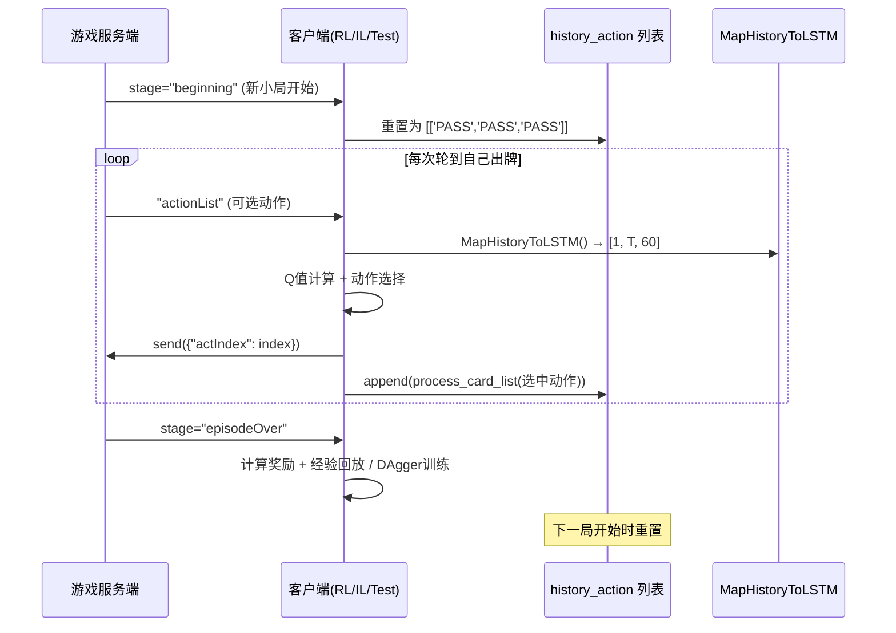
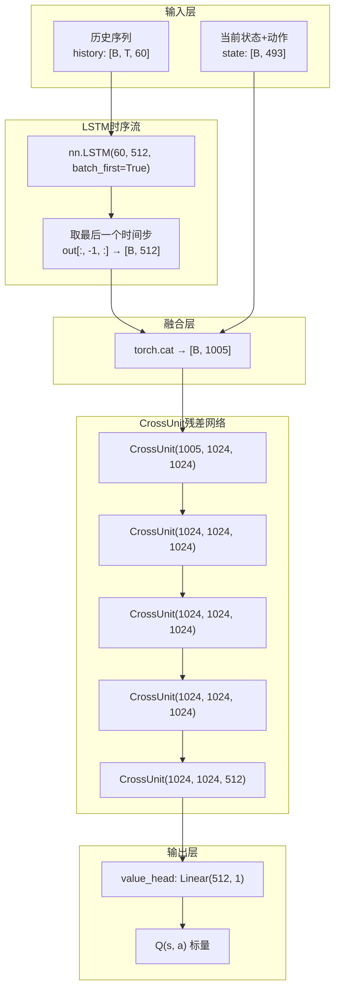
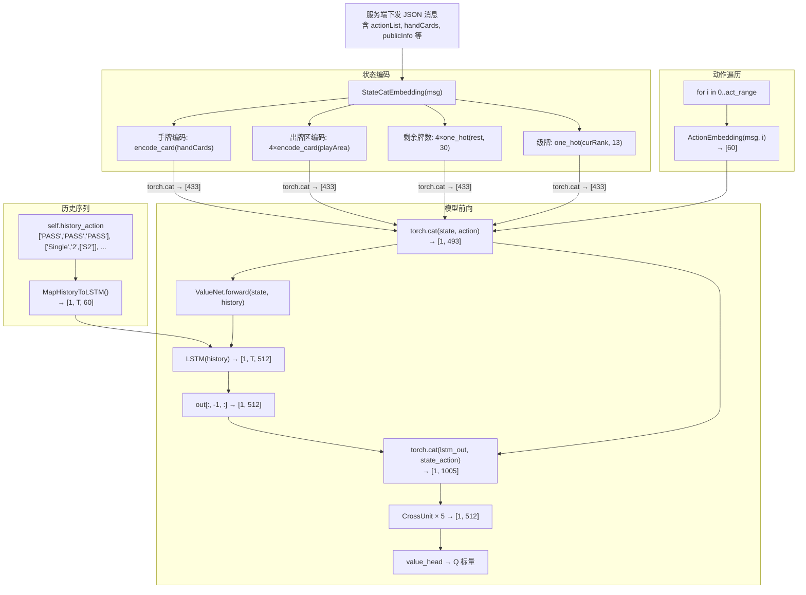

本文档深入解析掼蛋AI系统中「动作编码」与「历史序列」两大核心机制：前者将离散的扑克牌出牌动作映射为60维连续向量，后者将整局游戏中逐步累积的出牌序列送入LSTM进行时序建模。二者共同构成 `ActionValueNet` 对牌局动态演化的感知能力——模型不仅知道「当前局面长什么样」，更知道「局面是如何一步步演变到现在的」。

## 一、动作编码：4×15 牌张嵌入矩阵

动作编码是整个时序建模的原子单元。在掼蛋中，每一次出牌包含牌型（如单张、对子、炸弹）和具体的牌张列表（如 `['S2', 'H2']`）。系统将任意出牌动作统一映射为一个 **4 行 × 15 列** 的嵌入矩阵，展平后得到 **60 维** 向量。

### 1.1 编码规则

矩阵的行对应 4 种花色（S=黑桃、H=红心、C=梅花、D=方块），列对应 13 种牌点（A、2~K）加上 2 个特殊位置（小王 SB、大王 HR）。

| 维度 | 索引范围 | 含义 |
|------|---------|------|
| 行（花色） | 0=S, 1=H, 2=C, 3=D | 扑克牌四种花色 |
| 列 0~12 | A, 2, 3, ..., Q, K | 标准 13 个牌点 |
| 列 13 | `[3, 13]` | 小王（Small Joker, SB） |
| 列 14 | `[3, 14]` | 大王（Big Joker, HR） |

编码逻辑是 **多热计数**（multi-hot counting）：若某张牌出现 n 次（因为掼蛋使用两副牌），则该位置的值为 n。例如手牌中有两张黑桃2，则 `[0, 1] = 2`。

```python
def encode_card(card_list):
    embedding_matrix = np.zeros((4, 15))
    for card in card_list:
        if card == "PASS":
            return embedding_matrix          # PASS → 全零矩阵
        if card == "SB":
            embedding_matrix[3, 13] += 1     # 小王
        elif card == "HR":
            embedding_matrix[3, 14] += 1     # 大王
        else:
            color_index = color2index[card[0]]   # S/H/C/D → 0/1/2/3
            score_index = score2index[card[1]]   # A/2/.../K → 0~12
            embedding_matrix[color_index, score_index] += 1
    return embedding_matrix
```

关键设计决策：**PASS（过牌）动作被编码为全零矩阵**。这意味着模型必须从上下文（即其他玩家的出牌和历史序列）推断当前玩家选择了 PASS，而非从动作向量本身读取信息。这是一种有意为之的稀疏设计——PASS 的语义完全由牌局上下文赋予。

Sources: [util.py](util.py#L26-L44)

### 1.2 动作预处理：`process_card_list`

在将动作送入 `encode_card` 之前，原始的动作列表需要经过 `process_card_list` 进行标准化处理。掼蛋服务端返回的动作格式为 `[牌型, 等级, [牌张列表]]`（如 `['Straight', 'T', ['ST', 'SJ', 'SQ', 'SK', 'HA']]`），该函数提取其中的牌张列表部分，忽略牌型标签和等级信息：

```python
def process_card_list(card):
    if card is None:
        return ('PASS', 'PASS', 'PASS')
    if card[0] == 'PASS':
        return card
    else:
        return card[-1]   # 只取牌张列表
```

注意 `('PASS', 'PASS', 'PASS')` 三元组的巧妙之处：它模拟了「三个 PASS」的格式，使得 `encode_card` 内部的 `for card in card_list` 循环能够正常遍历，最终生成全零矩阵。这个三元组结构也恰好是历史序列初始化的格式。

Sources: [util.py](util.py#L47-L52)

### 1.3 动作嵌入函数：`ActionEmbedding`

训练和推理时，系统通过 `ActionEmbedding` 将特定候选动作编码为向量：

```python
def ActionEmbedding(message, action_index):
    action = message["actionList"][action_index]
    action_tensor = encode_card(process_card_list(action))
    return torch.flatten(action_tensor)  # [60]
```

该函数从服务端下发的 `actionList` 中按索引取出候选动作，经 `process_card_list` → `encode_card` → `flatten` 三步得到 60 维向量。在 `gene_client.py` 的各模式客户端中，此函数被循环调用以计算所有候选动作的 Q 值：

```python
for i in range(self.act_range + 1):
    act_emb = ActionEmbedding(msg, i)
    inp = torch.cat((state.flatten(), act_emb)).unsqueeze(0)
    q = self.ValueNet(inp, history).sum().item()
    q_vals.append(q)
```

这里的一个关键架构约定是：**状态向量与动作向量在进入 CrossUnit 网络之前被拼接**（concatenate），而非通过加法或其他方式融合。433 维状态 + 60 维动作 = 493 维联合输入。

Sources: [util.py](util.py#L76-L79), [clients/gene_client.py](clients/gene_client.py#L407-L411)

---

## 二、历史序列构建：从单步出牌到 LSTM 输入

如果说动作编码解决的是「一张牌怎么表示」的问题，那么历史序列构建解决的是「一串牌怎么组织」的问题。系统通过一个不断增长的 `history_action` 列表记录整局游戏中已发生的所有出牌动作，并在每次决策前将其转化为 LSTM 所需的 `[B, T, 60]` 张量。

### 2.1 序列生命周期

下图展示了历史序列在一个完整对局中的生命周期：



Sources: [clients/reinforment_client.py](clients/reinforment_client.py#L97-L102), [clients/gene_client.py](clients/gene_client.py#L88-L90)

### 2.2 核心方法：`MapHistoryToLSTM`

该方法在所有客户端类中均有定义，逻辑完全一致：

```python
def MapHistoryToLSTM(self):
    ret = torch.stack(
        [encode_card(action).flatten() for action in self.history_action],
        dim=0
    )
    ret = ret.unsqueeze(0)  # 添加 batch 维度: [1, T, 60]
    return ret
```

**执行流程解析**：

1. **列表推导**：遍历 `self.history_action` 中的每个历史动作，分别调用 `encode_card(action).flatten()` 得到 60 维向量
2. **堆叠**：`torch.stack(..., dim=0)` 将所有向量沿时间轴堆叠，得到 `[T, 60]` 张量，其中 T 为当前已发生的动作总数
3. **批处理维度**：`unsqueeze(0)` 添加 batch 维度，得到 `[1, T, 60]`——符合 PyTorch LSTM 对 `(batch, seq_len, input_size)` 的输入要求

**初始化序列的设计意图**：历史序列总是从 `[['PASS', 'PASS', 'PASS']]` 开始。这个三元组 PASS 序列有两个目的：
- **维度一致性**：保证第一个时间步也有合法的 60 维输入（全零向量）
- **语义锚定**：向 LSTM 传达「对局刚开始，尚无有效出牌历史」的信号

Sources: [clients/gene_client.py](clients/gene_client.py#L137-L139), [clients/reinforment_client.py](clients/reinforment_client.py#L179-L182), [clients/selfplay_opponent.py](clients/selfplay_opponent.py#L156-L159)

### 2.3 各模式客户端的序列管理对比

| 模式 | 初始化 | 追加时机 | 重置时机 | 特殊处理 |
|------|--------|---------|---------|---------|
| **强化学习 (RL)** | `[['PASS','PASS','PASS']]` | `parse()` 末尾追加选中动作 | `beginning` 阶段重置 | 需缓存前一步的 history 用于 TD 学习 |
| **模仿学习 (IL)** | `[['PASS','PASS','PASS']]` | `parse()` 末尾追加选中动作 | `beginning` / `episodeOver` / `gameOver` | 需将历史存入数据集供后续训练 |
| **自博弈对手** | `[['PASS','PASS','PASS']]` | `_select_action()` 末尾追加 | `beginning` 阶段重置 | 纯推理，不学习 |
| **测试模式** | `[['PASS','PASS','PASS']]` | `parse()` 末尾追加 | 无显式重置（单局测试） | 使用 `torch.no_grad()` |

在强化学习模式中，序列管理还承担了一项额外职责——**时序缓存**。由于 TD 学习需要 `(s, a, r, s', done)` 五元组，其中 `s` 和 `s'` 各自包含不同的历史序列（一个来自决策时刻，一个来自下一时刻），因此客户端维护了 `last_history` 变量来保存前一步的 LSTM 输入，并在 `parse()` 中将当前步的 history 作为 `history_next` 存入经验回放池：

```python
# 在 parse() 中
if self.last_obs is not None and self.last_history is not None:
    transition = (
        self.last_obs.cpu(),
        self.last_history.cpu(),    # ← 前一步的 history
        self.last_act,
        0.0,
        state.cpu(),
        self.action,
        history.cpu(),              # ← 当前步的 history (作为 s' 的 history)
        False
    )
    self.episode_transitions.append(transition)

self.last_obs = state
self.last_history = history         # 保存当前 history 供下一步使用
self.last_act = act
```

Sources: [clients/gene_client.py](clients/gene_client.py#L431-L445), [clients/reinforment_client.py](clients/reinforment_client.py#L207-L254)

---

## 三、LSTM 时序建模架构

### 3.1 ActionValueNet 中的 LSTM 组件

`ActionValueNet` 的核心设计理念是 **双流融合**：一条流通过 LSTM 处理时序出牌历史，另一条流通过 CrossUnit 残差网络处理当前局面状态，二者在 LSTM 输出层拼接后共同驱动 Q 值预测。



### 3.2 LSTM 参数与维度流转

| 组件 | 参数 | 说明 |
|------|------|------|
| LSTM 输入维度 | `input_size=60` | 与 `encode_card` 展平后的维度一致 |
| LSTM 隐层维度 | `hidden_size=512` | 较大的隐层用于捕捉复杂的出牌序列模式 |
| LSTM 层数 | `num_layers=1`（默认） | 单层 LSTM，避免过拟合 |
| LSTM 输出 | `out: [B, T, 512]` | 每个时间步均有 512 维输出 |
| 取用策略 | `out[:, -1, :]` | **仅取最后一个时间步**的隐状态作为序列的汇总表示 |

使用最后一个时间步而非所有时间步的池化是一个值得注意的设计选择。它意味着模型对出牌序列的感知是 **自回归式** 的——LSTM 在看完整个序列后，将其对序列模式的全部理解压缩到最后一个隐状态中，再与当前局面拼接。

```python
class ActionValueNet(nn.Module):
    def __init__(self):
        super().__init__()
        self.lstm = nn.LSTM(60, 512, batch_first=True)
        self.total_cross = nn.Sequential(
            CrossUnit(493 + 512, 1024, 1024),   # 1005 → 1024
            CrossUnit(1024, 1024, 1024),
            CrossUnit(1024, 1024, 1024),
            CrossUnit(1024, 1024, 1024),
            CrossUnit(1024, 1024, 512),         # 1024 → 512
        )
        self.value_head = nn.Linear(512, 1)

    def forward(self, state, history):
        out, (h_n, _) = self.lstm(history)          # out: [B, T, 512]
        state = torch.cat((out[:, -1, :], state), dim=1)  # [B, 512+493]
        value = self.value_head(self.total_cross(state))
        return value
```

Sources: [model.py](model.py#L25-L45)

### 3.3 维度精确计算

最终输入 CrossUnit 的维度为 493 + 512 = **1005**，其构成如下：

| 来源 | 维度 | 计算过程 |
|------|------|---------|
| 手牌 | 60 | `encode_card(handCards)` → 4×15 展平 |
| 公共出牌区 ×4 | 240 | 每位玩家 `playArea` 经 `encode_card` 后展平，4×60 |
| 剩余牌数 ×4 | 120 | 每位玩家 `rest` 做 30 类 one-hot 编码，4×30 |
| 当前级牌 | 13 | `curRank` 做 13 类 one-hot 编码 |
| **状态小计** | **433** | |
| 候选动作 | 60 | `ActionEmbedding` → `encode_card` 展平 |
| **状态+动作** | **493** | |
| LSTM 隐状态 | 512 | LSTM 最后一个时间步的输出 |
| **总计** | **1005** | |

Sources: [util.py](util.py#L55-L74)

---

## 四、完整数据流：从游戏消息到模型前向

下面以强化学习客户端的一次出牌决策为例，展示从服务端消息到 `ActionValueNet.forward()` 的完整数据流：



---

## 五、设计权衡与技术要点

### 5.1 为什么用 4×15 矩阵而非更简单的编码？

| 方案 | 维度 | 优点 | 缺点 |
|------|------|------|------|
| **4×15 矩阵（当前）** | 60 | 保留花色-牌点的二维结构；支持多热计数（两副牌） | 维度较高 |
| 牌点 one-hot | 15 | 维度低 | 丢失花色信息；多副牌无法区分 |
| 全 one-hot（54类） | 54 | 精确标识每张牌 | 丢失花色-牌点结构；维度爆炸 |
| 牌型+等级编码 | ~20 | 极低维度 | 丢失具体牌张信息 |

当前方案的 4×15 矩阵在信息保真度和维度效率之间取得了平衡。特别地，保留花色维度使模型能够感知同花顺等依赖花色的牌型。

### 5.2 为什么仅取 LSTM 最后一个时间步？

典型的时序建模有两种策略：(1) 取最后一个时间步的隐状态，(2) 对所有时间步做平均/最大池化。本项目选择策略 (1)，因为：

- 出牌序列的**顺序至关重要**——先出单张再出炸弹与先出炸弹再出单张含义完全不同
- LSTM 的最后一个隐状态在理论上已经包含了整个序列的信息（经过门控机制的逐步更新）
- 与 CrossUnit 拼接后，1005 维输入已经足够宽，不需要额外的序列池化来保留信息

### 5.3 PASS 的全零编码策略

PASS 被编码为全零向量的设计有两个深层含义：
- **信息分离**：PASS 不携带任何牌型或牌张信息，模型完全依赖局面状态（如 `greaterAction`、`greaterPos`）来理解 PASS 的语义
- **训练稳定性**：在 Q 值计算中，PASS 的全零向量意味着 `state + PASS_action = state + 0 = state`，数值上等价于仅使用状态信息，避免了 PASS 动作向量对梯度的干扰

强化学习客户端中还有一个 **PASS 惩罚机制**：每局最终的奖励会对 PASS 动作施加额外惩罚（`PASS_PENALTY = 0.05`），并在 Q 值选择时以 80% 概率强制替换 PASS 为非 PASS 动作中的最优选择，防止模型学习到「一直 PASS」的退化策略。

```python
PASS_PENALTY = 0.05

# 在 apply_final_reward 中
t[3] = final_reward - (self.PASS_PENALTY if t[2][0] == 'PASS' else 0.0)

# 在 parse 中：如果选了 PASS 且还有其它合法动作
if action_idx == pass_idx and self.act_range > 0:
    if random.random() < 0.8:
        action_idx = max(non_pass_indices, key=lambda i: q_vals[i])
```

Sources: [clients/gene_client.py](clients/gene_client.py#L375-L376), [clients/gene_client.py](clients/gene_client.py#L422-L426)

---

## 六、与其他模块的关联

当前页面描述的「动作编码」和「历史序列 LSTM」是整个神经网络架构的两大支柱之一。完整的理解路径建议按以下顺序阅读：

- **上游**：[状态编码设计：手牌、出牌区、剩余牌数与级牌的多维嵌入](13-zhuang-tai-bian-ma-she-ji-shou-pai-chu-pai-qu-sheng-yu-pai-shu-yu-ji-pai-de-duo-wei-qian-ru) — 详细解析 433 维状态向量的构成
- **并列**：[神经网络架构：ActionValueNet的LSTM历史建模与CrossUnit残差网络](12-shen-jing-wang-luo-jia-gou-actionvaluenetde-lstmli-shi-jian-mo-yu-crossunitcan-chai-wang-luo) — CrossUnit 残差网络的设计细节
- **下游**：[奖励函数设计：完牌次序到标量奖励的映射策略](15-jiang-li-han-shu-she-ji-wan-pai-ci-xu-dao-biao-liang-jiang-li-de-ying-she-ce-lue) — 历史序列的最终目的：驱动 Q 值向最优策略收敛
- **训练**：[DQN训练流程：经验回放、探索策略与TD目标更新](9-dqnxun-lian-liu-cheng-jing-yan-hui-fang-tan-suo-ce-lue-yu-tdmu-biao-geng-xin) — 历史序列在 TD 学习中的存储与采样