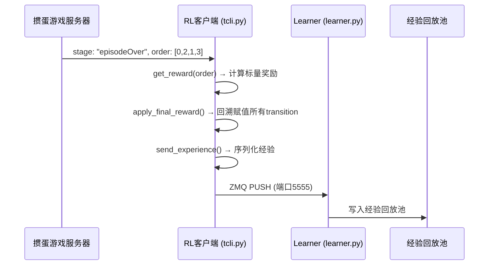
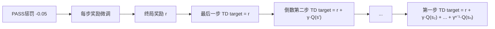

掼蛋是一个四人两两配对的合作—对抗游戏，奖励函数的核心任务是将小局结束时的「完牌次序」——一个长度为 4 的排列——映射为一个标量奖励值，用于驱动强化学习中 ActionValueNet 的 TD 更新。该系统的奖励函数经历了从旧版单客户端（`reinforment_client.py`）到新版统一入口（`tcli.py`）的演化，但六种名次组合到标量值的映射逻辑始终保持一致。

## 奖励函数的系统定位

在强化学习训练环路中，奖励函数位于客户端侧的 `received_message` 回调中，仅在服务器推送 `stage == "episodeOver"` 消息时触发。此时服务器会携带 `order` 字段——即本局四名玩家的完牌次序列表（如 `[0, 1, 2, 3]` 表示 0 号位最先出完，3 号位最后出完）。客户端调用 `get_reward(order)` 计算出终局标量奖励后，将其**回溯赋给本局所有已记录的 transition**，随后整批经验通过 ZMQ PUSH 发送至 Learner 的经验回放池。



Sources: [received_message](clients/tcli.py#L125-L145), [send_experience](clients/tcli.py#L236-L255)

## 完牌次序到标量奖励的核心映射

掼蛋的四人分为两组：`myPos` 与 `(myPos + 2) % 4` 为队友，其余两人为对手。奖励函数首先提取己方两人的完牌名次（`order.index(pos)`，0 表示第一名），然后按升序排列得到规范化的二元组 `(myRank, friendRank)`。六种可能的结果及对应奖励如下：

| 己方名次组合 | 语义描述 | 旧版奖励（reinforment_client） | 新版奖励（tcli.py） |
|:---:|:---|:---:|:---:|
| (0, 1) | 头游 + 二游（双上） | +500 | +5 |
| (0, 2) | 头游 + 三游 | +350 | +3 |
| (0, 3) | 头游 + 末游 | +100 | +1 |
| (1, 2) | 二游 + 三游 | −100 | −1 |
| (1, 3) | 二游 + 末游 | −350 | −3 |
| (2, 3) | 三游 + 末游（双下） | −500 | −5 |

两组数值的**相对比例完全一致**（1 : 0.7 : 0.2 : −0.2 : −0.7 : −1），新版仅做了 100 倍的缩放以适应更稳定的梯度传播。旧版代码位于：

```python
def get_reward(self, order):
    myPos = self.state._myPos
    friendPos = (myPos + 2) % 4
    myRank = order.index(myPos)
    friendRank = order.index(friendPos)
    myRank, friendRank = sorted((myRank, friendRank))
    score = (myRank, friendRank)
    if   score == (0, 1): reward = 500
    elif score == (0, 2): reward = 350
    ...
    return reward
```

新版代码将 if-elif 链替换为字典查找，并缩小了数值范围：

```python
def get_reward(self, order):
    myPos = self.state._myPos
    friendPos = (myPos + 2) % 4
    myRank = order.index(myPos)
    friendRank = order.index(friendPos)
    myRank, friendRank = sorted((myRank, friendRank))
    reward_map = {(0,1):5, (0,2):3, (0,3):1, (1,2):-1, (1,3):-3, (2,3):-5}
    return reward_map.get((myRank, friendRank), 0)
```

Sources: [get_reward (旧版)](clients/reinforment_client.py#L82-L96), [get_reward (新版)](clients/tcli.py#L118-L124)

## 奖励函数的设计原理

### 对称性与零和特性

奖励函数具备内在的**对抗对称性**：若将四人的完牌次序反转（`reversed(order)`），则双方奖励恰好取反。这意味着该奖励函数构造的是一个**零和博弈**框架——己方的收益恒等于对手的损失。以 (0, 1) → +5 为例，对手的名次必然为 (2, 3) → −5，总和为零。这一性质确保了强化学习训练的收敛稳定性：模型不会被鼓励去学习「双方都正收益」的无效策略。

### 排序规范化的去位置偏置

`myRank, friendRank = sorted((myRank, friendRank))` 这一操作消除了玩家自身与队友之间的角色差异——无论「我是头游、队友是二游」还是「队友是头游、我是二游」，奖励均为 +5。这使得模型学习的是**团队协作**而非个体英雄主义，符合掼蛋作为合作游戏的本质。

### 非线性奖励间距

奖励值之间的间距并非均匀分布：从 (0, 1) 到 (0, 2) 的奖励落差为 2（新版），而从 (0, 2) 到 (0, 3) 的落差为 2，但从 (0, 3) 到 (1, 2) 的落差也为 2。整体呈等差数列 {5, 3, 1, −1, −3, −5}，步长为 2。这一定距设计避免了奖励过于稀疏或过于密集，使得 Q 网络能有效区分相邻名次组合的价值差异。

## 终局奖励的回溯赋值机制

该系统的奖励是**完全稀疏（purely episodic）**的：在小局进行中，每一步的即时奖励均为 0。只有当小局结束时，才将计算出的终局奖励赋给本局所有 transition。

在 `tcli.py` 的 `select_action` 方法中，每步记录 transition 时 `reward` 字段固定为 `0.0`：

```python
transition = (
    self.last_obs.cpu(),
    self.last_history.cpu(),
    self.last_act,       # 上一轮的动作
    0.0,                  # 奖励占位（终局时被覆盖）
    state.cpu(),          # obs_next
    action_list,          # A' = 当前步的动作列表
    history.cpu(),
    False                 # done 占位（终局时被覆写为 True）
)
```

小局结束时，`apply_final_reward` 方法遍历所有缓存的 transition，统一覆写奖励字段：

```python
def apply_final_reward(self, final_reward):
    for i, trans in enumerate(self.episode_transitions):
        t = list(trans)
        t[3] = final_reward - (self.PASS_PENALTY if t[2][0] == 'PASS' else 0.0)
        if i == len(self.episode_transitions) - 1:
            t[7] = True          # 最后一步标记 done=True
        self.episode_transitions[i] = tuple(t)
```

关键细节：**只有本局最后一步的 `done` 被设为 `True`**，其余步骤的 `done` 保持 `False`。这确保了 TD 学习时：
- 非终局步骤的 TD target = `reward + γ · max Q(s', a')`（但 reward=终局奖励，因为全程共享同一奖励）
- 终局步骤的 TD target = `reward`（无未来折现）

Sources: [select_action 中的 transition 记录](clients/tcli.py#L192-L203), [apply_final_reward](clients/tcli.py#L211-L220)

## PASS 惩罚：抑制惰性让牌

新版客户端引入了 `PASS_PENALTY = 0.05` 常量，对每一条动作类型为 `PASS` 的 transition 在终局奖励基础上额外减去 0.05：

```python
PASS_PENALTY = 0.05
```

这个惩罚值相对于终局奖励（±1 到 ±5）非常微小（约 1%–5%），其作用类似于**正则化项**，而非主要训练信号。设计意图如下表：

| 场景 | 无 PASS 惩罚 | 有 PASS 惩罚（0.05） |
|:---|:---|:---|
| 终局 (0,1) 且整局 PASS 10 次 | 奖励 +5.0 | 奖励 +4.5 |
| 终局 (2,3) 且整局 PASS 10 次 | 奖励 −5.0 | 奖励 −5.5 |
| 训练效果 | Q(PASS) 可能膨胀，模型倾向频繁让牌 | 轻微抑制 PASS，鼓励主动出牌 |

值得注意的是，在 Learner 端的 `train_step` 方法中还有**额外的 PASS 屏蔽机制**：计算 `max Q(s', a')` 时，PASS 动作被 `masked_fill(pass_mask_t, float('-inf'))` 排除在候选动作之外，防止 Q(PASS) 膨胀导致训练崩塌。这与 PASS 惩罚形成了「双保险」：

1. **PASS 惩罚**（客户端侧）：微调奖励信号，削弱 PASS 的吸引力
2. **PASS 屏蔽**（Learner 侧）：在 bootstrapping 时完全排除 PASS，防止自举循环放大 Q 值

Sources: [PASS_PENALTY](clients/tcli.py#L209), [PASS 屏蔽逻辑](actor_all/learner.py#L316-L326)

## 奖励信号在 TD 训练中的传播

在 Learner 的 `train_step` 中，奖励信号通过标准的 Double DQN 公式参与训练：

```
TD target = reward + γ · Q_target(s', argmax_a' Q_online(s', a')) · (1 − done)
```

其中 `γ = 0.98`（默认值），`done` 仅在每局最后一步为 `True`。由于所有步骤共享同一终局奖励，梯度信号通过以下路径传播：



这实际上是**蒙特卡洛回报**的特例：由于非终局步骤的即时奖励为 0，每一步的 TD target 本质上是对终局奖励的 n-steps 折现估计。γ = 0.98 的接近 1 的值意味着远期奖励几乎不被折现，早期出牌决策与晚期出牌决策对最终胜负的贡献被同等看待。

训练日志中会同时输出四个统计量：

```
训练 #N | Loss: 0.xxx | Q均值: +x.xx | Target均值: +x.xx | Reward均值: +x.xx | Buffer: M
```

其中 **Reward均值** 直接反映当前训练批次中终局奖励的平均水平，可作为模型对局表现的代理指标——正值表示模型与队友总体占据优势，负值表示处于劣势。

Sources: [train_step](actor_all/learner.py#L294-L344), [训练日志](actor_all/learner.py#L447-L451)

## 两版奖励函数的版本演进

| 维度 | 旧版（reinforment_client.py） | 新版（tcli.py） |
|:---|:---|:---|
| **奖励量级** | {500, 350, 100, −100, −350, −500} | {5, 3, 1, −1, −3, −5} |
| **奖励映射方式** | if-elif 链 | 字典查找 `reward_map.get()` |
| **PASS 惩罚** | 无 | 0.05 / 步 |
| **经验传输方式** | 本地 MemoryBuffer 直接训练 | ZMQ PUSH → Learner 集中训练 |
| **分布式支持** | 单机单进程 | 多客户端 → 单 Learner（PUB-SUB架构） |
| **探索策略** | ε-greedy（在 parse 中内联） | ε-greedy（PASS 不被排除） |

旧版的较大奖励值（500 量级）在单机训练时配合 `MSE loss` 尚可工作，但迁移到分布式架构后，过大的奖励值会导致梯度幅度偏大，不利于多客户端并行训练的稳定性。新版缩小 100 倍后，配合 Adam 优化器（默认 lr=1e-4）可维持更好的数值稳定性。

Sources: [旧版 get_reward](clients/reinforment_client.py#L82-L96), [新版 get_reward](clients/tcli.py#L118-L124), [旧版 parse 方法](clients/reinforment_client.py#L216-L253)

## 设计局限与扩展方向

1. **完全稀疏奖励**：所有中间步骤共享同一终局奖励，导致信用分配问题——早期关键出牌和晚期无关出牌获得相同的奖励信号。未来可引入**差分奖励（difference rewards）**或**势函数塑形（potential-based shaping）**来区分步骤贡献。

2. **无级牌升级奖励**：掼蛋中「级牌升级」（从 2 打到 A）是重要的阶段性目标，当前奖励函数仅基于单局完牌次序，未建模跨小局的升级进度。这可能导致模型在「保级」与「冲头游」之间的策略权衡不够精细。

3. **固定线性间距**：奖励间距 {2, 2, 2, 2, 2} 是等距的，但实际游戏中 (0, 1)「双上」的战略价值远高于 (0, 2)「一三联」，未来可探索非线性间距（如指数衰减）来更准确地反映游戏价值结构。

4. **无进贡/抗贡信号**：掼蛋的进贡机制（上局末游向头游进贡最大单牌）会改变手牌分布，但当前奖励函数未对此建模。进贡阶段的信息仅通过状态编码隐式传递给网络，而非通过奖励信号直接引导。

---

**后续阅读建议**：理解奖励函数后，可继续阅读 [DQN训练流程：经验回放、探索策略与TD目标更新](9-dqnxun-lian-liu-cheng-jing-yan-hui-fang-tan-suo-ce-lue-yu-tdmu-biao-geng-xin) 了解 Learner 端如何使用这些奖励进行训练，或 [分布式强化学习：ZMQ PUB-SUB架构下的多客户端并行训练](10-fen-bu-shi-qiang-hua-xue-xi-zmq-pub-subjia-gou-xia-de-duo-ke-hu-duan-bing-xing-xun-lian) 了解经验如何在客户端与 Learner 之间流转。