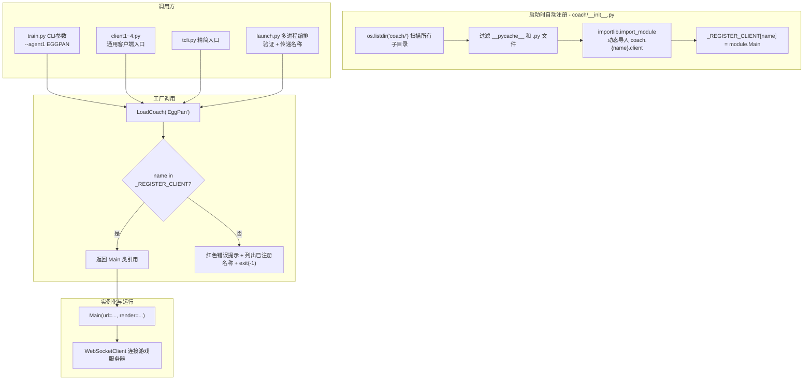
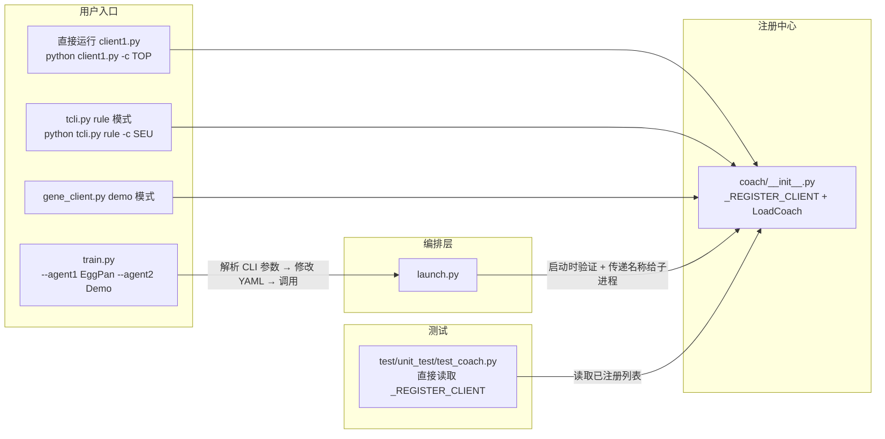
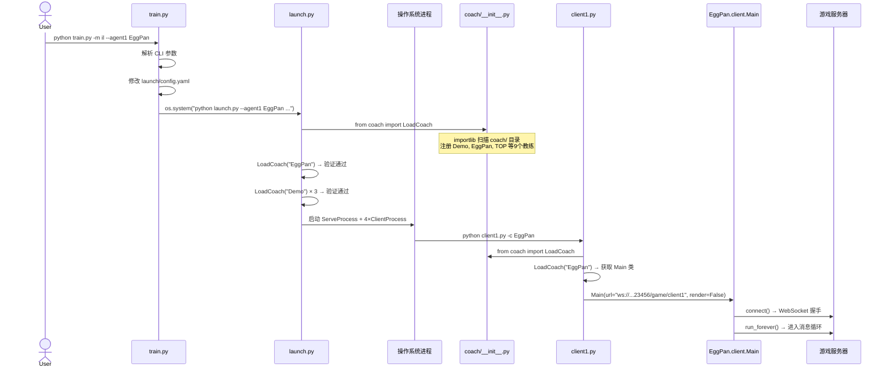

本文档解析 `coach` 包的自动发现与注册机制，阐述 `LoadCoach` 工厂函数如何将分布在独立子目录中的9个教练策略统一接入系统，以及各客户端入口如何通过一个名称字符串动态加载任意已注册的智能体。

## 架构概览：插件式教练系统

整个 `coach` 模块基于"扫描-注册"模式（Scan-and-Register Pattern）构建，本质上是**简单工厂模式**（Simple Factory）与**自动插件发现**（Automatic Plugin Discovery）的结合体。它允许开发者只需在 `coach/` 目录下新建一个符合约定的子目录，无需修改任何注册代码即可让新教练被系统自动发现和加载。



这个设计的核心思想是：**约定大于配置（Convention over Configuration）**。只要你的子目录下有一个 `client.py` 文件，且其中定义了 `Main` 类（继承自 `WebSocketClient`），你的教练就会被自动注册。

Sources: [coach/__init__.py](coach/__init__.py#L1-L27)

---

## 注册流程源码剖析

`coach/__init__.py` 在 Python 包导入时自动执行，整个注册过程分为三个清晰的阶段。

### 第一阶段：目录扫描与过滤

```python
_ROOT_FOLDER = "coach"
_REGISTER_CLIENT = dict()

for folder in os.listdir(_ROOT_FOLDER):
    if folder.endswith("py") or folder.startswith('__'):
        pass
    else:
        # 进入第二阶段
```

这里 `os.listdir` 遍历 `coach/` 下的所有条目，通过两个条件过滤掉非教练目录：以 `.py` 结尾的文件（比如 `__init__.py` 本身会被 `startswith('__')` 先拦截）和以 `__` 开头的 Python 特殊目录。经过过滤后，剩下的都是真正的教练子目录：`Demo`、`EggPan`、`HUMAN`、`PJH`、`QAI`、`SEU`、`SHL`、`TOP`、`ZZQ`，共9个。

Sources: [coach/__init__.py](coach/__init__.py#L10-L14)

### 第二阶段：动态模块导入

```python
module = import_module(name="{}.{}.client".format(_ROOT_FOLDER, folder))
_REGISTER_CLIENT[folder] = module.Main
```

`importlib.import_module` 是 Python 标准库提供的动态导入函数，它在运行时按字符串路径加载模块。对于 `folder = "EggPan"`，等价于执行 `from coach.EggPan import client as module`，但区别在于它不需要在代码中预先写死任何 `import` 语句。导入成功后，直接取出模块中的 `Main` 类引用，以 `folder` 名称（即目录名）作为键存入全局字典 `_REGISTER_CLIENT`。

这个机制的精妙之处在于：每次新增教练只需要新建一个 `coach/NewCoach/client.py` 文件并实现 `Main` 类，**零注册代码修改**。

Sources: [coach/__init__.py](coach/__init__.py#L13-L14)

### 第三阶段：工厂函数 `LoadCoach`

```python
def LoadCoach(coach_name):
    if coach_name in _REGISTER_CLIENT:
        return _REGISTER_CLIENT[coach_name]
    else:
        from colorama import Back, Style
        print(Back.RED, "{}不在已注册的智能体中, 已注册的智能体名称如下:".format(coach_name), Style.RESET_ALL)
        pprint(list(_REGISTER_CLIENT.keys()))
        exit(-1)
```

`LoadCoach` 是一个典型的工厂函数：输入教练名称字符串，输出对应的 `Main` 类引用。调用方随后可以用 `LoadCoach(name)(url=..., render=...)` 的方式实例化一个 WebSocket 客户端对象。当输入的名称不存在时，函数不会静默失败，而是用醒目的红色背景打印错误信息，列出所有已注册的教练名称，然后终止程序——这是一种**快速失败（Fail-Fast）**的设计策略，能在配置错误的第一时间暴露问题。

Sources: [coach/__init__.py](coach/__init__.py#L16-L27)

---

## 教练目录的结构约定

所有9个教练目录遵循统一的结构约定，但允许一定灵活性。以下是各教练目录的文件清单对比：

| 教练名称 | client.py | action.py | 其他文件 | 特点 |
|----------|-----------|-----------|----------|------|
| **Demo** | ✅ 基础实现 | ✅ 随机/基础解析 | — | 最简单的参考实现，默认备选教练 |
| **EggPan** | ✅ 标准实现 | ✅ 基于权重的启发式 | `__init__.py`, `message_Reyn_CUR2.py` | 模仿学习的默认专家策略 |
| **HUMAN** | ✅ 大型GUI实现 | —（内嵌于client） | `fonts/`, `images/` 资源目录 | 人类玩家图形界面，唯一不依赖 `clients.state.State` 的教练 |
| **PJH** | ✅ | ✅（含 `AIAction_back.py`） | — | — |
| **QAI** | ✅ | ✅ | `mysolve.py` 辅助解析 | 含自定义座位映射逻辑 |
| **SEU** | ✅ | ✅ | `utils.py` | 与TOP共享 `rule_parse` 调用风格 |
| **SHL** | ✅ | ✅ | — | 最精简的实现 |
| **TOP** | ✅ | ✅ | `__init__.py`, `state.py`, `utils.py` | 完整的规则引擎，自带 State 实现 |
| **ZZQ** | ✅ | ✅ | `message_Reyn.py` | — |

**最小约定**：每个教练目录下必须有 `client.py`，其中定义 `Main` 类，且该类必须：
1. **继承 `WebSocketClient`**（来自 `ws4py.client.threadedclient`）
2. **构造函数接受 `(url, render=True)` 两个参数**
3. **实现 `received_message(self, message)` 方法**处理游戏服务器的消息

绝大多数教练还遵循一个更强的约定：构造函数中创建 `self.state = State(render)` 和 `self.action = Action(render)`，分别负责游戏状态解析和出牌动作决策，保持关注点分离（Separation of Concerns）。

Sources: [coach/Demo/client.py](coach/Demo/client.py#L1-L29), [coach/EggPan/client.py](coach/EggPan/client.py#L1-L32), [coach/TOP/client.py](coach/TOP/client.py#L1-L31), [coach/HUMAN/client.py](coach/HUMAN/client.py#L1-L46), [coach/QAI/client.py](coach/QAI/client.py#L1-L45), [coach/SEU/client.py](coach/SEU/client.py#L1-L29)

---

## 调用方全景：谁在使用 LoadCoach

`LoadCoach` 在项目中共有5个主要调用入口，各自承担不同的职责：



### train.py → launch.py 链路

`train.py` 是最顶层的用户入口。用户通过 `--agent1` 到 `--agent4` 参数指定四个座位的教练名称（默认为 `Demo`）。`train.py` 本身不直接调用 `LoadCoach`，而是将这些参数传递给 `launch.py`：

```python
# train.py 将 agent 参数透传给 launch.py
ret = os.system("python -u ./launch/launch.py ... --agent1 {} --agent2 {} --agent3 {} --agent4 {}".format(
    args["agent1"], args["agent2"], args["agent3"], args["agent4"]
))
```

`launch.py` 在启动多进程之前，会先用 `LoadCoach` 对四个 agent 名称逐一验证，确保名称合法：

```python
# launch.py 的启动验证
for i in range(1, 5):
    _ = LoadCoach(args["agent{}".format(i)])
```

如果任何一个名称不在 `_REGISTER_CLIENT` 中，程序会立即报错退出，避免启动无效的子进程。

Sources: [train.py](train.py#L41-L52), [train.py](train.py#L131-L141), [launch/launch.py](launch/launch.py#L130-L132)

### 通用客户端 client1~4.py

四个客户端文件结构完全相同（仅 `_POS` 常量不同），是 `launch.py` 子进程的实际执行体：

```python
ws = LoadCoach(args['client'])(**CLIENT_ARGS)
ws.connect()
ws.run_forever()
```

注意这里的调用方式：`LoadCoach(args['client'])` 返回的是一个**类引用**（比如 `EggPan.client.Main`），然后通过 `(**CLIENT_ARGS)` 实例化，再调用 `connect()` 和 `run_forever()` 建立 WebSocket 长连接。这展示了工厂模式的核心价值——调用方不需要知道具体类的名字，只需要一个字符串标识。

Sources: [clients/client1.py](clients/client1.py#L1-L38), [clients/client2.py](clients/client2.py#L1-L32), [clients/client3.py](clients/client3.py#L1-L32), [clients/client4.py](clients/client4.py#L1-L32)

### 精简入口 tcli.py 和 gene_client.py

`tcli.py` 在 `rule` 模式下同样使用 `LoadCoach`：

```python
def run_demo(args):
    CLIENT_ARGS = {
        'url': f'ws://{args.host}:{args.port}/game/client{args.pos}',
        'render': args.render
    }
    ws = LoadCoach(args.client)(**CLIENT_ARGS)
    ws.connect()
    ws.run_forever()
```

而 `gene_client.py` 的 `run_demo` 函数模式完全一致。这些精简入口的存在说明 `LoadCoach` 工厂模式已经深度融入项目的各个客户端入口，形成统一的多态调度接口。

Sources: [clients/tcli.py](clients/tcli.py#L44-L54), [clients/gene_client.py](clients/gene_client.py#L58-L68)

---

## 教练注册信息的使用模式对比

项目中存在两种访问已注册教练信息的方式，适用于不同场景：

| 使用方式 | 位置 | 返回值 | 用途 |
|----------|------|--------|------|
| `LoadCoach(name)` | 运行时按需加载 | `Main` 类引用（可调用） | 实例化 WebSocket 客户端，连接游戏服务器 |
| `_REGISTER_CLIENT` 直接访问 | 测试/诊断场景 | 名称→类引用的完整字典 | 获取所有已注册教练列表，批量测试 |

测试文件 `test_coach.py` 采用直接读取 `_REGISTER_CLIENT` 的方式：

```python
from coach import _REGISTER_CLIENT
all_coaches = list(_REGISTER_CLIENT.keys())
```

然后对每个教练执行四玩家同教练的批量测试。而 `train.py` 的 `--show_all_agent` 参数也使用了同样的方式展示所有注册教练：

```python
if len(args["show_all_agent"]) > 0:
    from coach import _REGISTER_CLIENT
    pprint(list(_REGISTER_CLIENT.keys()))
    exit(0)
```

这种设计将注册表作为模块级变量暴露，在方便消费的同时也意味着它是全局可变状态——但在当前项目中，所有注册都在模块导入时一次性完成，之后只读不写，不存在并发修改风险。

Sources: [test/unit_test/test_coach.py](test/unit_test/test_coach.py#L1-L49), [train.py](train.py#L98-L104)

---

## 完整数据流：从命令行到 WebSocket 连接

以下时序图展示了一个典型的"用户启动对局、系统加载教练"的完整数据流：



整个流程中，`coach/__init__.py` 的自动扫描只在每个进程启动时执行一次（Python 模块缓存机制保证），之后 `LoadCoach` 始终是 O(1) 的字典查找。

Sources: [train.py](train.py#L1-L141), [launch/launch.py](launch/launch.py#L1-L188), [coach/__init__.py](coach/__init__.py#L1-L27), [clients/client1.py](clients/client1.py#L1-L38)

---

## 设计模式总结

| 维度 | 设计决策 | 优势 | 潜在局限 |
|------|----------|------|----------|
| **发现机制** | `os.listdir` + `importlib.import_module` 自动扫描 | 零配置添加新教练 | 依赖文件系统，打包后需调整 |
| **注册存储** | 模块级 `dict`（全局变量） | 简单直接，O(1) 查找 | 全局可变状态，但本项目只读 |
| **工厂接口** | `LoadCoach(name) → class` | 字符串驱动，调用方零耦合 | 实例化参数约定（url, render）需文档说明 |
| **错误处理** | 未注册名称 → 红色提示 + `exit(-1)` | 快速失败，防止静默错误 | 调用方无法优雅处理 |
| **约定约束** | `client.py` 中的 `Main` 类 | 结构清晰，新人易理解 | HUMAN 教练未使用 `action.py`，说明约定是"弱约束" |

## 扩展指南：如何添加新教练

如果你想添加一个名为 `MyCoach` 的新教练，只需要两步：

**第一步**：创建 `coach/MyCoach/` 目录，编写 `client.py`：

```python
import json
from ws4py.client.threadedclient import WebSocketClient
from clients.state import State

class Main(WebSocketClient):
    def __init__(self, url, render=True):
        super().__init__(url)
        self.state = State(render)
        # 你的决策逻辑初始化

    def opened(self):
        pass

    def closed(self, code, reason=None):
        print("Closed down", code, reason)

    def received_message(self, message):
        message = json.loads(str(message))
        self.state.parse(message)
        if "actionList" in message:
            # 你的出牌决策逻辑
            act_index = 0
            self.send(json.dumps({"actIndex": act_index}))
```

**第二步**：直接使用——无需修改任何现有代码：

```bash
python train.py -m common --agent1 MyCoach --agent2 Demo --agent3 Demo --agent4 Demo
```

系统会在启动时自动发现 `MyCoach` 并完成注册。

---

## 延伸阅读

- 了解默认专家策略的工作原理，参见 [EggPan专家策略：基于权重的启发式出牌决策](17-eggpanzhuan-jia-ce-lue-ji-yu-quan-zhong-de-qi-fa-shi-chu-pai-jue-ce)
- 了解完整的规则引擎实现，参见 [TOP专家策略：完整的掼蛋规则引擎与牌型组合搜索](18-topzhuan-jia-ce-lue-wan-zheng-de-guan-dan-gui-ze-yin-qing-yu-pai-xing-zu-he-sou-suo)
- 了解 `launch.py` 如何编排多进程，参见 [launch.py 多进程编排：服务端与四客户端并行启动与生命周期管理](20-launch-py-duo-jin-cheng-bian-pai-fu-wu-duan-yu-si-ke-hu-duan-bing-xing-qi-dong-yu-sheng-ming-zhou-qi-guan-li)
- 了解教练单元测试，参见 [coach单元测试：验证注册智能体的正常运行](24-coachdan-yuan-ce-shi-yan-zheng-zhu-ce-zhi-neng-ti-de-zheng-chang-yun-xing)
- 了解客户端精简入口的设计，参见 [客户端精简化：tcli.py统一入口与多模式路由](23-ke-hu-duan-jing-jian-hua-tcli-pytong-ru-kou-yu-duo-mo-shi-lu-you)