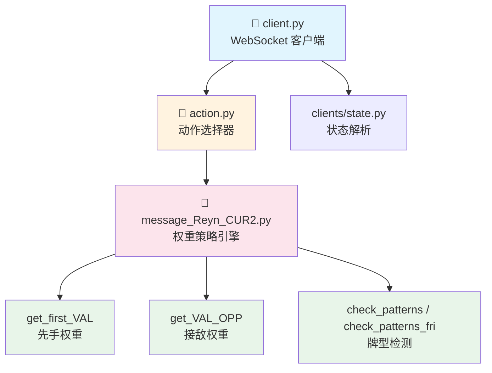
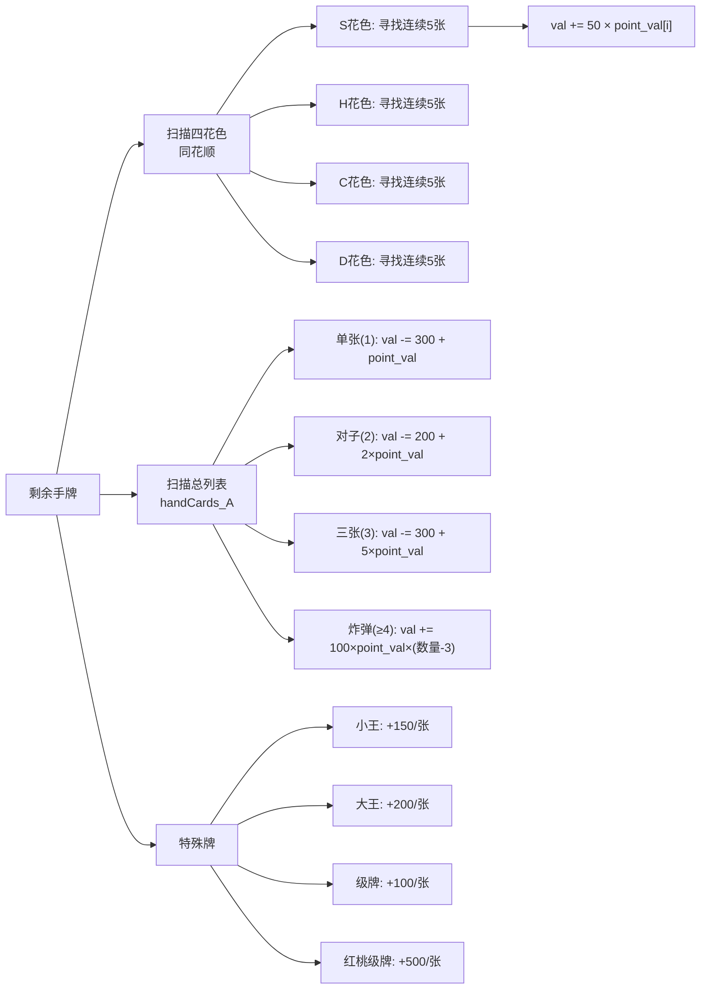
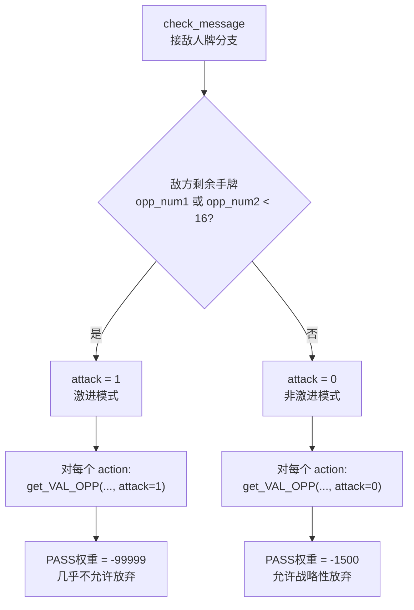
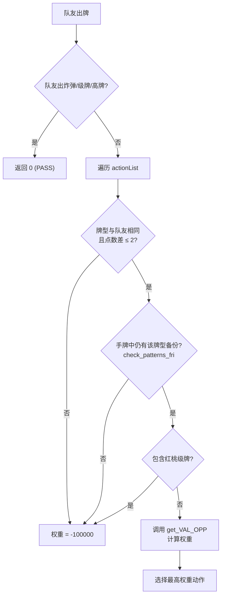
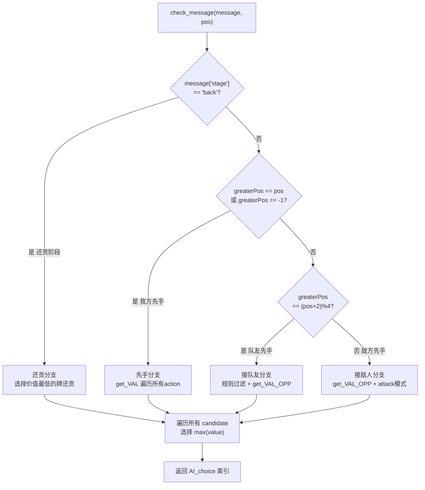

EggPan（又名 Reyn_AI 2.0.0）是由 NUAA 的 Ryen Zhang 开发的一套基于权重评分的启发式掼蛋AI策略。其核心思想是：将每一手可能的出牌动作转化为一个标量权重值，通过模拟"打出这副牌后剩余手牌的牌力"，选出一个能使后续局面最优的出牌决策。该策略不依赖深度学习或蒙特卡洛搜索，而是以手工设计的权重函数驱动，在任何需要专家经验的场景（如模仿学习的专家采样、自博弈对手）中充当确定性策略引擎。

Sources: [message_Reyn_CUR2.py](coach/EggPan/message_Reyn_CUR2.py#L1-L4)

## 模块架构：三文件协作模式

EggPan 模块由三个文件构成，形成清晰的**通信层 → 动作选择层 → 策略引擎层**三层架构。



**client.py** 作为 WebSocket 客户端接入游戏服务器，收到消息后先经 `State.parse()` 解析游戏状态（手牌、公共信息、阶段标记），然后在收到 `actionList` 时调用 `Action.parse_AI()` 获取决策索引。

Sources: [client.py](coach/EggPan/client.py#L9-L32)

**action.py** 提供两种模式：`parse()` 返回随机动作（用于基准测试），`parse_AI()` 调用 `check_message()` 获取AI决策。值得注意的是，`parse_AI()` 包含一个兜底逻辑——当 `check_message()` 返回 `None` 时（例如未处理的进贡阶段），自动降级为随机选择，避免程序崩溃。

Sources: [action.py](coach/EggPan/action.py#L5-L36)

**message_Reyn_CUR2.py** 是整个策略的核心，总计约 2505 行代码。尽管体量庞大，但其结构高度模式化——每个牌型都遵循完全相同的"扣除出牌 → 计算剩余牌力 → 汇总权重"三步流程。

Sources: [message_Reyn_CUR2.py](coach/EggPan/message_Reyn_CUR2.py#L1-L2505)

## 核心数据结构：七维手牌编码

策略引擎在每次评估动作前，都会将服务器传来的 `handCards`（字符串列表，如 `['S4', 'H5', 'C6']`）转换为七组固定长度的整数数组。这种编码方式为后续的剩余牌力扫描提供了O(1)的按花色、按点数访问能力。

| 数组名 | 长度 | 含义 | 索引映射 |
|--------|------|------|----------|
| `handCards_S` | 13 | 黑桃花色各点数持有量 | `[0]=A, [1]=2, ..., [12]=K` |
| `handCards_H` | 13 | 红桃花色各点数持有量 | 同上 |
| `handCards_C` | 13 | 梅花花色各点数持有量 | 同上 |
| `handCards_D` | 13 | 方片花色各点数持有量 | 同上 |
| `handCards_A` | 13 | 不计花色的总持有量 | 同上 |
| `handCards_R` | 3 | 级牌信息 | `[0]=级牌点数索引+1, [1]=级牌数量, [2]=红桃级牌数量` |
| `handCards_K` | 2 | 特殊牌 | `[0]=小王(SB)数量, [1]=大王(HR)数量` |

编码时，级牌不计入普通花色数组而单独记录，红桃级牌更享有双重身份（既是级牌又是红桃）。`get_num()` 函数负责将扑克点数字符（`'A'` → `0`, `'2'` → `1`, ..., `'K'` → `12`, `'T'` → `9`, `'J'` → `10`, `'Q'` → `11`）转换为数组索引。特别地，`'JOKER'` 被映射到索引 13。

Sources: [message_Reyn_CUR2.py](coach/EggPan/message_Reyn_CUR2.py#L1975-L1989)

## 权重公式：先手出牌的 get_VAL 函数

`get_VAL()` 是第一轮出牌（我方先手）时的核心权重函数。其调用签名为：

```
get_VAL(handCards_S, handCards_H, handCards_C, handCards_D, 
        handCards_A, handCards_R, handCards_K, card, curRank) → int
```

权重计算遵循一个通用公式，在不同牌型间仅有参数差异：

```
val = 基准偏移 - Σ(get_point_val(打出的每张牌)) - 牌型惩罚项 + get_remain_VAL(剩余手牌)
```

以**单张 Single** 为例：

```
val = 100 - get_point_val(打出的牌) + get_remain_VAL(扣除该牌后的手牌)
```

以**炸弹 Bomb（4张）** 为例：

```
val = -Σ(point_val[每张牌]) - 100 × point_val[该炸弹点数] + get_remain_VAL(剩余手牌)
```

以**顺子 Straight** 为例：

```
val = -Σ(point_val[5张牌]) + 250 + get_remain_VAL(剩余手牌)
```

各牌型的基准参数差异如下表：

| 牌型 | 基准偏移 | 额外惩罚 | 设计意图 |
|------|----------|----------|----------|
| PASS | — | 返回 -99999 | 先手时几乎不出PASS |
| Single | +100 | 无 | 鼓励出单张小牌 |
| Pair | +100 | 无 | 鼓励出小对子 |
| Trips | +80 | -5 × point_val[点数] | 三张有一定惩罚 |
| Bomb(4张) | 0 | -100 × point_val[点数] | 炸弹消耗大 |
| Bomb(5张+) | 0 | -150 × point_val[点数] | 更大炸弹惩罚更重 |
| Straight | +250 | 无 | 顺子清牌有奖励 |
| ThreeWithTwo | +250 | 无 | 三带二清牌有奖励 |
| ThreePair | +250 | 无 | 三联对清牌有奖励 |
| TwoTrips | +150 | 无 | 双三连清牌 |
| StraightFlush | 0 | -180 × point_val[点数] | 同花顺消耗极大 |

Sources: [message_Reyn_CUR2.py](coach/EggPan/message_Reyn_CUR2.py#L205-L1088)

## 剩余牌力评估：get_remain_VAL 的扫描逻辑

`get_remain_VAL()` 是权重系统的另一半核心——它在假想的"打出某手牌后"的剩余手牌上扫描所有潜在牌型，给出一个整体牌力评分。该函数的返回值直接决定了权重的高低，因此它的设计质量直接影响AI的出牌偏好。



关键设计要点：
- **同花顺是最高价值牌型**：每发现一组同花顺奖励 `50 × point_val[起始点数]`，点数越高的同花顺价值越大
- **单张处罚极重**：`val -= 300` 意味着每张孤立牌都是巨大负担，驱动机器人尽快清掉散张
- **对子和三张也有处罚**：分别 -200 和 -300，但处罚略轻于单张
- **炸弹奖励非线性**：`(数量 - 3)` 因子意味着4张炸弹获得 1× 奖励，5张获得 2×，依此类推
- **级牌与王的特殊地位**：红桃级牌 500 点的价值远超普通牌（普通A仅 28 点），反映了掼蛋中级牌的百搭属性

Sources: [message_Reyn_CUR2.py](coach/EggPan/message_Reyn_CUR2.py#L48-L103)

## 点数价值体系：point_val 与 get_point_val

全局数组 `point_val` 是所有权重计算的基础标尺，定义了每种点数的基础价值：

| 点数 | A | 2 | 3 | 4 | 5 | 6 | 7 | 8 | 9 | T | J | Q | K | B(小王) |
|------|---|---|---|---|---|---|---|---|---|---|---|----|----|----|----|----|
| 价值 | 28 | 6 | 8 | 10 | 12 | 15 | 18 | 20 | 21 | 22 | 23 | 24 | 25 | 100 |

该序列呈明显的**单调递增**趋势——高点数牌价值更高，这是合理的：高点数炸弹威力更大，高点数顺子更难被压。A（索引0）的 28 点尤其突出，反映了A作为最大单牌的战略价值。

`get_point_val(card, curRank)` 在基础价值之上叠加了**级牌加成**：
- 普通级牌（任意花色）：固定 100 点
- **红桃级牌 `HR`**：固定 500 点——这是全游戏中价值最高的单张
- 小王（`SB`）：固定 150 点，大王（`HR`）：固定 200 点

Sources: [message_Reyn_CUR2.py](coach/EggPan/message_Reyn_CUR2.py#L7-L44)

## 接敌人牌策略：get_VAL_OPP 与激进度

当轮到迎接敌方出牌时，策略引擎调用 `get_VAL_OPP()`。与先手 `get_VAL()` 的核心差异在于：

1. **PASS 权重可调**：非激进模式（`attack=0`）下 PASS 权重为 `-1500`（允许选择放弃），激进模式（`attack=1`）下为 `-99999`（强制出牌对抗）
2. **无正向基准偏移**：先手函数的 `+100`、`+250` 等奖励在接敌时全部消失——这意味着接敌出牌是一种"消耗"，只有牌力改善才会带来正权重

激进模式（`attack=1`）的触发条件是：任一敌方剩余手牌数 **少于 16 张**。此时AI判断进入残局阶段，必须全力阻击敌人，不再允许 PASS 避让。



Sources: [message_Reyn_CUR2.py](coach/EggPan/message_Reyn_CUR2.py#L1091-L1971) 和 [message_Reyn_CUR2.py](coach/EggPan/message_Reyn_CUR2.py#L2425-L2505)

## 接队友牌策略：check_patterns_fri 的协作逻辑

当轮到我方接队友牌时（`greaterPos == (pos+2)%4`），策略发生了根本性转变——不再通过权重比较选择动作，而是采用**规则过滤 + 缩小范围**的策略：

1. **直接让过的情况**：队友出炸弹、级牌、高点数牌（T/J/Q/K/A/B/R）、三联对、同花顺、JOKER 时，直接返回 `0`（即选择 PASS），不拆自己的牌去压队友
2. **筛选可接牌型**：只保留与队友牌型相同、点数差 ≤ 2、且自己手牌中仍有该牌型备份的候选动作
3. **红桃级牌保护**：若某候选包含红桃级牌 `H+curRank`，直接赋予 `-100000` 权重——绝不用百搭牌接队友



这一设计的核心理念是：**队友之间避免内耗**，只在"顺手"的情况下帮队友接牌，绝不用关键资源（炸弹、级牌、百搭）去压队友的普通牌。

Sources: [message_Reyn_CUR2.py](coach/EggPan/message_Reyn_CUR2.py#L2320-L2423)

## 全局决策路由：check_message 的四分支架构

`check_message(message, pos)` 是整个策略的入口函数，根据游戏阶段和出牌权归属，将决策路由到四个不同分支：



### 还贡分支（back stage）

在还贡阶段，AI 遍历所有可出的单张牌，选择 `-get_point_val()` 最大的那张（即价值最低的牌）还贡给对方。同时计算打出该牌后剩余手牌的 `get_remain_VAL()`，确保还贡后手牌结构不被过度破坏。

Sources: [message_Reyn_CUR2.py](coach/EggPan/message_Reyn_CUR2.py#L2152-L2248)

### 决策选择机制

所有四个分支最终都遵循相同的选择逻辑：

```python
max = -50000
AI_choice = 0
for i in range(index + 1):
    if value[i] > max:
        AI_choice = i
        max = value[i]
return AI_choice
```

选择 **最大权重** 对应的动作索引。初始阈值 `-50000` 确保了即使所有权重都为负（如在接敌时），仍能选出相对最优的动作。

Sources: [message_Reyn_CUR2.py](coach/EggPan/message_Reyn_CUR2.py#L2311-L2318)

## 牌型检测辅助函数

策略引擎包含两个牌型检测函数，用于判断手牌中是否存在可接牌的牌型备份。

**check_patterns_fri(message, action)** — 检查是否能接队友牌。将手牌按点数汇总到 16 位数组（索引 0-12 为 2-A，索引 13 为级牌统一位置，索引 14-15 为大小王），然后根据目标牌型检查是否有同类型且点数更高的组合：

| 目标牌型 | 检测逻辑 |
|----------|----------|
| Single | 手牌中是否有该点数（仅1张时返回1，表示该牌是唯一选择不应浪费） |
| Pair | 手牌中是否有该点数的对子 |
| Trips | 手牌中是否有该点数的三张 |
| ThreeWithTwo | 三张存在 且 任意点数有对子 |
| ThreePair | 存在连续三组对子 |
| Straight | 存在连续五张单牌 |

`check_patterns(message)` 的逻辑类似，但用于对方出牌后的可接牌判断，额外处理了 JOKER 的直接返回。

Sources: [message_Reyn_CUR2.py](coach/EggPan/message_Reyn_CUR2.py#L1993-L2149)

## 策略特征总结

| 维度 | 特征 |
|------|------|
| **决策范式** | 一步前瞻（One-step Lookahead）：模拟打出后的剩余牌力，不递归搜索 |
| **权重来源** | 手工设计的 point_val 数组 + 牌型惩罚/奖励参数 |
| **花色感知** | 是——四花色独立数组支持同花顺检测 |
| **级牌/百搭感知** | 是——红桃级牌享 500 点最高价值，且受特殊保护 |
| **队友协作** | 规则驱动的保守接牌策略，避免内耗 |
| **残局激进** | 敌方少于 16 张时切换 attack 模式，不再 PASS |
| **代码规模** | ~2500 行，高度模式化的 if-elif 结构 |
| **适用场景** | 模仿学习专家采样、自博弈对手、基准测试对标 |

## 相关页面导航

- 上一篇：[教练注册机制：coach模块的动态导入与LoadCoach工厂模式](16-jiao-lian-zhu-ce-ji-zhi-coachmo-kuai-de-dong-tai-dao-ru-yu-loadcoachgong-han-mo-shi)
- 下一篇：[TOP专家策略：完整的掼蛋规则引擎与牌型组合搜索](18-topzhuan-jia-ce-lue-wan-zheng-de-guan-dan-gui-ze-yin-qing-yu-pai-xing-zu-he-sou-suo)
- 相关阅读：[模仿学习原理：DAgger算法与专家策略混合采样](6-mo-fang-xue-xi-yuan-li-daggersuan-fa-yu-zhuan-jia-ce-lue-hun-he-cai-yang) — 了解 EggPan 如何作为专家策略参与训练数据生成
- 相关阅读：[客户端精简化：tcli.py统一入口与多模式路由](23-ke-hu-duan-jing-jian-hua-tcli-pytong-ru-kou-yu-duo-mo-shi-lu-you) — 了解客户端的通用入口与 EggPan 的调用关系