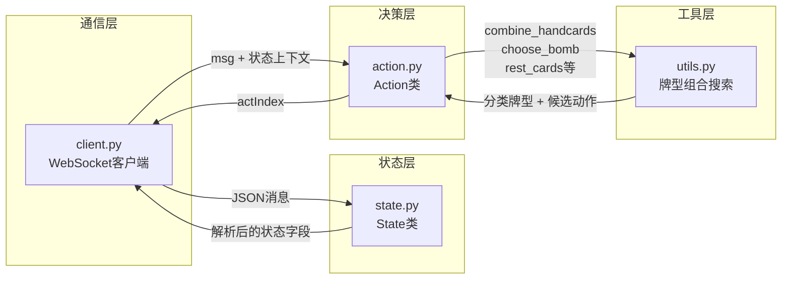
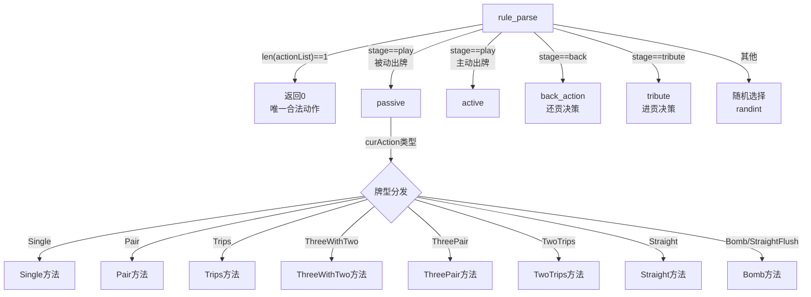
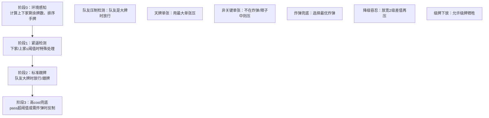

TOP（作者：Duofeng Wu）是 `coach/` 目录下最庞大、最完整的专家策略实现，总计约 **2500 行代码**，覆盖了掼蛋游戏从进贡/还贡到出牌决策的完整生命周期。与基于权重打分的 [EggPan专家策略](17-eggpanzhuan-jia-ce-lue-ji-yu-quan-zhong-de-qi-fa-shi-chu-pai-jue-ce) 不同，TOP 采用**规则驱动的条件分支架构**：针对每一种牌型（单张、对子、三张、三带二、顺子、三连对、钢板、炸弹、同花顺）编写了独立的决策函数，并在函数内部构建了嵌套的 if-else 决策树，模拟人类高手的"局面判断→策略选择"思维链。

**全局设计原则**：TOP 策略始终围绕四条核心博弈原则运转——**队友协同**（不给队友制造出牌压力）、**对手压制**（在对手即将完牌时争夺出牌权）、**牌型保全**（优先使用自然形成的牌型池而非拆解高阶组合）、**炸弹管理**（在多炸弹或关键局面时才使用炸弹）。这些原则在每一个牌型的决策函数中以不同形式反复体现。

Sources: [action.py](coach/TOP/action.py#L1-L1456), [utils.py](coach/TOP/utils.py#L1-L770)

## 模块架构：四文件协同的决策流水线

TOP 模块由四个文件构成一条清晰的**消息→状态→决策→响应**流水线，如下图所示：

- **`client.py`**（31行）：WebSocket 客户端骨架，负责连接服务端、收发 JSON 消息，本身不包含任何游戏逻辑——它只是 State 和 Action 之间的胶水层。
- **`state.py`**（180行）：游戏状态机，解析服务端发来的各类消息（`notify_play`、`act_play`、`notify_tribute` 等），维护四家剩余牌数、出牌历史、pass 计数器等全局状态。该模块在 [状态机解析](22-zhuang-tai-ji-jie-xi-statelei-de-xiao-xi-fen-fa-yu-you-xi-jie-duan-zi-dong-lu-you) 中有更通用的分析。
- **`action.py`**（1456行）：决策引擎核心，包含 `Single`、`Pair`、`Trips`、`ThreeWithTwo`、`ThreePair`、`TwoTrips`、`Straight`、`Bomb` 八种被动响应函数，以及 `active`（主动出牌）、`passive`（被动跟牌）、`back_action`（还贡）、`tribute`（进贡）四个顶层调度函数。
- **`utils.py`**（770行）：牌型组合搜索的函数库，提供手牌分类 `combine_handcards`、剩余牌推演 `rest_cards`、炸弹优选 `choose_bomb`、炸弹计数 `cal_bomb_num`、终局决策 `one_hand` 等核心工具。

Sources: [client.py](coach/TOP/client.py#L1-L31), [state.py](coach/TOP/state.py#L1-L180), [action.py](coach/TOP/action.py#L1-L1456), [utils.py](coach/TOP/utils.py#L1-L770)

## 核心调度：rule_parse 的双模式分发

整个决策系统的入口是 `Action.rule_parse()`，它根据消息的 `stage` 字段和局面角色（主动/被动）进行两级分发：

被动出牌（`greaterPos != myPos`）意味着必须跟牌——需要打出与 `curAction` 同类型且更大的牌，或选择 PASS（返回0）。主动出牌（`greaterPos == -1` 或 `curPos == -1`）则可以自由选择出牌策略。`rule_parse` 在调用 `passive` 之前额外做了一个关键检查：如果手牌数 ≤10 张，先调用 `one_hand` 检查是否能一次性出完所有牌。

Sources: [action.py](coach/TOP/action.py#L1383-L1405)

## 牌型组合搜索：combine_handcards 的六维分类

`combine_handcards` 是 TOP 策略的**感知基础**——它将 27 张手牌转换为结构化认知，输出六种牌型类别和炸弹信息字典：

| 输出键 | 数据结构 | 说明 |
|---|---|---|
| `"Single"` | `List[str]` | 所有单张牌 |
| `"Pair"` | `List[List[str]]` | 所有对子（每组2张同面值） |
| `"Trips"` | `List[List[str]]` | 所有三张（每组3张同面值） |
| `"Bomb"` | `List[List[str]]` | 所有炸弹（≥4张同面值） |
| `"Straight"` | `List[List[str]]` | 检测到的顺子（5张连续单牌），最多一组 |
| `"StraightFlush"` | `List[List[str]]` | 检测到的同花顺（5张同花色连续），最多一组 |

分类算法分三步执行：

**第一步：面值聚合**。将手牌按面值排序后分组，1张→Single，2张→Pair，3张→Trips，≥4张→Bomb，同时记录 `bomb_info`（面值→张数映射）。

**第二步：顺子检测**。从手牌中排除级牌（rank）、小王（B）、大王（R）以及已归入炸弹的牌，统计剩余牌在各面值（A=1 到 K=13）上的分布。在 14 个面值上滑动长度为 5 的窗口，寻找连续非零段。检测逻辑不仅要求无缺失面值，还通过 `zeronum`（张数为1的面值数）、`onenum`（张数为2）、`twonum`（张数为3）的差值关系评估顺子的"质量"——优先选择拆牌代价最小的窗口位置。特别处理了 A-2-3-4-5（A在位置1）和 10-J-Q-K-A（位置10跨到位置1）两种边界情况。

**第三步：同花顺检测**。如果找到了顺子候选，进一步在四花色维度上用 `sttemp[4][5]` 矩阵检查是否存在同一花色的五连张。若存在同花顺，优先提取同花顺牌；否则提取普通顺子牌。剩余牌重新进行面值聚合，得到最终的六维分类结果。

Sources: [utils.py](coach/TOP/utils.py#L14-L244)

## 被动跟牌决策：八种牌型的统一思维框架

所有被动跟牌方法共享一个**六阶段决策模板**，以 `Single` 方法为最完整代表：

### 紧逼检测阈值

每个牌型方法在阶段1都设定了紧逼条件，核心参数如下表：

| 牌型 | 下家紧逼阈值 | 上家紧逼阈值 | 队友压制跳过大牌阈值 |
|---|---|---|---|
| Single | `numofnext ≤ 4` | `numofpre ≤ 3` | `curVal ≥ max_val` 且队友是大牌 |
| Pair | `numofnext ≤ 4` | `numofpre ≤ 4` | `curVal ≥ max_val` |
| Trips | `numofnext ≤ 6` | `numofpre ≤ 5` | `curVal ≥ max_val` |
| ThreeWithTwo | `numofnext ≤ 7` | `numofpre ≤ 7` | `curVal ≥ max_val` |

当处于紧逼状态时，策略变得激进：优先用大牌压制、必要时使用炸弹、容忍一定的拆牌代价。当非紧逼时，进入**阶段2**的标准跟牌逻辑——如果队友是大牌则选择 PASS（返回0），否则按正常的"最小可压牌"原则选择动作。

### 炸弹选择算法：choose_bomb

当普通牌型无法应对时，`choose_bomb` 函数提供了精细的炸弹评分机制：

- **基础分** = `card_val[面值] + (长度 - 4) × 16`
- **级牌修正**：含1张级牌加3分（prior=3），含2张级牌加16分（prior=16）——级牌参与的"假炸弹"优先级低于纯炸弹
- **同花顺**：基础分 + 32（等价于6张普通炸弹）
- **拆弹保护**：如果某面值在 `bomb_info` 中的原始张数大于出牌张数，说明是拆了更大的炸弹，仅在无三张储备（`len(Trips)==0`）时才考虑
- 返回值是**评分最低**（即代价最小）的炸弹索引

Sources: [utils.py](coach/TOP/utils.py#L304-L368), [action.py](coach/TOP/action.py#L36-L163)

## 主动出牌策略：getlist 构建 + 七级优先级排序

主动出牌（`active` 方法）是 TOP 策略最具独创性的部分。它首先通过 `getlist` 方法系统地构建所有可行动作列表：

| 动作列表 | 构建方式 |
|---|---|
| `single_actionlist` | 从 sorted_cards["Single"] 逐一提取 |
| `pair_actionlist` | 从 sorted_cards["Pair"] 提取，按面值排序 |
| `trips_actionlist` | 从 sorted_cards["Trips"] 提取，按面值排序 |
| `threetwo_actionlist` | 笛卡尔积：Trips × Pair 的所有组合 |
| `threepair_actionlist` | 连续三对检测：pair_actionlist 中面值连续的三个对子 |
| `twotrips_actionlist` | 连续两三条检测：trips_actionlist 中面值连续的两个三条 |
| `straight_actionlist` | 从 sorted_cards["Straight"] 提取 |

随后按**七级优先级**依次尝试：

1. **一手出完**：如果某个 action 的手牌数等于总手牌数，直接选择
2. **两手组合出完**（手牌≤12张时）：检查是否存在两个 action 的并集恰好等于全部手牌
3. **中低单张**：单张面值低于阈值9时出单张（除非下家仅剩1张）
4. **钢板/三连对**：调用 `rankfour` 在两者中选面值更低的出
5. **顺子**：面值低于阈值10时出顺子
6. **三带二**：调用 `rankthree` 综合单张/对子/三张/三带二的相对距离决策
7. **三张/对子/单张**：依次调用 `rankone`、`ranktwo`、最后的单张兜底

每一步的阈值（`cur = [9,10,9,8,10,10,2]`）分别对应单张上限、连对上限、钢板上限、三带二上限、顺子上限、三张上限和 pair 距离容忍度。

Sources: [action.py](coach/TOP/action.py#L1023-L1168)

## 终局感知：one_hand 的"一手牌"检测

当手牌数 ≤10 时，`passive` 方法会优先调用 `one_hand` 检查能否一次性出完。该函数的核心逻辑：

- **下家非队友**：`(myPos+2)%4 != greaterPos` 时，只要 actionList 中有长度等于手牌数的动作就直接选择
- **下家是队友**：需要额外确保选择的不是炸弹/同花顺（避免浪费），或是该炸弹/同花顺能压过外部最大炸弹才使用
- **炸弹强度计算**：`card_val[面值] + (长度-4) × 14`，额外考虑级牌张数对炸弹强度的加成

这一机制确保 TOP 不会在即将获胜时错失良机，也不会在队友即将获胜时盲目出炸弹。

Sources: [utils.py](coach/TOP/utils.py#L370-L413)

## 进贡与还贡：tribute 与 back_action

进贡决策极为简洁：如果第一选项（actionList[0]）包含级牌，选择索引1（即第二选项，保留级牌）；否则选择索引0。这体现了一个简单原则——**进贡时优先保留级牌**。

还贡决策（`back_action`）则复杂得多，采用**牌型优先序 + 面值过滤**的两层策略：

| 优先级 | 牌型 | 过滤条件 | 选择策略 |
|---|---|---|---|
| 1 | Single | 面值 ≤10 | 对手位置奇偶判断：对家进贡→优先出5/T；同侧进贡→出<5的小牌 |
| 2 | Trips | 面值 ≤10 | 跳过连续三条中的成员、跳过与J/T相邻的 |
| 3 | Pair | 面值 ≤10 | 跳过三连对成员、跳过9（当同时有T和J时）、跳过T（当同时有J和Q时） |
| 4 | Bomb | 面值 ≤10 | 优先选择长度>4的超长炸弹中的牌 |
| 5 | 兜底 | 面值 ≤10 | 随机选一张 |

还贡策略的设计意图是将**低价值且不破坏手牌结构**的牌还给对手：优先在单张中选择不影响顺子/对子的小牌；在三张和对子中刻意保留连续结构（跳过三连对和钢板候选）；在炸弹中优先拆解超长炸弹（5张及以上）的冗余牌。

Sources: [action.py](coach/TOP/action.py#L1170-L1380), [action.py](coach/TOP/action.py#L1383-L1395)

## 状态感知层：State 的牌数追踪机制

`State` 类为 TOP 决策提供了关键的**对手牌数追踪**能力。在 `notify_play` 中，每当有人出牌（非 PASS），系统会：

1. 将出的每张牌从 `remain_cards[花色][面值索引]` 中减1
2. 更新 `history[位置]["remain"]` 减1
3. 维护两个 pass 计数器：全局 `pass_num`（队友和自己出牌时递增）和 `my_pass_num`（仅自己 PASS 时递增）

这两个计数器在决策函数中作为**激进程度调节器**——当 `pass_num >= 5` 或 `my_pass_num >= 3` 时，策略会从"保守跟牌"切换到"不惜代价争夺出牌权"模式，包括使用炸弹或拆解顺子候选牌。

每局结束时（`notify_episode_over`），这些状态被完整重置，确保下一局从干净状态开始。

Sources: [state.py](coach/TOP/state.py#L68-L108), [state.py](coach/TOP/state.py#L118-L135)

## 与模仿学习的集成：parse_AI 接口

`Action.parse_AI()` 是 TOP 策略对外暴露的标准接口，专门服务于模仿学习系统中的专家采样需求。该接口接受游戏消息和可选的 State 对象，内部调用 `rule_parse` 完成决策。如果 State 不可用，则使用默认的初始状态（27张剩余），这在 `tcli_imitation.py` 的批量采样场景中提供了回退保障。当规则解析出现异常时，降级为随机选择，确保训练流程不会因单次决策失败而中断——这与 [分布式DAgger](8-fen-bu-shi-dagger-learneryan-bo-quan-zhong-ke-hu-duan-shou-ji-zhuan-jia-yang-ben) 中描述的专家样本收集流程直接对接。

Sources: [action.py](coach/TOP/action.py#L1407-L1456)

## 策略优缺点分析

| 维度 | 优点 | 局限 |
|---|---|---|
| **覆盖面** | 覆盖掼蛋全部牌型（含同花顺），从进贡到终局完整闭环 | 决策依赖硬编码阈值，对手牌分布与阈值偏差较大时可能失准 |
| **可解释性** | 每个决策都有明确的条件路径，便于调试 | 条件分支嵌套深（3-4层），修改一个阈值可能引发连锁反应 |
| **队友协同** | 明确的"不给队友压力"策略，队友大牌时主动放行 | 对队友意图的推断仅基于牌数和位置，缺乏手牌建模 |
| **炸弹管理** | 精细的炸弹评分和选择性使用 | 炸弹决策中的概率因素（`random() > 0.5`）引入了非确定性 |
| **牌型保全** | `combine_handcards` 后的 member 池机制保护顺子和炸弹候选牌 | 顺子检测只保留一组最优，可能错失多顺子场景的灵活选择 |

## 阅读路线建议

TOP 策略代表了掼蛋AI中**规则引擎路线的完整形态**。理解它之后，建议对照阅读：
- [EggPan专家策略](17-eggpanzhuan-jia-ce-lue-ji-yu-quan-zhong-de-qi-fa-shi-chu-pai-jue-ce)：基于权重打分的轻量级方案，与TOP的规则分支形成鲜明对比
- [神经网络架构](12-shen-jing-wang-luo-jia-gou-actionvaluenetde-lstmli-shi-jian-mo-yu-crossunitcan-chai-wang-luo)：了解深度学习方案如何替代规则引擎的决策逻辑
- [分布式DAgger](8-fen-bu-shi-dagger-learneryan-bo-quan-zhong-ke-hu-duan-shou-ji-zhuan-jia-yang-ben)：TOP作为专家策略在模仿学习训练中的具体角色