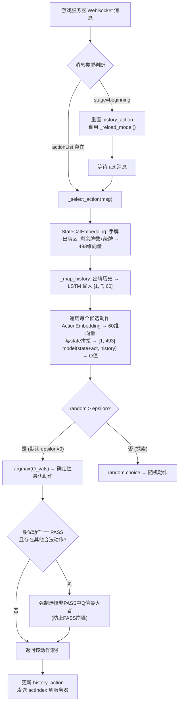
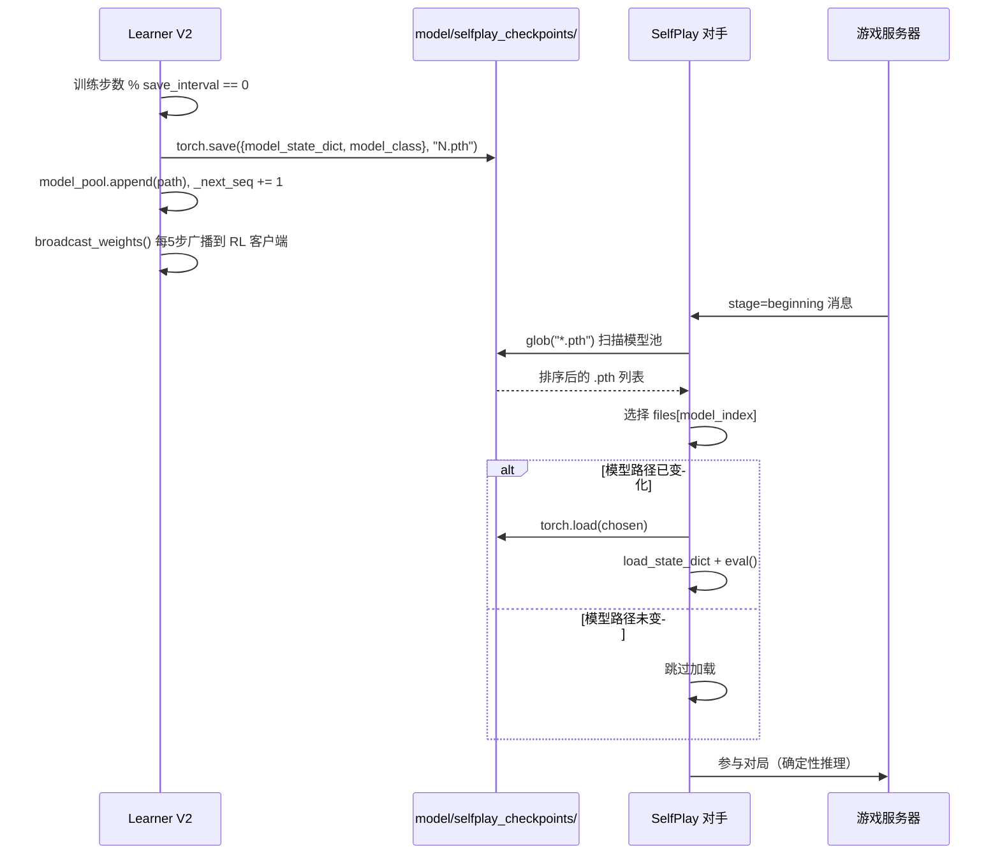

`clients/selfplay_opponent.py` 是自博弈训练体系中的"陪练"组件——它加载 Learner V2 在 `model/selfplay_checkpoints/` 目录下持续产出的固定模型检查点，以纯推理模式（无学习、无经验回传）参与对局，为正在训练的 RL 客户端提供**多样化、可迭代升级**的对抗压力。与 RL 客户端相比，它砍掉了 ZMQ 通信、经验回放、优化器和梯度计算，只保留一个最精简的推理回路：**状态编码 → 动作 Q 值评估 → 确定性 argmax 出牌**。

Sources: [selfplay_opponent.py](clients/selfplay_opponent.py#L1-L30)

## 系统定位：自博弈三环中的"旧版本对手"

自博弈训练需要三个角色协同运转：**Learner V2** 负责从经验中学习并周期性地将模型保存到 `model/selfplay_checkpoints/`（按递增编号 `1.pth`, `2.pth`, ... 命名）；**RL 客户端**（`tcli.py reinforcement` 模式）作为正在训练的智能体，从 Learner 接收广播权重、发送经验回 Learner；**SelfPlay 对手**则加载 Learner 产出的历史检查点，为 RL 客户端提供不同训练阶段的对抗强度。

整个系统的启动由 `actor_all/start_selfplay.py` 编排，形成一张 4 桌并行的对抗矩阵：

| 桌号 | 端口 | 座位 1 | 座位 2-4 | 对抗目的 |
|------|------|--------|----------|----------|
| 1 | 23456 | RL 客户端 | 3× TOP 专家 | **强对抗天花板**——RL 智能体与人类级规则引擎对抗 |
| 2 | 23457 | RL 客户端 | 3× SelfPlay (model_index=0) | 对抗**最新**自博弈模型 |
| 3 | 23458 | RL 客户端 | 3× SelfPlay (model_index=1) | 对抗**次新**自博弈模型 |
| 4 | 23459 | RL 客户端 | 3× SelfPlay (model_index=2) | 对抗**第三新**自博弈模型 |

这种**错位模型索引**策略确保 RL 客户端同时面对不同训练阶段的"历史自我"，防止策略过拟合到单一对手风格。

Sources: [start_selfplay.py](actor_all/start_selfplay.py#L1-L50), [start_selfplay.py](actor_all/start_selfplay.py#L100-L166)

## 核心架构：SelfPlayOpponent 的推理回路

`SelfPlayOpponent` 继承自 `ws4py.client.threadedclient.WebSocketClient`，核心逻辑全部集中在 `received_message` 回调中。与 RL 客户端（`tcli.py` 的 `InferenceClient`）相比，它极度精简——不维护经验缓冲区、不持有优化器、不连接 ZMQ：



核心推理在 `torch.no_grad()` 上下文中完成，不构建计算图，最大化推理效率。

Sources: [selfplay_opponent.py](clients/selfplay_opponent.py#L108-L152), [selfplay_opponent.py](clients/selfplay_opponent.py#L154-L163)

## 模型热加载机制：每局自动扫描模型池

`_reload_model()` 是 SelfPlay 对手区别于其他客户端的最关键设计——它在每局开始时自动扫描 `model/selfplay_checkpoints/` 目录，仅在模型路径发生变化时才执行磁盘 I/O 和 `load_state_dict`。具体流程：

1. **扫描**：`glob.glob(os.path.join(self.MODEL_DIR, "*.pth"))` 获取所有 `.pth` 文件
2. **排序**：按文件名中的数字从大到小排列（`1.pth` → `104.pth`，数字大的在前，即最新的在前）
3. **选择**：`files[idx]`，其中 `idx = min(self.model_index, len(files) - 1)`。`model_index=0` 选最新，`=1` 选第二新，以此类推
4. **去重**：若 `chosen == self.current_model_path`，说明模型未变化，直接跳过加载
5. **加载**：`torch.load` → 从检查点中提取 `model_class`（默认 `ActionValueNet`）→ `load_state_dict` → `model.eval()`

检查点文件格式与 Learner V2 的保存逻辑保持一致：

| 键 | 值 | 说明 |
|---|---|---|
| `model_state_dict` | `OrderedDict` | PyTorch 标准权重字典 |
| `model_class` | `type` | 网络类引用，默认 `ActionValueNet` |

当 `model/selfplay_checkpoints/` 目录为空时，构造函数会抛出 `FileNotFoundError`；但若模型已在之前加载过，`_reload_model` 会静默跳过（保留了上一次的有效模型），不会中断对局。这一容错设计使得即使 Learner V2 尚未产出任何检查点，已经运行的 SelfPlay 对手也能继续使用已有模型正常打牌。

Sources: [selfplay_opponent.py](clients/selfplay_opponent.py#L30-L32), [selfplay_opponent.py](clients/selfplay_opponent.py#L82-L106), [learner_v2.py](actor_all/learner_v2.py#L496-L507)

## 动作选择：确定性推理 + PASS 崩塌防护

`_select_action` 实现了自博弈对手的动作决策逻辑，核心有三层设计：

**第一层：Q 值遍历评估。** 对 `actionList` 中前 `indexRange + 1` 个候选动作逐一计算 Q 值。每个候选动作的评估流程为：`StateCatEmbedding(msg)` 产生 493 维全局状态向量，`ActionEmbedding(msg, i)` 产生 60 维动作编码（4×15 的牌面矩阵展平），二者拼接为 493 维输入，与 LSTM 历史编码（512 维隐状态）一起送入 `ActionValueNet`，输出标量 Q 值。

**第二层：ε-贪婪策略。** 默认 `epsilon=0.0`，这意味着 SelfPlay 对手执行**纯确定性推理**——始终选择 Q 值最大的动作。这是它与 RL 客户端（`epsilon=0.1`）的关键差异：RL 客户端需要探索来收集多样化经验，而 SelfPlay 对手作为陪练，应当以当前模型的最优策略出牌，为 RL 客户端提供一致的对抗信号。命令行参数 `--epsilon` 可以在需要时注入随机性。

**第三层：PASS 崩塌防护。** 若 argmax 选出的最优动作恰好是 PASS，且存在其他合法非 PASS 动作，则强制在非 PASS 动作中重新 argmax。这一机制防止模型陷入"永远 PASS"的退化策略（PASS 崩塌问题），确保对手在有能力出牌时积极出牌。这里的实现逻辑：

```python
if action_idx == pass_idx and act_range > 0:
    non_pass = [i for i in range(act_range + 1) if i != pass_idx]
    non_pass_qs = [q_vals[i] for i in non_pass]
    action_idx = non_pass[int(np.argmax(non_pass_qs))]
```

对比 RL 客户端（`tcli.py` 的 `InferenceClient.select_action`）的做法——它在 greedy 模式下直接对 PASS 位置赋 `-inf` 来屏蔽——SelfPlay 对手采用了语义更清晰的"二次 argmax"策略，结果等价但可读性更好。

Sources: [selfplay_opponent.py](clients/selfplay_opponent.py#L126-L152), [tcli.py](clients/tcli.py#L163-L183)

## 状态与动作编码：与训练管线共享的特征提取

SelfPlay 对手复用了 `util.py` 中的三个核心编码函数，与 RL 客户端、Imitation 客户端保持完全一致的特征口径：

| 函数 | 输入 | 输出维度 | 编码逻辑 |
|------|------|----------|----------|
| `StateCatEmbedding(msg)` | 游戏状态消息 | 493 维向量 | 手牌(4×15=60) + 4人出牌区(4×60=240) + 剩余牌数one-hot(4×30=120) + 级牌one-hot(13) + 当前动作(60) = 493 |
| `ActionEmbedding(msg, i)` | 消息 + 动作索引 | 60 维向量 | 对 `actionList[i]` 经 `process_card_list` 处理后再 `encode_card`，展平为 4×15 |
| `encode_card(card_list)` | 牌列表 | (4, 15) 矩阵 | 按花色(4)×牌面(13) + 特殊位置(2) 构建计数矩阵 |

`process_card_list` 在动作编码前执行格式标准化：将动作三元组（如 `['Straight', 'T', ['ST','SJ','SQ','SK','HA']]`）提取为实际牌列表（`['ST','SJ','SQ','SK','HA']`），PASS 动作则保留为 `('PASS', 'PASS', 'PASS')`。

出牌历史的 LSTM 编码通过 `_map_history` 方法完成：将 `self.history_action` 中的每条出牌记录逐一 `encode_card` 后堆叠为 `[1, T, 60]` 张量（T 为历史长度），送入 `ActionValueNet` 的 LSTM 层提取时序特征。每局开始时 `history_action` 被重置为 `[['PASS', 'PASS', 'PASS']]`，确保跨局历史不泄露。

Sources: [util.py](util.py#L1-L60), [util.py](util.py#L64-L84), [util.py](util.py#L88-L102), [selfplay_opponent.py](clients/selfplay_opponent.py#L154-L163)

## 命令行接口与运行方式

SelfPlay 对手通过标准命令行启动：

```bash
python clients/selfplay_opponent.py <seat> --model_index 0 --host 127.0.0.1 --port 23456 --device cuda
```

参数说明：

| 参数 | 类型 | 默认值 | 说明 |
|------|------|--------|------|
| `seat` | int（位置参数） | 必填 | 座位号 1-4 |
| `--model_index` | int | 0 | 模型选择序号：0=最新、1=第二新、2=第三新... |
| `--host` | str | 127.0.0.1 | 游戏服务器 IP |
| `--port` | int | 23456 | 游戏服务器端口 |
| `--device` | str | cuda | 推理设备（cuda/cpu） |
| `--epsilon` | float | 0.0 | 探索率，0=纯确定性 |
| `-r, --render` | flag | False | 是否渲染终端画面 |

在实际的自博弈训练流程中，这些对手由 `actor_all/start_selfplay.py` 自动启动和管理，无需手动逐个运行。启动脚本为 3 张自博弈桌（端口 23457-23459）各自生成 3 个 SelfPlay 对手进程（座位 2/3/4），每桌使用不同的 `model_index`，并持续监控进程状态——任何进程退出都会被检测并报告。

Sources: [selfplay_opponent.py](clients/selfplay_opponent.py#L1-L8), [selfplay_opponent.py](clients/selfplay_opponent.py#L55-L75), [start_selfplay.py](actor_all/start_selfplay.py#L60-L66), [start_selfplay.py](actor_all/start_selfplay.py#L133-L166)

## 与 RL 客户端的对比：精简设计的工程逻辑

将 SelfPlay 对手与 `tcli.py reinforcement` 模式并置观察，能清晰看出二者在架构上的"对称裁剪"关系：

| 维度 | SelfPlay 对手 | RL 客户端 (InferenceClient) |
|------|--------------|---------------------------|
| **ZMQ 连接** | 无 | SUB(接收权重) + PUSH×2(发送经验+就绪信号) |
| **模型所有权** | 本地加载，自主管理 | Learner 远程广播，被动接收 |
| **经验回放** | 无 | 完整 transition 收集 + 异步发送 |
| **优化器** | 无 | 无（推理端不训练，但发送经验供 Learner 训练） |
| **探索策略** | ε=0.0（确定性） | ε=0.1（ε-贪婪） |
| **PASS 处理** | 二次 argmax | greedy 时 mask 为 -inf |
| **模型热更新** | 每局扫描磁盘 | 后台线程监听 ZMQ SUB |
| **代码量** | ~165 行 | ~305 行 |

这种精简并非偶然——SelfPlay 对手被设计为**计算资源消耗最小化**的推理节点。在典型的自博弈训练中，可能同时运行 9-12 个 SelfPlay 对手进程（3 桌 × 3 个对手/桌），每个进程独立加载不同版本的模型文件。去掉 ZMQ 通信层避免了端口冲突和上下文切换开销；去掉经验收集避免了 GPU 内存浪费在不需要的反向传播图上；`model.eval()` + `torch.no_grad()` 确保推理以最高效率运行。

Sources: [selfplay_opponent.py](clients/selfplay_opponent.py#L1-L165), [tcli.py](clients/tcli.py#L65-L260)

## 模型池的生命周期：从 Learner V2 到 SelfPlay 的流水线

理解 SelfPlay 对手需要将其放在完整的模型流水线中审视。`actor_all/learner_v2.py`（自博弈版 Learner）在传统的 DQN 训练循环中增加了**模型池管理**和**固定目录存储**两个关键功能：



Learner V2 的保存间隔默认为 **25 步**（`learner.py` 为 50 步），更细粒度的检查点产出意味着 SelfPlay 对手池能以更高分辨率覆盖训练过程中的策略演变。每个检查点文件仅包含 `model_state_dict` 和 `model_class` 两个键——不保存优化器状态、不保存经验缓冲区，确保文件体积最小化（仅模型权重），加速磁盘 I/O。

模型池通过 `glob` 按文件名数字排序（`int(os.path.basename(p).replace(".pth", ""))`），数字越大表示训练步数越多，策略越成熟。`start_selfplay.py` 利用这一排序为不同桌子分配不同成熟度的对手：最新模型放在桌 2 提供最强对抗，较旧模型放在桌 3/4 提供多样化策略。

Sources: [learner_v2.py](actor_all/learner_v2.py#L1-L4), [learner_v2.py](actor_all/learner_v2.py#L245-L265), [learner_v2.py](actor_all/learner_v2.py#L496-L507), [start_selfplay.py](actor_all/start_selfplay.py#L83-L98)

## 阅读导航

SelfPlay 对手客户端处于自博弈训练体系与推理架构的交叉点。建议按以下路径深入：

- **上游依赖**：理解 Learner V2 如何产出检查点，参见 [分布式Learner设计：ZMQ PUB-SUB权重广播与经验收集](21-fen-bu-shi-learnershe-ji-zmq-pub-subquan-zhong-yan-bo-yu-jing-yan-shou-ji) 和 [DQN训练流程：经验回放、探索策略与TD目标更新](9-dqnxun-lian-liu-cheng-jing-yan-hui-fang-tan-suo-ce-lue-yu-tdmu-biao-geng-xin)
- **推理基础**：理解 Q 值评估背后的网络结构，参见 [神经网络架构：ActionValueNet的LSTM历史建模与CrossUnit残差网络](12-shen-jing-wang-luo-jia-gou-actionvaluenetde-lstmli-shi-jian-mo-yu-crossunitcan-chai-wang-luo)
- **特征编码**：理解状态与动作的嵌入方式，参见 [状态编码设计：手牌、出牌区、剩余牌数与级牌的多维嵌入](13-zhuang-tai-bian-ma-she-ji-shou-pai-chu-pai-qu-sheng-yu-pai-shu-yu-ji-pai-de-duo-wei-qian-ru) 和 [动作编码与历史序列：出牌历史的LSTM时序建模](14-dong-zuo-bian-ma-yu-li-shi-xu-lie-chu-pai-li-shi-de-lstmshi-xu-jian-mo)
- **训练系统全景**：理解自博弈对手在整个训练流程中的位置，参见 [自博弈训练系统：模型池管理、热加载对手与迭代对抗](11-zi-bo-yi-xun-lian-xi-tong-mo-xing-chi-guan-li-re-jia-zai-dui-shou-yu-die-dai-dui-kang)
- **进程编排**：理解 SelfPlay 对手进程的启动与管理，参见 [launch.py 多进程编排：服务端与四客户端并行启动与生命周期管理](20-launch-py-duo-jin-cheng-bian-pai-fu-wu-duan-yu-si-ke-hu-duan-bing-xing-qi-dong-yu-sheng-ming-zhou-qi-guan-li)
- **对手对比**：理解 SelfPlay 对手与专家策略的差异，参见 [TOP专家策略：完整的掼蛋规则引擎与牌型组合搜索](18-topzhuan-jia-ce-lue-wan-zheng-de-guan-dan-gui-ze-yin-qing-yu-pai-xing-zu-he-sou-suo)