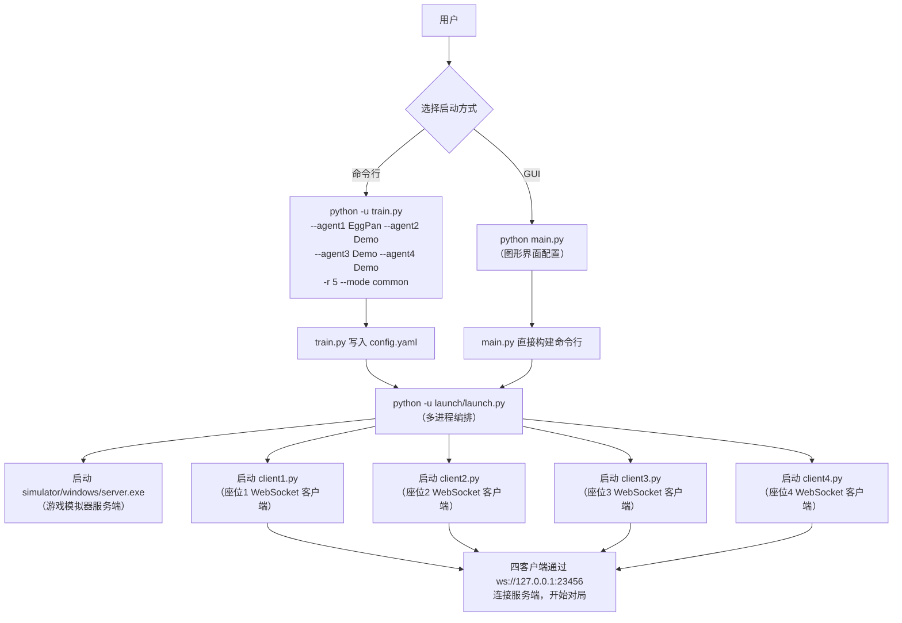

本节介绍如何用最简短的命令启动一场掼蛋AI对局——无需深入理解训练算法或神经网络架构，只需确保必要的环境就绪，即可在数秒内看到四个AI智能体在模拟器上完成完整的掼蛋游戏。

## 两种启动路径概览

本项目提供两条启动路径：**命令行快速启动**（适合调试、训练与批处理）和 **GUI图形界面启动**（适合可视化操作与多模式切换）。二者的底层机制完全一致——均通过多进程编排，依次拉起模拟器服务端与四个WebSocket客户端，唯一的区别在于参数传递方式。



所有路径的最终汇聚点是 `launch/launch.py`，它负责统一的生命周期管理——包括进程创建、信号处理与退出清理。

Sources: [train.py](train.py#L1-L141), [launch/launch.py](launch/launch.py#L1-L188), [main.py](main.py#L1-L507)

## 命令行一行启动（最简方式）

### 基础对局命令

打开终端（cmd 或 PowerShell），将工作目录切换到项目根目录后，执行：

```bash
python -u train.py -r 5 --mode common --agent1 EggPan --agent2 EggPan --agent3 EggPan --agent4 EggPan
```

这条命令的含义是：启动一场 **5局** 的普通模式对局，四个座位全部由 **EggPan**（基于权重的启发式专家策略）操控。对局过程的信息将打印在终端中，游戏结束后会看到绿色的进程释放提示。

若只想让1号玩家使用EggPan、其余座位使用随机策略Demo：

```bash
python -u train.py -r 10 --mode common --agent1 EggPan --agent2 Demo --agent3 Demo --agent4 Demo
```

### 参数速查表

| 参数 | 类型 | 默认值 | 说明 |
|------|------|--------|------|
| `-r / --round` | int | 10（由config.yaml决定） | 对局次数。传入 `-1` 时沿用 `config.yaml` 中的值 |
| `-m / --mode` | str | `il` | 训练模式：`common`=普通对局, `il`=模仿学习, `rl`=强化学习, `test`=模型测试 |
| `--agent1` ~ `--agent4` | str | `EggPan` / `Demo` / `Demo` / `Demo` | 四个座位的AI智能体名称，必须已在 `coach/` 目录注册 |
| `-d / --device` | str | `cpu` | 运算设备：`cpu` 或 `cuda` |
| `--model` | str | `None` | 已有模型路径，用于断点续训或测试 |
| `--lr` | float | `1e-4` | 学习率 |
| `--save_interval` | int | `1000` | 模型保存频率（单位：局） |
| `--log_interval` | int | `100` | 日志记录频率（单位：局） |
| `--epsilon` | float | `0.1` | ε-greedy 探索概率 |
| `--gamma` | float | `0.98` | 强化学习折扣因子 |

### 查看所有可用智能体

如果不确定有哪些已注册的教练（智能体），执行：

```bash
python -u train.py --show_all_agent 1
```

这会列出 `coach/` 目录下所有已注册的智能体名称，包括 `EggPan`、`Demo`、`TOP`、`SEU`、`PJH`、`QAI`、`SHL`、`ZZQ`、`HUMAN` 等。

Sources: [train.py](train.py#L1-L141), [README.md](README.md#L44-L72)

## 底层机制：从 train.py 到游戏对局的完整链路

理解"一行命令"背后发生了什么，有助于排查启动失败的问题。整个流程分为四个阶段：

### 阶段一：train.py 写入配置

`train.py` 本质上是一个参数转发器。它接收命令行参数后，执行两项关键操作：

1. **修改 `launch/config.yaml`**：将 `--mode` 映射为1号玩家的客户端脚本路径（`common` → `client1.py`, `il` → `imitation_client.py`, `rl` → `reinforment_client.py`, `test` → `test_client.py`），同时写入游玩次数。
2. **调用 `launch/launch.py`**：通过 `os.system()` 将剩余参数透传给真正的编排器。

```python
# train.py 核心逻辑（简化）
config_dict["游玩次数"] = rounds
if   args["mode"] == "il":
    config_dict["1号玩家"] = ".\\clients\\imitation_client.py"
elif args["mode"] == "rl":
    config_dict["1号玩家"] = ".\\clients\\reinforment_client.py"
elif args["mode"] == "common":
    config_dict["1号玩家"] = ".\\clients\\client1.py"
# 写入后调用 launch.py
ret = os.system("python -u ./launch/launch.py -d {} --model {} ...".format(...))
```

Sources: [train.py](train.py#L103-L141)

### 阶段二：launch.py 多进程编排

`launch/launch.py` 读取 `config.yaml`，构建一个包含5个进程的列表：

| 进程序号 | 负责进程类 | 执行内容 |
|----------|-----------|----------|
| 0 | `ServeProcess` | 启动 `simulator/windows/server.exe <游玩次数>`，监听 `23456` 端口 |
| 1 | `ClientProcess` | 启动 `clients/client1.py`（1号玩家，通常为训练对象） |
| 2 | `ClientProcess` | 启动 `clients/client2.py`（2号玩家） |
| 3 | `ClientProcess` | 启动 `clients/client3.py`（3号玩家） |
| 4 | `ClientProcess` | 启动 `clients/client4.py`（4号玩家） |

所有进程通过 `multiprocessing.Process.start()` 同时启动，然后对四个 `ClientProcess` 执行 `join()` 等待对局结束。最后通过 `taskkill /F /IM server.exe` 强制清理服务端进程并检查释放状态。

```python
MyProcessGroup : List[Process] = [
    ServeProcess(config["服务启动端路径"], config["游玩次数"]),
    ClientProcess(config["1号玩家"], render=render_list[0], **trainee_args),
    ClientProcess(config["2号玩家"], render=render_list[1], client=args["agent2"]),
    ClientProcess(config["3号玩家"], render=render_list[2], client=args["agent3"]),
    ClientProcess(config["4号玩家"], render=render_list[3], client=args["agent4"])
]
```

Sources: [launch/launch.py](launch/launch.py#L148-L188), [launch/config.yaml](launch/config.yaml#L1-L8)

### 阶段三：config.yaml 的客户端路由

`config.yaml` 中的 `1号玩家` ~ `4号玩家` 字段指定了每个座位对应的Python脚本路径。以普通模式为例：

```yaml
1号玩家: .\clients\client1.py    # 座位1
2号玩家: .\clients\client2.py    # 座位2
3号玩家: .\clients\client3.py    # 座位3
4号玩家: .\clients\client4.py    # 座位4
服务启动端路径: .\simulator\windows\server.exe
渲染列表: []
游玩次数: 5
```

每个 `clientN.py` 内部通过 `_POS` 常量确定座位号，拼接 WebSocket URL `ws://127.0.0.1:23456/game/client{N}`。这种设计使得每个座位的客户端脚本可以独立替换为不同的训练模式（例如1号位跑强化学习、其余三位跑专家策略），而无需修改核心编排逻辑。

Sources: [launch/config.yaml](launch/config.yaml#L1-L8), [clients/client1.py](clients/client1.py#L1-L38), [clients/client2.py](clients/client2.py#L1-L32)

### 阶段四：coach 动态加载与 WebSocket 连接

每个客户端脚本通过 `LoadCoach(agent_name)` 工厂函数动态加载对应教练的 `Main` 类。`LoadCoach` 在 `coach/__init__.py` 中实现——它在模块导入时遍历 `coach/` 下所有子目录，将每个子目录中的 `client.py` 模块的 `Main` 类注册到全局字典 `_REGISTER_CLIENT` 中。

```python
# coach/__init__.py 注册机制
_ROOT_FOLDER = "coach"
_REGISTER_CLIENT = dict()
for folder in os.listdir(_ROOT_FOLDER):
    if not folder.endswith("py") and not folder.startswith('__'):
        module = import_module(name="{}.{}.client".format(_ROOT_FOLDER, folder))
        _REGISTER_CLIENT[folder] = module.Main

def LoadCoach(coach_name):
    if coach_name in _REGISTER_CLIENT:
        return _REGISTER_CLIENT[coach_name]
    else:
        # 打印已注册列表并退出
        exit(-1)
```

加载后的 `Main` 类继承自 `WebSocketClient`，通过 `connect()` 连接到模拟器服务端，然后 `run_forever()` 进入消息循环——收到 `act` 类型消息时调用教练的决策逻辑，返回动作索引。

Sources: [coach/__init__.py](coach/__init__.py#L1-L27), [clients/client1.py](clients/client1.py#L30-L37)

## GUI 启动器：可视化配置与一键启动

对于不习惯命令行的用户，项目提供了 `main.py` 图形界面启动器：

```bash
python main.py
```

GUI 启动器的主要功能：

- **服务器控制区**：一键启动/停止模拟器服务端，设置对局数，实时显示端口状态（通过 `netstat -ano | findstr :23456` 检测）
- **四座位独立配置**：每个座位可独立选择模式（`rule`=规则教练, `imitation`=模仿学习, `reinforcement`=强化学习, `test`=模型测试），并配置对应的超参数（学习率、batch size、模型路径等）
- **实时日志面板**：四个客户端的 stdout 输出分流到独立标签页，方便并行调试
- **端口冲突自动清理**：启动服务端前自动检测23456端口占用情况，若被占用则通过 `os.kill` 强制终止占用进程

GUI 底层仍然调用 `gene_client.py` 统一客户端入口，该入口根据第一个位置参数（`rule`/`imitation`/`reinforcement`/`test`）路由到不同的运行模式。

Sources: [main.py](main.py#L1-L507), [clients/gene_client.py](clients/gene_client.py#L1-L70)

## 常见场景示例

### 场景一：四专家对战（纯观赏/测试）

```bash
python -u train.py -r 3 --mode common --agent1 EggPan --agent2 TOP --agent3 SEU --agent4 PJH
```

四位不同策略的专家AI对战3局，适合观察不同规则引擎的强弱对比。

### 场景二：模仿学习训练（DAgger）

```bash
python -u train.py -r 500 --mode il --agent1 EggPan --agent2 EggPan --agent3 EggPan --agent4 EggPan --lr 1e-4 --save_interval 50 --log_interval 25 --device cuda
```

1号玩家运行 `imitation_client.py`，在EggPan专家的监督下进行DAgger模仿学习，每50局保存一次检查点，训练日志写入 `value.log`。

### 场景三：强化学习训练（DQN）

```bash
python -u train.py -r 1000 --mode rl --agent1 EggPan --agent2 EggPan --agent3 EggPan --agent4 EggPan --lr 1e-4 --save_interval 100 --log_interval 50 --epsilon 1.0 --gamma 0.98 --device cuda
```

1号玩家运行 `reinforment_client.py`，使用DQN在EggPan对手环境中进行强化学习，ε从1.0开始逐步衰减。

### 场景四：加载已有模型测试

```bash
python -u train.py -r 20 --mode test --agent1 Demo --agent2 Demo --agent3 Demo --agent4 Demo --model ./model/checkpoints_xxx/ep_50_value_7.28.pth --device cuda --epsilon 0.05
```

加载训练好的模型进行20局测试，ε设为0.05使模型以95%概率选择最优动作。

Sources: [README.md](README.md#L44-L121), [train.py](train.py#L103-L141)

## 启动失败排查

| 症状 | 可能原因 | 解决方案 |
|------|---------|----------|
| 端口23456被占用 | 上次对局未正常退出，server.exe残留 | 执行 `netstat -ano \| findstr :23456` 找到PID后手动 `taskkill /PID`，或使用GUI的自动清理功能 |
| `FileNotFoundError: server.exe` | `simulator/windows/server.exe` 不存在 | 确认模拟器程序已放置在正确路径 |
| `xxx不在已注册的智能体中` | `--agent` 参数拼写错误或coach目录缺失 | 执行 `python -u train.py --show_all_agent 1` 查看可用名称 |
| 客户端连接后无响应 | 服务端启动尚未完成 | 服务端启动后有若干秒预热时间，等待终端出现端口就绪提示后再启动客户端 |
| `CUDA out of memory` | GPU显存不足 | 添加 `--device cpu` 切换为CPU模式 |

**重要提示**：对局结束后，请等待终端中出现绿色 `已经释放` 字样后再关闭窗口。如果强行退出，残留进程会占用23456端口，导致下次启动失败。若已发生端口占用，可重启电脑或使用 `taskkill /F /IM server.exe` 清理。

Sources: [launch/launch.py](launch/launch.py#L178-L188), [main.py](main.py#L395-L425), [README.md](README.md#L63-L72)

## 阅读下一步

完成快速启动后，建议按以下顺序深入理解系统：

1. **[项目架构总览：从服务端到客户端的完整对局流程](3-xiang-mu-jia-gou-zong-lan-cong-fu-wu-duan-dao-ke-hu-duan-de-wan-zheng-dui-ju-liu-cheng)** — 理解模拟器、客户端、教练三层架构的数据流
2. **[环境准备：Python依赖、模拟器服务端与GPU配置](4-huan-jing-zhun-bei-pythonyi-lai-mo-ni-qi-fu-wu-duan-yu-gpupei-zhi)** — 确认所有依赖项安装完毕
3. **[GUI启动器：使用图形界面管理多客户端对局](5-guiqi-dong-qi-shi-yong-tu-xing-jie-mian-guan-li-duo-ke-hu-duan-dui-ju)** — 深入了解GUI的完整功能