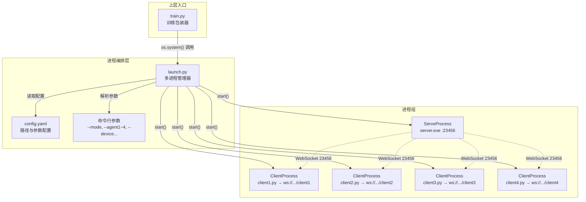
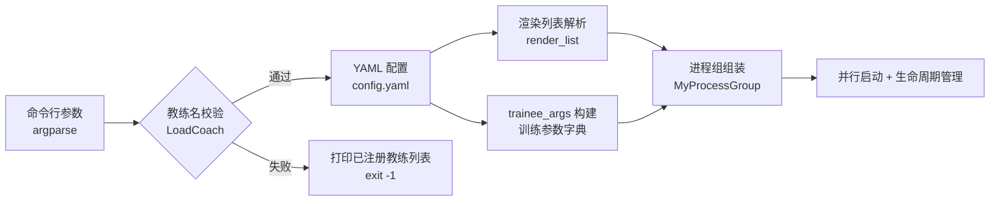
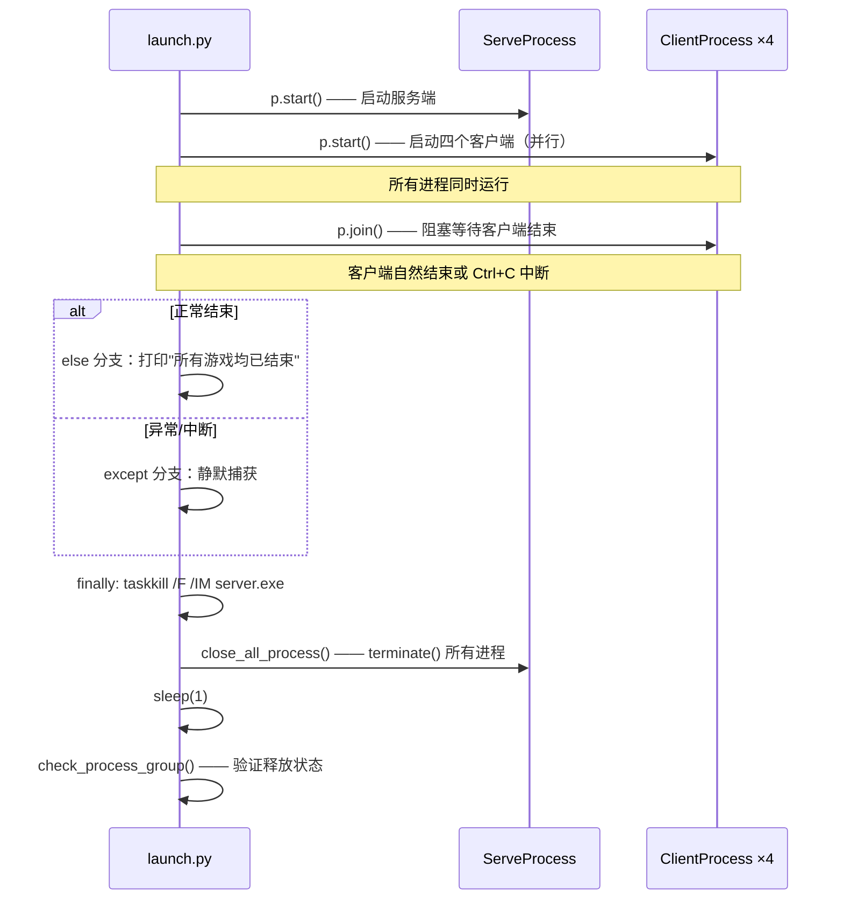

`launch.py` 是整个掼蛋AI系统的**进程编排中枢**，负责以多进程方式并行启动模拟器服务端与四个玩家客户端，并管理其完整的生命周期——从预热启动到异常兜底清理。它位于 `train.py`（上层训练包装器）与底层 WebSocket 游戏通信之间，是连接"训练策略配置"与"游戏对局执行"的关键胶水层。如果你刚阅读完训练系统的文档，本文将揭示那些训练参数是如何转化为实际运行的对局进程的。

## 架构概览：五进程并行模型

`launch.py` 遵循 **1 服务端 + 4 客户端** 的固定进程拓扑。服务端进程负责托管一局完整的掼蛋游戏（发牌、回合推进、胜负判定），四个客户端进程各自以 WebSocket 连接到服务端的固定端口（`23456`），代表四位玩家独立决策。这五个进程由 Python 的 `multiprocessing.Process` 统一管理，启动几乎同时进行，而关闭则遵循"先等客户端自然结束 → 再强杀服务端 → 最后兜底清理"的顺序。



五个进程在逻辑上是平等的——`launch.py` 不做父子进程间的数据通信，仅负责启动与关闭。真正的游戏通信发生在服务端与各客户端之间的 WebSocket 连接上，与 `launch.py` 无关。

Sources: [launch.py](launch/launch.py#L1-L8)

## 进程类的继承设计

`launch.py` 定义了两个进程子类，均继承自 `multiprocessing.Process`，覆写 `run()` 方法来封装不同的启动逻辑。

### ServeProcess：服务端进程包装

`ServeProcess` 的职责极度单一：通过 `os.system()` 执行模拟器服务端可执行文件，并传入端口号。类属性 `PLATFORM = "WINDOWS"` 暗示了平台依赖——在 Windows 下服务端是一个预编译的 `server.exe`，路径由 YAML 配置文件中的 `服务启动端路径` 字段指定。

```python
class ServeProcess(Process):
    PLATFORM = "WINDOWS"
    def __init__(self, path, port):
        # path: 服务端可执行文件路径（如 .\simulator\windows\server.exe）
        # port: 游玩次数（复用 port 参数名，实际传给 server.exe 作为对局次数）
```

值得注意的设计细节：`port` 参数在命名上是"端口号"，但实际传入的是 YAML 中的 `游玩次数`（对局总数）。服务端程序内部固定监听 `23456` 端口，而命令行参数用于控制"进行多少局游戏"。这是一个参数命名的历史遗留问题，阅读时需要注意区分。

Sources: [launch.py](launch/launch.py#L53-L68)

### ClientProcess：客户端进程包装

`ClientProcess` 封装了四种不同客户端脚本的启动逻辑，根据是否传入训练参数（`lr`、`save_interval`、`log_interval`）走两条不同的命令行构建路径：

| 条件 | 命令行格式 | 适用场景 |
|---|---|---|
| 有训练参数 (`lr` 非空) | `python -u <脚本路径> -c <教练> -d <设备> --model <模型> --lr ...` | 模仿学习 / 强化学习训练模式 |
| 无训练参数 | `python -u <脚本路径> -r <渲染> -c <教练>` | 纯推理 / 规则对局模式 |

两条路径的核心差异在于：训练模式需要传入模型路径、学习率、保存间隔和日志间隔等训练超参数；而普通模式只需要指定是否渲染画面和使用的教练名称。这种条件分支使得同一个 `ClientProcess` 类可以驱动 `client1.py`（训练客户端）、`client2~4.py`（陪玩客户端）乃至 `imitation_client.py`、`reinforment_client.py` 等不同脚本。

```python
class ClientProcess(Process):
    PYTHON_INTERPRETER = "python"
    def __init__(self, path, render=False, client="Demo", device="cpu", 
                 model="", lr=None, save_interval=None, log_interval=None):
```

`PYTHON_INTERPRETER = "python"` 作为类属性而非硬编码在 `os.system()` 中，为未来切换到特定 Python 环境（如 conda 环境下的 `python.exe` 完整路径）保留了扩展点。

Sources: [launch.py](launch/launch.py#L71-L110)

## 配置管道：从命令行到 YAML 到进程组

`launch.py` 的配置流经三层管道，每层各司其职：



**第一层：命令行参数解析。** `argparse` 解析 `--mode`、`--device`、`--model`、`--lr`、`--save_interval`、`--log_interval`、`--agent1` 到 `--agent4`、`--epsilon`、`--gamma` 等参数。其中 `--agent1~4` 的默认值均为 `"Demo"`，代表随机采样的基准智能体。

Sources: [launch.py](launch/launch.py#L12-L50)

**第二层：教练注册校验。** 在读取 YAML 之前，`launch.py` 会调用 `LoadCoach()` 逐一验证四个 `--agent` 参数是否在 `coach/` 目录下注册。这是一个**快速失败（fail-fast）** 设计——如果用户拼错了教练名称，程序不会等到进程启动后才报错，而是在配置阶段就通过红色高亮输出所有已注册教练列表并退出。

Sources: [launch.py](launch/launch.py#L134-L135), [coach/\_\_init\_\_.py](coach/__init__.py#L17-L25)

**第三层：YAML 配置读取与进程组装。** `config.yaml` 定义了四个客户端脚本的实际文件路径、服务端可执行文件路径、游玩次数和渲染列表。渲染列表是一个整数列表（如 `[0]` 表示在 1 号玩家的终端中渲染游戏画面），由 `launch.py` 转换为布尔列表 `render_list`。

```yaml
# config.yaml 结构
1号玩家: .\clients\client1.py
2号玩家: .\clients\client2.py
3号玩家: .\clients\client3.py
4号玩家: .\clients\client4.py
服务启动端路径: .\simulator\windows\server.exe
渲染列表: []
游玩次数: 5
```

Sources: [config.yaml](launch/config.yaml#L1-L8)

**进程组组装**是配置管道的最终产出。`MyProcessGroup` 是一个包含 5 个进程的列表，其中 **1 号玩家始终是训练智能体**（携带完整的训练超参数），2~4 号玩家是陪玩智能体（只携带教练名称和渲染标志）：

```python
MyProcessGroup: List[Process] = [
    ServeProcess(config["服务启动端路径"], config["游玩次数"]),
    ClientProcess(config["1号玩家"], render=render_list[0], **trainee_args),
    ClientProcess(config["2号玩家"], render=render_list[1], client=args["agent2"]),
    ClientProcess(config["3号玩家"], render=render_list[2], client=args["agent3"]),
    ClientProcess(config["4号玩家"], render=render_list[3], client=args["agent4"])
]
```

`trainee_args` 字典汇聚了设备、模型路径、学习率、保存间隔和日志间隔——这些参数**仅注入到 1 号玩家的 `ClientProcess` 中**，触发训练路径的命令行构建。2~4 号玩家不传训练参数，走纯推理路径。

Sources: [launch.py](launch/launch.py#L154-L170)

## 生命周期管理：启动、等待与清理

`launch.py` 的进程生命周期管理分为四个阶段，由 `try/except/else/finally` 结构精确控制：



### 阶段一：并行启动

所有进程通过 `for p in MyProcessGroup: p.start()` 一次性启动。由于 `multiprocessing.Process.start()` 是非阻塞的，五个进程几乎同时进入运行状态。服务端会先开始监听端口，客户端随后通过 WebSocket 连接——客户端的 `ws.run_forever()` 在服务端就绪前会持续重试，因此启动顺序的微小差异不会导致连接失败。

Sources: [launch.py](launch/launch.py#L172-L173)

### 阶段二：阻塞等待

```python
for p in MyProcessGroup:
    if isinstance(p, ClientProcess):
        p.join()
```

这里的关键设计是 **只 join 客户端进程，不 join 服务端进程**。原因在于：当所有客户端完成对局并断开连接后，服务端可能仍在运行（等待新的连接或处于空闲状态）。如果 join 服务端，程序将永远阻塞。通过只 join 客户端，`launch.py` 可以感知所有对局的自然结束时机——当四个 `ClientProcess.join()` 全部返回时，意味着所有游戏对局已完成。

`ServeProcess` 在此阶段作为后台进程持续运行，直到 finally 块强制终止它。

Sources: [launch.py](launch/launch.py#L174-L177)

### 阶段三：正常/异常分支

- **正常路径（else）**：打印 `"所有游戏均已结束"`，使用蓝色背景高亮提示。
- **异常路径（except）**：捕获 `BaseException`（包括 `KeyboardInterrupt`），静默处理。这意味着用户可以随时按 `Ctrl+C` 中断对局，程序不会崩溃，而是直接跳入 finally 清理阶段。

Sources: [launch.py](launch/launch.py#L179-L182)

### 阶段四：强制清理（finally）

清理流程是 `launch.py` 最坚固的设计环节，确保无论何种退出方式，系统资源都会被回收：

1. **`os.system("taskkill /F /IM server.exe")`**：这是 Windows 平台特有的强制终止命令。由于服务端进程是由 `os.system()` 启动的子进程，`Process.terminate()` 可能无法穿透进程树将其杀死，因此直接按镜像名称强制终止是最可靠的兜底手段。`/F` 标志表示强制终止，不等待程序响应。

2. **`close_all_process(MyProcessGroup)`**：遍历所有进程，对仍然存活（`is_alive()`）的进程调用 `terminate()`。这是对步骤 1 的补充——确保客户端进程和任何未被 `taskkill` 覆盖的残留进程都被终止。

3. **`sleep(1)`**：等待 1 秒，给操作系统时间完成进程资源回收。

4. **`check_process_group(MyProcessGroup)`**：最终状态检查，逐进程报告释放状态——绿色背景表示"已经释放"，红色背景表示"尚未释放"。这一诊断输出对调试进程残留问题至关重要。

```python
def check_process_group(process_group: List[Process]):
    for p in process_group:
        process_type = "客户端" if p.__class__.__name__ == "ClientProcess" else "服务端"
        if p.is_alive():
            print("{}进程  ".format(process_type), "{:18}".format(p.name), Back.RED + "尚未释放" + Style.RESET_ALL)
        else:
            print("{}进程  ".format(process_type), "{:18}".format(p.name), Back.GREEN + "已经释放" + Style.RESET_ALL)
```

Sources: [launch.py](launch/launch.py#L113-L127), [launch.py](launch/launch.py#L183-L188)

## 与 train.py 的上下层协作

`launch.py` 不是系统的唯一入口——它被设计为 `train.py` 的子过程。`train.py` 在调用 `launch.py` 之前会完成三项关键准备工作：

| 步骤 | 操作 | 目的 |
|---|---|---|
| 路径校验 | `check_path("launch/config.yaml")` + `check_path("launch/launch.py")` | 确保配置文件与编排脚本存在 |
| YAML 覆写 | 根据 `--mode` 修改 `config.yaml` 中的 `1号玩家` 路径和 `游玩次数` | 将训练模式映射到对应的客户端脚本（`imitation_client.py` / `reinforment_client.py` / `client1.py`） |
| 模型路径锁定 | 若指定 `--lock_value` 或 `--lock_reward`，自动搜索断点续训的检查点 | 支持从特定 value 或 reward 指标恢复训练 |

`train.py` 最终通过 `os.system("python -u ./launch/launch.py ...") ` 的方式调用 `launch.py`，将所有命令行参数透传。这种"外层修改配置 + 内层执行编排"的两层架构，使得 `launch.py` 保持纯粹的进程管理职责，而训练策略的差异化配置全部收敛在 `train.py` 中。

Sources: [train.py](train.py#L91-L141)

## 关键设计决策总结

| 设计决策 | 实现方式 | 优势 | 代价 |
|---|---|---|---|
| `multiprocessing.Process` 而非 `subprocess` | 继承 `Process` 类，覆写 `run()` | 统一的进程管理接口，`join()`/`terminate()` 语义清晰 | `os.system()` 启动的子进程无法被 `terminate()` 穿透 |
| `taskkill /F /IM server.exe` 强制终止 | 在 finally 块中按镜像名杀进程 | 确保服务端一定被终止 | Windows 平台绑定，不支持 Linux |
| 1 号玩家固定为训练智能体 | `trainee_args` 仅注入 `MyProcessGroup[1]` | 简化配置逻辑，训练与陪玩角色分离 | 无法灵活指定其他座位训练 |
| 只 join 客户端不 join 服务端 | `isinstance(p, ClientProcess)` 判断 | 避免无限阻塞 | 服务端异常退出时无法立即感知 |
| `LoadCoach()` 提前校验 | 在进程启动前验证教练名称 | 快速失败，避免启动后才发现配置错误 | 启动时多一次模块导入开销 |
| `colorama` 终端着色 | `Back.RED` / `Back.GREEN` / `Back.BLUE` | 进程状态一目了然 | 非终端环境（如日志重定向）会显示 ANSI 转义码 |

## 阅读路线建议

- 要理解进程启动后的游戏通信机制，请阅读 [状态机解析：State类的消息分发与游戏阶段自动路由](22-zhuang-tai-ji-jie-xi-statelei-de-xiao-xi-fen-fa-yu-you-xi-jie-duan-zi-dong-lu-you)
- 要理解 `train.py` 如何根据不同训练模式修改 `config.yaml`，请阅读 [train.py 训练入口：命令行参数与YAML配置联动](7-train-py-xun-lian-ru-kou-ming-ling-xing-can-shu-yu-yamlpei-zhi-lian-dong)
- 要理解 GUI 启动器如何替代命令行进行进程管理，请阅读 [GUI启动器：使用图形界面管理多客户端对局](5-guiqi-dong-qi-shi-yong-tu-xing-jie-mian-guan-li-duo-ke-hu-duan-dui-ju)
- 要理解分布式训练场景下的进程编排差异，请阅读 [分布式强化学习：ZMQ PUB-SUB架构下的多客户端并行训练](10-fen-bu-shi-qiang-hua-xue-xi-zmq-pub-subjia-gou-xia-de-duo-ke-hu-duan-bing-xing-xun-lian)