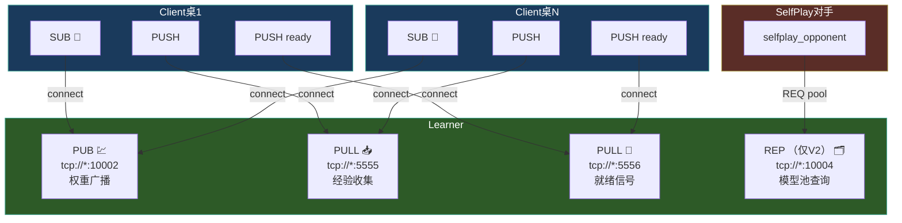
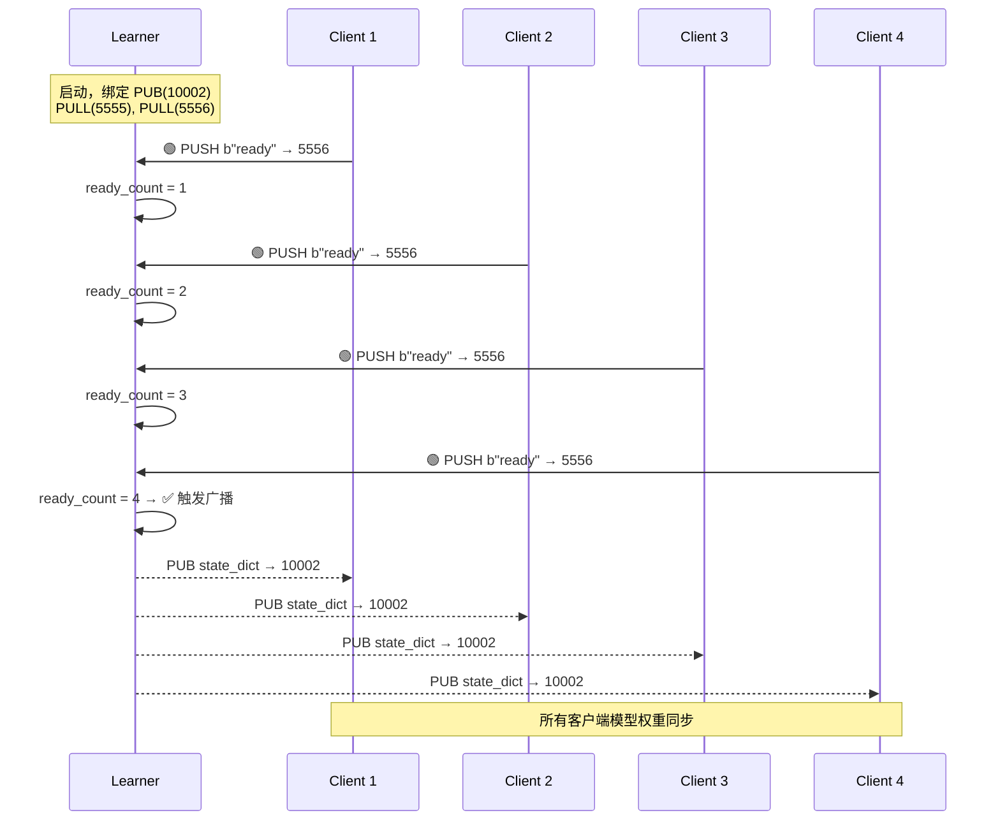
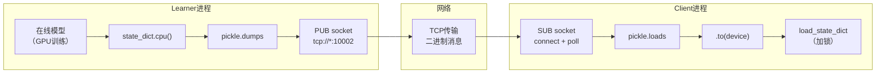
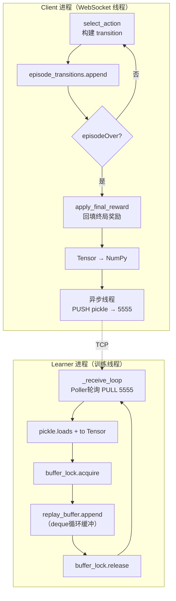
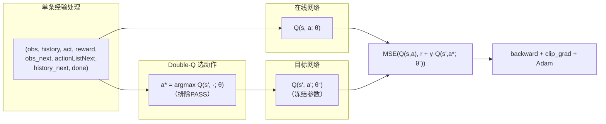
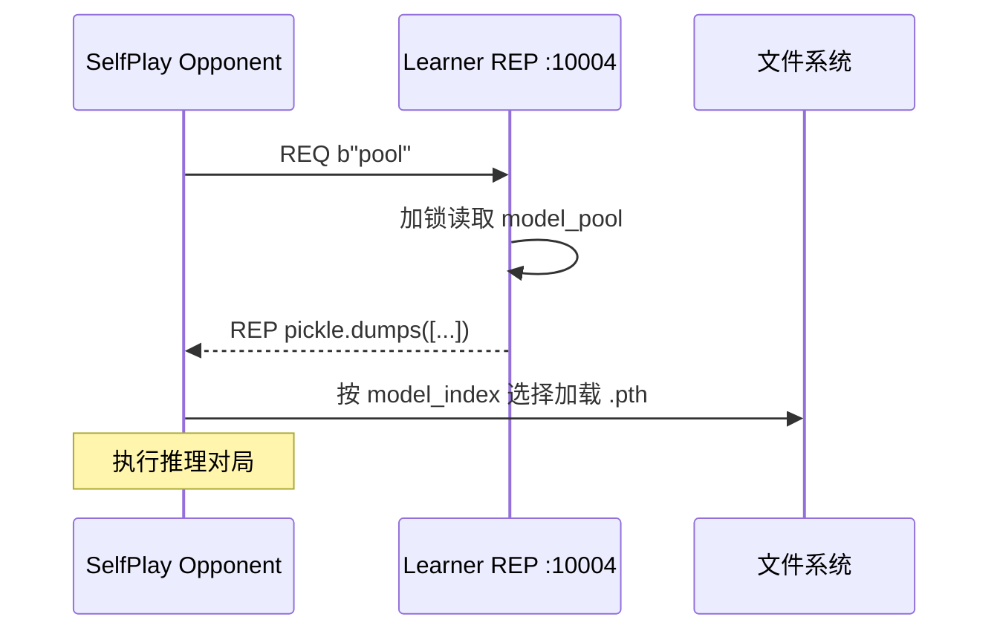

本文档深入剖析分布式强化学习训练系统中 Learner 的架构设计——涵盖 ZMQ 套接字拓扑、权重广播机制、经验收集流水线、Double DQN 训练核心以及自博弈 Learner V2 的模型池扩展。Learner 是整个分布式训练体系的中枢节点：它通过 PUB-SUB 模式向所有推理客户端广播模型权重，同时通过 PULL 端口异步接收来自多桌并行的经验数据，在独立训练线程中完成梯度更新，并将新权重周期性推回客户端，形成闭环的"推理→收集→训练→分发"循环。

Sources: [actor_all/learner.py](actor_all/learner.py#L1-L10)

## ZMQ套接字拓扑：Learner的多端口通信设计

Learner 进程在启动时绑定四个（V1 为三个）ZMQ 套接字，每个套接字承担独立的通信职责。这种多端口、多模式的设计将控制流与数据流分离，确保高吞吐量的经验数据不会阻塞权重广播或就绪信号。

| 套接字 | 类型 | 端口 | 方向 | 职责 |
|--------|------|------|------|------|
| `pub_socket` | PUB | 10002（可配置） | Learner → Clients | 广播序列化的模型 `state_dict` |
| `pull_socket` | PULL | 5555（固定） | Clients → Learner | 接收整局经验元组 `(obs, history, act, reward, obs_next, actionListNext, history_next, done)` |
| `ready_pull_socket` | PULL | 5556（固定） | Clients → Learner | 接收客户端就绪信号 `b"ready"` |
| `rep_socket` （仅V2） | REP | 10004（可配置） | 双向 | 响应模型池查询（`b"pool"` / `b"latest"`）与自博弈对手协调 |

通信模式选择的背后逻辑值得注意：PUB-SUB 用于权重分发是因为一对多广播天然匹配 ZMQ 的发布-订阅语义，且 SUB 端无需发送确认——丢包由下一次周期性广播自动修复；PULL 用于经验接收是因为 Learner 作为唯一消费者，PUSH-PULL 模式提供负载均衡和公平排队；REP 用于模型池查询是因为请求-响应模式天然匹配查询语义。

Sources: [actor_all/learner.py](actor_all/learner.py#L230-L268), [actor_all/learner_v2.py](actor_all/learner_v2.py#L276-L313)

### 端口状态可视化

Learner 的 Tkinter GUI 实时展示所有端口绑定状态，通过 `status_vars` 列表驱动标签颜色与文本更新——绿色确认已绑定，红色指示失败。此外就绪计数 `ready_label` 动态显示已连接的客户端数量，V2 额外展示模型池中 checkpoint 文件数量。



Sources: [actor_all/learner.py](actor_all/learner.py#L41-L48), [actor_all/learner_v2.py](actor_all/learner_v2.py#L52-L57)

## 就绪协议：启动同步与初始权重广播

分布式训练面临一个经典的启动同步问题：如果 Learner 在所有客户端完成 ZMQ 连接之前就开始广播权重，SUB 端可能错过初始 `state_dict`，导致不同客户端使用不同的初始模型参数。Learner 采用了轻量级的"就绪计数"协议来解决这个问题。

每个 `InferenceClient` 在 `__init__` 中立即通过 PUSH 套接字向 `tcp://{learner_host}:5556` 发送一个单字节信号 `b"ready"`。Learner 的 `_ready_receiver` 线程在独立循环中 `recv()` 该消息，使用 `ready_lock` 互斥地递增 `ready_count`。当 `ready_count % expected == 0`（即所有 `expected_clients` 都已汇报就绪）时，触发一次 `broadcast_weights()`——确保每个 SUB 端都已连接并订阅，能收到这次初始广播。此后，如果更多客户端（例如新一轮游戏桌上的客户端）加入并发送就绪信号，协议会再次触发广播，支持动态扩展。



Sources: [actor_all/learner.py](actor_all/learner.py#L291-L306), [clients/tcli.py](clients/tcli.py#L91-L93)

## 权重广播：Pickle序列化与后台监听

`broadcast_weights()` 方法是 Learner 向推理端分发模型的核心通道。它将在线网络 `self.model` 的所有参数 `.state_dict()` 转移到 CPU（避免 GPU 张量序列化问题），使用 `pickle.dumps` 序列化为二进制消息，然后通过 PUB 套接字 `send()` 分发。广播触发频率为每 5 次训练步执行一次，在`_train_loop` 中通过 `if train_count % 5 == 0` 条件控制——这个间隔在"权重更新频率"和"网络带宽消耗"之间取得了实用平衡。

Sources: [actor_all/learner.py](actor_all/learner.py#L347-L354)

客户端侧，`InferenceClient` 在初始化时启动一个守护线程 `_weights_listener`，该线程通过 `zmq.Poller` 以 500ms 超时轮询 SUB 套接字。收到权重消息后立即 `pickle.loads` 反序列化，将各张量转移到客户端本地设备（`self.device`，可以是独立的 GPU），用 `weights_lock` 保护对 `self.model.load_state_dict()` 的调用——因为在推理（`select_action`）期间模型正被读取，必须防止读写竞争。这种设计使得 Learner 和多个客户端可以运行在不同的 GPU 甚至不同的物理机器上，只要网络可达即可。



Sources: [clients/tcli.py](clients/tcli.py#L97-L112)

## 经验收集流水线：从牌桌到经验池

### 客户端侧：整局延迟批处理

`InferenceClient` 采用**整局延迟批处理**（episode-level delayed batching）策略收集经验。在每步 `select_action` 中，客户端利用上一帧缓存的 `(last_obs, last_history, last_act, last_action_list)` 与当前帧的 `(state, history, action_list)` 构建完整的 transition 元组，附加中间奖励 0.0 和 `done=False`。这些 transition 累积在 `episode_transitions` 列表中。

Source: [clients/tcli.py](clients/tcli.py#L186-L212)

当局终事件 `episodeOver` 到达时，`apply_final_reward` 方法遍历列表中所有 transition，将终端奖励（基于完牌名次的函数返回值）回填到每个 transition 的 reward 字段，并对 PASS 动作施加 0.05 的额外惩罚（`PASS_PENALTY = 0.05`），最后一条 transition 的 `done` 标记设置为 `True`。这种惩罚项的引入是为了对抗"PASS 崩塌"问题——在没有惩罚时模型可能学习到持续 PASS 是一种安全策略，因为 PASS 不会立即导致负奖励，但长期来看会导致出牌权丧失。

```python
# 基础终局奖励，PASS 动作额外减分
t[3] = final_reward - (self.PASS_PENALTY if t[2][0] == 'PASS' else 0.0)
```

Sources: [clients/tcli.py](clients/tcli.py#L215-L225)

随后 `send_experience` 将 episode 内所有 transition 中的 Tensor 转换为 NumPy 数组（避免跨进程序列化 GPU Tensor），通过异步线程 `_send_experience_async` 发送至 Learner 的 PULL 端口 5555。异步发送是关键设计——WebSocket 回调在主线程中运行，如果同步发送大块 pickle 数据会阻塞游戏消息处理循环，导致整桌的通信冻结。

Sources: [clients/tcli.py](clients/tcli.py#L226-L238)

### Learner侧：缓冲池与线程安全

Learner 的 `_receive_loop` 线程使用 `zmq.Poller` 以 100ms 超时轮询 PULL 套接字，收到经验块后立即反序列化，将 NumPy 数组转回 PyTorch Tensor，并在 `buffer_lock` 保护下追加到 `replay_buffer`（一个 `deque(maxlen=replay_capacity)` 的循环缓冲区）。转换操作在 Learner 进程中执行，确保了网络传输的是紧凑的 NumPy 数组而非笨重的 GPU Tensor。



Sources: [actor_all/learner.py](actor_all/learner.py#L356-L376)

## 训练核心：Double DQN with Target Network

### 训练线程的调度策略

`_train_loop` 线程采用"缓冲区水位线触发"策略：当 `replay_buffer` 长度 ≥ `batch_size` 时才启动训练，否则以递增的休眠时间（`min(0.1 * idle_count, 2.0)` 秒）等待数据积累。每次唤醒后最多训练 `min(10, buffer_len // batch_size)` 个 batch，充分利用累积的数据而不致训练过度超前于数据收集。这种设计避免了早期因经验不足导致的无效梯度更新。

Sources: [actor_all/learner.py](actor_all/learner.py#L378-L468)

### Double-Q 训练步骤

`train_step` 实现标准的 Double DQN 更新。对于 batch 中的每条经验：

1. **当前 Q 值计算**：将当前状态 `obs` 与动作嵌入 `encode_card(act)` 拼接后输入在线网络，与 LSTM 历史编码联合前向传播，得到 `q_curr`
2. **TD Target 构造**：对于终局状态（`done or not actionListNext`），TD target 直接等于 `reward`；否则使用 Double-Q 技巧——在线网络选择最优动作索引，Target 网络对该索引打分，构建 `td_target = reward + gamma * target_q[best_idx]`
3. **PASS 动作屏蔽**：在候选动作 Q 值计算时，将 PASS 动作对应的 Q 值置为 `-inf`，防止 Q(PASS) 膨胀导致模型总选 PASS。若候选动作全部为 PASS，则不引导（`td_target = reward`）
4. **损失与优化**：MSE loss 累积后统一 backward，梯度裁剪 `max_norm=1.0` 后执行 Adam 步进

Target 网络每 `target_update_freq`（默认 100）个训练步执行一次硬更新（`load_state_dict`），提供稳定的 TD bootstrap 目标。



Sources: [actor_all/learner.py](actor_all/learner.py#L308-L345)

### 训练指标与检查点保存

每次训练步产出四维指标：`avg_loss`（MSE 损失）、`avg_q`（当前 Q 均值）、`avg_target`（TD target 均值）、`avg_reward`（batch 奖励均值）。这些指标通过日志线程安全地写入 GUI 的滚动文本框。每 `save_interval` 步保存一次检查点，V1 保存到时间戳命名的目录 `model/checkpoints_{now_str()}_learner/`，V2 则保存到固定目录 `model/selfplay_checkpoints/` 并使用递增整数编号。

Sources: [actor_all/learner.py](actor_all/learner.py#L438-L460), [actor_all/learner_v2.py](actor_all/learner_v2.py#L234-L248)

## Learner V2：自博弈扩展

### 模型池管理

Learner V2 在 V1 基础上增加了自博弈训练所需的模型池基础设施。固定保存目录 `model/selfplay_checkpoints/`，启动时扫描已有 `.pth` 文件并按编号排序填充 `model_pool` 列表。每次保存时追加新路径到列表并更新 `pool_label` 显示。自博弈对手客户端通过 `selfplay_opponent.py` 的 `_reload_model()` 方法在每局开始时扫描此目录，按 `model_index` 选择历史对手——形成"当前模型 vs 历史快照"的对抗训练范式。

Sources: [actor_all/learner_v2.py](actor_all/learner_v2.py#L244-L260)

### REP 模型池查询服务

`_rep_handler` 线程处理 REP 套接字上的查询请求，支持两种命令：
- `b"pool"`：返回 `pickle.dumps(list(self.model_pool))`，完整模型文件路径列表
- `b"latest"`：返回最新单个模型路径，或空字符串

该服务使外部组件（如启动脚本、监控面板）无需直接访问文件系统即可获知可用模型列表，为自动化自博弈流水线提供了程序化接口。



Sources: [actor_all/learner_v2.py](actor_all/learner_v2.py#L316-L334)

## 三种Learner横向对比

| 特性 | Learner V1 | Learner V2（自博弈） | Imitation Learner |
|------|-----------|---------------------|-------------------|
| 文件 | `actor_all/learner.py` | `actor_all/learner_v2.py` | `actor_all/imitation_learner.py` |
| PUB 端口 | 10002 | 10002 | 10003 |
| 经验端口 | PULL 5555 | PULL 5555 | PULL 5557 |
| 就绪端口 | PULL 5556 | PULL 5556 | PULL 5558 |
| 额外端口 | 无 | REP 10004 | 无 |
| 损失函数 | Double DQN MSE | Double DQN MSE | 交叉熵（模仿专家） |
| 保存目录 | `model/checkpoints_*_learner/` | `model/selfplay_checkpoints/` | `model/checkpoints_*_imit/` |
| 默认学习率 | 1e-4 | 25e-4 | 1e-4 |
| 经验池容量 | 30000 | 20000 | 30000（数据集） |
| 保存间隔 | 50 步 | 25 步 | 100 步 |
| 模型池 | 无 | ✅ 自动管理 | 无 |
| 专家概率衰减 | N/A | N/A | ✅ 1.0 → 0.1 |

Sources: [actor_all/learner.py](actor_all/learner.py#L29-L48), [actor_all/learner_v2.py](actor_all/learner_v2.py#L37-L57), [actor_all/imitation_learner.py](actor_all/imitation_learner.py#L40-L56)

## 启动脚本编排

Learner 的 GUI 程序独立启动，而客户端通过命令行脚本批量编排。`actor_all/start.py` 为强化学习模式启动 4 张桌子（每桌 1 个 RL 客户端 `--learner_host 127.0.0.1 --learner_port 10002` + 3 个 TOP 规则对手），总进程数 `4 × 4 = 16`。`actor_all/start_selfplay.py` 则编排自博弈模式：桌子 1 使用 3 个 TOP 强对手，桌子 2-4 使用 `selfplay_opponent.py` 加载历史 checkpoint 作为陪练。`actor_all/find.py` 是一个简化版本，将所有 4 个 RL 客户端连接到同一张桌子 23456，用于纯 RL 自对弈测试。

Sources: [actor_all/start.py](actor_all/start.py#L63-L75), [actor_all/start_selfplay.py](actor_all/start_selfplay.py#L87-L140), [actor_all/find.py](actor_all/find.py#L1-L11)

## 线程模型与并发安全

Learner 进程中同时运行 4 个（V2 为 5 个）关键线程：

| 线程 | 职责 | 主要锁 |
|------|------|--------|
| GUI 主线程 | Tkinter 事件循环、UI 更新 | N/A |
| `_ready_receiver` | 监听就绪信号，触发初始广播 | `ready_lock` |
| `_receive_loop` | 接收经验并写入 replay_buffer | `buffer_lock` |
| `_train_loop` | 采样训练 + 周期性广播 + 保存 | `buffer_lock`（读） |
| `_rep_handler`（V2） | 响应模型池查询 | `model_pool_lock` |

`buffer_lock` 是竞争最激烈的锁——`_receive_loop` 写入经验时持有，`_train_loop` 采样 batch 时持有，但两者都在临界区内执行极短操作（append / random.sample），锁竞争概率低。`weights_lock` 在客户端侧保护模型加载，Learner 侧无此锁——因为 PBS 套接字发送的是 CPU 上的 state_dict 副本，与训练线程的 GPU 模型操作无竞争。

Sources: [actor_all/learner.py](actor_all/learner.py#L63-L66), [clients/tcli.py](clients/tcli.py#L95-L96)

## 阅读下一步

本文档覆盖了分布式 Learner 的完整设计。建议按以下路径深入阅读相关模块：

- **客户端推理侧**：[客户端精简化：tcli.py统一入口与多模式路由](23-ke-hu-duan-jing-jian-hua-tcli-pytong-ru-kou-yu-duo-mo-shi-lu-you) — 了解 InferenceClient 如何在 WebSocket 回调中完成 epsilon-greedy 推理
- **自博弈完整流程**：[自博弈训练系统：模型池管理、热加载对手与迭代对抗](11-zi-bo-yi-xun-lian-xi-tong-mo-xing-chi-guan-li-re-jia-zai-dui-shou-yu-die-dai-dui-kang) — 了解 Learner V2 与 SelfPlay Opponent 如何协同完成迭代训练
- **DQN 理论基础**：[DQN训练流程：经验回放、探索策略与TD目标更新](9-dqnxun-lian-liu-cheng-jing-yan-hui-fang-tan-suo-ce-lue-yu-tdmu-biao-geng-xin) — 深入 Double DQN 的算法细节
- **神经网络架构**：[神经网络架构：ActionValueNet的LSTM历史建模与CrossUnit残差网络](12-shen-jing-wang-luo-jia-gou-actionvaluenetde-lstmli-shi-jian-mo-yu-crossunitcan-chai-wang-luo) — 了解训练目标网络的结构
- **模仿学习对比**：[分布式DAgger：Learner广播权重 + 客户端收集专家样本](8-fen-bu-shi-dagger-learneryan-bo-quan-zhong-ke-hu-duan-shou-ji-zhuan-jia-yang-ben) — 对比 Imitation Learner 的设计差异