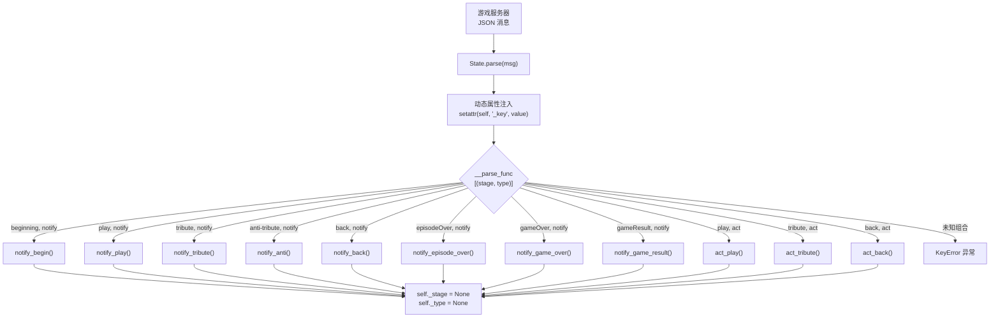
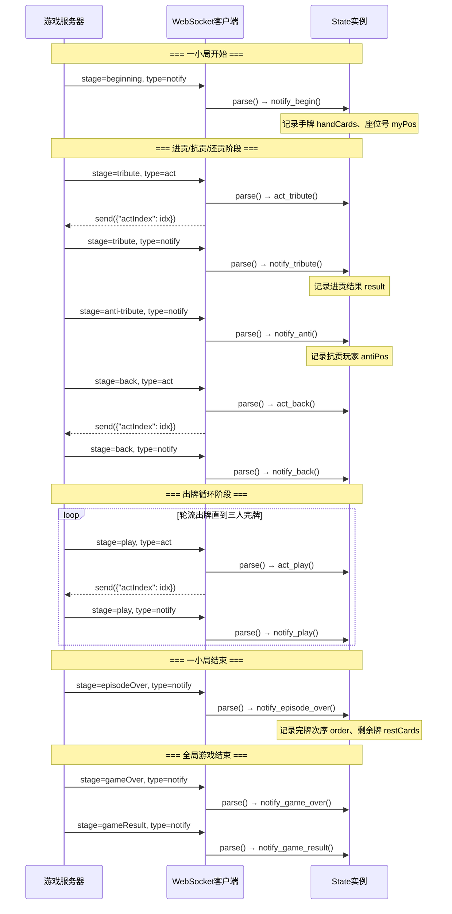
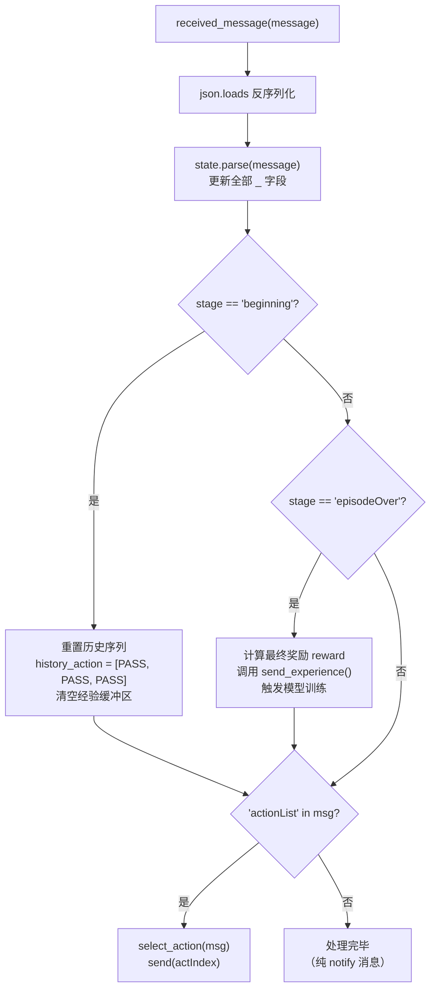

State 类是掼蛋 AI 系统中连接游戏服务器与决策逻辑的核心桥梁。它以 **有限状态机（Finite State Machine）** 的方式自动解析游戏服务器发来的 JSON 消息，根据消息中的 `stage`（游戏阶段）和 `type`（消息类型）组合，将消息路由到对应的处理函数。State 的设计遵循「**解析框架 + 可覆写钩子**」的模板方法模式：基类提供完整的消息分发基础设施与游戏状态存储，子类（或外部 Action 类）只需覆写特定的处理函数即可注入自定义决策逻辑。

## 消息分发的双键路由机制

State 的消息分发建立在两组核心维度之上：**消息类型（type）** 和 **游戏阶段（stage）**。消息类型分为 `"notify"`（通知类，仅告知游戏状态变化）和 `"act"`（动作类，要求玩家做出决策响应）。游戏阶段则覆盖了掼蛋完整对局的七个阶段，构成一张 7×2 的笛卡尔积路由表。



路由表的 11 个合法条目中，8 个属于 `notify` 类型（对应 7 个游戏阶段加上 `gameResult` 终局汇总），3 个属于 `act` 类型（对应 `play` 出牌、`tribute` 进贡、`back` 还贡三个需要玩家主动决策的阶段）。注意 `anti-tribute`（抗贡）阶段仅有 `notify` 无 `act`——因为抗贡是系统自动判定，玩家无需主动操作。`beginning`、`episodeOver`、`gameOver`、`gameResult` 四个阶段也只有 `notify`，它们代表游戏流程中的结构性边界而非决策点。

Sources: [clients/state.py](clients/state.py#L56-L73)

## parse() 方法：动态属性注入与函数查表

`parse()` 方法以不足 10 行的极简实现完成了消息解析、状态存储与路由分发的全部工作。它接收一个 Python 字典（由 JSON 反序列化而来），通过三步流水线完成处理：

| 步骤 | 操作 | 说明 |
|------|------|------|
| 类型断言 | `assert type(msg) == dict` | 防御性检查，确保入参格式正确 |
| 属性注入 | `setattr(self, "_{}".format(key), value)` | 将 JSON 的每个顶层字段以 `_fieldname` 形式存储为实例的保护属性 |
| 路由查找 | `self.__parse_func[(self._stage, self._type)]()` | 以 `(stage, type)` 元组为键查找处理函数并立即调用 |
| 状态重置 | `self._stage = None; self._type = None` | 处理完毕后清空阶段和类型标记，等待下一条消息 |

**动态属性注入**利用 Python 的 `setattr` 机制避免了手动字段映射。例如服务器发来的 `{"type": "notify", "stage": "play", "curPos": 1, "curAction": {...}}` 会自动产生 `self._type = "notify"`、`self._stage = "play"`、`self._curPos = 1` 和 `self._curAction = {...}` 四个实例属性。这一设计使得 State 类无需预知 JSON 的完整字段集合——只要服务器新增字段，客户端无需修改 State 基类即可自动接收。但代价是字段访问依赖命名约定（前缀 `_`），且 IDE 无法提供静态类型提示。

**函数查表**使用的 `__parse_func` 是实例私有的字典（双下划线 name mangling 后为 `_State__parse_func`），在 `__init__` 中一次性构建，将 11 个 `(stage, type)` 元组映射到对应的实例方法。查表失败的 `KeyError` 被捕获后打印原始消息并重新抛出，方便调试未识别的消息组合。

Sources: [clients/state.py](clients/state.py#L75-L83)

## 游戏阶段的完整生命周期

掼蛋一局（episode）的游戏流程在 State 的消息路由表中得到完整映射。以下时序图展示了一局游戏中消息在服务端与客户端之间的流转，以及 State 在每个阶段触发的处理函数：



关键设计要点：`play` 阶段的 `act` 和 `notify` 交替出现——服务器先向当前轮到出牌的玩家发送 `act` 要求其做出动作，然后将该动作以 `notify` 广播给所有玩家（包括做出动作的玩家自身）。这意味着每个客户端在 `play` 阶段会交替调用 `act_play()`（自己做决策时）和 `notify_play()`（观察他人出牌时），两者携带的字段集合不同：`act_play` 包含 `handCards`、`actionList`、`publicInfo` 等决策所需的全量信息，而 `notify_play` 仅包含 `curPos`、`curAction`、`greaterPos`、`greaterAction` 等描述已发生动作的摘要信息。

Sources: [clients/state.py](clients/state.py#L85-L198)

## 处理器方法：模板钩子与信息边界

State 基类中的 11 个处理器方法均为**空壳模板**：它们以详尽的 docstring 记录了对应 JSON 格式的字段结构，但方法体仅包含被注释掉的 `print` 语句（由 `render` 参数控制是否输出）。这种设计明确了每个处理器的**信息边界**——例如 `notify_begin` 的 docstring 指出该阶段可安全访问的字段为 `handCards` 和 `myPos`，并警告「若此时访问其他属性则很有可能是之前处理时未更新的实例属性，不具有准确性」。

下表列出了每个处理器方法的关键语义字段：

| 处理器方法 | 阶段含义 | 可安全访问的字段 | 决策要求 |
|-----------|---------|-----------------|---------|
| `notify_begin()` | 游戏开局 | `_handCards`, `_myPos` | 无，仅记录 |
| `notify_play()` | 观察他人出牌 | `_curPos`, `_curAction`, `_greaterPos`, `_greaterAction` | 无，更新牌面状态 |
| `notify_tribute()` | 观察进贡结果 | `_result` (list of `[from, to, card]`) | 无 |
| `notify_anti()` | 观察抗贡结果 | `_antiNum`, `_antiPos` | 无 |
| `notify_back()` | 观察还贡结果 | `_result` (list of `[from, to, card]`) | 无 |
| `notify_episode_over()` | 小局结束 | `_order`, `_curRank`, `_restCards` | 无，计算奖励 |
| `notify_game_over()` | 全局结束 | `_curTimes`, `_settingTimes` | 无 |
| `notify_game_result()` | 最终汇总 | `_victoryNum`, `_draws` | 无 |
| `act_play()` | 轮到自己出牌 | `_handCards`, `_publicInfo`, `_actionList`, `_selfRank`, `_oppoRank`, `_curRank` | **必须返回动作索引** |
| `act_tribute()` | 轮到自己进贡 | `_handCards`, `_actionList` (含 `tribute` 键) | **必须返回动作索引** |
| `act_back()` | 轮到自己还贡 | `_handCards`, `_actionList` (含 `back` 键) | **必须返回动作索引** |

Sources: [clients/state.py](clients/state.py#L85-L290)

## 客户端集成模式：WebSocket → State.parse → Action 决策

所有客户端（Demo 教练、EggPan 专家、TOP 规则引擎、模仿学习客户端、强化学习客户端、自博弈对手）均遵循相同的集成范式。以 Demo 客户端为例，其 `received_message` 方法是使用 State 的最小完整示例：

```python
def received_message(self, message):
    message = json.loads(str(message))   # ① JSON 反序列化
    self.state.parse(message)            # ② State 更新游戏状态
    if "actionList" in message:          # ③ 判断是否需要做出决策
        act_index = self.action.parse(message)
        self.send(json.dumps({"actIndex": act_index}))
```

这一范式的核心逻辑链为：**JSON 反序列化 → State 状态同步 → Action 决策 → 发送动作索引**。其中第③步的 `"actionList" in message` 检查是关键的分支判断——只有 `act` 类型的消息才会携带 `actionList` 字段，因此这一步自然地将 `notify` 和 `act` 两类消息的处理路径分离开来。值得注意的是，这一判断放在 `state.parse(message)` 之后执行，保证了 Action 做决策时 State 中的字段已是最新状态。

Source: [coach/Demo/client.py](coach/Demo/client.py#L18-L27)

对于更复杂的客户端（如模仿学习和强化学习），它们在此基础上扩展了阶段级别的回调逻辑：



这种模式的核心洞察是：`state.parse()` 负责**同步游戏状态**（What happened），而客户端的 `received_message` 负责**编排决策流程**（What to do next）。两者职责分明——State 永远不主动发送消息，它只是被动地将服务器消息转化为结构化的 Python 对象属性。

Sources: [clients/gene_client.py](clients/gene_client.py#L72-L91), [clients/tcli.py](clients/tcli.py#L130-L155)

## 两套 State 实现：基类与 TOP 专家覆写

项目中存在两套 State 实现，它们展示了该架构的两种使用层级：

| 对比维度 | `clients/state.py`（基类） | `coach/TOP/state.py`（TOP 覆写） |
|---------|--------------------------|--------------------------------|
| 定位 | 通用解析框架 | 为 TOP 规则引擎定制的状态跟踪器 |
| `render` 参数 | 支持，控制打印输出 | 支持，但额外增加了大量非渲染状态 |
| 处理器行为 | 空壳 + docstring | 包含完整的牌面统计逻辑 |
| 额外状态字段 | 无 | `history`（出牌历史）、`remain_cards`（剩余牌统计）、`play_cards`（当前出牌区）、`pass_num` / `my_pass_num`（过牌计数）、`tribute_result` |
| `notify_play` | 仅打印 | **统计出牌历史**、更新剩余牌矩阵、追踪 pass 计数 |
| `act_play` | 仅打印 | 从 `publicInfo` 中提取每位玩家的 `playArea` |
| 局间重置 | 无 | `notify_episode_over` 和 `notify_game_over` 中重置全部统计状态 |

TOP 教练的 State 覆写清晰地例示了「**在 notify_play 中累积信息，在 act_play 中使用信息**」的设计模式。当 `notify_play` 被调用时，TOP 的 State 会解析 `curAction` 中的牌型数据，更新每位玩家的出牌历史 `history`、从花色-点数矩阵 `remain_cards` 中扣减已出的牌张、并追踪 `pass_num`（连续过牌次数）——这些统计信息随后在 `act_play` 被调用时，作为 `rule_parse()` 的入参传递给 TOP 的规则引擎，支撑其启发式搜索决策。

```python
# TOP coach/TOP/state.py 中 notify_play 的核心逻辑（简化）
def notify_play(self):
    # 从 curAction 中提取实际打出的牌张列表
    if self._curAction and len(self._curAction) >= 3 and self._curAction[2] not in ("PASS", None):
        for card in self._curAction[2]:
            card_type = card[0]   # 花色 'S', 'H', 'C', 'D'
            card_rank = card[1]   # 点数 '2'~'K', 'A'
            self.history[str(self._curPos)]["send"].append(card)
            self.history[str(self._curPos)]["remain"] -= 1
            self.remain_cards[card_type][card_value[card_rank]] -= 1
    # 追踪队友和自己的 pass 次数
    if self._curPos == (self._myPos + 2) % 4 or self._curPos == self._myPos:
        if self._curAction[0] == "PASS":
            self.pass_num += 1
        else:
            self.pass_num = 0
```

Source: [coach/TOP/state.py](coach/TOP/state.py#L1-L180)

## 版本差异：Simulator 与主项目的 State

`simulator/clients/state.py` 是 State 类的**独立捆绑版本**，随模拟器分发包一起提供给外部用户。与主项目 `clients/state.py` 的核心差异如下：

| 差异点 | 主项目 `clients/state.py` | 模拟器 `simulator/clients/state.py` |
|--------|--------------------------|-------------------------------------|
| `__init__` 参数 | `render=True`（可选渲染开关） | 无参数（始终打印） |
| `render` 属性 | 存在，控制 print 语句 | 不存在 |
| 处理器方法体 | `if self.render: pass`（被注释的打印） | `print(...)`（始终执行，未注释） |
| 用途定位 | 被 AI 客户端子类化使用 | 供外部开发者快速调试和理解协议 |

模拟器版本的 State 将 print 语句直接激活（未注释），旨在让初次接触掼蛋协议的开发者能够直观地看到每一条消息的结构和内容。主项目版本则将这些打印默认关闭（通过 `render=False` 控制），以避免训练时的大量 I/O 开销。两套实现在路由表结构、`parse()` 逻辑和字段命名约定上**完全一致**，保证了协议的向上兼容性。

Sources: [clients/state.py](clients/state.py#L14-L15), [simulator/clients/state.py](simulator/clients/state.py#L12-L14)

## 架构设计评价与使用建议

State 类的设计体现了几个值得注意的架构权衡：

**优点方面**，双键路由机制将消息分发逻辑集中在一张查表中，新增消息类型只需在 `__parse_func` 字典中添加一个条目并实现对应的处理器方法，扩展成本低。动态属性注入避免了手动字段映射的样板代码，使 State 能自动适应协议字段的增减。模板方法模式允许子类按需覆写特定阶段的处理器，而不必理解整个消息分发流程。

**局限方面**，属性命名约定（`_fieldname`）依赖开发者记忆，缺乏编译期检查；处理器方法之间通过实例属性传递状态，隐含时序耦合——例如先收到 `notify_tribute` 再收到 `act_back` 时，两者共享 `_result` 字段但语义不同（前者是进贡结果，后者是还贡结果）。此外，`parse()` 在 `try` 块内执行处理器后立即将 `_stage` 和 `_type` 重置为 `None`，这意味着如果处理器内部需要异步操作（如发送网络请求），`stage` 和 `type` 信息将不可用。

对于需要在 State 基类上构建自定义逻辑的开发者，建议遵循以下模式：**覆写处理器方法而非 `parse()` 方法**，因为 `parse()` 包含属性注入和查表的关键基础设施；在 `notify_*` 处理器中**仅累积状态信息**（更新牌面统计、记录历史），在 `act_*` 处理器中**使用累积的状态辅助决策**；当需要在局间重置状态时，在 `notify_begin` 或 `notify_episode_over` 中执行清理逻辑。

从系统架构角度看，State 类与后续的 [客户端精简化：tcli.py统一入口与多模式路由](23-ke-hu-duan-jing-jian-hua-tcli-pytong-ru-kou-yu-duo-mo-shi-lu-you) 形成「协议解析层 → 决策执行层」的分层关系，而与 [分布式Learner设计：ZMQ PUB-SUB权重广播与经验收集](21-fen-bu-shi-learnershe-ji-zmq-pub-subquan-zhong-yan-bo-yu-jing-yan-shou-ji) 中的经验收集机制则构成了「状态感知 → 经验提取」的数据上游。