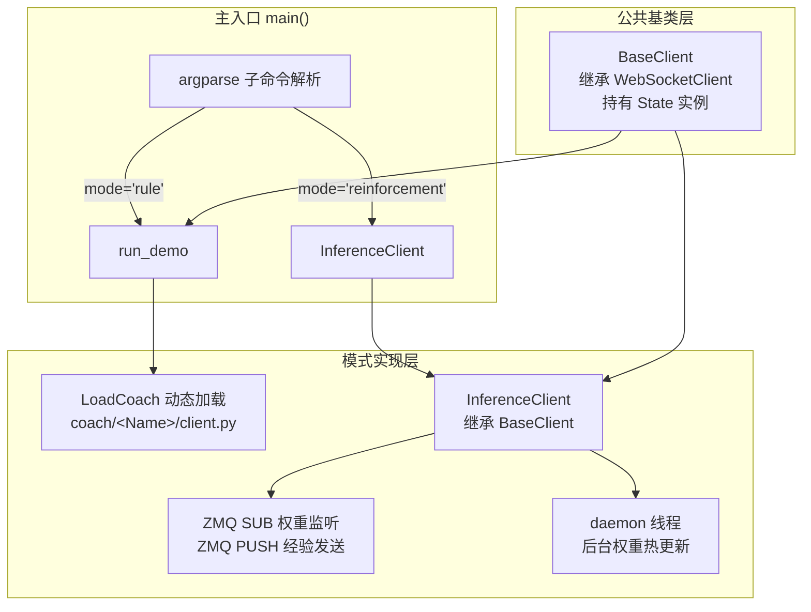
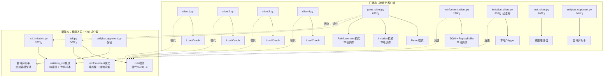

在项目早期，`clients/` 目录下存在大量功能重叠、代码高度重复的客户端脚本——`client1.py` 到 `client4.py` 仅仅是座位号不同的四份拷贝，而 `gene_client.py`、`reinforment_client.py`、`imitation_client.py`、`test_client.py` 各自独立维护完整的 WebSocket 连接、状态解析与推理逻辑，形成了 **"一个模式一个文件"的碎片化格局**。`tcli.py` 的引入改变了这一局面：它通过 argparse 子命令机制将所有运行时模式收敛到单一入口，同时从单机本地训练向**分布式推理—训练分离架构**跃迁，使客户端角色从"自给自足的训练单元"转变为"轻量级推理节点 + 经验采集器"。

Sources: [tcli.py](clients/tcli.py#L1-L19), [gene_client.py](clients/gene_client.py#L1-L13)

## 一、碎片化时代的客户端全景

在 `tcli.py` 出现之前，`clients/` 目录承载了六类功能不同但结构高度重复的脚本，形成了如下格局：

| 文件 | 行数 | 核心职责 | 座位绑定 | 学习方式 |
|------|------|---------|---------|---------|
| `client1.py ~ client4.py` | ~32 行/个 | 加载 coach 规则引擎打牌 | 硬编码 `_POS` | 无学习 |
| `gene_client.py` | 632 行 | 统一入口：demo / imitation / reinforcement / test | 参数化 | 本地 DAgger / DQN |
| `reinforment_client.py` | 259 行 | 单进程 DQN 训练 + 经验回放 | 硬编码 `client1` | 本地经验回放 |
| `imitation_client.py` | 802 行 | 模仿学习（已整体注释） | 硬编码 `client1` | 本地 DAgger |
| `test_client.py` | 169 行 | 加载模型纯推理评估 | 硬编码 `client1` | 无学习 |
| `selfplay_opponent.py` | 164 行 | 固定 checkpoint 确定性打牌 | 参数化 | 无学习 |

其中 `client1.py` 到 `client4.py` 本质上完全一致，差异仅在于 `_POS` 常量（1~4）和默认的 `render` 布尔值。`gene_client.py` 虽然提供了一个"统一入口"的雏形，但将所有模式（demo、imitation、reinforcement、test）的代码塞进同一个 632 行文件中，训练逻辑与推理逻辑深度耦合——客户端既要管理 WebSocket 通信，又要维护 replay buffer、执行 optimizer.step()，使得单个文件的理解成本急剧上升。

Sources: [client1.py](clients/client1.py#L6-L38), [client2.py](clients/client2.py#L6-L32), [gene_client.py](clients/gene_client.py#L1-L200), [reinforment_client.py](clients/reinforment_client.py#L1-L50), [imitation_client.py](clients/imitation_client.py#L1-L20), [test_client.py](clients/test_client.py#L1-L20), [selfplay_opponent.py](clients/selfplay_opponent.py#L1-L20)

### 碎片化的代价

这套架构存在三个结构性问题。**第一，代码冗余严重**：每个客户端文件都重复实现 WebSocket 连接生命周期（`connect()` → `run_forever()` → `close()`）、State 实例化、JSON 消息解析、actionList 提取与响应发送，以及 `MapHistoryToLSTM()` 等工具方法。**第二，训练与推理耦合**：`gene_client.py` 的 `ImitationAction` 类在 `parse()` 方法中同时完成模型推理、专家采样、数据集追加和本地训练，违背单一职责原则。**第三，无法横向扩展**：单机训练模式意味着每增加一个并行客户端，就需要运行一个完整的训练循环，GPU 显存争抢与 optimizer 状态冲突不可避免。

Sources: [gene_client.py](clients/gene_client.py#L100-L160), [reinforment_client.py](clients/reinforment_client.py#L50-L100)

## 二、tcli.py 的架构设计：公共基类 + 模式子命令

`tcli.py` 的解决方案遵循**"提取公共抽象，子命令按需组合"**的设计原则。整个文件分为三层结构：



### 2.1 公共基类 `BaseClient`

`BaseClient` 仅做了两件事：持有 `State` 实例（负责 JSON 消息的状态机解析）和暴露 WebSocket 生命周期钩子。它不包含任何游戏逻辑，所有模式通过继承它来获得与游戏服务器的通信能力。

```
class BaseClient(WebSocketClient):
    def __init__(self, url, render=False):
        super().__init__(url)
        self.state = State(render)
        self.render = render
```

这消除了旧架构中每个文件都要重复 `State(render)` 和 `WebSocketClient.__init__` 的样板代码。值得注意的是 `State` 本身是一个**无状态的状态机**（stateless state machine）：每次 `parse(msg)` 调用根据 `(stage, type)` 二元组路由到对应处理函数，处理完成后将 `_stage` 和 `_type` 重置为 `None`，确保跨消息之间无状态泄漏。

Sources: [tcli.py](clients/tcli.py#L27-L34), [state.py](clients/state.py#L10-L80)

### 2.2 子命令路由机制

`tcli.py` 使用 Python 标准库 `argparse` 的 **subparsers** 机制实现模式路由。主解析器定义了一个必需的 `mode` 位置参数，两个子解析器各自声明模式专属的参数：

| 子命令 | 对应函数/类 | 必需参数 | 可选参数 |
|--------|-----------|---------|---------|
| `rule` | `run_demo(args)` | `pos`（座位号） | `-c/--client`（教练名，默认 TOP）、`-r/--render`、`--host`、`--port` |
| `reinforcement` | `InferenceClient(url, args)` | `pos`（座位号） | `-r/--render`、`--host`、`--port`、`--device`、`--epsilon`、`--learner_host`、`--learner_port` |

主入口的调度逻辑极其简洁——仅做模式分发和 WebSocket 生命周期管理：

```python
if args.mode == "rule":
    run_demo(args)
elif args.mode == "reinforcement":
    url = f"ws://{args.host}:{args.port}/game/client{args.pos}"
    client = InferenceClient(url, args)
    client.connect()
    client.run_forever()
```

这种设计的核心优势在于**每个模式的参数空间完全隔离**：`rule` 模式不需要知道 `--epsilon`、`--learner_host` 等 RL 参数的存在，`reinforcement` 模式也不需要 `--client` 教练名。未来新增模式（如 selfplay）只需添加一个新的 subparser 和对应的处理函数，不影响已有代码。

Sources: [tcli.py](clients/tcli.py#L270-L305)

## 三、Rule 模式：从四个文件到一个函数调用

旧版 `client1.py` ~ `client4.py` 的核心逻辑可以浓缩为三行：

```python
ws = LoadCoach(args['client'])(**CLIENT_ARGS)
ws.connect()
ws.run_forever()
```

`tcli.py` 的 `run_demo()` 函数做了完全相同的事情，但通过参数化的 `args.pos` 动态构造 WebSocket URL（`ws://{host}:{port}/game/client{pos}`），不再需要四个硬编码座位号的文件。`LoadCoach` 工厂函数从 `coach/__init__.py` 的注册表中查找教练名称，动态导入 `coach/<Name>/client.py` 中的 `Main` 类并实例化。

这里的架构要点是**教练客户端类本身也是 WebSocketClient 的子类**——每个教练（TOP、EggPan、SEU、PJH 等）在各自的 `coach/<Name>/client.py` 中实现 `Main` 类，继承 WebSocketClient，重写 `received_message()` 来处理游戏消息并调用对应的 `action.py` 进行决策。`LoadCoach` 工厂屏蔽了所有差异，使得 `tcli.py` 的 `rule` 模式可以用同一段代码驱动任意已注册教练。

Sources: [tcli.py](clients/tcli.py#L37-L46), [coach/__init__.py](coach/__init__.py#L1-L27), [client1.py](clients/client1.py#L30-L38)

## 四、Reinforcement 模式：分布式推理—训练分离的客户端

这是 `tcli.py` 最具架构价值的模式。与旧版 `reinforment_client.py` 在客户端本地维护 `ReplayMemory`、`optimizer` 并执行反向传播不同，`InferenceClient` 完全放弃了训练职责，转变为**纯推理 + 经验采集**的轻量节点。

### 4.1 ZMQ 三通道通信架构

```mermaid
graph LR
    subgraph Client["InferenceClient (tcli.py)"]
        SUB[ZMQ SUB<br/>接收权重广播]
        PUSH_EXP[ZMQ PUSH :5555<br/>发送经验数据]
        PUSH_RDY[ZMQ PUSH :5556<br/>发送就绪信号]
        THREAD[权重监听 daemon 线程]
        MODEL[ActionValueNet<br/>eval mode]
        WS[WebSocket<br/>游戏通信]
    end

    subgraph Learner["分布式 Learner"]
        PUB[ZMQ PUB<br/>权重广播]
        PULL_EXP[ZMQ PULL :5555<br/>收集经验]
        PULL_RDY[ZMQ PULL :5556<br/>客户端计数]
    end

    PUB -->|pickle(state_dict)| SUB
    PUSH_EXP -->|pickle(transitions)| PULL_EXP
    PUSH_RDY -->|b'ready'| PULL_RDY
    WS <-->|JSON 消息| GS[游戏服务器]
```

客户端在 `__init__` 阶段同时建立三条 ZMQ 连接：
- **SUB socket**：被动接收 Learner 通过 PUB 广播的模型权重，利用 `pickle.loads` 反序列化后调用 `load_state_dict` 热更新本地模型。
- **PUSH socket (5555)**：每局结束后，将整局的 `(obs, history, act, reward, next_obs, action_list, next_history, done)` 八元组序列通过 pickle 序列化发送给 Learner。
- **PUSH socket (5556)**：启动时发送单字节 `b"ready"` 信号，供 Learner 累计已连接的客户端数量，实现同步启动控制。

Sources: [tcli.py](clients/tcli.py#L50-L100)

### 4.2 权重热更新：daemon 线程 + 锁机制

`_weights_listener` 方法在 daemon 线程中运行，以 500ms 超时轮询 SUB socket。当收到 Learner 广播的 `state_dict` 后，通过 `threading.Lock` 保护模型参数更新，确保不会在推理过程中发生写冲突：

```python
def _weights_listener(self):
    while not self.stop_listener:
        if self.sub_socket.poll(timeout=500):
            msg = self.sub_socket.recv()
            state_dict = pickle.loads(msg)
            with self.weights_lock:
                for k, v in state_dict.items():
                    state_dict[k] = v.to(self.device)
                self.model.load_state_dict(state_dict)
```

这个设计的精妙之处在于**权重更新对游戏主循环完全透明**：WebSocket 回调线程在 `received_message` 中执行推理时无需关心模型是否正在更新——锁保证了原子性，而 500ms 的轮询间隔远大于单次推理耗时（通常在毫秒级），几乎不会产生锁竞争。

Sources: [tcli.py](clients/tcli.py#L75-L88)

### 4.3 经验收集与异步发送

`InferenceClient` 的 `select_action` 方法承担双重职责：既做 ε-greedy 动作选择，又在每一步累积转移样本。关键设计包括：

**PASS 崩塌防护**：在 greedy 模式下，如果 PASS 在可选动作中且存在其他合法动作，则将 PASS 的 Q 值设为 `-inf`，强制选择非 PASS 动作。这解决了 DQN 训练初期模型倾向于"一直 PASS 等终局奖励"的崩塌问题。而在 exploration 模式下允许选择 PASS，让模型在探索过程中学到何时让牌是合理的。

**异步经验发送**：`send_experience` 方法将经验序列化后交给 daemon 线程异步发送，避免 `push_socket.send()` 阻塞 WebSocket 回调线程导致整桌游戏冻结。这对四人实时对局的稳定性至关重要。

**终局奖励回溯注入**：`apply_final_reward` 方法在 `episodeOver` 阶段将终局标量奖励（基于完牌次序）写入该局所有转移样本的 reward 字段，并对 PASS 动作施加 `PASS_PENALTY = 0.05` 的微小惩罚以抑制过度让牌。奖励映射基于队友与对手的完牌次序组合：

| (我, 队友) 完牌名次 | 奖励值 | 含义 |
|-------------------|--------|------|
| (0, 1) | +5 | 头游 + 二游 |
| (0, 2) | +3 | 头游 + 三游 |
| (0, 3) | +1 | 头游 + 末游 |
| (1, 2) | -1 | 二游 + 三游 |
| (1, 3) | -3 | 二游 + 末游 |
| (2, 3) | -5 | 三游 + 末游 |

Sources: [tcli.py](clients/tcli.py#L130-L195), [tcli.py](clients/tcli.py#L213-L260)

## 五、tcli_imitation.py：模仿学习的分布式版本

`tcli_imitation.py` 是 `tcli.py` 的姐妹篇，专门服务于分布式 DAgger 模仿学习场景。虽然它是独立文件，但架构理念与 `tcli.py` 高度一致：客户端仅负责推理和样本收集，训练完全由 Learner 端完成。

### 5.1 核心差异对比

| 维度 | `tcli.py reinforcement` | `tcli_imitation.py imitation_dist` |
|------|--------------------------|-------------------------------------|
| 动作选择 | ε-greedy（Q 值最大 / 随机） | DAgger 混合策略（专家 / 模型 softmax 采样） |
| 数据发送 | 经验八元组 → PUSH :5555 | 专家样本四元组 → PUSH :5557 |
| 权重接收 | `state_dict` only | `(state_dict, expert_prob)` 元组 |
| 就绪端口 | PUSH :5556 | PUSH :5558 |
| 专家依赖 | 无 | `coach/<Name>/action.py` 的 `parse_AI` 方法 |

### 5.2 DAgger 混合策略

`ImitationAction.parse()` 的核心逻辑：

```python
expert_idx = self.expert.parse_AI(msg, msg.get("myPos", 0), state)
self.add_to_buffer(msg, expert_idx)      # 无论谁决策，都记录专家样本
if random.random() < self.use_expert_prob:
    index = expert_idx                   # 专家决策
else:
    index = self.select_action_by_model(msg)  # 模型 softmax 采样
```

无论最终使用专家动作还是模型动作，**都记录专家动作索引作为训练标签**——这正是 DAgger 算法的核心：用专家标签纠正模型在自身诱导分布下的偏差。`use_expert_prob` 由 Learner 端通过 ZMQ PUB 随权重一同广播下发，实现从 1.0 逐步衰减的动态课程调度。

Sources: [tcli_imitation.py](clients/tcli_imitation.py#L100-L155), [tcli_imitation.py](clients/tcli_imitation.py#L40-L98)

## 六、新老架构演变对照



最值得关注的演进是**训练职责的彻底外移**。旧版 `reinforment_client.py` 在 `received_message` 中执行完整的 TD 学习循环——`replay_memory.learn_from(gamma, optimizer, ValueNet, device)`——这意味着客户端进程同时消耗 GPU 显存用于推理和训练。新版 `tcli.py` 的 `InferenceClient` 仅执行 `model.eval()` 前向推理，训练所需的梯度计算、反向传播和权重更新全部交由独立的 Learner 进程完成。这种分离使得：
- 单个 GPU 可以同时服务多个客户端进程的推理
- Learner 可以聚合多个客户端并行产生的经验进行批量训练
- 客户端崩溃不影响训练进度（经验丢失仅限当前 episode）

Sources: [reinforment_client.py](clients/reinforment_client.py#L140-L170), [tcli.py](clients/tcli.py#L130-L165)

## 七、命令行使用方式

### Rule 模式（规则教练打牌）
```bash
python clients/tcli.py rule 1 -c TOP -r --host 127.0.0.1 --port 23456
```
启动 1 号位 TOP 教练客户端，开启渲染，连接本地游戏服务器。

### Reinforcement 模式（分布式 RL 推理）
```bash
python clients/tcli.py reinforcement 2 --device cuda --epsilon 0.05 \
    --learner_host 192.168.1.100 --learner_port 10002
```
启动 2 号位 RL 推理客户端，使用 CUDA 推理，5% 探索率，连接远程 Learner 接收权重。

### Imitation 模式（分布式 DAgger，使用独立脚本）
```bash
python clients/tcli_imitation.py imitation_dist 3 --expert TOP \
    --learner_host 127.0.0.1 --learner_port 10003
```
启动 3 号位模仿学习客户端，以 TOP 为专家，连接本地 Learner。

## 八、与 launch.py 编排系统的关系

`launch.py` 的 `ClientProcess` 类通过命令行调用客户端脚本——它直接执行 `python -u <client_path> -r <render> -c <client>`。在默认 `config.yaml` 中，四个位置指向 `client1.py` ~ `client4.py`。切换到 `tcli.py` 需要调整 `config.yaml` 并修改 `ClientProcess.run()` 的命令行拼接逻辑以适配子命令格式（如 `tcli.py rule 1 -c TOP`）或额外传递 `--learner_host` 等参数。这是当前架构中 `launch.py` 与 `tcli.py` 之间的一个适配断层——`launch.py` 的 `ClientProcess` 是为旧版 `-u -r -c` 参数格式设计的，尚未原生支持子命令模式。

Sources: [launch/launch.py](launch/launch.py#L69-L100), [launch/config.yaml](launch/config.yaml#L1-L7)

## 九、设计评价与后续演进方向

**精简化成果**：`tcli.py` 将 4 个重复的客户端脚本 + 632 行的学习耦合文件收敛为 305 行的清晰入口，代码复用率显著提升，每个模式的核心逻辑一目了然。

**待完善之处**：`tcli.py` 与 `tcli_imitation.py` 仍然存在代码重复——两者的 `MapHistoryToLSTM`、ZMQ 权重监听线程、WebSocket 生命周期管理等完全可以提取到共享的基类或 mixin 中。此外，`selfplay_opponent.py` 的推理逻辑（Q 值遍历 + argmax + PASS 处理）与 `InferenceClient.select_action` 高度相似，统一为一个可配置的 `InferenceOnlyClient` 基类将进一步提升内聚性。

**推荐阅读路径**：从架构视角，建议先回顾 [状态机解析：State类的消息分发与游戏阶段自动路由](22-zhuang-tai-ji-jie-xi-statelei-de-xiao-xi-fen-fa-yu-you-xi-jie-duan-zi-dong-lu-you) 理解底层消息处理机制，再阅读 [分布式Learner设计：ZMQ PUB-SUB权重广播与经验收集](21-fen-bu-shi-learnershe-ji-zmq-pub-subquan-zhong-yan-bo-yu-jing-yan-shou-ji) 了解 Learner 端如何与 tcli.py 的 ZMQ 三通道对接，最后参考 [分布式强化学习：ZMQ PUB-SUB架构下的多客户端并行训练](10-fen-bu-shi-qiang-hua-xue-xi-zmq-pub-subjia-gou-xia-de-duo-ke-hu-duan-bing-xing-xun-lian) 获取完整的分布式训练流程视图。