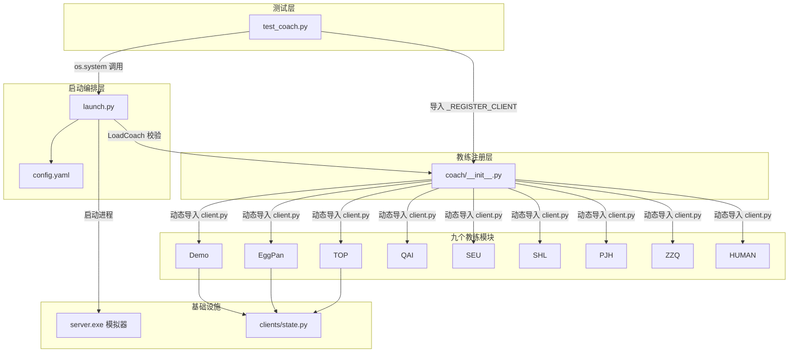
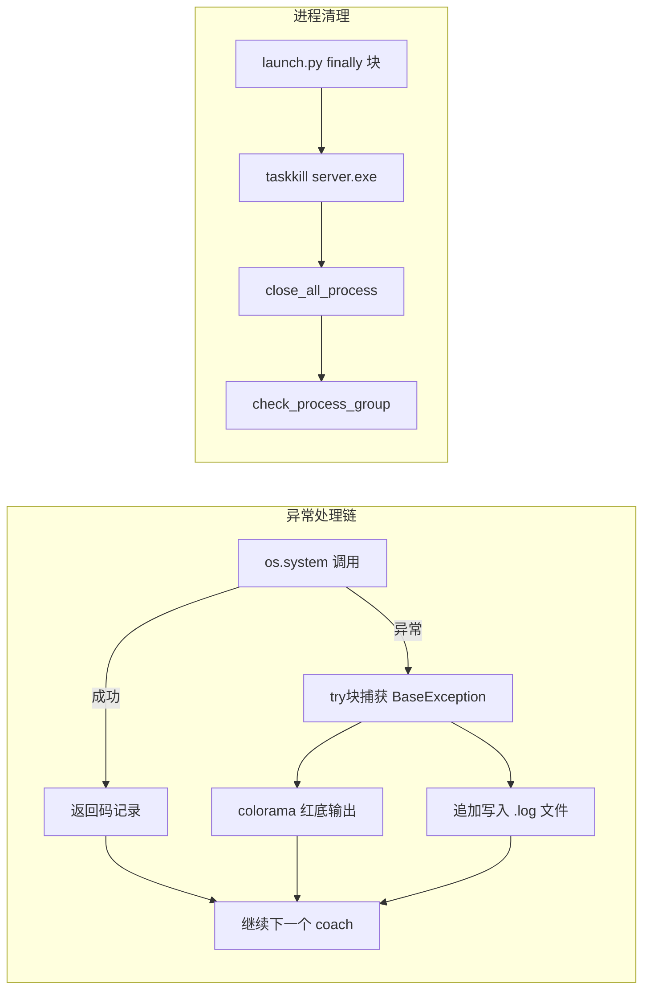

本文档详述 `test_coach.py` 的设计意图、执行流程与底层依赖，帮助初学者理解如何验证 coach 目录中所有已注册智能体（专家策略）能否在对局环境中正常运转。它是教练系统质量保障的第一道防线——任何新增或修改的 coach 模块，都应通过此测试才能确认其与模拟器服务端、消息协议和 `launch.py` 编排系统的兼容性。

## 测试的定位与前置依赖

在深入测试细节之前，必须理解一个关键的架构事实：**`test_coach.py` 不直接实例化任何 coach 对象**。它通过命令行调用 `launch.py`，由 `launch.py` 启动模拟器服务端和四个客户端进程来完成完整对局。这意味着测试覆盖的不仅是 coach 内部的决策逻辑，还包括整个进程编排链路：服务端启动 → WebSocket 连接建立 → 游戏消息收发 → 动作选择与返回 → 进程终止。

这一设计的优点在于端到端验证，缺点在于测试耗时较长（每轮需完成完整对局）且依赖外部可执行文件 `server.exe`。测试文件与核心模块的依赖关系如下：



Sources: [test_coach.py](test/unit_test/test_coach.py#L1-L49) | [coach/__init__.py](coach/__init__.py#L1-L27) | [launch.py](launch/launch.py#L1-L50)

## 教练注册机制回顾

`test_coach.py` 第一行核心代码是 `from coach import _REGISTER_CLIENT`。这个字典在 `coach/__init__.py` 模块加载时自动构建——它遍历 `coach/` 目录下的所有子文件夹，跳过 `.py` 文件和 `__` 开头的特殊目录，对每个有效子目录执行 `import_module("{}.{}.client".format(_ROOT_FOLDER, folder))`，将各模块的 `Main` 类存入字典。

```python
# coach/__init__.py 核心逻辑（简化）
_ROOT_FOLDER = "coach"
_REGISTER_CLIENT = dict()

for folder in os.listdir(_ROOT_FOLDER):
    if folder.endswith("py") or folder.startswith('__'):
        pass
    else:
        module = import_module(name="{}.{}.client".format(_ROOT_FOLDER, folder))
        _REGISTER_CLIENT[folder] = module.Main
```

这意味着任何新增的 coach 模块只需在 `coach/` 下创建文件夹并放入一个含 `Main` 类的 `client.py`，即可自动完成注册——无需修改任何配置文件。测试脚本通过 `all_coaches = list(_REGISTER_CLIENT.keys())` 获取全体已注册教练名称列表，然后逐个进行对局验证。

Sources: [coach/__init__.py](coach/__init__.py#L7-L15) | [test_coach.py](test/unit_test/test_coach.py#L21-L27)

### 已注册教练一览

| 教练名称 | 目录 | 决策风格 | 核心 action 模块 |
|---------|------|---------|----------------|
| **Demo** | `coach/Demo/` | 随机出牌（基线） | `action.py` → `randint(0, act_range)` |
| **EggPan** | `coach/EggPan/` | 加权启发式评分 | `action.py` + `message_Reyn_CUR2.py`（点数权重表） |
| **TOP** | `coach/TOP/` | 完整规则引擎 | `action.py` + `state.py` + `utils.py` |
| **QAI** | `coach/QAI/` | 加权评分策略 | `action.py` + `mysolve.py` |
| **SEU** | `coach/SEU/` | 规则驱动解析 | `action.py` + `utils.py` |
| **SHL** | `coach/SHL/` | 多轮次感知 | `action.py`（含 `Action_shl` 类） |
| **PJH** | `coach/PJH/` | 回合制决策 | `AIAction_back.py`（659 行完整策略） |
| **ZZQ** | `coach/ZZQ/` | 加权启发式 | `action.py` + `message_Reyn.py`（2306 行策略） |
| **HUMAN** | `coach/HUMAN/` | 人类 GUI 交互 | `client.py`（Pygame 图形界面） |

每个 `Main` 类均继承自 `ws4py.client.threadedclient.WebSocketClient`，在 `received_message` 中接收游戏服务器 JSON 消息，通过 `State.parse()` 解析游戏阶段，当 `"actionList"` 出现在消息中时调用各自 `action` 对象做出决策，最后以 `{"actIndex": act_index}` 格式发回服务器。

Sources: [Demo/action.py](coach/Demo/action.py#L1-L13) | [EggPan/client.py](coach/EggPan/client.py#L1-L32) | [TOP/client.py](coach/TOP/client.py#L1-L31) | [QAI/client.py](coach/QAI/client.py#L1-L45) | [SEU/client.py](coach/SEU/client.py#L1-L29) | [SHL/client.py](coach/SHL/client.py#L1-L56) | [PJH/client.py](coach/PJH/client.py#L1-L100) | [ZZQ/client.py](coach/ZZQ/client.py#L1-L40) | [HUMAN/client.py](coach/HUMAN/client.py#L1-L200)

## 测试流程详解

### 整体执行流程

```mermaid
flowchart TD
    START([启动 test_coach.py]) --> IMPORT[导入 _REGISTER_CLIENT<br/>获取 all_coaches 列表]
    IMPORT --> LOGDIR[创建 test/log 目录<br/>生成时间戳日志文件名]
    LOGDIR --> LOOP{遍历每个 coach}
    LOOP -->|第 i 个| CMD[构造命令:<br/>python -u launch.py<br/>-pc1 {coach} -pc2 {coach}<br/>-pc3 {coach} -pc4 {coach}]
    CMD --> EXEC[os.system 执行命令]
    EXEC -->|launch.py 内部| CHECK[LoadCoach 校验<br/>四个 coach 名称合法性]
    CHECK -->|通过| SERVER[启动 server.exe 服务端]
    SERVER --> CLIENTS[启动 4 个客户端进程<br/>全部使用相同 coach]
    CLIENTS --> GAME[完成 config.yaml 指定局数的对局]
    GAME --> CLEAN[taskkill server.exe<br/>回收所有进程]
    CLEAN --> NEXT{还有下一个 coach?}
    NEXT -->|是| LOOP
    NEXT -->|否| DONE([测试完成])
    EXEC -->|异常| ERR[捕获异常<br/>写入日志文件]
    ERR --> NEXT
```

Sources: [test_coach.py](test/unit_test/test_coach.py#L29-L49) | [launch.py](launch/launch.py#L122-L188)

### 关键参数解析

测试脚本构造的命令行格式为：

```
python -u launch/launch.py -pc1 {coach} -pc2 {coach} -pc3 {coach} -pc4 {coach}
```

四个位置的玩家均使用同一个 coach，构成"自我对弈"场景。`-u` 标志强制 Python 使用无缓冲输出，确保日志实时可读。测试利用 `tqdm` 进度条包裹 `all_coaches` 的遍历循环，每轮迭代使用 `set_description_str` 动态显示当前正在测试的教练名称。

| 测试组件 | 配置项 | 说明 |
|---------|--------|------|
| Python 解释器 | `python` | 通过 `PYTHON_INTERPRET` 变量定义 |
| 启动脚本 | `./launch/launch.py` | 多进程编排入口 |
| 对局数 | `config.yaml` 中 `游玩次数: 5` | 每次测试的对局数量 |
| 日志目录 | `test/log/` | 自动创建，按时间戳命名 |
| 进度显示 | `tqdm` | 显示"测试 {coach_name}" |

> **⚠️ 参数兼容性注意**：`test_coach.py` 使用 `-pc1` ~ `-pc4` 作为启动参数，但当前 `launch.py` 定义的参数为 `--agent1` ~ `--agent4`（长格式），未注册 `-pc` 的短格式别名。这意味着直接运行 `test_coach.py` 可能因 argparse 无法识别参数而失败。如需修复，可将测试脚本中的 `-pc` 替换为 `--agent`，或在 `launch.py` 的 `add_argument` 调用中增加 `"-pc{}".format(i)` 作为短格式。

Sources: [test_coach.py](test/unit_test/test_coach.py#L19-L49) | [launch.py](launch/launch.py#L17-L20) | [config.yaml](launch/config.yaml#L1-L8)

### launch.py 内部执行链

当 `test_coach.py` 通过 `os.system` 调用 `launch.py` 后，launch.py 内部的执行序列为：

1. **参数校验阶段**：解析命令行参数后，逐一对四个 agent 参数调用 `LoadCoach(coach_name)`——这确保传入的 coach 名称确实存在于 `_REGISTER_CLIENT` 字典中，若不存在则打印已注册列表并终止进程。

2. **配置加载阶段**：读取 `launch/config.yaml`，获取服务端可执行文件路径（`.\\simulator\\windows\\server.exe`）、各客户端脚本路径、渲染列表和游玩次数。

3. **进程组构建阶段**：构建包含一个 `ServeProcess`（启动 `server.exe`，端口固定 23456）和四个 `ClientProcess` 的进程列表。1 号玩家（训练位）接收完整训练参数（`--device`, `--model`, `--lr` 等），其余三位仅指定 coach 名称。

4. **进程生命周期管理**：依次 `start()` 所有进程 → 等待所有 `ClientProcess` 完成 `join()` → `taskkill` 强制终止 `server.exe` → 关闭所有进程 → 检查进程释放状态。

Sources: [launch.py](launch/launch.py#L122-L188) | [launch.py](launch/launch.py#L55-L102)

## 两组测试的设计思路

`test_coach.py` 的 docstring 明确规划了两组测试，但当前代码仅实现了第一组：

### 第一组：同教练四开测试（已实现）

```
四个玩家使用完全相同的 coach
```

每次测试中，四个位置的玩家全部加载同一个 coach。这种设计验证的是：**coach 模块在多实例并发环境下能否稳定运行**——同一套代码逻辑在不同座位号（myPos 0/1/2/3）、不同手牌和不同游戏阶段下是否正确处理消息并返回合法动作索引。这是最基本的冒烟测试。

### 第二组：混排随机测试（未实现）

```
每个玩家的 coach 随机抽取
```

计划中的第二组测试将从 `all_coaches` 列表中为四个位置分别随机抽取 coach 名称，构成异构对战。这可以验证**不同 coach 模块之间是否存在协议兼容性问题**——例如，某个 coach 的 `Main.__init__` 签名不一致（如 ZZQ 的 `__init__` 只接受 `url` 参数而不接受 `render` 参数）可能导致进程崩溃。当前代码中此测试组仅存在于注释中，可作为后续扩展方向。

```python
# 第一组测试的当前实现核心循环
coaches_num = len(all_coaches)
iter_wrapper = tqdm(range(coaches_num))
for i in iter_wrapper:
    client = all_coaches[i]
    iter_wrapper.set_description_str("测试 {}".format(client))
    ret = os.system("{} -u {} -pc1 {} -pc2 {} -pc3 {} -pc4 {}".format(
        PYTHON_INTERPRET, LAUNCH_FILE, client, client, client, client
    ))
```

Sources: [test_coach.py](test/unit_test/test_coach.py#L10-L49)

## 异常处理与日志机制

测试采用双层异常防护。内层由 `try/except BaseException` 包裹 `os.system` 调用，捕获任何异常后通过 `colorama` 输出红色背景的"出现错误"提示，并将异常信息追加写入 `test/log/{timestamp}.log` 文件。外层依赖 `launch.py` 中的 `finally` 块确保无论对局是否正常结束，都会执行 `taskkill /F /IM server.exe` 清理残留服务端进程。

日志文件命名格式为 `年_月_日_时_分_秒.log`（通过 `datetime.now()` 生成），每次运行 `test_coach.py` 产生一个独立日志文件，便于回溯历史测试记录。



Sources: [test_coach.py](test/unit_test/test_coach.py#L37-L48) | [launch.py](launch/launch.py#L178-L188)

## 运行测试的前置条件

在尝试运行 `test_coach.py` 之前，需要确保以下条件全部满足：

| 条件 | 检查方式 | 备注 |
|------|---------|------|
| `server.exe` 可执行 | 确认 `simulator/windows/server.exe` 存在 | 端口 23456 不可被占用 |
| Python 依赖安装 | `ws4py`, `tqdm`, `colorama`, `pygame`（HUMAN coach） | `pip install ws4py tqdm colorama` |
| 工作目录正确 | 在项目根目录（`NUAA-guandan-main/`）下执行 | 脚本内 `sys.path.append(os.path.abspath('.'))` 依赖此条件 |
| `config.yaml` 配置正确 | 检查 `launch/config.yaml` 中客户端路径和游玩次数 | 游玩次数不宜过大以免测试耗时过长 |
| 参数格式匹配 | 确认 `launch.py` 的 argparse 参数与测试脚本一致 | 参见上文"参数兼容性注意" |

建议在运行完整测试前，先用单个 coach 手动验证链路通畅：

```
python -u launch/launch.py --agent1 Demo --agent2 Demo --agent3 Demo --agent4 Demo
```

若此命令能正常完成对局并输出"所有游戏均已结束"，则说明 `launch.py` → `server.exe` → WebSocket 通信 → coach 决策的完整链路已就绪，可以放心运行全量测试。

## 与项目其他模块的关联

`test_coach.py` 处于项目测试金字塔的**集成测试层**——它位于单元测试（如各 coach action 函数的独立调用测试）和端到端训练测试（如完整 DQN 训练流程）之间。

- **上游依赖**：[教练注册机制](16-jiao-lian-zhu-ce-ji-zhi-coachmo-kuai-de-dong-tai-dao-ru-yu-loadcoachgong-han-mo-shi) 是测试正常工作的前提——`_REGISTER_CLIENT` 字典的内容直接决定测试遍历范围
- **并行关系**：[launch.py 多进程编排](20-launch-py-duo-jin-cheng-bian-pai-fu-wu-duan-yu-si-ke-hu-duan-bing-xing-qi-dong-yu-sheng-ming-zhou-qi-guan-li) 是测试调用的核心编排逻辑
- **下游关联**：若测试通过，各 coach 可在 [分布式DAgger](8-fen-bu-shi-dagger-learneryan-bo-quan-zhong-ke-hu-duan-shou-ji-zhuan-jia-yang-ben) 中作为专家策略收集样本，或在 [模仿学习](6-mo-fang-xue-xi-yuan-li-daggersuan-fa-yu-zhuan-jia-ce-lue-hun-he-cai-yang) 中作为教师模型
- **数据关联**：`test/analysis/` 目录下的 [训练过程可视化](25-xun-lian-guo-cheng-ke-shi-hua-value-logri-zhi-jie-xi-yu-sun-shi-jiang-li-qu-xian-hui-zhi)（`drawloss.py`）和 `race.py`（空文件，预留的对局统计分析入口）可用于分析测试对局的详细数据

Sources: [test/analysis/drawloss.py](test/analysis/drawloss.py#L1-L81) | [test/analysis/race.py](test/analysis/race.py#L1-L1)

## 扩展建议

对于希望增强测试覆盖率的开发者，以下方向值得考虑：

1. **实现第二组混排测试**：使用 `random.sample` 或 `random.choices` 为四个位置分配不同 coach，捕获异构组合下的兼容性问题。

2. **增加单局结果断言**：当前测试仅检查进程是否崩溃，未验证对局结果的合理性。可以解析 `launch.py` 的标准输出或返回值，验证每个 coach 的对局完成率。

3. **参数化测试框架迁移**：将 `os.system` 调用替换为 `subprocess.run` 并捕获 stdout/stderr，或迁移至 `pytest` 参数化测试以获得更丰富的断言和报告能力。

4. **HUMAN coach 的特殊处理**：HUMAN coach 依赖 Pygame 图形界面和人工点击交互，在全自动测试中可能需要跳过或使用 mock 替代——当前代码未做此区分，测试 HUMAN 时会因无人点击按钮而卡死。