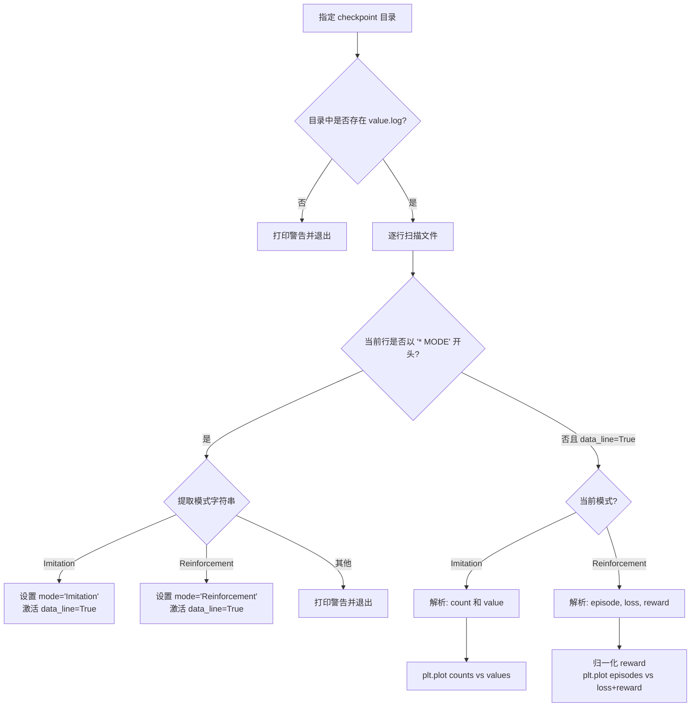

value.log 是贯穿整个训练系统的核心遥测文件——它在每次训练启动时被创建于 `model/checkpoints_<时间戳>_<模式>/` 目录下，以纯文本形式逐行记录训练超参数元数据和周期性训练指标。`test/analysis/drawloss.py` 脚本则负责解析该日志并绘制损失曲线与奖励曲线，为开发者提供训练进程的直观视图。本文档将系统梳理 value.log 的生成路径、格式规范、解析逻辑以及可视化流程。

Sources: [gene_client.py](clients/gene_client.py#L575-L610), [drawloss.py](test/analysis/drawloss.py#L1-L81)

## value.log 的生成路径与双轨架构

value.log 由客户端进程在训练初始化阶段创建。系统存在两条并行的日志生成路径：**旧版单文件客户端**（`imitation_client.py` / `reinforment_client.py`）与**统一客户端**（`gene_client.py`）。二者在日志格式上存在关键差异，理解这一双轨架构是正确解析日志的前提。

旧版路径中，客户端脚本通过 `argparse` 接收参数后，直接在当前进程内完成模型加载、决策、训练与日志写入。以模仿学习为例，`clients/imitation_client.py` 在启动时创建检查点目录并写入 value.log 头部元数据：

```python
CHECK_PATH = "model/checkpoints_{}".format(now_str())
if not os.path.exists(CHECK_PATH):
    os.makedirs(CHECK_PATH)
with open(CHECK_PATH + "/value.log", "a", encoding="utf-8") as fp:
    fp.write("* LEARNING_RATE : {}\n".format(LEARNING_RATE))
    fp.write("* MODE : {}\n".format(MODE))
```

Sources: [imitation_client.py](clients/imitation_client.py#L33-L52), [reinforment_client.py](clients/reinforment_client.py#L53-L65)

统一客户端 `gene_client.py` 采用 `argparse` 子命令架构（`imitation` / `reinforcement` / `test` / `rule`），在 `main()` 函数中统一创建检查点目录并写入 value.log 头。与旧版的关键区别在于，统一客户端在写入日志头部时填充了更完整的超参数信息：

```python
if args.mode in ("imitation", "reinforcement"):
    check_path_dir = f"model/checkpoints_{now_str()}_{args.mode}"
    os.makedirs(check_path_dir, exist_ok=True)
    log_path = os.path.join(check_path_dir, "value.log")
    with open(log_path, "w", encoding="utf-8") as f:
        f.write(f"* LEARNING_RATE : {args.lr}\n")
        f.write(f"* MODE : Imitation Learning (DAgger)\n")  # 或 Reinforcement Learning
        # ... 更多超参数行
```

训练过程中的日志写入由客户端内部的 `write_log()` 方法以追加模式完成。在 `ImitationAction` 中，日志文件路径在构造函数内绑定：`self.log_file = os.path.join(check_path, "value.log")`；在 `ReinforcementClient` 中同理。

Sources: [gene_client.py](clients/gene_client.py#L142-L147), [gene_client.py](clients/gene_client.py#L250-L255), [gene_client.py](clients/gene_client.py#L575-L610)

## value.log 的格式规范

一份完整的 value.log 由两部分组成：**元数据头**（以 `*` 开头的配置行）和**数据行**（以 `[count=...]` 或 `[episode=...]` 开头的指标行）。`drawloss.py` 通过检测 `* MODE` 行来判定训练模式，从而切换数据行的解析策略。

### 模仿学习模式的日志格式

**元数据头**包含以下字段（以统一客户端 gene_client.py 为例）：

| 字段 | 说明 | 示例值 |
|------|------|--------|
| `* LEARNING_RATE` | 优化器学习率 | `1e-4` |
| `* SAVE_INTERVAL` | 模型保存间隔 | `N/A`（模仿学习不以局为单位保存） |
| `* LOG_INTERVAL` | 日志记录频率（步） | `50` |
| `* DEVICE` | 运算设备 | `cpu` 或 `cuda` |
| `* MODE` | 训练模式标识 | `Imitation Learning (DAgger)` |
| `* DAGGER_EPOCHS` | 每轮 DAgger 训练的 epoch 数 | `3` |
| `* DAGGER_INTERVAL` | DAgger 全量训练间隔（局） | `5` |
| `* EXPERT_DECAY` | 专家概率衰减系数 | `0.995` |
| `* MIN_EXPERT_PROB` | 最小专家采样概率 | `0.1` |
| `* BATCH_SIZE` | 训练批量大小 | `16` |
| `* MIN_DATASET_SIZE` | 触发训练的最小数据集大小 | `32` |

**统一客户端的数据行**格式为：
```
[count=X] expert_prob=Y, dataset_size=Z
```
其中 `count` 是训练步数累计值（跨局不重置），`expert_prob` 是当前专家策略的混合概率，`dataset_size` 是 DAgger 数据集的当前大小。

**旧版客户端的数据行**格式为（这也是 `drawloss.py` 期望解析的格式）：
```
[count=X] value = Y
```
其中 `value` 是模型在当前步的损失值取负号（`-loss.item()`），反映模型对专家动作的"价值评估"——该值越高，表示模型越认同专家决策。

Sources: [gene_client.py](clients/gene_client.py#L186-L188), [imitation_client.py](clients/imitation_client.py#L118-L120)

### 强化学习模式的日志格式

**元数据头**包含以下字段：

| 字段 | 说明 | 示例值 |
|------|------|--------|
| `* LEARNING_RATE` | 优化器学习率 | `1e-5` |
| `* SAVE_INTERVAL` | 模型保存间隔（局） | `1000` |
| `* LOG_INTERVAL` | 日志记录频率（局） | `100` |
| `* DEVICE` | 运算设备 | `cpu` 或 `cuda` |
| `* MODE` | 训练模式标识 | `Reinforcement Learning (MC / DQN)` |
| `* EPSILON` | 初始探索率 | `1.0` |
| `* EPSILON_DECAY` | 每局 epsilon 衰减系数 | `0.9999` |
| `* GAMMA` | TD 折扣因子 | `0.98` |
| `* BATCH_SIZE` | 训练批量大小 | `128` |
| `* UPDATE_STEPS` | 每局训练 batch 数 | `100` |

**统一客户端的数据行**格式为：
```
[episode=X] avg_loss=Y reward_sample=Z
```
其中 `avg_loss` 是当前局所有训练 batch 的 MSE 损失均值，`reward_sample` 是最后一个 batch 中样本的平均奖励值。

**旧版客户端的数据行**格式为（这也是 `drawloss.py` 期望解析的格式）：
```
[epsiode=X] avgloss = Y reward = Z
```
注意旧版代码中存在拼写错误：`epsiode` 而非 `episode`。`avgloss` 是经验回放训练的平均损失，`reward` 是当前局的累计奖励。

Sources: [gene_client.py](clients/gene_client.py#L296-L300), [reinforment_client.py](clients/reinforment_client.py#L121-L123)

## drawloss.py 解析引擎

`test/analysis/drawloss.py` 是一个独立的可视化脚本，它遍历指定检查点目录中的 value.log，根据模式字段切换解析策略，并使用 matplotlib 绘制训练曲线。其核心解析流程可用以下流程图表示：



Sources: [drawloss.py](test/analysis/drawloss.py#L11-L80)

### 模仿学习模式的解析细节

当检测到 `mode == "Imitation"` 时，对每一数据行执行两步拆分：

1. **提取 value**：`line.split()[-1]` 取空格分割后的最后一个字段，这是模型对专家动作的评估值。若该字段为 `"nan"`，则终止解析（后续数据不可靠）。
2. **提取 count**：`line.split()[0].split("=")[-1][:-1]` ——先取第一个字段（如 `[count=100]`），按 `=` 分割取最后一段（`100]`），再去掉末尾的 `]` 得到整数。

最终以 `counts` 为 X 轴、`values` 为 Y 轴绘制带数据点标记的折线图，标题为 "imitation learning"。**value 曲线的上升趋势**意味着模型的 softmax 概率分布越来越集中于专家动作，即模仿效果在提升。

Sources: [drawloss.py](test/analysis/drawloss.py#L30-L43)

### 强化学习模式的解析细节

当检测到 `mode == "Reinforcement"` 时，对每一数据行执行：

1. 按空格分割得到 `spts` 列表
2. `loss = float(spts[3])` ——第 4 个字段（如 `avgloss = 0.523` 中的 `0.523`），表示 MSE 训练损失
3. `reward = float(spts[-1])` ——最后一个字段，表示整局累计奖励
4. `episode = int(spts[0].split('=')[-1][:-1])` ——与模仿学习相同的 episode 提取方法

在绘图前，脚本对 reward 序列执行 **Min-Max 归一化后缩放至 60000** 的操作：
```python
rewards = (rewards - rewards.min()) / np.ptp(rewards) * 60000
```
这样做的目的是将 reward 曲线拉伸到与 loss 曲线相近的数值量级，以便在同一张图上直观比较两条曲线的趋势。**loss 下降且 reward 上升**是训练收敛的理想信号。

Sources: [drawloss.py](test/analysis/drawloss.py#L44-L52)

## 实际使用指南

### 修改 drawloss.py 指向你的检查点

脚本底部的 `DrawCheckpoints("checkpoints_2022_3_3_22_40_23")` 是硬编码的示例路径。你需要将其替换为实际的检查点目录名（即 `model/` 下的子目录名）。该目录名由 `gene_client.py` 自动生成为 `checkpoints_<年>_<月>_<日>_<时>_<分>_<秒>_<模式>` 格式。

```python
# 将最后一行改为你的检查点目录
DrawCheckpoints("checkpoints_2025_1_15_9_30_0_imitation")
plt.legend()
plt.tight_layout()
plt.show()
```

`DrawCheckpoints` 函数默认在 `./model` 根目录下搜索检查点子目录，可通过 `root_dir` 参数修改。

Sources: [drawloss.py](test/analysis/drawloss.py#L77-L81), [gene_client.py](clients/gene_client.py#L580)

### 格式兼容性处理

由于统一客户端（gene_client.py）的数据行格式与旧版不同，直接使用 drawloss.py 解析统一客户端生成的 value.log 会失败：

| 对比维度 | 旧版模仿学习 | 统一版模仿学习 |
|----------|-------------|---------------|
| 数据行格式 | `[count=100] value = 0.523` | `[count=100] expert_prob=0.85, dataset_size=500` |
| value 来源 | `-loss.item()` | 无直接 value 字段 |
| drawloss.py 兼容 | ✅ 完全兼容 | ❌ 格式不匹配 |

| 对比维度 | 旧版强化学习 | 统一版强化学习 |
|----------|-------------|---------------|
| 数据行格式 | `[epsiode=50] avgloss = 0.3 reward = 12` | `[episode=50] avg_loss=0.3000 reward_sample=2.5` |
| 分隔方式 | 空格分隔，`=` 独立为字段 | 空格分隔，`=` 融入字段名 |
| drawloss.py 兼容 | ✅ spts[3]=loss, spts[-1]=reward | ❌ spts 仅 3 个字段 |

如需可视化统一客户端的日志，你有两种选择：一是修改 drawloss.py 的解析逻辑以适配新格式（将 `spts[1].split('=')[-1]` 作为 loss，`spts[2].split('=')[-1]` 作为 reward）；二是使用旧版客户端文件进行训练以保持兼容。推荐第一种方案，因为统一客户端是新架构的基础。

### 曲线解读

**模仿学习曲线**：如果 value 曲线持续上升并趋于平稳，说明模型对专家动作的评估值在提高，模仿效果良好。如果 value 曲线剧烈震荡或出现 `nan` 值，通常意味着学习率过高或数据集质量存在问题。

**强化学习曲线**：理想的训练曲线应呈现 **loss 下降 + reward 上升** 的"剪刀差"形态。如果两条曲线都趋于水平，说明模型可能已收敛到局部最优；如果 loss 下降但 reward 不升反降，可能出现了 reward hacking 或探索不足的问题。

## 与模型检查点搜索的联动

value.log 中记录的指标值与模型检查点的命名约定直接关联。`util.py` 中的 `lock_model_path()` 函数通过解析检查点文件名中的 `value` 或 `reward` 关键词来定位特定性能水平的模型：

```python
def lock_model_path(value, model_root="./model", keyword="value", reverse=True):
    for checkpoints in os.listdir(model_root):
        for pth in os.listdir(check_path):
            params = pth[:-4].split("_")
            if params[-2] == keyword and float(params[-1]) == value:
                return os.path.join(check_path, pth)
```

模仿学习保存的模型文件遵循命名模式 `imitation_<时间戳>_step<步数>_prob<value>.pth`（如 `imitation_2025_1_15_9_30_0_step500_prob0.723.pth`），其中 `prob` 后的数值即 `np.exp(-avg_loss)` 的结果。强化学习旧版保存格式为 `<时间戳>_reward_<累计奖励>.pth`。`train.py` 的 `--lock_value` 和 `--lock_reward` 参数正是利用这一机制实现断点续训的自动模型搜索。

Sources: [util.py](util.py#L170-L182), [train.py](train.py#L64-L74), [gene_client.py](clients/gene_client.py#L230-L237)

## 相关页面导航

阅读完本文后，建议按以下顺序继续深入：

- **[模型断点续训：基于value与reward的自动检查点搜索](26-mo-xing-duan-dian-xu-xun-ji-yu-valueyu-rewardde-zi-dong-jian-cha-dian-sou-suo)** ——了解 `lock_model_path` 如何利用 value.log 的数值实现训练恢复
- **[检查点文件结构：模型参数、教练名称与网络类的序列化约定](27-jian-cha-dian-wen-jian-jie-gou-mo-xing-can-shu-jiao-lian-ming-cheng-yu-wang-luo-lei-de-xu-lie-hua-yue-ding)** ——理解 `.pth` 文件的内部结构与命名逻辑
- **[DQN训练流程：经验回放、探索策略与TD目标更新](9-dqnxun-lian-liu-cheng-jing-yan-hui-fang-tan-suo-ce-lue-yu-tdmu-biao-geng-xin)** ——回顾 value.log 中 loss 和 reward 指标的计算原理
- **[模仿学习原理：DAgger算法与专家策略混合采样](6-mo-fang-xue-xi-yuan-li-daggersuan-fa-yu-zhuan-jia-ce-lue-hun-he-cai-yang)** ——理解 value.log 中 expert_prob 和 dataset_size 的含义