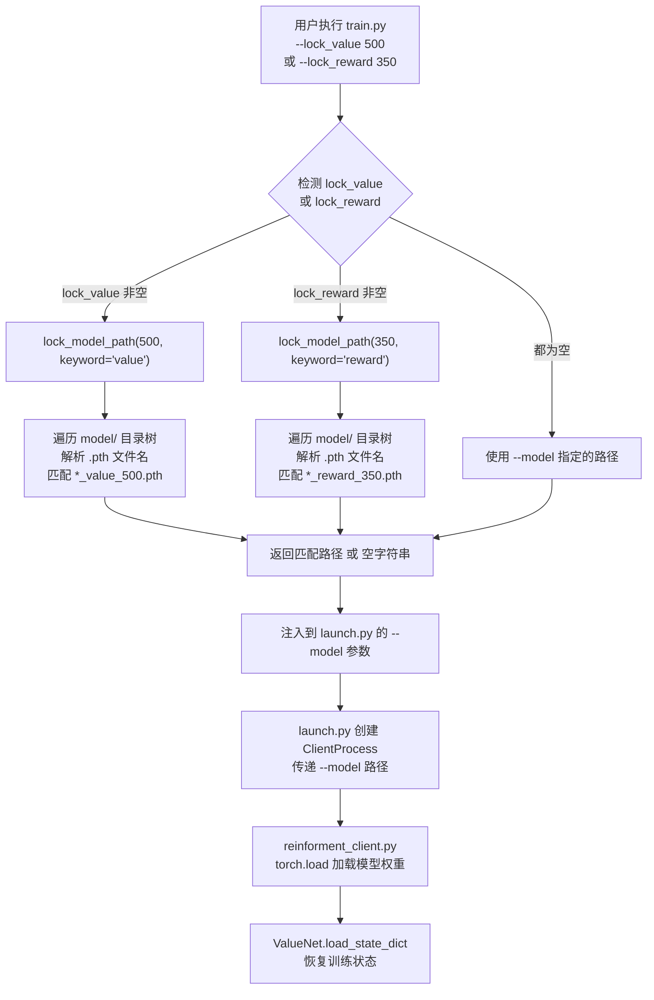

当强化学习训练运行数千乃至上万轮对局后，模型权重被以检查点（checkpoint）的形式周期性地保存到 `model/` 目录中。面对堆积的数十上百个 `.pth` 文件，开发者面临一个棘手的工程问题：**如何从检查点坟墓中精确复活一个满足特定性能条件的模型？** 本系统提供了一套基于 Q-value 均值与累计 reward 的自动检查点搜索机制——只需在命令行指定一个数值，系统便能自动遍历所有历史检查点，命中匹配的文件并恢复训练。

## 核心搜索函数：lock_model_path 的命名约定解析

检查点自动搜索的引擎是 `util.py` 中的 `lock_model_path` 函数，其设计核心依赖于一套**可解析的文件命名约定**。该函数接收一个数值 `value` 和一个关键词 `keyword`（`"value"` 或 `"reward"`），然后遍历 `model/` 目录下的所有子文件夹，逐一检查每个 `.pth` 文件的文件名是否满足 `*_{keyword}_{value}.pth` 的模式。

具体解析逻辑是：去掉 `.pth` 后缀后，按下划线 `_` 分割文件名，检查倒数第二个片段 `params[-2]` 是否等于关键词、倒数第一个片段 `params[-1]` 转换为浮点数后是否等于目标值。例如文件名 `2026_5_17_12_1_18_reward_500.0.pth`，去除后缀后分割为 `['2026', '5', '17', '12', '1', '18', 'reward', '500.0']`，`params[-2]` = `'reward'`、`float(params[-1])` = `500.0`，恰好匹配 `keyword="reward"` 且 `value=500.0` 的查询条件。

函数默认以 `reverse=True` 模式遍历，即按 `os.listdir` 返回的顺序反向搜索（通常意味着先检查最近创建的目录），一旦命中立即返回完整路径，未命中则返回空字符串。

```python
def lock_model_path(value, model_root="./model", keyword="value", reverse=True):
    iter_obj = os.listdir(model_root)
    if reverse:
        iter_obj.reverse()
    for checkpoints in iter_obj:
        check_path = os.path.join(model_root, checkpoints)
        for pth in os.listdir(check_path):
            if pth.endswith("pth"):
                params = pth[:-4].split("_")
                if params[-2] == keyword and float(params[-1]) == value:
                    return os.path.join(check_path, pth)
    return ""
```

Sources: [util.py](util.py#L172-L183)

## 训练入口的命令行触发：--lock_value 与 --lock_reward

在 `train.py` 的 `argparse` 参数定义中，`--lock_value` 和 `--lock_reward` 是两个专用参数，分别用于按 Q-value 均值或累计 reward 定位检查点。当用户指定其中任意一个参数时，`train.py` 会自动调用 `lock_model_path` 进行搜索，并将返回的路径注入到 `--model` 参数中，随后传递给 `launch.py`。

```python
if args["lock_value"]:
    model = lock_model_path(args["lock_value"], keyword="value")
elif args["lock_reward"]:
    model = lock_model_path(args["lock_reward"], keyword="reward")
else:
    model = args["model"]
```

三者的优先级是互斥的：`--lock_value` 优先于 `--lock_reward`，两者均优先于 `--model`。这意味着如果同时指定了 `--lock_value` 和 `--model`，系统将忽略 `--model` 而执行自动搜索。

Sources: [train.py](train.py#L125-L130)

## 检查点的保存时机与命名来源

理解检查点的命名来源对有效使用自动搜索至关重要。在旧版分布式客户端 `reinforment_client.py` 中，每个 episode 结束时，客户端会计算本局 reward（由 `get_reward` 方法根据己方和队友的完牌排名映射为标量），累积到 `episode` 计数器达到 `SAVE_INTERVAL` 的倍数时，便保存一份检查点，文件名采用 `{now_str()}_reward_{sum(rewards)}.pth` 格式。

其中 `now_str()` 生成精确到秒的时间戳（如 `2026_5_17_12_1_18`），而 `sum(rewards)` 是上一个保存间隔内所有 episode reward 的总和。这种命名方式意味着：**检查点文件名中嵌入的 reward 值是训练过程中的实际累计奖励**，可作为模型性能的天然标签。

```python
if self.episode % SAVE_INTERVAL == 0:
    torch.save({
        "coach" : COACH,
        "MODE"  : MODE,
        "model_state_dict" : self.action.ValueNet.state_dict(),
        "model_class"  : ActionValueNet
    }, CHECK_PATH + "/{}_reward_{}.pth".format(now_str(), round(sum(rewards), 3)))
```

与此同时，训练日志 `value.log` 中会以 `[epsiode=N] avgloss = X reward = Y` 的格式记录每个 `LOG_INTERVAL` 周期的平均损失和奖励值，为手动定位检查点提供了辅助索引。

Sources: [clients/reinforment_client.py](clients/reinforment_client.py#L111-L118) 和 [clients/reinforment_client.py](clients/reinforment_client.py#L120-L122)

## 完整流程：从命令行到模型加载

下面的 Mermaid 流程图展示了从用户在 `train.py` 中指定 `--lock_value` 或 `--lock_reward` 参数到最终模型被加载至客户端的完整数据流。



Sources: [train.py](train.py#L124-L131) 和 [launch/launch.py](launch/launch.py#L138-L145) 和 [clients/reinforment_client.py](clients/reinforment_client.py#L48-L55)

## 模型目录的实际结构验证

从项目实际的 `model/` 目录结构可以看到三类检查点文件夹共存。`model/checkpoints_2026_5_16_13_9_28_learner` 中保存的是新版 Learner GUI 的训练产出，命名为 `learner_train{step}.pth`；`model/imitation_checkpoints_*` 保存模仿学习的中间模型；`model/selfplay_checkpoints/` 保存自博弈的序列化编号模型（`1.pth`, `2.pth` … `104.pth`）。

| 目录类型 | 命名模式 | 搜索兼容性 |
|---|---|---|
| 旧版 RL 客户端 | `{timestamp}_reward_{value}.pth` | ✅ 支持 `lock_reward` 搜索 |
| 新版 Learner GUI | `learner_train{step}.pth` | ❌ 不含 value/reward 关键词 |
| 模仿学习 | `imitation_train{step}.pth` | ❌ 不含 value/reward 关键词 |
| 自博弈 V2 | `{seq}.pth` | ❌ 不含 value/reward 关键词 |
| 未来扩展（value） | `{timestamp}_value_{value}.pth` | ✅ 支持 `lock_value` 搜索 |

这解释了为何 `lock_model_path` 在新版 Learner GUI 产出的检查点上无法工作——新版采用了更简洁的 `learner_train{step}.pth` 命名，废弃了将 reward 嵌入文件名的做法。要使用自动搜索功能，需要确保检查点文件名遵循 `*_{keyword}_{value}.pth` 约定。

Sources: [actor_all/learner.py](actor_all/learner.py#L449-L455) 和 [actor_all/imitation_learner.py](actor_all/imitation_learner.py#L372-L377)

## 奖励函数的映射：理解 reward 的含义

要有效使用 `--lock_reward` 搜索，必须理解检查点文件名中 reward 数值的来源。`get_reward` 方法将己方（`myPos`）和队友（`friendPos`，即对家）的完牌排名映射为标量奖励。

| (己方排名, 队友排名) | Reward | 语义 |
|---|---|---|
| (0, 1) — 头游+二游 | +500 | 大胜（双赢） |
| (0, 2) — 头游+三游 | +350 | 小胜 |
| (0, 3) — 头游+末游 | +100 | 险胜 |
| (1, 2) — 二游+三游 | -100 | 小负 |
| (1, 3) — 二游+末游 | -350 | 中负 |
| (2, 3) — 三游+末游 | -500 | 惨败（双输） |

每局结束后，该 reward 被用于更新经验池中所有 transition 的终局信号，并通过 `MemoryBuffer.learn_batch` 中的 Double-Q TD(0) 公式 `target = r + γ * max_a' Q(s', a')` 反向传播更新网络权重。因此，累计 reward 越高的检查点通常对应着在近期对局中表现更优的模型版本。

Sources: [clients/reinforment_client.py](clients/reinforment_client.py#L65-L80) 和 [util.py](util.py#L111-L148)

## 搜索失败的处理与容错

`lock_model_path` 在未找到匹配检查点时返回空字符串 `""`。在 `train.py` 中，空字符串会作为 `--model ""` 传递给 `launch.py`，后者再传递给客户端进程。客户端在 `MODEL` 为空或 `"None"` 时会跳过模型加载，直接从随机初始化开始训练——这意味着一次未命中的搜索等价于"从头训练"，而非报错终止。

```python
if MODEL is None or MODEL != "None":
    check_path(MODEL)
    STATE_DICT = torch.load(MODEL)
else:
    STATE_DICT = {}
```

这一设计提供了良好的容错性：用户可以大胆尝试不同的 value/reward 搜索值，即使未命中也不会中断训练流程。但需注意 `check_path` 在路径非空且不存在时会直接 `exit(-1)` 终止程序，因此务必确保搜索值在历史记录中真实存在。

Sources: [clients/reinforment_client.py](clients/reinforment_client.py#L45-L49)

## 常用操作示例

**按 reward 搜索检查点并恢复训练**：
```bash
python train.py -m rl --lock_reward 500.0 -d cuda --lr 1e-4 --save_interval 1000
```
该命令会在 `model/` 下搜索文件名匹配 `*_reward_500.0.pth` 的检查点，加载后以学习率 `1e-4` 继续训练，每 1000 轮保存一次。

**按 value 搜索检查点**（需检查点文件名包含 `_value_` 段）：
```bash
python train.py -m rl --lock_value 3.5 -d cpu
```

**直接指定模型路径（不使用自动搜索）**：
```bash
python train.py -m rl --model model/checkpoints_2026_5_17_12_1_18_learner/learner_train500.pth
```

## 阅读下一步

- 了解检查点文件的内部结构（`model_state_dict`、`model_class`、`coach` 等字段），请阅读 [检查点文件结构：模型参数、教练名称与网络类的序列化约定](27-jian-cha-dian-wen-jian-jie-gou-mo-xing-can-shu-jiao-lian-ming-cheng-yu-wang-luo-lei-de-xu-lie-hua-yue-ding)
- 理解训练日志的可视化方法，请阅读 [训练过程可视化：value.log日志解析与损失/奖励曲线绘制](25-xun-lian-guo-cheng-ke-shi-hua-value-logri-zhi-jie-xi-yu-sun-shi-jiang-li-qu-xian-hui-zhi)
- 回溯奖励函数的设计原理，请阅读 [奖励函数设计：完牌次序到标量奖励的映射策略](15-jiang-li-han-shu-she-ji-wan-pai-ci-xu-dao-biao-liang-jiang-li-de-ying-she-ce-lue)