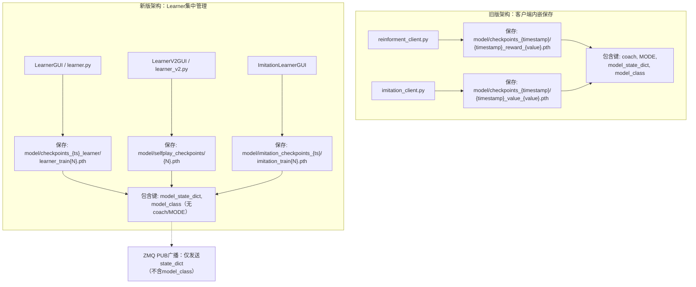

本页深入剖析项目中所有检查点文件的序列化格式、命名约定和加载机制。项目在架构演进过程中形成了**两代检查点格式**：旧版客户端内嵌保存（包含教练元数据），新版分布式Learner集中保存（精简为模型核心数据）。理解这些差异对断点续训、模型评估和自博弈对手加载至关重要。

## 检查点文件的两代演进

项目的检查点机制经历了从**客户端自主保存**到**Learner集中管理**的架构变迁。这一变迁与训练架构从单进程到分布式的演进同步发生，直接影响检查点内部字典的键集合和文件命名策略。



## 检查点字典的核心键

所有检查点文件本质上都是通过 `torch.save(dict, path)` 序列化的 Python 字典。两代格式共享两个核心键，旧版额外携带元数据键。

| 键名 | 旧版格式 | 新版格式 | 值的类型 | 说明 |
|------|---------|---------|---------|------|
| `model_state_dict` | ✅ 必需 | ✅ 必需 | `collections.OrderedDict` | PyTorch 原生的 `model.state_dict()`，包含所有可学习参数的张量 |
| `model_class` | ✅ 必需 | ✅ 必需 | Python 类对象 | 网络类的直接引用，用于动态实例化。始终为 `ActionValueNet` |
| `coach` | ✅ 旧版有 | ❌ 新版无 | `str` | 训练时使用的教练名称（如 `"EggPan"`），记录专家来源 |
| `MODE` 或 `mode` | ✅ 旧版有 | ❌ 新版无 | `str` | 训练模式标识（如 `"Reinforcement Learning"`, `"Imitation Learning"`） |

`model_class` 的序列化方式尤为关键：旧版和新版代码都将 **Python 类对象本身**（而非字符串名称）存入字典。加载时通过 `ckpt.get("model_class", ActionValueNet)()` 动态实例化网络，若键缺失则回退到默认的 `ActionValueNet`。

Sources: [actor_all/learner.py](actor_all/learner.py#L446-L451), [actor_all/learner_v2.py](actor_all/learner_v2.py#L510-L514), [actor_all/imitation_learner.py](actor_all/imitation_learner.py#L378-L383), [clients/reinforment_client.py](clients/reinforment_client.py#L117-L124)

## 检查点命名约定与目录结构

### 旧版客户端命名

旧版 `reinforment_client.py` 和 `imitation_client.py` 在启动时创建带时间戳的检查点目录，并将日志和模型文件一同存放：

```
model/
└── checkpoints_{YYYY}_{M}_{D}_{H}_{M}_{S}/
    ├── value.log                          # 训练日志文件
    ├── {timestamp}_value_{cur_val}.pth    # 模仿学习检查点
    └── {timestamp}_reward_{sum_reward}.pth # 强化学习检查点
```

文件名中的数值嵌入是旧版设计的关键特征：模仿学习检查点嵌入当前 Q 值的标量（`_value_{cur_val}`），强化学习检查点嵌入累计奖励（`_reward_{sum_reward}`）。`util.py` 中的 `lock_model_path()` 函数正是利用这一约定，通过解析文件名中的 `keyword`（`"value"` 或 `"reward"`）和数值来定位断点续训的模型。

Sources: [clients/reinforment_client.py](clients/reinforment_client.py#L44-L47), [util.py](util.py#L156-L167)

### 新版 Learner 命名

新版分布式架构将检查点保存职责完全转移到 Learner 端，三种 Learner 各自采用不同的目录和命名策略：

| Learner 类型 | 目录路径 | 文件命名格式 | 示例 | 保存间隔默认值 |
|-------------|---------|-------------|------|---------------|
| `LearnerGUI` (RL) | `model/checkpoints_{ts}_learner/` | `learner_train{N}.pth` | `learner_train50.pth` | 50 步 |
| `LearnerV2GUI` (自博弈) | `model/selfplay_checkpoints/` | `{N}.pth` | `25.pth` | 25 步 |
| `ImitationLearnerGUI` (模仿) | `model/imitation_checkpoints_{ts}/` | `imitation_train{N}.pth` | `imitation_train100.pth` | 100 步 |

其中 **LearnerV2 的连续编号设计**最为精妙：以自然数 `1.pth`, `2.pth`, `3.pth`... 命名，启动时自动扫描已有文件并续接编号。这使得自博弈对手客户端可以通过 `model_index` 参数（0=最新, 1=第二新...）按训练进度梯度选择对手强度。

Sources: [actor_all/learner.py](actor_all/learner.py#L237-L238), [actor_all/learner_v2.py](actor_all/learner_v2.py#L247-L265), [actor_all/imitation_learner.py](actor_all/imitation_learner.py#L237-L238)

## 检查点的保存流程

### Learner 端保存（新版核心路径）

所有新版 Learner 的训练线程（`_train_loop`）在满足保存间隔条件时执行相同的核心逻辑：

```python
# 伪代码：Learner 保存检查点的核心模式
save_path = os.path.join(self.save_dir, f"{prefix}{train_count}.pth")
torch.save({
    "model_state_dict": self.model.state_dict(),
    "model_class": ActionValueNet
}, save_path)
```

这一模式在三个 Learner 中完全一致——仅 `model_state_dict` 和 `model_class` 两个键。`model_class` 固定为 `ActionValueNet` 类对象，在 `torch.save` 时通过 pickle 序列化整个类定义。

Sources: [actor_all/learner.py](actor_all/learner.py#L445-L451), [actor_all/learner_v2.py](actor_all/learner_v2.py#L509-L519), [actor_all/imitation_learner.py](actor_all/imitation_learner.py#L377-L383)

### 客户端端保存（旧版路径）

旧版 `reinforment_client.py` 在每局结束时保存检查点，额外携带教练元数据：

```python
torch.save({
    "coach": COACH,                          # 如 "EggPan"
    "MODE": MODE,                            # 如 "Reinforcement Learning"
    "model_state_dict": self.action.ValueNet.state_dict(),
    "model_class": ActionValueNet
}, CHECK_PATH + "/{}_reward_{}.pth".format(now_str(), round(sum(rewards), 3)))
```

`coach` 和 `MODE` 字段用于追溯训练来源——知道一个模型是哪个教练指导下、在哪种模式下训练得到的。新版架构取消了这些字段，因为训练模式已由 Learner 类型隐式确定。

Sources: [clients/reinforment_client.py](clients/reinforment_client.py#L117-L124)

## 检查点的加载机制

### 通用加载模式

两代格式的加载逻辑遵循相同的容错模式，核心在于 `model_class` 键的动态类实例化：

```python
ckpt = torch.load(model_path, map_location=device)
model = ckpt.get("model_class", ActionValueNet)().to(device)  # 动态实例化
model.load_state_dict(ckpt["model_state_dict"])                # 加载参数
```

`ckpt.get("model_class", ActionValueNet)` 提供了优雅的回退：旧版检查点如果有 `model_class` 则使用保存的类，否则默认为 `ActionValueNet`。这在网络类经过重构后依然保证向后兼容。

Sources: [actor_all/learner.py](actor_all/learner.py#L215-L218), [actor_all/learner_v2.py](actor_all/learner_v2.py#L228-L232), [actor_all/imitation_learner.py](actor_all/imitation_learner.py#L218-L222)

### 自博弈对手的热加载机制

`selfplay_opponent.py` 实现了最复杂的加载逻辑——**每局开始时自动热加载**。它不依赖 `model_class` 键进行首次实例化，而是直接在构造时创建 `ActionValueNet` 实例，后续每局仅调用 `load_state_dict` 更新参数：

```python
def _reload_model(self):
    files = glob.glob(os.path.join(self.MODEL_DIR, "*.pth"))
    files.sort(key=extract_num, reverse=True)  # 从新到旧排序
    chosen = files[min(self.model_index, len(files) - 1)]
    if chosen == self.current_model_path:
        return  # 模型未变化，跳过加载
    ckpt = torch.load(chosen, map_location=self.device)
    if self.model is None:
        self.model = ckpt.get("model_class", ActionValueNet)().to(self.device)
    self.model.load_state_dict(ckpt["model_state_dict"])
    self.model.eval()
```

这种设计支持训练过程中新 checkpoint 的**无缝热切换**——Learner V2 保存新模型后，对手客户端在下一局开始时自动加载最新的对手策略，无需重启进程。`model_index` 参数使得不同桌可以使用不同进度的对手（桌2用最新、桌3用第二新、桌4用第三新），实现分层对抗强度的自博弈训练。

Sources: [clients/selfplay_opponent.py](clients/selfplay_opponent.py#L59-L79), [actor_all/start_selfplay.py](actor_all/start_selfplay.py#L129-L136)

### ZMQ 权重广播：不经过磁盘的检查点传输

新版架构中，Learner 和客户端之间还存在一条独立的权重传输通道——**ZMQ PUB-SUB 广播**。这一通道传输的不是完整的检查点字典，而是裸的 `state_dict`：

```python
# Learner 端广播
state_dict = {k: v.cpu() for k, v in self.model.state_dict().items()}
msg = pickle.dumps(state_dict)
self.pub_socket.send(msg)

# 客户端接收
state_dict = pickle.loads(msg)
for k, v in state_dict.items():
    state_dict[k] = v.to(self.device)
self.model.load_state_dict(state_dict)
```

注意两个关键差异：(1) 广播的是纯 `state_dict`，不含 `model_class`——因为客户端已在启动时创建了 `ActionValueNet` 实例；(2) Learner 端将张量移至 CPU 再序列化，保证跨设备兼容性。

Sources: [actor_all/learner.py](actor_all/learner.py#L369-L375), [clients/tcli.py](clients/tcli.py#L101-L109)

### 断点续训的自动模型搜索

`train.py` 通过 `--lock_value` 和 `--lock_reward` 参数支持基于训练指标的**自动检查点定位**。`util.py` 中的 `lock_model_path()` 函数遍历 `model/` 目录，解析文件名中的关键字和数值：

```python
def lock_model_path(value, model_root="./model", keyword="value", reverse=True):
    for checkpoints in os.listdir(model_root):
        for pth in os.listdir(check_path):
            if pth.endswith("pth"):
                params = pth[:-4].split("_")
                if params[-2] == keyword and float(params[-1]) == value:
                    return os.path.join(check_path, pth)
    return ""
```

文件名 `{ts}_value_{3.14}.pth` 按下划线分割后，倒数第二个元素是关键字、倒数第一个是数值。这一设计仅适用于旧版命名约定，新版 Learner 的简单命名（`learner_train{N}.pth`）无法通过此函数定位。

Sources: [util.py](util.py#L156-L167), [train.py](train.py#L129-L136)

## 检查点内容的张量维度参考

理解 `model_state_dict` 中各参数的形状有助于调试加载问题。以下是 `ActionValueNet` 的完整参数结构：

| 参数键（示例） | 形状 | 所属模块 | 说明 |
|---------------|------|---------|------|
| `lstm.weight_ih_l0` | `[2048, 60]` | LSTM 输入权重 | 4×512, 60维历史动作嵌入 |
| `lstm.weight_hh_l0` | `[2048, 512]` | LSTM 隐层权重 | 4×512 |
| `total_cross.0.fc_1.weight` | `[1024, 1005]` | CrossUnit-0 | 493+512 → 1024 |
| `total_cross.0.fc_2.weight` | `[1024, 1024]` | CrossUnit-0 | 1024 → 1024 |
| `total_cross.4.fc_2.weight` | `[512, 1024]` | CrossUnit-4（末层） | 1024 → 512 |
| `value_head.weight` | `[1, 512]` | 价值头 | 512 → 1（标量 Q 值） |

总参数量约为 15M~20M 级别，主要由 6 层 CrossUnit 中的大维度全连接层贡献。

Sources: [model.py](model.py#L1-L45)

## 跨版本兼容性总结

| 场景 | 加载方式 | 兼容性 |
|------|---------|--------|
| 旧版检查点 → 旧版客户端 | `torch.load` + `model_class`/`model_state_dict` | ✅ 原生 |
| 旧版检查点 → 新版 Learner | `torch.load` + `model_class`/`model_state_dict` | ✅ `model_class` 键通用 |
| 新版检查点 → 旧版客户端 | `torch.load` + `model_class`/`model_state_dict` | ✅ 旧版用 `.get("coach")` 容错 |
| 新版检查点 → 自博弈对手 | `torch.load` + `load_state_dict` | ✅ 支持热加载 |
| ZMQ 广播 → 客户端 | `pickle.loads` + `load_state_dict` | ✅ 纯权重传输 |

核心设计原则：**`model_state_dict` 和 `model_class` 是贯穿所有版本的"最小公共接口"**，旧版的 `coach`/`MODE` 字段是可选附加元数据，不影响模型加载的正确性。

Sources: [actor_all/learner.py](actor_all/learner.py#L215-L218), [clients/reinforment_client.py](clients/reinforment_client.py#L155-L164), [clients/selfplay_opponent.py](clients/selfplay_opponent.py#L72-L79), [clients/test_client.py](clients/test_client.py#L104-L113)

## 阅读下一步

理解检查点文件结构后，建议按以下路径深入：

- **模型断点续训**：了解如何利用 `lock_model_path()` 和检查点命名约定实现自动续训 → [模型断点续训：基于value与reward的自动检查点搜索](26-mo-xing-duan-dian-xu-xun-ji-yu-valueyu-rewardde-zi-dong-jian-cha-dian-sou-suo)
- **自博弈训练系统**：深入模型池管理和热加载对手的完整流程 → [自博弈训练系统：模型池管理、热加载对手与迭代对抗](11-zi-bo-yi-xun-lian-xi-tong-mo-xing-chi-guan-li-re-jia-zai-dui-shou-yu-die-dai-dui-kang)
- **分布式Learner设计**：理解ZMQ PUB-SUB权重广播与检查点保存的协同机制 → [分布式Learner设计：ZMQ PUB-SUB权重广播与经验收集](21-fen-bu-shi-learnershe-ji-zmq-pub-subquan-zhong-yan-bo-yu-jing-yan-shou-ji)