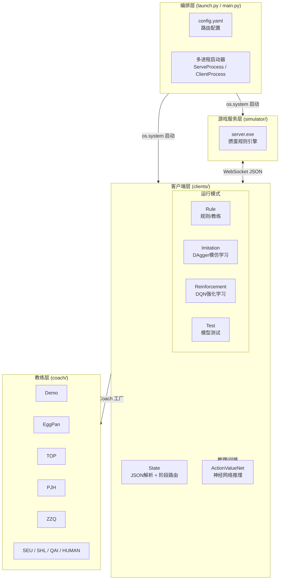
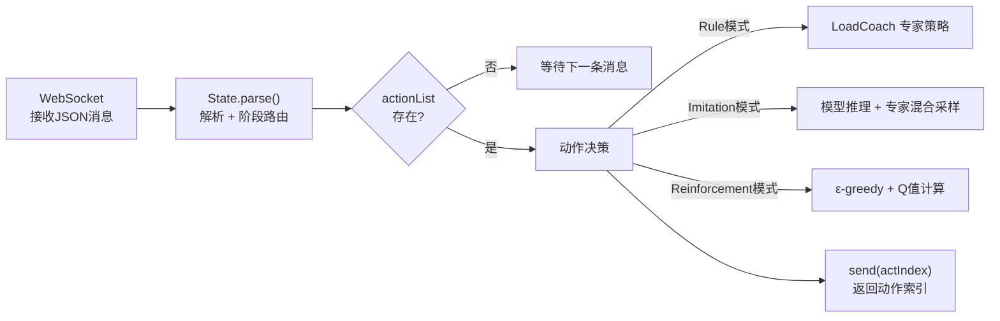
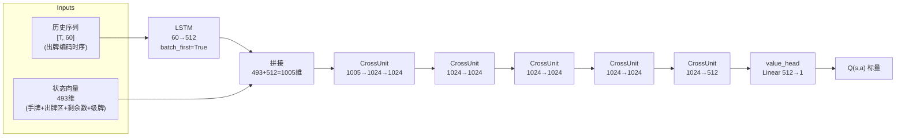
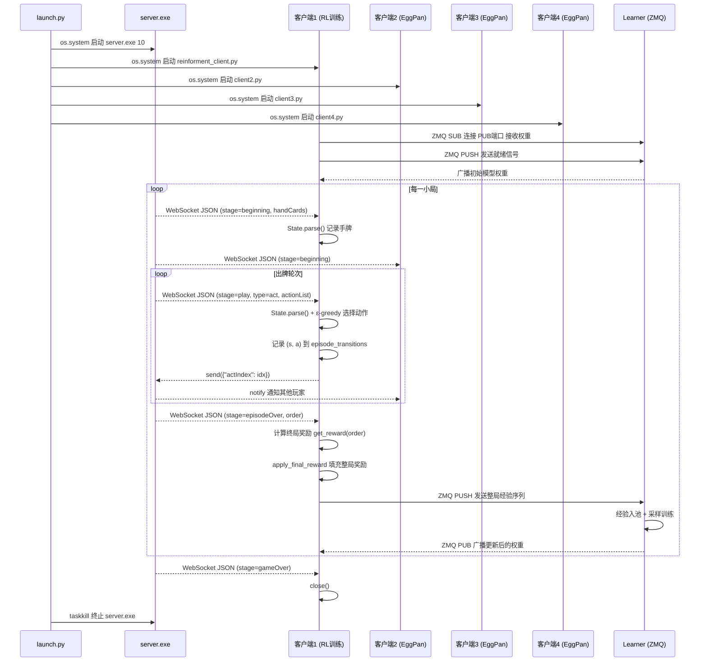

本文档从**零基础视角**出发，逐层拆解掼蛋AI系统的整体架构。你将理解：一个棋牌对局如何从服务端发起、经WebSocket通信传递到四个AI客户端、再由客户端完成决策后回传动作的全过程。阅读完本文档后，你将具备阅读任何模块源码的"全局地图"。

## 三层架构全景图

系统采用经典的**服务端-客户端-教练**三层设计，辅以**训练编排层**协调多进程生命周期。下图展示了各层之间的通信关系与数据流向：



**编排层**是入口，负责同时拉起1个服务端进程和4个客户端进程。**服务层**是黒盒掼蛋引擎，管理牌局规则与状态广播。**客户端层**通过WebSocket接收游戏状态，按运行模式调用**教练层**或神经网络完成决策。这种分层设计使游戏规则、AI策略、训练流程三者完全解耦。

Sources: [launch.py](launch/launch.py#L62-L188), [main.py](main.py#L1-L20)

## 核心目录结构速览

在深入了解架构之前，先认识每个目录的职责：

| 目录 | 职责 | 关键文件 |
|------|------|----------|
| `simulator/` | 掼蛋游戏服务器（黒盒二进制） | `windows/server.exe`、`ubuntu/server` |
| `clients/` | 四种运行模式的客户端入口与核心库 | `tcli.py`、`gene_client.py`、`state.py` |
| `coach/` | 9个注册在案的专家/规则智能体 | 每个子文件夹含 `client.py` + `action.py` |
| `actor_all/` | 分布式训练 Learner 及其多桌启动脚本 | `learner.py`、`learner_v2.py`、`start.py` |
| `launch/` | 多进程编排器与 YAML 配置 | `launch.py`、`config.yaml` |
| `model.py` | 神经网络架构定义 | `ActionValueNet`（含 LSTM + CrossUnit） |
| `util.py` | 牌型编码、状态嵌入、经验回放缓冲区 | `encode_card`、`StateCatEmbedding`、`MemoryBuffer` |
| `train.py` | CLI训练入口，修改 YAML 后透传至 launch.py | 命令行参数解析 + 配置联动 |

Sources: [config.yaml](launch/config.yaml#L1-L8), [coach/__init__.py](coach/__init__.py#L1-L26), [state.py](clients/state.py#L1-L79)

## 第一层：游戏服务端 — 掼蛋规则引擎

服务端是一个**预编译的黒盒可执行文件**（`simulator/windows/server.exe` 或 `simulator/ubuntu/server`），开发者无需关心其内部实现。它的核心职责是：

1. **管理牌局生命周期**：洗牌、发牌、进贡、抗贡、还贡、出牌、判定每小局胜负
2. **广播游戏状态**：通过 WebSocket 向四名玩家推送 JSON 格式的游戏消息
3. **接收并执行动作**：接收客户端返回的动作索引，验证合法性后更新牌面状态

启动服务端只需一条命令：`server.exe <端口号>`。端口号被约定为对局次数——例如 `server.exe 10` 表示进行10局游戏。

服务端按固定协议推送消息。每条 JSON 消息包含两个核心字段：`type`（`"notify"` 通知 或 `"act"` 动作请求）和 `stage`（`"beginning"`、`"play"`、`"tribute"`、`"anti-tribute"`、`"back"`、`"episodeOver"`、`"gameOver"`）。当 `type` 为 `"act"` 时，消息中会携带 `actionList`（当前可选动作列表）和 `indexRange`（有效索引范围），客户端必须从中选择一个索引返回。

Sources: [simulator README](simulator/README.md#L1-L52), [state.py](clients/state.py#L234-L327)

## 第二层：客户端 — WebSocket通信 + 状态解析 + 动作决策

四个客户端通过 WebSocket 分别连接到 `ws://127.0.0.1:<port>/game/client1` ~ `client4`。每个客户端的处理流程完全一致，可以用以下流程图概括：



### State 状态机：消息解析的核心

`State` 类是消息分发的核心路由器。它内部维护了一个 `(stage, type)` 到处理函数的映射表：

| stage | type=notify | type=act |
|-------|------------|----------|
| `beginning` | 记录初始手牌和座位 | — |
| `play` | 记录其他玩家的出牌 | **选择出牌动作** |
| `tribute` | 记录进贡结果 | **选择进贡牌** |
| `anti-tribute` | 记录抗贡信息 | — |
| `back` | 记录还贡结果 | **选择还贡牌** |
| `episodeOver` | 记录完牌次序 | — |
| `gameOver` | 记录最终胜负 | — |

`State.parse()` 方法接收字典消息后，将每个字段写入对应的实例属性（如 `self._myPos`、`self._actionList`），然后调用映射表中对应的处理函数。这种设计使游戏阶段逻辑高度内聚——每个 `notify_*` / `act_*` 方法只关心自己阶段的数据。

Sources: [state.py](clients/state.py#L7-L79), [state.py](clients/state.py#L84-L110)

### 三种运行模式对比

系统支持四种客户端运行模式，每种模式对应不同的决策逻辑和使用场景：

| 模式 | CLI入口 | 决策方式 | 是否学习 | 典型用途 |
|------|---------|----------|----------|----------|
| **Rule（规则）** | `tcli.py rule` | `LoadCoach` 调用专家策略 | 否 | 测试专家AI、作为陪练对手 |
| **Imitation（模仿学习）** | `gene_client.py imitation` | 专家概率衰减混合模型采样 | 是（在线DAgger） | 从专家策略蒸馏知识 |
| **Reinforcement（强化学习）** | `tcli.py reinforcement` | ε-greedy + Q网络推理 | 是（经验发送至Learner） | DQN自对弈训练 |
| **Test（测试）** | `gene_client.py test` | 纯模型推理（低ε） | 否 | 评估已训练模型强度 |

**Rule 模式**是最简路径：客户端收到消息 → `State.parse()` 解析 → `LoadCoach("EggPan")` 获取专家类 → 调用 `action.parse_AI()` 得到动作索引。

**Imitation 模式**的核心是 DAgger 算法：每一步以 `use_expert_prob` 的概率采用专家动作（由 EggPan 提供），以 `1-use_expert_prob` 的概率采用模型 softmax 采样动作。所有（状态，专家动作）对存入数据集，每 `dagger_interval` 局进行一次全量训练。专家概率 `use_expert_prob` 随训练进程以 `expert_decay` 速率衰减，最低不低于 `min_expert_prob`。

**Reinforcement 模式**采用 DQN 框架：ε-greedy 探索策略选择动作，每局结束后将整局 `(s, a, r, s', done)` 转移序列发送至远端 Learner 进行集中训练。客户端通过 ZMQ SUB 被动接收 Learner 广播的最新模型权重，实现"推理-发送-接收-更新"的闭环。

Sources: [tcli.py](clients/tcli.py#L1-L14), [gene_client.py](clients/gene_client.py#L1-L33), [gene_client.py](clients/gene_client.py#L78-L196)

## 第三层：教练系统 — 专家策略的插件化注册

`coach/` 目录采用**工厂模式 + 动态导入**实现专家策略的插件化管理。其注册机制极其简洁：

```python
# coach/__init__.py 核心逻辑
for folder in os.listdir("coach"):
    module = import_module(name=f"coach.{folder}.client")
    _REGISTER_CLIENT[folder] = module.Main
```

每个教练文件夹只需提供 `client.py`（定义 `Main` 类，继承 `WebSocketClient`）即可被自动发现。项目内置了 9 个教练：

| 教练名称 | 策略类型 | 特点 |
|----------|----------|------|
| `Demo` | 随机采样 | `randint(0, act_range)`，最简基准 |
| `EggPan` | 启发式权重 | 基于权重的出牌评估，本项目主力专家 |
| `TOP` | 完整规则引擎 | 牌型组合搜索 + 完整掼蛋规则 |
| `PJH` | 启发式 | 独立设计的评估函数 |
| `ZZQ` | 启发式 | 基于 Reyn 消息的评估 |
| `SEU` | 启发式 | 东南大学方案 |
| `SHL` | 启发式 | 独立策略 |
| `QAI` | 启发式 | 含 `mysolve.py` 求解器 |
| `HUMAN` | 人类交互 | GUI 界面供真人出牌 |

所有教练的 `Main` 类遵循统一接口：`__init__(url, render)` → `connect()` → `run_forever()`。内部通过 `received_message()` 接收 JSON → `State.parse()` 解析 → `Action.parse()` 决策 → `send(actIndex)` 返回动作。

Sources: [coach/__init__.py](coach/__init__.py#L1-L26), [Demo client](coach/Demo/client.py#L1-L29), [EggPan action](coach/EggPan/action.py#L1-L36)

## 神经网络：ActionValueNet 的核心设计

`model.py` 中定义的 `ActionValueNet` 是系统中唯一的神经网络模型。它的设计遵循 **状态-动作价值函数** Q(s, a) 的范式：



关键设计要点：

- **LSTM 历史建模**：出牌序列（每步编码为 4×15 的牌型矩阵，展平为 60 维）通过 LSTM 提取时序特征，取最后时间步的输出（512 维）与当前状态拼接
- **CrossUnit 残差块**：每个 CrossUnit 是 `Linear → ReLU → Linear` 再接残差连接的结构。当输入输出维度不一致时，通过额外的 `fc_3` 对齐。5 层堆叠实现深层特征变换
- **无激活输出的 value_head**：Q 值可正可负（奖励函数设计为对称的正负值），最后一层不加激活函数

状态编码的 493 维构成：手牌 `4×15=60` + 四个玩家出牌区 `4×60=240` + 四人剩余牌数 one-hot `4×30=120` + 当前级牌 one-hot `13` + 动作编码 `60` = 493 维。

Sources: [model.py](model.py#L1-L45), [util.py](util.py#L1-L88), [util.py](util.py#L89-L107)

## 完整对局流程：从启动到结束的一次生命周期

下面以**最典型的强化学习训练场景**（`train.py -m rl`）为例，展示一次完整对局中所有组件的交互时序：



关键时序说明：

1. **启动阶段**：`launch.py` 同时启动 5 个进程（1 服务端 + 4 客户端），`ServeProcess` 和 `ClientProcess` 均继承自 `multiprocessing.Process`
2. **连接阶段**：每个客户端通过 WebSocket 连接到服务端，服务端等待四名玩家全部就绪后开始发牌
3. **出牌循环**：服务端轮流向当前行动玩家发送 `type=act` 消息，该玩家必须在规定时间内返回动作索引；其他玩家收到 `type=notify` 消息获知场上动态
4. **终局结算**：当三名玩家出完手牌时，服务端发送 `episodeOver` 消息（含完牌次序 `order`），客户端据此计算奖励并触发训练
5. **游戏结束**：达到设定局数后服务端发送 `gameOver`，所有客户端关闭连接，`launch.py` 强制终止服务端进程

Sources: [launch.py](launch/launch.py#L62-L188), [reinforment_client.py](clients/reinforment_client.py#L58-L134), [tcli.py](clients/tcli.py#L107-L200)

## 两条训练路径：单机版与分布式版的架构差异

系统支持两种训练范式，它们在架构上有本质区别：

| 维度 | 单机训练（reinforment_client.py） | 分布式训练（tcli.py + learner.py） |
|------|-----------------------------------|-------------------------------------|
| **模型存储** | 客户端本地维护一份模型 | Learner 集中维护，广播至所有客户端 |
| **经验存储** | 客户端本地 MemoryBuffer | Learner 集中 Replay Buffer |
| **训练执行** | 客户端每局结束自行 train_step | Learner 独立训练线程持续采样 |
| **权重同步** | 无需同步 | ZMQ PUB-SUB 广播 |
| **经验传输** | 无需传输 | ZMQ PUSH-PULL 发送 |
| **扩展性** | 仅支持单桌 | 支持多桌并发（actor_all/start.py） |

**单机训练**的数据流：客户端本地收集 `(s, a, r, s')` → 存入 `MemoryBuffer` → 每局结束调用 `replay_memory.learn_from()` → 梯度更新本地模型 → 保存检查点。

**分布式训练**的数据流：客户端本地收集经验 → `pickle.dumps` 序列化 → ZMQ PUSH 发送至 Learner:5555 → Learner 的经验池累积 → Learner 训练线程采样训练 → Learner 通过 PUB 端口广播 `state_dict` → 所有客户端 SUB 线程接收并 `load_state_dict`。

分布式架构的核心优势在于：多个客户端可以**并行收集经验**，Learner 集中训练并统一分发权重，实现"数据并行"的训练加速。`actor_all/start.py` 甚至支持同时启动 4 张桌子（16 个客户端）向同一个 Learner 发送经验。

Sources: [reinforment_client.py](clients/reinforment_client.py#L136-L200), [tcli.py](clients/tcli.py#L56-L106), [learner.py](actor_all/learner.py#L200-L468), [start.py](actor_all/start.py#L1-L112)

## 通信协议全景

系统中存在三种通信协议，各自服务于不同的数据交换场景：

| 协议 | 端点 | 数据格式 | 方向 | 用途 |
|------|------|----------|------|------|
| **WebSocket** | `ws://host:port/game/clientN` | JSON 文本 | 双向 | 游戏状态同步 + 动作返回 |
| **ZMQ PUB-SUB** | `tcp://learner_host:10002` | pickle 二进制 | Learner → 客户端 | 模型权重广播 |
| **ZMQ PUSH-PULL** | `tcp://learner_host:5555` | pickle 二进制 | 客户端 → Learner | 经验数据上传 |
| **ZMQ PUSH-PULL** | `tcp://learner_host:5556` | 字符串 `b"ready"` | 客户端 → Learner | 就绪信号通知 |

**WebSocket 层**负责游戏逻辑——消息格式由服务端定义，客户端必须原样遵守。消息中的 `actionList` 采用特殊编码：`['PASS', 'PASS', 'PASS']` 表示过牌；`['Straight', 'T', ['ST', 'SJ', ...]]` 表示具体牌型（类型、等级、具体牌张列表）。

**ZMQ 层**负责训练逻辑——完全由 Python 端自定义。Learner 一侧使用 `bind`，客户端一侧使用 `connect`，Learner 必须先启动。PUB-SUB 模式中，Learner 发送权重时所有已连接的 SUB 客户端都能接收（支持"先启 Learner、后启客户端"）。

Sources: [simulator README](simulator/README.md#L20-L52), [tcli.py](clients/tcli.py#L56-L106), [learner.py](actor_all/learner.py#L120-L200)

## 阅读路线建议

恭喜你完成架构总览！根据你的具体需求，建议按以下路径深入阅读：

- **想快速跑起来**：继续阅读 [快速启动：一行命令运行AI对局](2-kuai-su-qi-dong-xing-ming-ling-yun-xing-aidui-ju)，然后阅读 [GUI启动器](5-guiqi-dong-qi-shi-yong-tu-xing-jie-mian-guan-li-duo-ke-hu-duan-dui-ju)
- **想理解训练原理**：从 [模仿学习原理](6-mo-fang-xue-xi-yuan-li-daggersuan-fa-yu-zhuan-jia-ce-lue-hun-he-cai-yang) 或 [DQN训练流程](9-dqnxun-lian-liu-cheng-jing-yan-hui-fang-tan-suo-ce-lue-yu-tdmu-biao-geng-xin) 开始
- **想理解神经网络**：直接跳转 [神经网络架构](12-shen-jing-wang-luo-jia-gou-actionvaluenetde-lstmli-shi-jian-mo-yu-crossunitcan-chai-wang-luo)
- **想理解专家策略**：阅读 [教练注册机制](16-jiao-lian-zhu-ce-ji-zhi-coachmo-kuai-de-dong-tai-dao-ru-yu-loadcoachgong-han-mo-shi) 和 [EggPan专家策略](17-eggpanzhuan-jia-ce-lue-ji-yu-quan-zhong-de-qi-fa-shi-chu-pai-jue-ce)
- **想深入分布式架构**：阅读 [launch.py多进程编排](20-launch-py-duo-jin-cheng-bian-pai-fu-wu-duan-yu-si-ke-hu-duan-bing-xing-qi-dong-yu-sheng-ming-zhou-qi-guan-li) 和 [分布式Learner设计](21-fen-bu-shi-learnershe-ji-zmq-pub-subquan-zhong-yan-bo-yu-jing-yan-shou-ji)
- **想知道状态机如何工作**：阅读 [状态机解析](22-zhuang-tai-ji-jie-xi-statelei-de-xiao-xi-fen-fa-yu-you-xi-jie-duan-zi-dong-lu-you)