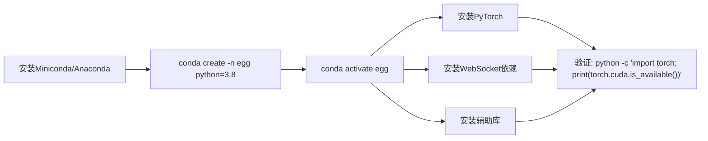
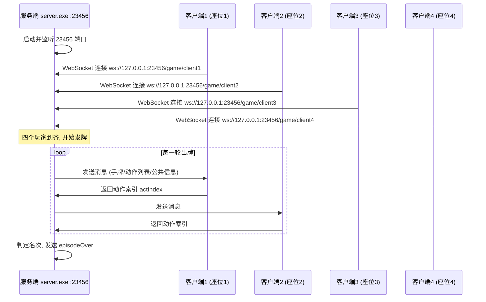

成功运行掼蛋AI系统的第一步，是确保开发环境正确配置。本页将从**Python依赖安装**、**模拟器服务端启动**和**GPU加速配置**三个维度，带你完成从零到可运行的环境搭建。完成本页后，你将能够顺利执行 `python -u train.py -r 5 --mode common` 这样的快速启动命令。

Sources: [README.md](README.md#L50-L52)

## Python 环境与 Conda 虚拟环境

项目开发者推荐使用 **Conda** 管理 Python 环境。GUI 启动器 `main.py` 中硬编码了名为 **`egg`** 的 Conda 环境作为首选 Python 解释器 —— 程序会依次搜索当前激活的 Conda 环境、`~/miniconda3/envs/egg`、`~/anaconda3/envs/egg` 和 `D:/conda_envs/egg`，因此我们强烈建议你创建一个名为 `egg` 的 Conda 环境来保持一致性。



Sources: [main.py](main.py#L100-L112)

### 核心依赖清单

项目没有提供 `requirements.txt` 文件，依赖关系分散在各模块的 import 语句中。以下是完整依赖汇总：

| 包名 | 用途 | 涉及模块 |
|---|---|---|
| **torch** (PyTorch) | 神经网络构建、GPU 张量运算、自动微分 | `model.py`、`util.py`、`gene_client.py`、`tcli.py` |
| **numpy** | 数值计算、概率采样 | `util.py`、`gene_client.py`、`tcli.py` |
| **ws4py** | WebSocket 客户端，与服务端通信 | 所有 `client*.py` 文件 |
| **PyYAML** | 解析 `launch/config.yaml` 配置文件 | `launch.py`、`train.py` |
| **colorama** | 终端彩色日志输出（红/绿/蓝/黄背景） | `launch.py`、`gene_client.py`、`util.py` |
| **pyzmq** | 分布式训练的 PUB-SUB 权重广播与 PUSH 经验收集 | `tcli.py` |
| **prettytable** | 训练配置表格式化打印 | `launch.py` |
| **tkinter** | GUI 启动器图形界面（Python 内置） | `main.py` |

Sources: [gene_client.py](clients/gene_client.py#L11-L23), [tcli.py](clients/tcli.py#L12-L19), [launch.py](launch/launch.py#L1-L8)

### 一键安装命令

在激活 `egg` 环境后，依次执行以下命令即可完成所有依赖安装：

```bash
# 1. PyTorch（根据你的CUDA版本选择，详见GPU配置章节）
pip install torch torchvision torchaudio --index-url https://download.pytorch.org/whl/cu118

# 2. WebSocket 客户端
pip install ws4py

# 3. 辅助库
pip install numpy pyyaml colorama pyzmq prettytable
```

> **注意**：`tkinter` 是 Python 标准库的一部分，通常随 Python 一起安装。如果缺失（Linux 最小化安装），可通过 `sudo apt install python3-tk` 补装。

Sources: [gene_client.py](clients/gene_client.py#L11-L23), [main.py](main.py#L8-L9)

## 模拟器服务端

掼蛋对局由一个**外部可执行程序**作为游戏服务端来驱动。服务端负责洗牌、发牌、判定出牌合法性、裁定每局名次等核心游戏逻辑，四个 AI 客户端通过 WebSocket 协议连接到服务端进行对局。

### 服务端文件位置

```
simulator/
├── windows/
│   └── server.exe        ← Windows 可执行文件
├── ubuntu/
│   └── server            ← Linux 可执行文件
├── clients/              ← 服务端自带的示例客户端
│   ├── client1.py
│   ├── client2.py
│   ├── client3.py
│   ├── client4.py
│   ├── action.py
│   └── state.py
├── README.md
└── 使用说明.pdf
```

Sources: [simulator](simulator/README.md#L1-L6)

### 服务端启动方式

服务端通过命令行启动，接受一个**端口号**作为参数。在项目中，端口号被**硬编码为 `23456`**，因此请确保该端口未被其他程序占用。

**Windows 下手动启动**：
```bash
.\simulator\windows\server.exe 23456
```

**Linux 下手动启动**（需先赋予执行权限）：
```bash
chmod +x ./simulator/ubuntu/server
./simulator/ubuntu/server 23456
```

Sources: [simulator/README.md](simulator/README.md#L3-L6), [launch/config.yaml](launch/config.yaml#L5), [launch/config_backup.yaml](launch/config_backup.yaml#L6)

### 自动化启动机制

实际上，你**不需要手动启动服务端**。`launch/launch.py` 通过多进程编排自动完成启动 —— `ServeProcess` 类将 `config.yaml` 中配置的服务端路径与游玩次数拼接为命令行并执行：

```python
class ServeProcess(Process):
    PLATFORM = "WINDOWS"
    def run(self) -> None:
        ret = os.system("{} {}".format(self.path, self.port))
```

配置文件 `launch/config.yaml` 中指定了服务端路径：

```yaml
服务启动端路径: .\simulator\windows\server.exe
游玩次数: 5
```

这意味着每次运行 `train.py` 或 `launch.py` 时，系统会自动启动服务端并以 `23456` 端口监听，等待四个客户端连接。对局结束后，`launch.py` 会通过 `taskkill /F /IM server.exe` 强制清理服务端进程。

Sources: [launch.py](launch/launch.py#L60-L80), [launch/config.yaml](launch/config.yaml#L5-L6)

### 服务端连接流程



每个客户端通过 WebSocket 连接到服务端的不同路径（`/game/client1` 到 `/game/client4`），服务端据此区分四个座位的玩家。

Sources: [simulator/clients/client1.py](simulator/clients/client1.py#L36-L40), [gene_client.py](gene_client.py#L58-L60)

### 端口占用问题排查

如果启动时遇到端口被占用，通常是上一次对局异常退出导致 `server.exe` 残留。解决方法：

| 方法 | 命令 | 说明 |
|---|---|---|
| 查找占用进程 | `netstat -ano \| findstr 23456` | 找到 PID 后通过任务管理器终止 |
| 强制终止 | `taskkill /F /IM server.exe` | 杀掉所有 server.exe 进程 |
| 程序自动清理 | 由 `launch.py` 自动执行 | 正常退出时自动调用 |

项目 README 中也特别提示：**请在看到绿色的进程销毁信息后再关闭终端**，否则残余进程会导致下一次启动端口占用。

Sources: [README.md](README.md#L59-L62), [launch.py](launch/launch.py#L182-L187)

## GPU 配置

神经网络模型的训练和推理涉及大量矩阵运算，GPU 加速可以显著缩短训练时间。本项目基于 PyTorch 框架，通过统一的 `--device` 参数控制运算设备。

### 设备选择机制

所有涉及张量运算的代码均通过 `.to(device)` 模式将数据迁移到目标设备。`device` 参数在命令行中以 `-d` 或 `--device` 指定，可选值为 `"cpu"` 或 `"cuda"`，默认值为 `"cpu"`。

在 `gene_client.py`（统一客户端入口）中，模型和数据按如下方式迁移：

```python
# 模型加载到指定设备
self.ValueNet = model_class().to(args.device)

# 推理时数据迁移
state = StateCatEmbedding(msg).to(self.args.device)
history = self.MapHistoryToLSTM().float().to(self.args.device)
```

在 `model.py` 中定义的 `ActionValueNet` 网络本身与设备无关 —— 它由标准的 `nn.Linear`、`nn.LSTM` 和 `CrossUnit` 残差块构成，通过 `.to(device)` 调用时 PyTorch 自动将所有权重参数复制到 GPU 显存。

Sources: [gene_client.py](gene_client.py#L120-L132), [model.py](model.py#L25-L45)

### GPU 使用场景对比

| 场景 | 是否推荐 GPU | 原因 |
|---|---|---|
| **模仿学习训练**（DAgger） | ✅ 强烈推荐 | 每局结束后在数据集上训练多个 epoch，涉及大量前向/反向传播 |
| **强化学习训练**（DQN） | ✅ 强烈推荐 | 每局结束后执行多批次 TD 目标更新，batch_size 可达 32768 |
| **分布式强化学习** | ✅ 强烈推荐 | Learner 端集中训练，客户端仅推理，GPU 可加速 Learner 的训练循环 |
| **推理/测试** | ⚠️ 可选 | 单步推理计算量小，CPU 也可胜任；若批量测试多模型建议使用 GPU |
| **规则引擎对局**（EggPan/TOP 等） | ❌ 不需要 | 基于启发式规则，不涉及神经网络 |

Sources: [gene_client.py](gene_client.py#L212-L245), [gene_client.py](gene_client.py#L307-L340), [tcli.py](tcli.py#L140-L175)

### GPU 配置步骤

**第一步：确认 CUDA 环境**

```bash
# 检查 NVIDIA 驱动
nvidia-smi

# 检查 CUDA 是否可用（在 Python 中）
python -c "import torch; print(torch.cuda.is_available())"
```

如果输出 `True`，说明 PyTorch 已正确识别 GPU。

**第二步：安装 CUDA 版 PyTorch**

根据你的 CUDA 版本选择对应安装命令。项目开发时使用的 PyTorch 版本兼容 CUDA 11.x：

```bash
# CUDA 11.8（推荐）
pip install torch torchvision torchaudio --index-url https://download.pytorch.org/whl/cu118

# CUDA 12.1
pip install torch torchvision torchaudio --index-url https://download.pytorch.org/whl/cu121
```

**第三步：启动时指定 GPU**

在 `train.py` 或 `launch.py` 中添加 `-d cuda` 参数：

```bash
# 模仿学习 + GPU
python -u train.py -r 100 --mode il --agent1 EggPan -d cuda

# 强化学习 + GPU
python -u train.py -r 500 --mode rl --agent1 EggPan -d cuda --save_interval 25
```

**第四步：验证 GPU 正在使用**

训练启动后，打开任务管理器（Windows）或执行 `nvidia-smi -l 1`（Linux），观察 `python` 进程的 GPU 显存占用。如果显存占用从 0 上升到数百 MB 至数 GB，说明 GPU 正在工作。

Sources: [train.py](train.py#L16-L19), [launch.py](launch/launch.py#L17-L20)

### 多 GPU 与显存管理

项目目前**不支持多 GPU 并行**（无 `DataParallel` 或 `DistributedDataParallel` 封装）。如果你的机器有多张 GPU，可以通过设置环境变量 `CUDA_VISIBLE_DEVICES` 指定使用哪一张：

```bash
# 仅使用第 0 号 GPU
set CUDA_VISIBLE_DEVICES=0
python -u train.py -r 100 --mode il -d cuda

# 仅使用第 1 号 GPU
set CUDA_VISIBLE_DEVICES=1
python -u train.py -r 100 --mode il -d cuda
```

对于**显存不足**的情况（特别是 batch_size 设置过大时），可以调小 `--batch_size` 参数（模仿学习默认 16，强化学习默认 128/32768）。训练日志中的 `value.log` 文件会记录当前设备信息，便于排查。

Sources: [gene_client.py](gene_client.py#L564-L576), [gene_client.py](gene_client.py#L543-L548)

## 环境验证清单

完成上述配置后，按以下步骤验证环境是否就绪：

| 序号 | 验证项 | 命令 | 预期结果 |
|---|---|---|---|
| 1 | Conda 环境 | `conda activate egg` | 终端前缀变为 `(egg)` |
| 2 | PyTorch 导入 | `python -c "import torch; print(torch.__version__)"` | 输出版本号（如 2.0.1） |
| 3 | CUDA 可用 | `python -c "import torch; print(torch.cuda.is_available())"` | `True`（GPU）或 `False`（CPU） |
| 4 | ws4py 导入 | `python -c "from ws4py.client.threadedclient import WebSocketClient"` | 无报错 |
| 5 | 服务端存在 | `dir .\simulator\windows\server.exe` | 文件存在 |
| 6 | 快速对局 | `python -u train.py -r 5 --mode common --agent1 EggPan --agent2 Demo --agent3 Demo --agent4 Demo` | 5 局对局完成，进程正常退出 |

如果全部通过，恭喜你 —— 环境配置完成！可以继续阅读 [快速启动：一行命令运行AI对局](2-kuai-su-qi-dong-xing-ming-ling-yun-xing-aidui-ju) 来深入了解对局流程，或直接跳转 [模仿学习原理：DAgger算法与专家策略混合采样](6-mo-fang-xue-xi-yuan-li-daggersuan-fa-yu-zhuan-jia-ce-lue-hun-he-cai-yang) 开始训练你的第一个 AI 模型。