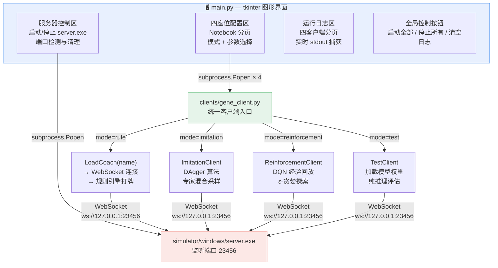
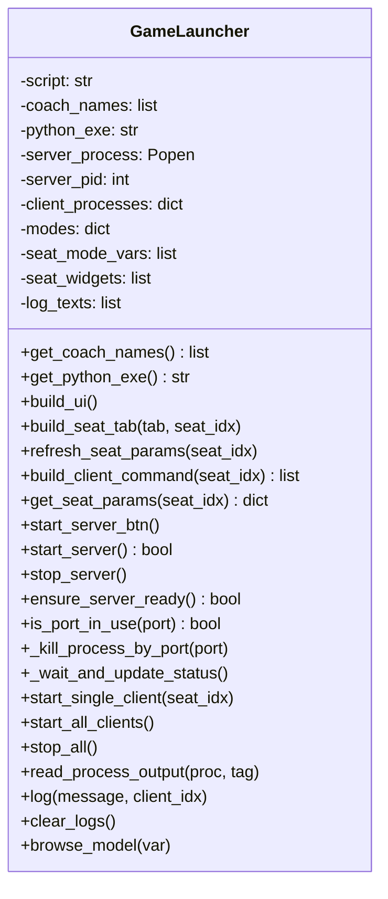
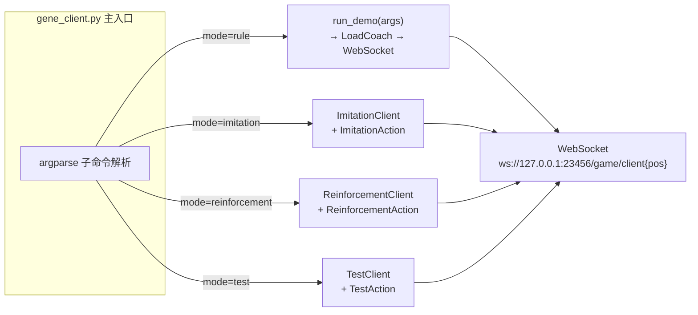
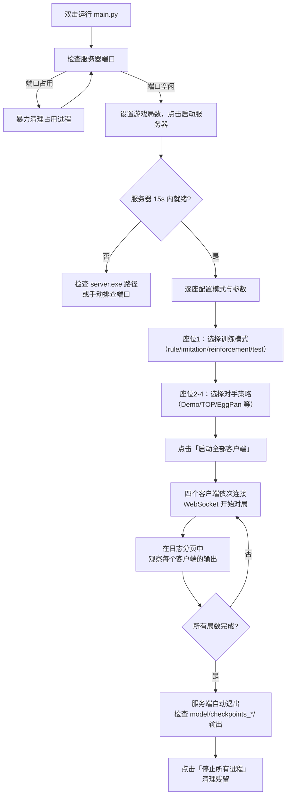

本文档介绍项目中的图形界面启动器（`main.py`），它是对原有命令行多进程编排器（`launch/launch.py`）的增强替代方案。通过 tkinter 构建的窗口界面，开发者可以直观地配置四名玩家的对局模式、教练策略和训练参数，一键启动服务端与四个客户端进程，并在分页日志区域实时监控每个客户端的运行输出。

在阅读本文前，建议先建立对项目整体流程的理解，可参考 [项目架构总览](3-xiang-mu-jia-gou-zong-lan-cong-fu-wu-duan-dao-ke-hu-duan-de-wan-zheng-dui-ju-liu-cheng)。本文后续将深入各个子系统的技术细节，特别是 [launch.py 多进程编排](20-launch-py-duo-jin-cheng-bian-pai-fu-wu-duan-yu-si-ke-hu-duan-bing-xing-qi-dong-yu-sheng-ming-zhou-qi-guan-li) 和 [tcli.py 统一客户端入口](23-ke-hu-duan-jing-jian-hua-tcli-pytong-ru-kou-yu-duo-mo-shi-lu-you)。

## 架构全景：GUI启动器在整个系统中的位置

在深入代码之前，先通过一张架构图理解 GUI 启动器与各组件之间的关系。启动器处于整个系统的「编排层」，其下方是模拟器服务端（`server.exe`）和统一客户端入口（`gene_client.py`），而客户端内部又按模式分为规则引擎、模仿学习和强化学习三条路径。



GUI 启动器本质上是一个**进程编排器**：它本身不参与游戏逻辑，而是通过 `subprocess.Popen` 启动五个独立子进程（1 个服务端 + 4 个客户端），并负责监控它们的生命周期。与早期命令行版本 `launch/launch.py` 使用的 `multiprocessing.Process` 不同，`main.py` 使用 `subprocess` 可以获得每个客户端进程的 `stdout` 管道，从而实现分页日志实时展示。

Sources: [main.py](main.py#L1-L28), [gene_client.py](clients/gene_client.py#L1-L35)

## 两种启动方式对比：GUI vs 命令行

项目提供了两套启动器，理解它们的差异有助于根据场景选择合适的工具。

| 维度 | `main.py`（GUI 启动器） | `launch/launch.py`（命令行启动器） |
|---|---|---|
| **界面形式** | tkinter 图形窗口 | 终端命令行 |
| **进程管理** | `subprocess.Popen`，支持 stdout 管道捕获 | `multiprocessing.Process`，无输出捕获 |
| **模式支持** | rule / imitation / reinforcement / test 四种 | il（模仿学习）/ rl（强化学习）两种 |
| **配置方式** | 图形界面逐座位置配置参数 | YAML 配置文件 + 命令行参数 |
| **日志查看** | 分客户端分页实时显示 | 各进程独立输出到终端，混杂显示 |
| **服务器管理** | 内置端口检测与 os.kill 暴力清理 | 依赖 taskkill 命令清理 |
| **教练注册校验** | 自动扫描 coach 目录并提供下拉列表 | 通过 LoadCoach 在启动时校验 |
| **适用场景** | 日常开发调试、快速实验 | 脚本化批处理、远程服务器训练 |

命令行启动器的设计在 [launch.py 多进程编排](20-launch-py-duo-jin-cheng-bian-pai-fu-wu-duan-yu-si-ke-hu-duan-bing-xing-qi-dong-yu-sheng-ming-zhou-qi-guan-li) 中有详细解读。GUI 启动器可以视为其交互式增强版本，核心改动在于用 `subprocess` 替代 `multiprocessing`，并引入了 `gene_client.py` 统一客户端入口来替代原先的 `client1.py` ~ `client4.py` 四份独立脚本。

Sources: [main.py](main.py#L1-L28), [launch/launch.py](launch/launch.py#L1-L57)

## 核心类设计：GameLauncher 的职责划分

GUI 启动器的全部逻辑封装在 `GameLauncher` 类中（约 500 行），其方法可按职责划分为四个层次：



### UI 构建层

`build_ui()` 方法组织整体布局：顶部是服务器控制区（状态标签、局数输入、启停按钮），中部是四座位配置的 Notebook 分页，底部是客户端日志的 Notebook 分页，最下方是全局控制按钮（启动全部、停止所有、清空日志）。每个座位的配置页由 `build_seat_tab()` 构建，内含模式下拉框和动态参数区域。

Sources: [main.py](main.py#L111-L164)

### 动态参数渲染

`refresh_seat_params()` 是 GUI 中最精巧的方法。当用户切换模式下拉框（rule / imitation / reinforcement / test）时，该方法会清空当前参数区域并根据模式定义（`self.modes` 字典）重新渲染所有参数控件。参数类型支持五种：

| 参数类型 | 控件 | 示例 |
|---|---|---|
| `coach` | Combobox 下拉选择 | 教练名称（自动扫描 coach 目录） |
| `bool` | Checkbutton 复选框 | 渲染画面开关 |
| `str` + `option` | Combobox 下拉选择 | 设备选择（cpu / cuda） |
| `str`（model 专用） | Entry + 浏览按钮 | 模型文件路径选择 |
| `str` / `float` / `int` | Entry 文本框 | 学习率、batch size 等数值参数 |

所有控件的值通过 `.var` 属性（`StringVar`、`BooleanVar` 等 tkinter 变量）存储在 `self.seat_widgets[seat_idx]` 字典中，供后续命令构建时统一提取。

Sources: [main.py](main.py#L166-L238)

### 服务器管理层

服务器管理涉及三个关键操作。**启动**：`start_server_btn()` 先调用 `is_port_in_use()` 检查端口 23456 是否被占用，若占用则暴力清理后重试，确认端口空闲后调用 `start_server()` 启动 `server.exe`，并启动后台线程轮询端口直到连接成功或超时。**状态轮询**：`_wait_and_update_status()` 每 0.5 秒尝试通过 `socket.create_connection` 连接 127.0.0.1:23456，最多等待 15 秒，成功后更新状态为「运行中」。**停止**：`stop_server()` 调用 `_kill_process_by_port()`，该方法使用 `netstat -ano` 查找占用端口的 PID，然后调用 `os.kill(pid, signal.SIGTERM)` 强制终止。

Sources: [main.py](main.py#L305-L398)

### 客户端管理层

客户端的启动命令由 `build_client_command()` 拼接而成，格式为：

```
<python_exe> clients/gene_client.py <mode> <座位号> --参数1 值1 --参数2 值2 ...
```

例如，座位 1 选择 imitation 模式时，实际执行的命令类似：

```
D:/conda_envs/egg/python.exe clients/gene_client.py imitation 1 --render --lr 1e-4 --device cuda --dagger_epochs 3 ...
```

`start_single_client()` 通过 `subprocess.Popen` 启动进程，指定 `stdout=subprocess.PIPE` 和 `encoding='utf-8'`，然后启动守护线程 `read_process_output()` 持续读取 stdout 并写入对应日志页。`start_all_clients()` 则依次调用四次 `start_single_client()`，每次间隔 0.5 秒以避免连接风暴。

Sources: [main.py](main.py#L240-L302), [main.py](main.py#L429-L479)

## 统一客户端入口：gene_client.py

GUI 启动器不再使用 `client1.py` ~ `client4.py` 四个独立脚本，而是统一通过 `gene_client.py` 启动客户端。这是一个用 `argparse` 子命令实现的**多模式路由**架构。



四种模式的参数定义与 GUI 启动器中的 `self.modes` 字典完全对应：

| 模式 | 客户端类 | 核心动作类 | 训练/推理逻辑 |
|---|---|---|---|
| `rule` | 无（函数式） | LoadCoach 动态导入 | 教练注册机制决定的规则引擎 |
| `imitation` | `ImitationClient` | `ImitationAction` | DAgger：专家概率衰减 + 数据集训练 |
| `reinforcement` | `ReinforcementClient` | `ReinforcementAction` | DQN：经验回放 + ε-贪婪 + 目标网络 |
| `test` | `TestClient` | `TestAction` | 纯推理：加载模型权重，argmax 出牌 |

每个客户端启动时，会创建专属的检查点输出目录（格式为 `model/checkpoints_<时间戳>_<模式>/`），并写入 `value.log` 记录训练参数与过程指标。这一约定与 [检查点文件结构](27-jian-cha-dian-wen-jian-jie-gou-mo-xing-can-shu-jiao-lian-ming-cheng-yu-wang-luo-lei-de-xu-lie-hua-yue-ding) 中描述的标准一致。

Sources: [gene_client.py](clients/gene_client.py#L569-L632)

## 使用流程：从启动到对局完成

下面通过一张流程图展示使用 GUI 启动器完成一次典型对局的完整操作步骤。



### 典型配置示例

以下是一个模仿学习实验的典型配置：

| 座位 | 模式 | 关键参数 | 说明 |
|---|---|---|---|
| 座位 1 | imitation | model=预训练权重, lr=1e-4, device=cuda | 训练中的 AI，由 EggPan 专家引导 |
| 座位 2 | rule | client=TOP | 队友：TOP 规则引擎 |
| 座位 3 | rule | client=EggPan | 对手 1：EggPan 专家策略 |
| 座位 4 | rule | client=Demo | 对手 2：Demo 基准策略 |

在这种配置下，座位 1 的客户端会运行 DAgger 算法：每局以逐渐衰减的概率（`expert_decay=0.995`）向 EggPan 专家请教，同时将状态-动作对收集到数据集中，每 `dagger_interval=5` 局进行一次全量训练。

Sources: [main.py](main.py#L47-L58), [gene_client.py](clients/gene_client.py#L79-L237)

## Python 解释器自动检测

`get_python_exe()` 方法实现了一个实用的环境自适应逻辑。它首先检查是否在 conda 环境 `egg` 中，若是则使用该环境下的 Python 解释器；否则按优先级遍历预定义的候选路径列表。这一设计解决了 Windows 下多 Python 环境共存的常见痛点——避免因 PATH 中的 `python` 指向错误环境而导致 `import torch` 失败。

```python
# 检测优先级：
# 1. CONDA_PREFIX 环境变量（当前激活的 conda 环境）
# 2. 预设路径列表（~/miniconda3/envs/egg/ → ~/anaconda3/envs/egg/ → D:/conda_envs/egg/）
# 3. sys.prefix（当前运行 Python 的前缀路径）
# 4. sys.executable（最终回退）
```

Sources: [main.py](main.py#L95-L109)

## 端口管理：暴力清理机制

GUI 启动器最显著的技术特性之一是端口占用的自动检测与清理。在启动服务器前，`is_port_in_use()` 执行 `netstat -ano | findstr :23456` 并检查输出中是否包含 `LISTENING`。若端口被占用，`_kill_process_by_port()` 会提取占用进程的 PID，调用 `os.kill(pid, signal.SIGTERM)` 终止进程，等待 1 秒后再次检查。这种「暴力清理」设计避免了开发者手动打开任务管理器查找占用进程的繁琐操作。

需要注意的是，`os.kill` 在 Windows 上的行为与 Unix 不同——Windows 的 `SIGTERM` 会调用 `TerminateProcess`，这是一个强制终止，而非优雅退出。因此，该机制仅适用于开发调试场景，不应在生产环境中对关键进程使用。

Sources: [main.py](main.py#L295-L398)

## 小结与阅读指引

GUI 启动器是项目的「驾驶舱」——它将原本分散在命令行参数和 YAML 配置中的启动逻辑整合到一个可视化的操作面板中，大幅降低了多客户端对局的编排成本。其核心价值在于：

1. **模式可视化**：四座位的模式与参数一目了然，避免命令行拼写错误
2. **日志分页**：四个客户端的输出独立显示，调试时不再被混杂的终端输出困扰
3. **端口自愈**：自动检测并清理 23456 端口占用，消除最常见的启动失败原因
4. **环境自适应**：智能检测 conda 环境中的 Python 解释器路径

理解启动器后，建议按以下路径深入阅读：

- **客户端内部逻辑**：了解客户端如何连接服务端并做出决策 → [状态机解析：State类的消息分发与游戏阶段自动路由](22-zhuang-tai-ji-jie-xi-statelei-de-xiao-xi-fen-fa-yu-you-xi-jie-duan-zi-dong-lu-you)
- **教练策略配置**：了解各教练引擎的决策机制 → [教练注册机制](16-jiao-lian-zhu-ce-ji-zhi-coachmo-kuai-de-dong-tai-dao-ru-yu-loadcoachgong-han-mo-shi)
- **训练模式深入**：
  - 模仿学习 → [模仿学习原理：DAgger算法与专家策略混合采样](6-mo-fang-xue-xi-yuan-li-daggersuan-fa-yu-zhuan-jia-ce-lue-hun-he-cai-yang)
  - 强化学习 → [DQN训练流程](9-dqnxun-lian-liu-cheng-jing-yan-hui-fang-tan-suo-ce-lue-yu-tdmu-biao-geng-xin)
- **命令行替代方案** → [launch.py 多进程编排](20-launch-py-duo-jin-cheng-bian-pai-fu-wu-duan-yu-si-ke-hu-duan-bing-xing-qi-dong-yu-sheng-ming-zhou-qi-guan-li)