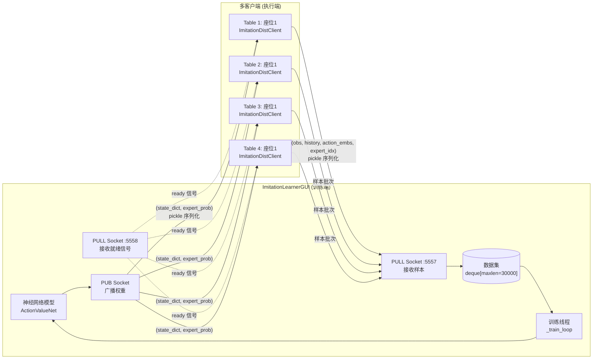
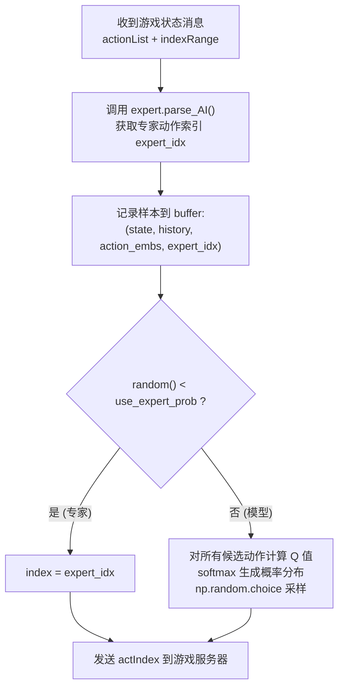
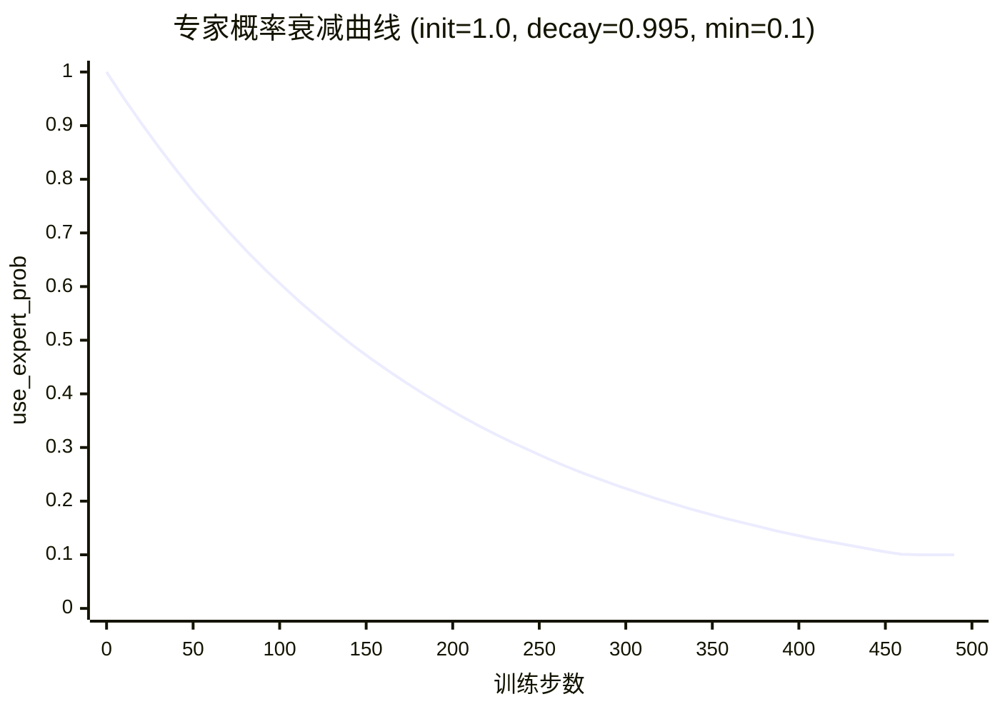
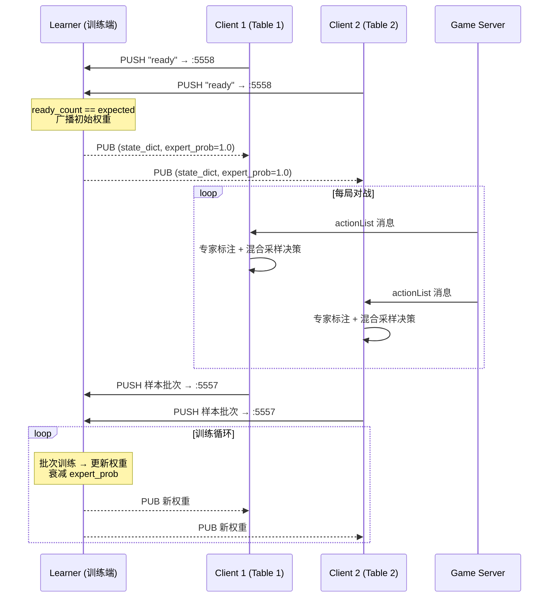

本文档从算法原理与工程实现两个维度解析项目中的模仿学习系统，涵盖DAgger（Dataset Aggregation）算法的核心思想、分布式权重广播机制、专家策略混合采样的衰减调度，以及新旧两版实现之间的架构演进路径。阅读本文档后，你将理解系统如何从零开始——仅依赖专家规则引擎——逐步训练出一个具备独立决策能力的神经网络。

## DAgger算法：从行为克隆到在线纠错

传统行为克隆（Behavioral Cloning, BC）存在一个根本性问题：**协变量偏移（Covariate Shift）**。模型仅在专家轨迹上训练，一旦推理时犯错进入未见过的状态，误差会随时间累积，导致性能雪崩式下滑。DAgger通过将"在线交互"引入模仿学习来解决这一困境：每轮迭代中，让当前策略与环境交互，收集其自身访问到的状态，再交由专家为这些状态标注正确动作。随着训练推进，数据集中的状态逐渐从"纯专家分布"过渡到"策略分布"，模型便学会了从自己的错误中恢复。

本项目的分布式DAgger实现将这一范式映射到掼蛋游戏的四人对局场景中，由两个核心组件协同完成：**Learner（训练端）**与**客户端（执行端）**。



Sources: [imitation_learner.py](actor_all/imitation_learner.py#L1-L12)

Learner端是一个带GUI的Tkinter应用程序，绑定三个ZMQ端口：PUB端口（默认10003）向外广播模型权重和当前专家概率，PULL端口5557从各客户端收集专家标注的样本，PULL端口5558接收客户端就绪信号。当全部预期客户端就绪后，Learner广播初始权重，训练线程随即在独立线程中持续进行。

Sources: [imitation_learner.py](actor_all/imitation_learner.py#L277-L283)

## 专家策略混合采样：探索与模仿的平衡

DAgger的精髓在于策略混合——让专家持续为当前策略访问到的状态提供"正确答案"。本系统通过一个介于0和1之间的概率参数 `use_expert_prob` 控制每步决策的来源：

```
以概率 use_expert_prob  → 采用专家动作（标注数据）
以概率 1-use_expert_prob → 采用模型softmax采样动作（探索新状态）
```



Sources: [tcli_imitation.py](clients/tcli_imitation.py#L111-L132)

**为什么使用softmax采样而非argmax？** 纯粹取最大Q值动作（argmax）会导致策略过早收敛到确定性行为，失去探索能力。softmax温度化采样保留了低概率动作的被选机会，使模型能在专家未覆盖的状态分支中积累样本，这正是DAgger优于传统行为克隆的关键所在。

Sources: [tcli_imitation.py](clients/tcli_imitation.py#L90-L99)

### 专家概率衰减调度

`use_expert_prob` 不是固定值，而是从初始值按训练步数逐步衰减：

| 参数 | 默认值 | 含义 |
|---|---|---|
| `expert_init` | 1.0 | 初始专家概率——训练初期完全跟随专家 |
| `expert_decay` | 0.995 | 每次训练后乘以该衰减因子 |
| `min_expert_prob` | 0.1 | 专家概率的下限——最终保留10%的专家干预 |



衰减在每次训练步骤后触发：

```python
self.current_expert_prob = max(
    self.min_expert_prob_val,
    self.current_expert_prob * self.expert_decay_val
)
```

Sources: [imitation_learner.py](actor_all/imitation_learner.py#L341-L344)

这意味着训练初期模型几乎完全依赖专家策略提供正确示范，随着训练推进，模型逐渐接管决策，但仍保留最低限度的专家引导以确保稳定性。专家概率的当前值会随权重一同广播给所有客户端，保证所有对局桌使用一致的混合比例。

## 分布式训练循环：从样本收集到梯度更新

### 客户端样本收集

每个 `ImitationDistClient` 维护一个 `ImitationAction` 实例，它在每局对战的每一步执行以下操作：

1. **获取专家标注**：调用 `expert.parse_AI(msg, pos, state)` 获取专家认为最优的动作索引。专家可以是EggPan、TOP或其他任何实现 `parse_AI` 接口的教练模块。

2. **记录训练样本**：将当前状态嵌入（`StateCatEmbedding`）、历史序列（LSTM输入）、所有候选动作的嵌入列表，以及专家动作索引存入 `buffer`。

3. **混合决策**：按当前 `use_expert_prob` 概率选择执行专家动作或模型采样动作。

4. **局末上报**：当收到 `episodeOver` 消息时，通过ZMQ PUSH socket将整局所有样本序列化为pickle格式发送给Learner。

Sources: [tcli_imitation.py](clients/tcli_imitation.py#L111-L155)

### Learner端向量化训练

Learner的训练线程（`_train_loop`）以持续轮询方式运行。数据集用 `deque(maxlen=30000)` 实现，新样本自动挤掉旧样本，保持分布的新鲜度。每次训练步骤执行**完整的向量化交叉熵计算**：

```python
# 对批次中每个样本：
# 1. 将所有候选动作嵌入堆叠为 [num_actions, emb_dim]
# 2. 将状态和LSTM历史复制num_actions份
# 3. 拼接后送入网络，得到 [num_actions] 的 Q 值向量
# 4. 对 Q 值做 softmax，与专家索引做交叉熵损失
loss = torch.nn.functional.cross_entropy(
    qs.unsqueeze(0),                          # [1, num_actions]
    torch.tensor([expert_idx], device=device) # [1]
)
```

Sources: [imitation_learner.py](actor_all/imitation_learner.py#L418-L427)

这个设计的巧妙之处在于：单个样本构造一个完整的分类任务——模型需要从所有候选动作中识别出专家选择的那个。Q值经过softmax后直接解释为"该动作是专家动作的概率"，交叉熵损失激励模型在所有状态下都与专家判断对齐。

训练同步应用了梯度裁剪（`clip_grad_norm_(max_norm=1.0)`）以防止LSTM的循环结构在长序列上产生梯度爆炸。

Sources: [imitation_learner.py](actor_all/imitation_learner.py#L433)

### 权重广播与同步

每5次训练步骤，Learner通过PUB socket广播一次最新权重（含专家概率）。客户端在独立线程中通过SUB socket持续监听，收到后调用 `load_weights` 进行热更新。这种"训练-广播-热加载"的松耦合架构天然支持多桌并行：4个客户端各占一桌的座位1（其余3个座位由TOP规则引擎填充），同时向一个Learner输送样本。



Sources: [start_imitation.py](actor_all/start_imitation.py#L36-L54)

## 两版实现对比：从单机DAgger到分布式DAgger

项目经历了从单进程DAgger到分布式DAgger的架构演进，理解两者的差异有助于把握设计决策的动机。

| 维度 | 旧版 imitation_client.py | 新版 tcli_imitation.py + imitation_learner.py |
|---|---|---|
| **训练位置** | 客户端内部，每局结束后本地训练 | Learner端集中训练，客户端仅收集样本 |
| **数据汇聚** | 每个客户端独立数据集，无共享 | 所有客户端样本汇聚到Learner的统一数据集 |
| **训练时机** | 每N局（`dagger_interval`）全量重训练 | 持续增量训练，样本即收即训 |
| **权重同步** | 无需同步（各客户端独立） | ZMQ PUB-SUB实时广播 |
| **专家概率衰减** | 每局结束衰减（`per episode`） | 每次训练步骤衰减（`per step`） |
| **损失函数** | 负对数似然 `-log(probs[expert_idx])` | 交叉熵 `cross_entropy(qs, expert_idx)` |
| **并行能力** | 单进程，无法多桌并行 | 支持多桌（默认4桌）并行采样 |
| **梯度裁剪** | 有（`clip_grad_norm_`） | 有（`clip_grad_norm_`） |

旧版的训练发生在客户端内部——在 `train_from_dataset` 方法中对积累的全部样本进行多epoch训练，每次训练后衰减专家概率。这种设计的优势在于简单直接，缺点是各客户端学到的策略彼此独立，数据效率低。

Sources: [imitation_client.py](clients/imitation_client.py#L740-L795)

新版通过ZMQ PUB-SUB架构将"样本收集"和"策略训练"解耦，实现了真正的分布式DAgger：Learner看到的是所有对局桌汇聚的全局数据分布，模型更新后即时推送给所有客户端，形成"中央训练—边缘执行"的高效闭环。

## 启动流程：从命令行到多进程编排

### 训练入口

用户通过 `train.py` 以 `--mode il` 参数触发模仿学习模式：

```bash
python train.py -m il -d cuda --agent1 EggPan --agent2 TOP --agent3 TOP --agent4 TOP
```

`train.py` 负责两件事：修改 `launch/config.yaml` 将1号玩家的客户端脚本指向 `imitation_client.py`（旧版）或直接启动Learner GUI（新版通过 `start_imitation.py` 编排）。

Sources: [train.py](train.py#L101-L103)

### 分布式启动编排

新版通过 `start_imitation.py` 脚本同时启动4张对局桌，每桌包含1个模仿学习客户端（座位1）和3个TOP规则客户端（座位2~4）：

```python
# 4张桌 × 1个ImitationDist + 3个TOP = 共16个进程
TABLES = [23456, 23457, 23458, 23459]

# 模仿学习客户端：tcli_imitation.py imitation_dist 1
# 规则客户端：tcli.py rule {seat} -c TOP
```

Sources: [start_imitation.py](actor_all/start_imitation.py#L65-L84)

Learner GUI（`actor_all/imitation_learner.py`）需要用户在启动客户端之前手动运行，点击"启动 Learner"按钮后开始监听客户端就绪信号。

## 与后续系统的衔接

理解模仿学习系统后，建议按以下路径继续深入：

- **[train.py 训练入口：命令行参数与YAML配置联动](7-train-py-xun-lian-ru-kou-ming-ling-xing-can-shu-yu-yamlpei-zhi-lian-dong)**：了解训练脚本如何编排不同模式的启动流程。
- **[分布式DAgger：Learner广播权重 + 客户端收集专家样本](8-fen-bu-shi-dagger-learneryan-bo-quan-zhong-ke-hu-duan-shou-ji-zhuan-jia-yang-ben)**：深入分布式架构的传输协议与线程模型细节。
- **[神经网络架构：ActionValueNet的LSTM历史建模与CrossUnit残差网络](12-shen-jing-wang-luo-jia-gou-actionvaluenetde-lstmli-shi-jian-mo-yu-crossunitcan-chai-wang-luo)**：理解模仿学习所训练的神经网络内部结构。
- **[状态编码设计：手牌、出牌区、剩余牌数与级牌的多维嵌入](13-zhuang-tai-bian-ma-she-ji-shou-pai-chu-pai-qu-sheng-yu-pai-shu-yu-ji-pai-de-duo-wei-qian-ru)**：弄清 `StateCatEmbedding` 和 `ActionEmbedding` 的具体编码方式。
- **[强化学习训练流程](9-dqnxun-lian-liu-cheng-jing-yan-hui-fang-tan-suo-ce-lue-yu-tdmu-biao-geng-xin)**：模仿学习训练好的模型可作为强化学习的初始策略，实现从IL到RL的平滑过渡。