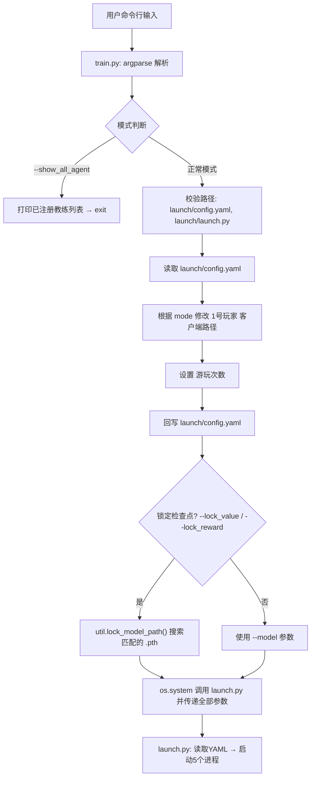
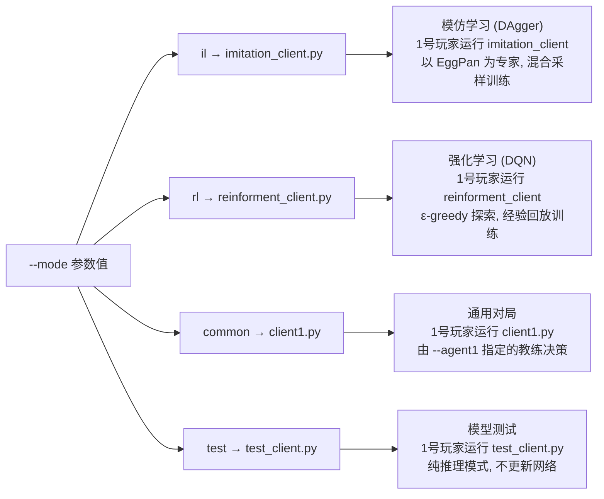
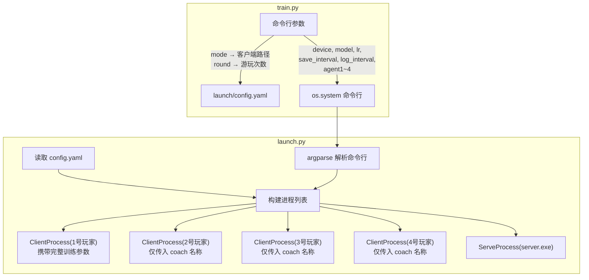
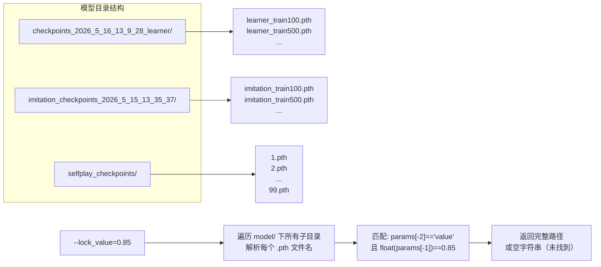

`train.py` 是整个掼蛋AI训练系统的**顶层调度入口**。它不直接执行训练逻辑，而是扮演"配置翻译官"的角色——解析命令行参数，将其注入 `launch/config.yaml`，最后通过 `os.system()` 将控制权委托给 `launch.py` 进行多进程编排。这种设计实现了用户接口（命令行）与底层调度（YAML + 多进程）的解耦，让同一个训练脚本可以通过简单的参数切换覆盖**模仿学习、强化学习、通用对局、模型测试**四种运行模式。

## 双层架构：train.py → launch.py 的委托链

整个训练启动流程采用**两阶段委托架构**。第一阶段在 `train.py` 中完成参数的收集、校验与YAML回写；第二阶段由 `launch.py` 接管，读取被修改后的YAML配置，启动服务端进程与四个客户端进程。



用户面向的始终是 `train.py` 的命令行接口，而 `launch.py` 则作为被调方完全由程序驱动。这种分层使得 `launch.py` 也可以被其他脚本（如 `actor_all/start.py`）直接调用，保持架构的灵活性。

Sources: [train.py](train.py#L79-L141), [launch/launch.py](launch/launch.py#L130-L188)

## 命令行参数全览

`train.py` 通过 Python 标准库 `argparse` 定义了 **14 个命令行参数**，覆盖训练模式、设备选择、超参数、断点续训、对手配置和调试辅助。

| 参数 | 简写 | 类型 | 默认值 | 作用 |
|---|---|---|---|---|
| `--device` | `-d` | str | `"cpu"` | 运算设备：`cpu` 或 `cuda` |
| `--mode` | `-m` | str | `"il"` | 训练模式：`il` / `rl` / `common` / `test` |
| `--round` | `-r` | int | `-1`（即10局） | 对局次数，负值时取默认10局 |
| `--model` | — | str | `None` | 已有模型 `.pth` 路径，用于持久化训练 |
| `--lr` | — | float | `1e-4` | 学习率 |
| `--save_interval` | — | int | `1000` | 模型保存频率（局） |
| `--log_interval` | — | int | `100` | 训练日志输出频率（局） |
| `--agent1` | — | str | `"EggPan"` | 1号玩家教练名称 |
| `--agent2` | — | str | `"Demo"` | 2号玩家教练名称 |
| `--agent3` | — | str | `"Demo"` | 3号玩家教练名称 |
| `--agent4` | — | str | `"Demo"` | 4号玩家教练名称 |
| `--epsilon` | — | float | `0.1` | ε-greedy 探索概率 |
| `--gamma` | — | float | `0.98` | 强化学习折扣因子 |
| `--lock_value` | — | float | `None` | 按 value 值自动搜索检查点 |
| `--lock_reward` | — | float | `None` | 按 reward 值自动搜索检查点 |
| `--show_all_agent` | — | str | `""` | 传入任意非空字符串展示已注册教练列表后退出 |

值得注意的是，`--agent1` 的默认值是 `"EggPan"`——这意味着**1号玩家默认使用 EggPan 专家策略**，它是模仿学习中提供专家动作的教练，同时也是强化学习中的基准对手。而 `--agent2` 到 `--agent4` 默认使用 `"Demo"`（随机采样），体现了训练阶段将计算资源集中于一桌中的一位玩家的设计哲学。

Sources: [train.py](train.py#L11-L78)

## launch/config.yaml：可编程的进程蓝图

`launch/config.yaml` 是 `train.py` 和 `launch.py` 之间的**数据契约**。`train.py` 负责写入，`launch.py` 负责读取。它的结构直观地映射到最终运行的进程拓扑。

| YAML键 | 示例值 | 含义 |
|---|---|---|
| `1号玩家` | `.\\clients\\imitation_client.py` | 1号位客户端脚本（被 train.py 动态覆盖） |
| `2号玩家` | `.\\clients\\client2.py` | 2号位客户端脚本 |
| `3号玩家` | `.\\clients\\client3.py` | 3号位客户端脚本 |
| `4号玩家` | `.\\clients\\client4.py` | 4号位客户端脚本 |
| `服务启动端路径` | `.\\simulator\\windows\\server.exe` | 游戏模拟器服务端可执行文件 |
| `渲染列表` | `[]` | 需要渲染调试信息的玩家索引（0~3） |
| `游玩次数` | `5` | 服务端接收的对局次数（被 train.py 动态覆盖） |

原始的 `config.yaml` 保留的是普通对局配置（`client1.py`~`client4.py`），这也是 `common` 模式的直接使用状态。当执行 `il`、`rl` 或 `test` 模式时，`train.py` 会将 `1号玩家` 替换为对应的训练客户端脚本，从而将普通对局升级为训练对局。

配置文件还有一个备份版本 `launch/config_backup.yaml`，包含了更详细的注释说明（如路径分隔符的平台差异、渲染列表的使用方式），可作为配置参考。

Sources: [launch/config.yaml](launch/config.yaml#L1-L7), [launch/config_backup.yaml](launch/config_backup.yaml#L1-L19)

## 模式路由：mode 参数如何决定训练策略

`--mode` 是 `train.py` 中**最关键的分支参数**，它通过修改 `config_dict["1号玩家"]` 来切换整个系统的行为模式。



四种模式的本质区别体现在1号玩家客户端的行为：

- **`il` 模仿学习**：`imitation_client.py` 内部维护一个 DAgger 训练循环，以 EggPan 专家策略为参考做出决策，同时将专家动作与模型动作按概率混合采样，收集到的状态-动作对用于后续的监督学习更新。此模式下模型通过**行为克隆**逐步逼近专家水平。
- **`rl` 强化学习**：`reinforment_client.py` 使用 DQN 算法，通过 ε-greedy 策略平衡探索与利用，将每局游戏的经验（状态转移四元组）存入经验回放缓冲区，定期采样进行 TD 目标更新。
- **`common` 通用对局**：`client1.py` 是最简客户端，它加载 `--agent1` 指定的教练类（默认 EggPan）进行纯推理，不涉及任何神经网络训练。
- **`test` 模型测试**：`test_client.py` 以纯推理模式运行，**必须指定模型路径**（否则报错退出），仅评估模型表现而不更新参数。

Sources: [train.py](train.py#L106-L116), [clients/imitation_client.py](clients/imitation_client.py#L1-L30), [clients/reinforment_client.py](clients/reinforment_client.py#L1-L30), [clients/test_client.py](clients/test_client.py#L1-L30), [clients/client1.py](clients/client1.py#L1-L38)

## 参数流转：CLI → YAML → launch.py 的三阶段传递

参数在系统中的传递并非简单的透传，而是经历了**三次过滤与转换**。

**第一阶段：train.py 内部的 YAML 写入。** 仅有 `mode`（转化为客户端路径）和 `round`（转化为游玩次数）两个参数会写入 YAML 文件。`agent2`~`agent4` 的路径会被校验是否存在（通过 `check_path`），但不会修改。

**第二阶段：train.py → launch.py 的命令行转发。** 在 `os.system()` 调用中，共有 7 个参数被拼接为命令行字符串传递给 `launch.py`：`device`、`model`、`lr`、`save_interval`、`log_interval`、`agent1`、`agent2`、`agent3`、`agent4`。注意 `epsilon` 和 `gamma` **未被转发**。

**第三阶段：launch.py 的进程分发。** `launch.py` 在构建 `ClientProcess` 时，会将训练相关参数（`lr`、`save_interval`、`log_interval`、`device`、`model`）**仅注入到 1 号玩家的 `ClientProcess`** 中，因为 `trainee_args` 字典只被传递给 `ClientProcess(config["1号玩家"], ...)`。2~4 号玩家只接收 `client` 参数（即教练名称），不参与训练。



这种设计确保了**只有1号玩家（训练目标）会初始化神经网络、维护优化器、执行梯度更新**，而其他三位玩家仅作为环境的一部分提供对手行为。

Sources: [train.py](train.py#L94-L141), [launch/launch.py](launch/launch.py#L71-L111), [launch/launch.py](launch/launch.py#L155-L170)

## 断点续训：lock_model_path 的检查点自动搜索

当用户不记得确切的模型文件路径时，`--lock_value` 和 `--lock_reward` 提供了一种**语义化检索**机制。`util.py` 中的 `lock_model_path()` 函数会在 `./model/` 目录下遍历所有检查点子目录，解析 `.pth` 文件名中的元数据来匹配目标检查点。

检查点文件的命名遵循约定：`{类型}_train{步数}.pth`，例如 `learner_train100.pth` 或 `imitation_train500.pth`。`lock_model_path` 通过下划线分割文件名，取倒数第二个字段作为关键词（`value` 或 `reward`），取最后一个字段（去掉 `.pth` 后缀）转换为浮点数进行精确匹配。



三个检查点目录对应不同的训练场景：`checkpoints_*_learner` 来自分布式强化学习的 Learner 节点，`imitation_checkpoints_*` 来自 DAgger 模仿学习，`selfplay_checkpoints` 来自自博弈训练（按迭代编号命名）。值得注意的是，`lock_model_path` 默认 `reverse=True`，在遍历子目录时会先反转列表，这意味着**优先返回最新（字母序靠后）的检查点目录中的匹配文件**。

如果 `--lock_value` 和 `--lock_reward` 均未指定，则回退到 `--model` 直接指定路径；若三者都为空，模型参数将为 `None`，客户端将从随机初始化开始训练。

Sources: [util.py](util.py#L176-L187), [train.py](train.py#L123-L128)

## 辅助功能：教练注册表展示

`--show_all_agent` 是一个**调试辅助参数**，当传入任意非空字符串时，程序会在解析参数后立即打印所有已注册的教练名称并退出。该功能依赖于 `coach/__init__.py` 中的 `_REGISTER_CLIENT` 全局字典——该字典在模块导入时通过遍历 `coach/` 目录下的子文件夹、动态导入每个子文件夹中的 `client.py` 模块来构建。

```python
# coach/__init__.py 的核心注册逻辑
_ROOT_FOLDER = "coach"
_REGISTER_CLIENT = dict()
for folder in os.listdir(_ROOT_FOLDER):
    if folder.endswith("py") or folder.startswith('__'):
        pass
    else:
        module = import_module(name="{}.{}.client".format(_ROOT_FOLDER, folder))
        _REGISTER_CLIENT[folder] = module.Main
```

项目提供的教练包括 `Demo`（随机采样基线）、`EggPan`（基于权重的启发式出牌）、`TOP`（完整规则引擎）、`SEU`、`SHL`、`ZZQ`、`PJH`、`QAI`、`HUMAN` 等，可通过此参数随时查看。

Sources: [train.py](train.py#L82-L89), [coach/__init__.py](coach/__init__.py#L1-L27)

## 典型使用场景

以下展示四种模式的标准调用命令，以及它们在内部分别触发的客户端拓扑。

| 场景 | 命令示例 | 1号玩家客户端 | 训练行为 |
|---|---|---|---|
| 从头开始模仿学习 | `python train.py -m il -r 1000 -d cuda` | `imitation_client.py` | DAgger：混合采样 → 行为克隆 |
| 从检查点继续强化学习 | `python train.py -m rl --lock_value 0.75 -d cuda` | `reinforment_client.py` | DQN：加载权重 → TD更新 |
| 测试已训练模型 | `python train.py -m test --model model/xxx.pth` | `test_client.py` | 纯推理，不更新参数 |
| 查看可用教练 | `python train.py --show_all_agent 1` | — | 打印注册表后退出 |

对于 `-m common` 模式，系统使用原始的 `client1.py`~`client4.py` 配置，四个玩家均由各自的教练驱动，适合观察多专家对局或进行规则级调试。若需要修改2~4号玩家的客户端文件，可直接编辑 `launch/config.yaml`，`train.py` 在校验阶段会检测文件是否存在并给出明确提示。

Sources: [train.py](train.py#L97-L103)

## 阅读导航

至此，你已经理解了训练入口的完整参数体系与模式路由机制。下一步可以根据训练目标选择深入方向：

- 若关注**模仿学习的训练循环**，请阅读 [模仿学习原理：DAgger算法与专家策略混合采样](6-mo-fang-xue-xi-yuan-li-daggersuan-fa-yu-zhuan-jia-ce-lue-hun-he-cai-yang) 了解 `imitation_client.py` 内部如何混合专家动作与模型预测。
- 若关注**强化学习的更新机制**，请阅读 [DQN训练流程：经验回放、探索策略与TD目标更新](9-dqnxun-lian-liu-cheng-jing-yan-hui-fang-tan-suo-ce-lue-yu-tdmu-biao-geng-xin) 了解 ε-greedy 探索与经验回放的实现细节。
- 若需要理解**多进程编排的完整流程**，请阅读 [launch.py 多进程编排：服务端与四客户端并行启动与生命周期管理](20-launch-py-duo-jin-cheng-bian-pai-fu-wu-duan-yu-si-ke-hu-duan-bing-xing-qi-dong-yu-sheng-ming-zhou-qi-guan-li)。
- 若想了解**可用的教练引擎**，请阅读 [教练注册机制：coach模块的动态导入与LoadCoach工厂模式](16-jiao-lian-zhu-ce-ji-zhi-coachmo-kuai-de-dong-tai-dao-ru-yu-loadcoachgong-han-mo-shi)。