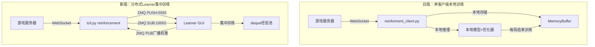
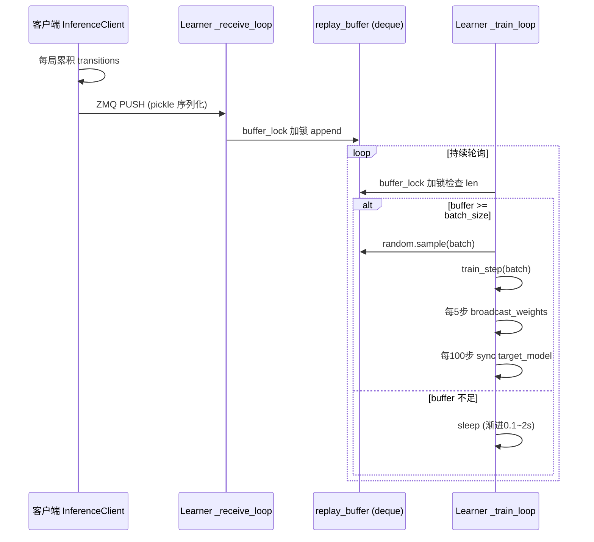

本文档深入解析掼蛋AI系统的DQN（Deep Q-Network）强化学习训练流程，涵盖两种并存的训练架构——**单客户端本地训练**（旧版）与**分布式Learner集中训练**（新版）——以及贯穿其中的三大核心机制：经验回放缓冲、ε-greedy探索策略、和基于Double Q-Learning的TD目标更新。阅读本文前，建议先了解 [神经网络架构](12-shen-jing-wang-luo-jia-gou-actionvaluenetde-lstmli-shi-jian-mo-yu-crossunitcan-chai-wang-luo) 和 [状态编码设计](13-zhuang-tai-bian-ma-she-ji-shou-pai-chu-pai-qu-sheng-yu-pai-shu-yu-ji-pai-de-duo-wei-qian-ru)，以理解Q网络输入输出的数据格式。

## 两种训练架构总览

项目演进过程中形成了两种DQN训练架构，二者共享相同的核心算法（Double DQN + ε-greedy），但在经验收集与模型更新的物理分布上存在根本差异。



| 维度 | 旧版 (reinforment_client.py) | 新版 (learner.py + tcli.py) |
|---|---|---|
| **经验存储** | 每个客户端独立的 `MemoryBuffer`（容量100000） | Learner 端集中 `deque`（默认容量30000） |
| **模型位置** | 每个客户端持有完整模型 + 优化器 | 仅 Learner 持有模型 + 优化器；客户端只做推理 |
| **权重同步** | 无同步（各客户端独立训练） | ZMQ PUB-SUB 广播，默认每5步训练广播一次 |
| **训练触发** | 每局（episode）结束时 `learn_batch` | 独立训练线程持续轮询，buffer 够大即训练 |
| **Target网络** | 旧版 `learn_batch` 接受外部 `target_net` 参数，但调用方未传入独立 target | Learner 端维护独立 `target_model`，每100步同步 |
| **启动方式** | `train.py --mode rl` → `launch.py` 多进程编排 | `actor_all/start.py` 或 `start_selfplay.py` 独立启动 Learner + 多桌客户端 |

旧版架构的代码位于 `clients/reinforment_client.py` 的 `MLPAction` 类中，它将模型、优化器、回放缓冲全部耦合在单个客户端进程内。新版则将推理与训练彻底分离——客户端 `InferenceClient` 只负责根据 Learner 广播的最新权重做前向推理，每局结束后将整局经验一次性推送给 Learner。

Sources: [reinforment_client.py](clients/reinforment_client.py#L109-L157) | [learner.py](actor_all/learner.py#L53-L67) | [tcli.py](clients/tcli.py#L51-L95)

## 经验回放：Transition结构与缓冲区管理

### Transition 八元组

整个系统使用统一的经验元组格式，共8个字段：

```python
(obs, history, act, reward, obs_next, actionListNext, history_next, done)
```

| 索引 | 字段名 | 类型 | 含义 |
|---|---|---|---|
| 0 | `obs` | `Tensor[492]` | 当前状态编码（手牌+出牌区+剩余牌数+级牌） |
| 1 | `history` | `Tensor[T, 60]` | 截至当前步的出牌历史序列（LSTM输入） |
| 2 | `act` | `list[str]` | 实际执行的动作（原始牌列表，如 `['Single', 'S3']`） |
| 3 | `reward` | `float` | 即时奖励（中间步为0，终局步为完整对局奖励） |
| 4 | `obs_next` | `Tensor[492]` | 执行动作后的下一状态编码 |
| 5 | `actionListNext` | `list[list]` | 下一状态的可选动作列表（用于计算 TD target 中的 max Q(s',a')） |
| 6 | `history_next` | `Tensor[T+1, 60]` | 下一状态的出牌历史序列 |
| 7 | `done` | `bool` | 是否终局（决定 TD target 是否包含 bootstrapped 项） |

状态编码 `obs` 由 `StateCatEmbedding` 函数生成，将手牌（4×15=60维）、四家出牌区（4×60=240维）、剩余牌数one-hot（4×30=120维）和级牌one-hot（1×13=13维）拼接为493维向量。但在实际输入网络时，状态与动作嵌入拼接后总计493维（60+240+120+13=433维状态 + 60维动作 = 493维），这是因为某些维度在具体实现中有所合并。详见 [状态编码设计](13-zhuang-tai-bian-ma-she-ji-shou-pai-chu-pai-qu-sheng-yu-pai-shu-yu-ji-pai-de-duo-wei-qian-ru)。

Sources: [util.py](util.py#L48-L77) | [tcli.py](clients/tcli.py#L187-L200)

### 集中式经验池（新版Learner）

Learner 使用 Python `collections.deque` 作为经验回放缓冲区，核心操作在 `_receive_loop` 和 `_train_loop` 两个守护线程中完成：

**接收线程** (`_receive_loop`)：通过 ZMQ PULL socket（端口5555）阻塞轮询，收到客户端发来的经验列表后，加锁写入 `replay_buffer`。每条经验的 `obs`、`history`、`obs_next`、`history_next` 字段从 numpy 数组转为 `torch.Tensor`，其余字段保持原始 Python 类型。`step_count` 累加记录全局经验步数。

**训练线程** (`_train_loop`)：持续检查 buffer 大小，当 `buffer_len >= batch_size` 时唤醒训练。每次唤醒进行最多10个 batch 的训练（`batches_per_wake = min(10, buffer_len // batch_size)`），充分利用积累的经验。若 buffer 不足，采用渐进式休眠（0.1秒起步，最多2秒），避免空转浪费CPU。



值得注意的是，训练线程每**5步训练**就广播一次最新权重（`broadcast_weights`），而非每训练一步就广播。这减少了 ZMQ 通信开销，同时保证客户端能及时获取更新的策略。每**100步训练**同步一次 target 网络（`target_update_freq`），将 online 模型的参数完整复制到 target 模型。

Sources: [learner.py](actor_all/learner.py#L392-L468) | [learner.py](actor_all/learner.py#L350-L388)

### 本地经验池（旧版MemoryBuffer）

旧版 `MemoryBuffer`（位于 `util.py`）同样基于 `deque`，默认容量100000，提供了 `append`、`sample`、`clear` 和核心的 `learn_batch` 方法。与新版的关键区别在于：`learn_batch` 将**训练逻辑内嵌在缓冲区类中**，每局结束时由客户端直接调用，而非异步训练线程。这导致训练阻塞游戏主循环，直到梯度更新完成才能开始下一局。

```python
# 旧版训练触发流程（reinforment_client.py）
# episodeOver 阶段 → get_reward → update_post → send_buffer → learn_from
losses, rewards = self.action.replay_memory.learn_from(
    gamma=GAMMA, 
    optimizer=self.action.optimizer,
    ValueNet=self.action.ValueNet,
    device=DEVICE
)
```

Source: [reinforment_client.py](clients/reinforment_client.py#L100-L113) | [util.py](util.py#L111-L164)

## 探索策略：多层级的ε-greedy与PASS抑制

掼蛋的动作空间中包含一个特殊动作——**PASS（过牌）**。如果不加约束，Q网络容易学到"一直PASS等待好牌"的退化策略。系统在探索策略的多个层级上对PASS进行了精细控制。

### 第一层：客户端动作选择时的PASS抑制

在 `InferenceClient.select_action` 中（新版 `tcli.py`），探索策略分为两种模式：

**Greedy模式**（概率 `1 - ε`）：遍历所有可选动作计算Q值。关键做法是——找到PASS动作的索引，将其Q值设为 `-inf`，然后在剩余动作中取 argmax。仅当所有动作都是PASS时（`act_range == 0` 且唯一动作是PASS），才允许选择PASS。

```python
if random.random() > self.args.epsilon:
    # Greedy: 选最优非 PASS 动作，防止 PASS 崩塌
    if pass_idx is not None and act_range > 0:
        q_vals_masked = q_vals.copy()
        q_vals_masked[pass_idx] = -float('inf')
        action_idx = int(np.argmax(q_vals_masked))
    else:
        action_idx = int(np.argmax(q_vals))
```

**Exploration模式**（概率 `ε`，默认0.1）：完全随机均匀采样——**允许选择PASS**。这样设计是因为：如果探索时也禁止PASS，模型将永远无法学习"何时应该让牌"的策略。随机探索中的PASS经历会被记录为经验，在训练时由TD target的PASS掩码机制处理。

Source: [tcli.py](clients/tcli.py#L142-L175)

### 第二层：TD目标计算时的PASS掩码

在 Learner 的 `train_step` 方法中计算 TD target 时，同样对 PASS 动作进行掩码处理：

```python
pass_mask = [act_entry[0] == 'PASS' for act_entry in actionListNext]
pass_mask_t = torch.tensor(pass_mask, device=device)
if pass_mask_t.all():
    td_target = reward  # 全是 PASS 时不引导
else:
    online_qs_masked = online_qs.masked_fill(pass_mask_t, float('-inf'))
    best_idx = online_qs_masked.argmax().item()
    td_target = reward + gamma * target_qs[best_idx].item()
```

这里的关键逻辑是：当 `actionListNext` **全部是PASS**时（例如游戏终局或特定规则阶段），TD target 退化为纯即时奖励，不做 bootstrap，因为未来没有有效的非PASS动作可供选择。当存在非PASS动作时，Double Q-Learning 的 argmax 操作仅在非PASS动作中进行，确保 bootstrapped 值来自有意义的出牌决策。

Source: [learner.py](actor_all/learner.py#L322-L348)

### 第三层：终局奖励中的PASS惩罚

在 `InferenceClient.apply_final_reward` 中，终局奖励分配时额外对PASS动作施加微小惩罚（`PASS_PENALTY = 0.05`）：

```python
t[3] = final_reward - (self.PASS_PENALTY if t[2][0] == 'PASS' else 0.0)
```

这是一个轻量级的信号，鼓励模型在不确定时优先出牌而非消极让牌，但惩罚值（0.05）远小于终局奖励的尺度（±1~±5），不会主导学习目标。

Source: [tcli.py](clients/tcli.py#L216-L225)

### 自博弈对手的探索策略

自博弈对手 (`selfplay_opponent.py`) 默认 `epsilon=0.0`，即**纯确定性推理**。但它在动作选择时采用了更激进的PASS抑制：即使 argmax 选出了PASS，也会强制覆盖为非PASS动作中的最优者：

```python
if action_idx == pass_idx and act_range > 0:
    non_pass = [i for i in range(act_range + 1) if i != pass_idx]
    non_pass_qs = [q_vals[i] for i in non_pass]
    action_idx = non_pass[int(np.argmax(non_pass_qs))]
```

这确保自博弈对手**永远不会主动PASS**（除非被迫），产生更具对抗性的对局数据。

Source: [selfplay_opponent.py](clients/selfplay_opponent.py#L121-L126)

### 探索策略对比总览

| 场景 | ε值 | Greedy PASS | Explore PASS | 额外交互 |
|---|---|---|---|---|
| RL训练客户端 (tcli.py) | 0.1 | 禁止（mask -inf） | 允许 | PASS惩罚 -0.05 |
| 旧版RL客户端 (reinforment_client.py) | 0.1 | 允许（无mask） | 允许 | 无 |
| 自博弈对手 (selfplay_opponent.py) | 0.0 | 禁止（强制覆盖） | N/A | 确定性推理 |
| Learner训练TD目标 | N/A | 禁止（mask -inf） | N/A | 全PASS时不bootstrap |

## TD目标更新：Double Q-Learning与目标网络

### Double Q-Learning公式

系统采用 **Double DQN** 算法解耦动作选择与动作评估，以缓解Q值过高估计问题。对每条经验，TD目标的计算公式为：

$$\text{TD target} = \begin{cases} r & \text{if done or } \forall a' \in A(s') : a' = \text{PASS} \\ r + \gamma \cdot Q_{\text{target}}\left(s', \arg\max_{a' \in A(s') \setminus \{\text{PASS}\}} Q_{\text{online}}(s', a')\right) & \text{otherwise} \end{cases}$$

其中 **online网络**负责选择最优动作（argmax），**target网络**负责评估该动作的Q值。两个网络架构完全相同（`ActionValueNet`），但参数更新频率不同：online网络每个训练步都更新（梯度下降），target网络每 `target_update_freq`（默认100）步从online网络完整复制一次。

Sources: [learner.py](actor_all/learner.py#L316-L348) | [model.py](model.py#L21-L44)

### 训练循环的微观流程

`train_step` 方法接收一个 batch（默认512条经验），逐条计算 loss 后累加，最后统一反向传播：

```mermaid
flowchart TD
    B[遍历 batch 中每条 transition] --> C{obs, history, act, reward, obs_next, actionListNext, history_next, done}
    C --> D[拼接 state_curr = cat(obs, act_emb)]
    D --> E[online 网络前向: q_curr = model(state_curr, history)]
    E --> F{done 或 无下一动作?}
    F -->|是| G[td_target = reward]
    F -->|否| H[online 网络计算所有 a' 的 Q(s', a')]
    H --> I[PASS 掩码: mask PASS → -inf]
    I --> J[best_idx = argmax(online_qs_masked)]
    J --> K[target 网络打分: target_qs[best_idx]]
    K --> L[td_target = reward + gamma × target_qs[best_idx]]
    G --> M[loss = MSE(q_curr, td_target)]
    L --> M
    M --> N[累加 total_loss]
    N --> O{batch 遍历完?}
    O -->|否| C
    O -->|是| P[avg_loss.backward()]
    P --> Q[clip_grad_norm_(max_norm=1.0)]
    Q --> R[optimizer.step()]
    R --> S[model.eval()]
```

关键实现细节：
- 每次调用 `train_step` 前执行 `self.model.train()`，完成后执行 `self.model.eval()`，确保 BatchNorm/Dropout 等层在训练和评估模式间正确切换
- 梯度裁剪使用 `clip_grad_norm_` 限制在1.0，防止单条异常经验引发梯度爆炸
- 优化器使用 Adam（默认学习率 `1e-4`），loss 函数为 MSE

Sources: [learner.py](actor_all/learner.py#L315-L370)

### 旧版learn_batch的差异

旧版 `MemoryBuffer.learn_batch`（`util.py`）与新版的算法逻辑高度相似，但存在两个关键差异：

1. **无PASS掩码**：旧版的 Double Q-Learning argmax 操作在所有动作（包括PASS）上进行，没有 `masked_fill(-inf)` 步骤。这意味着如果PASS在下一状态具有最高Q值，TD target 会以PASS为基础进行 bootstrap，可能导致Q值估计偏向消极策略。

2. **无梯度累积**：旧版遍历 batch 后直接 `avg_loss.backward()` + `optimizer.step()`，等效于 batch 梯度下降。新版逻辑相同。

Source: [util.py](util.py#L127-L164)

### TD折扣因子与奖励尺度

`gamma` 默认值为 **0.98**，这意味着模型对未来奖励有较强的远见——100步后的奖励衰减因子为 $0.98^{100} \approx 0.133$，仍保留了约13%的影响。这与掼蛋对局通常持续多轮（可达数十步出牌）的特性相匹配。

终局奖励由 `get_reward` 方法根据完牌名次计算，新版 `tcli.py` 使用缩放后的奖励尺度（±1~±5），旧版使用原始尺度（±100~±500）：

| 名次组合 (自己, 队友) | 新版奖励 | 旧版奖励 |
|---|---|---|
| (0, 1) — 头游+二游 | +5 | +500 |
| (0, 2) — 头游+三游 | +3 | +350 |
| (0, 3) — 头游+末游 | +1 | +100 |
| (1, 2) — 二游+三游 | -1 | -100 |
| (1, 3) — 二游+末游 | -3 | -350 |
| (2, 3) — 三游+末游 | -5 | -500 |

新版将奖励缩放到更小的范围，有助于稳定Q值训练——避免过大的TD target导致梯度震荡。

Sources: [tcli.py](clients/tcli.py#L124-L129) | [reinforment_client.py](clients/reinforment_client.py#L79-L91)

## 权重广播与模型同步

Learner 每**5步训练**调用 `broadcast_weights()` 将 online 模型的 `state_dict` 通过 ZMQ PUB socket 广播到所有订阅的客户端：

```python
def broadcast_weights(self):
    state_dict = {k: v.cpu() for k, v in self.model.state_dict().items()}
    msg = pickle.dumps(state_dict)
    self.pub_socket.send(msg)
```

客户端端的 `_weights_listener` 守护线程通过 ZMQ SUB socket 持续监听（500ms 超时轮询），收到消息后反序列化并加载到本地推理模型：

```python
msg = self.sub_socket.recv()
state_dict = pickle.loads(msg)
with self.weights_lock:
    for k, v in state_dict.items():
        state_dict[k] = v.to(self.device)
    self.model.load_state_dict(state_dict)
```

注意这里使用了 `weights_lock` 线程锁，因为权重加载与推理（`select_action` 中的模型前向）可能并发执行——推理发生在 WebSocket 回调线程中，权重接收在独立守护线程中。

Sources: [learner.py](actor_all/learner.py#L372-L378) | [tcli.py](clients/tcli.py#L102-L112)

## 关键超参数汇总

| 参数 | 默认值 | 在代码中的位置 | 含义 |
|---|---|---|---|
| `gamma` | 0.98 | `learner.py` / `train.py` | TD折扣因子 |
| `epsilon` | 0.1 | `tcli.py` / `train.py` | ε-greedy探索率 |
| `lr` | 1e-4 (Learner) / 2.5e-3 (V2) / 1e-3 (旧版) | 各Learner/Client类 | Adam优化器学习率 |
| `batch_size` | 512 | `learner.py` | 每次训练的采样批量 |
| `replay_capacity` | 30000 (Learner) / 20000 (V2) | `learner.py` / `learner_v2.py` | 经验池最大容量 |
| `target_update_freq` | 100 | `learner.py` | Target网络同步间隔（训练步数） |
| `save_interval` | 50 (Learner) / 25 (V2) | `learner.py` / `learner_v2.py` | 模型保存间隔（训练步数） |
| `PASS_PENALTY` | 0.05 | `tcli.py` | PASS动作在终局奖励中的扣分 |
| 权重广播频率 | 每5训练步 | `learner.py` `_train_loop` | PUB广播online权重的频次 |
| 梯度裁剪 | max_norm=1.0 | `learner.py` `train_step` | 防止梯度爆炸 |

## 阅读下一步

本文档覆盖了DQN训练的核心算法细节。要理解这些组件如何协同运作，建议继续阅读以下关联文档：

- **[分布式强化学习](10-fen-bu-shi-qiang-hua-xue-xi-zmq-pub-subjia-gou-xia-de-duo-ke-hu-duan-bing-xing-xun-lian)**：深入ZMQ PUB-SUB架构下的多客户端并行训练机制
- **[自博弈训练系统](11-zi-bo-yi-xun-lian-xi-tong-mo-xing-chi-guan-li-re-jia-zai-dui-shou-yu-die-dai-dui-kang)**：Learner V2的模型池管理与迭代对抗训练
- **[奖励函数设计](15-jiang-li-han-shu-she-ji-wan-pai-ci-xu-dao-biao-liang-jiang-li-de-ying-she-ce-lue)**：终局奖励映射策略的完整说明
- **[分布式Learner设计](21-fen-bu-shi-learnershe-ji-zmq-pub-subquan-zhong-yan-bo-yu-jing-yan-shou-ji)**：Learner端的多端口ZMQ架构详解